# Comprehensive Documentation Survey & Agent Architecture Analysis Report

**Author:** Documentation Spec Miner (`explorer_docs_survey`)  
**Target Project:** reForm Monolith (`com.reForm.backend.ai`)  
**Date:** 2026-08-05  
**Source Specifications Surveyed:**
- `backend/knowledge/pth/week3/*` (20 documents)
- `backend/knowledge/pth/week4/*` (8 documents)
- `backend/src/main/java/com/reForm/backend/ai/*` (Source code audit)

---

## Executive Summary

This report provides an exhaustive, deep-dive survey and specification analysis of the reForm platform's agent architecture across Week 3 and Week 4 technical documentation and backend codebase.

reForm implements a **4-Mode Unified AI Architecture**:
- **Mode 1 (Static Form)**: Standard web forms without AI.
- **Mode 2 (Text Co-Builder / Form Filler)**: Stateless REST interaction with Gemini 3.6 Flash.
- **Mode 3 (Cascaded Voice)**: 3-microservice pipeline (Deepgram Nova-3 STT $\rightarrow$ Gemini 3.6 Flash LLM $\rightarrow$ Cartesia Sonic TTS) over WebSockets (~700ms latency, 35% cheaper).
- **Mode 4 (Native Live Voice)**: Audio-to-audio streaming via Google Gemini 3.1 Live API (`BidiGenerateContent`) over WebSockets (~300ms latency).

The platform architecture is built around decoupled Spring `@Component` service beans functioning as **autonomous software agents**, bound via an Event-Driven Architecture (EDA), Redis state tracking, PostgreSQL `pgvector` hybrid semantic search, and Virtual Thread execution.

---

## 1. "What is Agentic in 2026?" — Philosophy & Framework Paradigms

### 1.1 Engineering Definition of "Agentic" in 2026
In 2026, an **Agent** is no longer viewed as a single, massive, monolithic LLM prompt or an external opaque third-party black-box framework. Instead, in production enterprise software engineering (specifically within a Spring Boot Java ecosystem):

> **An Agent is a Spring `@Component` service bean that encapsulates LLM client invocation, vector database retrieval, state management, tool execution, safety guardrails, and business logic execution.**

An "Agentic System" is defined by the following core capabilities:
1. **Perception**: Receiving continuous input streams (mic audio PCM, text frames, WebSocket events, HTTP requests).
2. **Reasoning & Planning**: Utilizing LLMs to select goals, plan steps, and generate structured actions (ReAct and Plan-and-Execute loops).
3. **Action Execution (Tool Calling)**: Invoking concrete domain side-effects (database mutations, API calls, dynamic UI rendering, hardware disconnection).
4. **Reflection & Evaluation**: Self-correcting responses, assessing multi-criteria performance post-session, and scoring outputs.
5. **Stateful Memory**: Retaining short-term working memory (Redis hashes) and long-term semantic memory (pgvector HNSW indexes).
6. **Safety & Guardrails**: Deterministically intercepting and filtering unauthorized actions or malicious prompt injections before LLM context ingestion.

### 1.2 Paradigm Alignment Matrix

| Paradigm | How it works | reForm Monolith Mapping |
| :--- | :--- | :--- |
| **ReAct (Reasoning + Acting)** | LLM outputs thought $\rightarrow$ calls tool $\rightarrow$ observes tool output $\rightarrow$ responds. | Gemini 3.1 Live emitting `toolCall` $\rightarrow$ `ToolCallRegistry` executing `IToolCallHandler` bean $\rightarrow$ sending `toolResponse` frame back to Gemini. |
| **Plan-and-Execute** | High-level goal decomposed into sub-tasks executed sequentially or in parallel. | `LayoutAgent` receiving high-level intent (`userIntent="ADD_CONTACT_SECTION"`), prompting Gemini 3.6 Flash for schema, and creating multiple block entities. |
| **Multi-Agent Orchestration** | Concurrent specialized agents handling distinct sub-tasks instead of 1 monolithic agent. | Form Filler Pipeline where `GuardrailAgent`, `MemoryGoalAgent`, `BillingAgent`, `RagSearchAgent`, and `EvaluationAgent` run concurrently during voice sessions. |
| **Reflection & Guardrails** | In-flight or post-execution quality and safety verification. | `GuardrailAgent` running sub-2ms embedding similarity checks against toxic/jailbreak vectors in `pgvector` before processing. |
| **Dynamic Sub-Agent Spawning** | Main agent instantiating background worker micro-agents on demand. | `SubAgentFactory` spawning `CodeAnalysisSubAgent`, `DocumentOcrSubAgent`, or `ScoringSubAgent` via Spring `AsyncTaskExecutor`. |

---

## 2. Complete Catalog of Agents & Sub-Agents

Below is the complete audit of all built, designed, and sub-agent components documented across reForm.

### 2.1 Existing / Built Components

#### 1. `LayoutAgent`
- **Role**: Asynchronously processes form layout modification intents and updates PostgreSQL JSONB block arrays.
- **Trigger Mechanism**: Spring Event Bus listener (`@EventListener`) catching `FormLayoutModificationEvent`.
- **Input**: `FormLayoutModificationEvent` containing `formId`, `userIntent` (e.g. `"ADD_CONTACT_SECTION"`), and `targetBlockId`.
- **Output**: Mutated PostgreSQL `Form.blocks` array and WebSocket canvas push to React UI (`/topic/form-canvas/{formId}`).
- **Design Pattern**: **Observer Pattern** (`@EventListener`) + **Strategy/Factory Pattern** (delegates heavy schema creation to Gemini 3.6 Flash Mode 2).
- **Technology Selection**: Gemini 3.6 Flash (Mode 2) via REST + PostgreSQL JSONB column + Spring `@Async` thread pool. *Rationale: Gemini 3.1 Live is optimized for voice latency, not generating nested JSON schemas. Offloading schema creation to Flash prevents voice stutter.*
- **SOLID & KISS Justification**:
  - *SRP*: Only responsible for layout block creation and persistence.
  - *OCP*: Extended by adding new block types without modifying event dispatching logic.
  - *DIP*: Depends on `FormRepository` interface, not concrete database implementations.
- **Open Questions**: How to revert multi-step layout mutations if a user says "Undo that last change"?

#### 2. 18 `IToolCallHandler` Strategy Beans (`com.reForm.backend.ai.tool.handler.*`)
- **Role**: Encapsulates discrete domain execution algorithms for Gemini function calls.
- **Trigger Mechanism**: `ToolCallRegistry.executeTool()` invoked by `GeminiLiveVoiceAdapter` upon receiving a `toolCall` WebSocket frame.
- **Input**: `WebSocketSession clientSession`, `JsonNode functionCall`, `String callId`.
- **Output**: `Map<String, Object>` matching Google's `toolResponse` schema.
- **Design Pattern**: **Strategy Pattern** (`IToolCallHandler`) + **Registry/Command Router Pattern** (`ToolCallRegistry`).
- **Technology Selection**: Spring IoC Dependency Injection (`List<IToolCallHandler>` autowiring) + $O(1)$ Hash Map routing.
- **SOLID & KISS Justification**:
  - *SRP*: Each handler bean owns exactly one tool's business logic.
  - *OCP*: New tools are added by creating a new `@Component` class without modifying adapter or registry code.
- **Catalog breakdown**:
  1. `EndSessionToolHandler` (`endSession` - Universal): 3-Stage asynchronous session teardown.
  2. `SearchUserDocumentToolHandler` (`searchUserDocument` - Universal): In-session pgvector document search.
  3. `ModifyFormLayoutToolHandler` (`modifyFormLayout` - Builder): Publishes `FormLayoutModificationEvent`.
  4. `ConfigureFillerPersonaToolHandler` (`configureFillerPersona` - Builder): Persists prompt, voice, temp to `FormAiAgentProfile`.
  5. `PublishFormToolHandler` (`publishForm` - Builder): Sets status to `PUBLISHED`, locks form, generates slug URL.
  6. `GenerateContentFromDocToolHandler` (`generateContentFromDocument` - Builder): Generates quiz/interview blocks from doc.
  7. `SaveFieldResponseToolHandler` (`saveFieldResponse` - Filler): Saves validated field answers to PostgreSQL.
  8. `EvaluateResponseToolHandler` (`evaluateResponse` - Filler): Scores candidate answer against rubric (0-100).
  9. `SkipQuestionToolHandler` (`skipQuestion` - Filler): Marks field skipped with reason, advances pointer.
  10. `LookupFormProgressToolHandler` (`lookupFormProgress` - Filler): Computes total vs answered fields & % complete.
  11. `FlagForHumanReviewToolHandler` (`flagForHumanReview` - Filler): Flags response for owner review.
  12. `RequestFileUploadToolHandler` (`requestFileUpload` - File): Emits UI frame to show drag-drop zone.
  13. `AnalyzeUploadedFileToolHandler` (`analyzeUploadedFile` - File): Invokes Gemini Vision or Tika OCR.
  14. `ExtractStructuredDataToolHandler` (`extractStructuredData` - File): Extracts key-value pairs from resume/ID.
  15. `SaveAudioRecordingToolHandler` (`saveAudioRecording` - Audio): Compresses & uploads PCM audio to S3/local storage.
  16. `SaveSessionTranscriptToolHandler` (`saveSessionTranscript` - Audio): Persists timestamped dialogue transcript array.
  17. `RenderDynamicUIToolHandler` (`renderDynamicUI` - UI): Pushes interactive widgets (star rating, date picker) to UI.
  18. `SendNotificationToolHandler` (`sendNotification` - UI): Pushes real-time alerts to dashboard/email/Slack.

#### 3. `FormAiAgentProfile` (Domain Entity)
- **Role**: PostgreSQL database entity storing AI persona configuration bound 1-to-1 with a `Form`.
- **Fields**: `modelKey`, `systemPromptTemplate`, `voiceName` (e.g. "Puck", "Kore"), `temperature`, `byokApiKeyEncrypted`.

---

### 2.2 Designed Agents (Documented Specification)

#### 1. `GuardrailAgent` (Safety & Moderation)
- **Role**: Prevents prompt injection, jailbreak attempts, and toxic content in real time.
- **Trigger Mechanism**: Called synchronously per turn in `GeminiLiveVoiceAdapter` before passing transcript to LLM.
- **Input**: Transcript text chunk string.
- **Output**: `GuardrailResult` (`boolean safe`, `float similarityScore`, `String category`).
- **Design Pattern**: **Chain of Responsibility / Strategy Pattern**.
- **Technology Selection**: `text-embedding-004` (768d) + PostgreSQL `pgvector` HNSW cosine similarity query (`<=>`).
- **SOLID & KISS Justification**:
  - *SRP*: Exclusive focus on safety/content policy validation.
  - *KISS*: Reuses existing `pgvector` database infrastructure rather than maintaining external moderation API endpoints.

#### 2. `MemoryGoalAgent` (State & Checklist Tracking)
- **Role**: Manages active interview goals and prevents AI from repeating questions or getting stuck in loops.
- **Trigger Mechanism**: Updated per conversational turn during Form Filler sessions.
- **Input**: Candidate transcript text.
- **Output**: Map of goal states (`VERIFIED`, `PENDING`, `SKIPPED`) and context injection snippet.
- **Design Pattern**: **State Pattern**.
- **Technology Selection**: Redis `opsForHash()` (`session:{userId}:goals`). *Rationale: Redis provides sub-millisecond RAM read/write access for in-flight session goal states.*
- **SOLID & KISS Justification**:
  - *SRP*: Isolates state tracking logic from conversational voice generation.
  - *KISS*: Key-value hash structure allows atomic updates without database locks.

#### 3. `BillingAgent` (Token Metering & Credit Protection)
- **Role**: Protects platform from runaway LLM audio token costs during open-mic silence or abandoned sessions.
- **Trigger Mechanism**: Continuous frontend VAD (Voice Activity Detection) frame inspection & scheduled heartbeat.
- **Input**: VAD audio state signals and session duration timer.
- **Output**: Warning prompt injection ("Are you still there?"), session pause signal, or account balance deduction.
- **Design Pattern**: **Observer / Timer Pattern**.
- **Technology Selection**: Spring `@Scheduled` / Redis TTL / VAD socket frame signals.
- **SOLID & KISS Justification**:
  - *SRP*: Manages token consumption and financial billing limits exclusively.

#### 4. `EvaluationAgent` (Post-Session Scoring & Summary)
- **Role**: Analyzes complete session transcript post-call, computes overall candidate score (0-100), generates executive summary report, and persists `Submission` record.
- **Trigger Mechanism**: Asynchronously fired upon WebSocket connection close (`afterConnectionClosed`).
- **Input**: Complete timestamped session transcript array.
- **Output**: `Submission` entity persisted in PostgreSQL containing candidate match score, strengths, red flags, and 1-page summary PDF/Markdown.
- **Design Pattern**: **Observer Pattern** (`@Async @EventListener`).
- **Technology Selection**: Gemini 3.6 Flash (Mode 2) + PostgreSQL + Spring `@Async`.
- **SOLID & KISS Justification**:
  - *SRP*: Heavy summary generation happens offline, keeping real-time voice call latency zero.

#### 5. `RagSearchAgent` (Knowledge Retrieval)
- **Role**: Retrieves factual knowledge from uploaded company documents, handbooks, and rubrics during sessions.
- **Trigger Mechanism**: Activated when Gemini emits `searchUserDocument` function call.
- **Input**: Search query string.
- **Output**: Top-3 relevant document text passages.
- **Design Pattern**: **Repository / Strategy Pattern**.
- **Technology Selection**: Google `text-embedding-004` (768d) + PostgreSQL `pgvector` HNSW index + tsvector full-text search (Hybrid Search).

---

### 2.3 Sub-Agents (Dynamic Worker Agents)

1. **`CodeAnalysisSubAgent`**:
   - *Role*: Spawned during technical coding interviews when candidate submits or speaks code. Runs code inside a sandboxed container, checks syntax/tests, and feeds results back to interview context.
   - *Spawning Mechanism*: `SubAgentFactory.spawnCodeAnalysisSubAgent()` via Spring `AsyncTaskExecutor`.
2. **`DocumentOcrSubAgent`**:
   - *Role*: Spawned when a builder or filler uploads complex scanned PDFs or images. Extracts clean text using Apache Tika or Tesseract OCR, chunks text (512 tokens / 64 overlap), and writes vectors to `pgvector`.
3. **`ScoringSubAgent`**:
   - *Role*: Spawned during multi-criteria evaluations to score domain competencies (e.g. Leadership, Technical Depth, Communication) in parallel worker threads.

---

## 3. The 5 Platform Pipelines

```mermaid
graph TD
    subgraph P1 [1. Form Builder Pipeline]
        M4_B[Mode 4 Live Voice / Mode 2 Text] --> Tool_MFL[modifyFormLayout Tool]
        Tool_MFL --> Event_FLM[FormLayoutModificationEvent]
        Event_FLM --> LayoutAgent[LayoutAgent @Async]
        LayoutAgent --> M2_Flash[Gemini 3.6 Flash]
        M2_Flash --> DB_Form[PostgreSQL Form.blocks]
        DB_Form --> Canvas_WS[WebSocket Push to UI Canvas]
    end

    subgraph P2 [2. Form Filler Pipeline]
        Filler_Voice[Candidate Mic Stream] --> WS_Handler[VoiceSyncWSHandler]
        WS_Handler --> Guardrail[GuardrailAgent pgvector]
        WS_Handler --> Memory[MemoryGoalAgent Redis]
        WS_Handler --> Billing[BillingAgent VAD Metering]
        WS_Handler --> RAG[RagSearchAgent searchUserDocument]
        WS_Handler --> Save_Resp[saveFieldResponse Tool]
    end

    subgraph P3 [3. File & Media Processing Pipeline]
        Doc_Upload[User Upload PDF/PNG] --> Format_Router{Format Router}
        Format_Router -->|PDF/DOCX| Tika[Apache Tika Engine]
        Format_Router -->|Scanned Image| Tesseract[Tesseract OCR]
        Tika --> Chunker[Chunker 512 Tokens / 64 Overlap]
        Tesseract --> Chunker
        Chunker --> Embedder[text-embedding-004 768d]
        Embedder --> HNSW[PostgreSQL pgvector HNSW Index]
    end

    subgraph P4 [4. Background & Async Pipeline]
        SubFactory[SubAgentFactory] --> Worker_Pool[Spring AsyncTaskExecutor Pool]
        Worker_Pool --> CodeSub[CodeAnalysisSubAgent]
        Worker_Pool --> OcrSub[DocumentOcrSubAgent]
        Worker_Pool --> ScoreSub[ScoringSubAgent]
        Event_Closed[Socket Closed Event] --> EvalAgent[EvaluationAgent @Async]
        EvalAgent --> Score_DB[Submission Record & Report]
    end

    subgraph P5 [5. Session Lifecycle Pipeline]
        Handshake[GET /ws/v1/voice Handshake] --> JWT_Auth[JwtHandshakeInterceptor]
        JWT_Auth --> Redis_Track[SessionTracker Redis 2h TTL]
        Redis_Track --> Twin_Sockets[Twin Socket Memory Setup]
        Twin_Sockets --> Session_Loop[Active Stream & Tool Loop]
        Session_Loop --> End_Tool[endSession Tool Trigger]
        End_Tool --> Stage1[Stage 1: SESSION_ENDED UI Push]
        Stage1 --> Stage2[Stage 2: SESSION_ENDING Tool Resp]
        Stage2 --> Stage3[Stage 3: VirtualThread 2s Teardown & Redis Deregistration]
    end
```

### 3.1 Form Builder Pipeline
- **Purpose**: Enables form creators (John) to design, edit, and publish forms verbally or via text chat.
- **Workflow**:
  1. Creator speaks: "Add a contact section with email and phone".
  2. Gemini 3.1 Live emits `modifyFormLayout` tool call.
  3. `ModifyFormLayoutToolHandler` publishes `FormLayoutModificationEvent`.
  4. `LayoutAgent` catches event asynchronously, invokes Gemini 3.6 Flash (Mode 2) for block JSON generation, mutates PostgreSQL `Form.blocks`, and pushes WebSocket canvas update (`/topic/form-canvas/{formId}`).
  5. Creator configures interviewer tone using `configureFillerPersona` tool.
  6. Creator locks layout using `publishForm` tool.

### 3.2 Form Filler Pipeline
- **Purpose**: Conducts interactive AI voice/text interviews for candidates (Sarah).
- **Workflow**:
  1. Candidate connects to `/ws/v1/voice?mode=MODE_4` or `MODE_3`.
  2. `SessionContextService` hydrates prompt template from `FormAiAgentProfile`.
  3. `GuardrailAgent` checks safety in sub-2ms per turn.
  4. `MemoryGoalAgent` tracks answered vs pending goals in Redis `opsForHash()`.
  5. `BillingAgent` monitors VAD silence (45s threshold).
  6. If candidate asks a factual question, `RagSearchAgent` executes `searchUserDocument` vector search.
  7. Spoken answers are validated and saved per turn via `saveFieldResponse` tool.

### 3.3 File & Media Processing Pipeline
- **Purpose**: Processes uploaded resumes, job specs, and images for RAG retrieval and form auto-filling.
- **Workflow**:
  1. User uploads document (PDF, PNG, DOCX).
  2. Format Router passes text files to Apache Tika / PDFBox and scanned images to Tesseract OCR.
  3. Text is chunked into 512-token segments with 64-token overlap.
  4. Chunks are embedded using `text-embedding-004` (768 dimensions).
  5. Embeddings are stored in PostgreSQL `document_embeddings` table backed by an HNSW index (`vector_cosine_ops`).
  6. In voice sessions, small documents ($\le$ 4k tokens) are injected into Gemini system instructions, while large documents ($>$ 4k tokens) are queried dynamically via `searchUserDocument` tool.

### 3.4 Background & Async Pipeline
- **Purpose**: Handles heavy computational tasks without degrading real-time voice latency.
- **Workflow**:
  1. Event-driven triggers (`FormLayoutModificationEvent`, socket teardown, code submission) dispatch tasks to Spring's `@Async` worker thread pools.
  2. `SubAgentFactory` dynamically instantiates sub-agent instances (`CodeAnalysisSubAgent`, `DocumentOcrSubAgent`, `ScoringSubAgent`).
  3. `EvaluationAgent` processes full transcript post-session, calculates 0-100 score, generates summary report, and persists `Submission`.

### 3.5 Session Lifecycle Pipeline
- **Purpose**: Manages TCP connection setup, authentication, twin-socket memory tracking, and clean teardown.
- **Workflow**:
  1. Handshake request validated by `JwtHandshakeInterceptor`.
  2. Session registered in Redis RAM by `SessionTracker` (2-hour TTL).
  3. Twin WebSockets initialized per user session: Socket 1 (Inbound Browser $\leftrightarrow$ Server) and Socket 2 (Outbound Server $\leftrightarrow$ Google Gemini Live WSS). Total sockets for $N$ users = $2N$.
  4. Sockets wrapped in `ConcurrentWebSocketSessionDecorator` (10MB buffer limit, 10s send timeout) to prevent thread race conditions.
  5. `endSession` tool triggers 3-stage teardown:
     - Stage 1: Send `SESSION_ENDED` text frame to browser (frees mic/speaker hardware).
     - Stage 2: Return `SESSION_ENDING` tool response to Gemini Live (allows natural goodbye phrase).
     - Stage 3: Virtual Thread (`Thread.ofVirtual()`) waits 2 seconds, closes Socket 2 (stops billing), closes Socket 1, and deregisters Redis key.

---

## 4. Technology Selections & Rationale

| Component / Tech | Technology Selected | Alternatives Considered | Selection Rationale |
| :--- | :--- | :--- | :--- |
| **Vector Database** | PostgreSQL `pgvector` (HNSW index) | Pinecone, Qdrant, Milvus | Eliminates additional infra complexity & cost. Keeps relational form metadata and vector embeddings in a single ACID-compliant database. Sub-5ms cosine search. |
| **Session & Goal State** | Redis `opsForHash()` | In-Memory Java Maps, PostgreSQL | Provides sub-millisecond RAM speed for session state and shared multi-node presence across horizontally scaled application servers. |
| **Live Voice AI Engine** | Google Gemini 3.1 Live API | OpenAI Realtime API, ElevenLabs | Native audio-to-audio streaming (~300ms latency), native tool calling support, highly cost-effective pricing structure. |
| **Text & Layout Engine** | Google Gemini 3.6 Flash | GPT-4o, Claude 3.5 Sonnet | Ultra-fast token generation, low cost, exceptional JSON schema compliance for Mode 2 text and LayoutAgent schema generation. |
| **Event Bus** | Spring `ApplicationEventPublisher` | Kafka, RabbitMQ | Decouples components cleanly within the modular monolith architecture without introducing message broker ops overhead. |
| **WebSockets** | Spring WebSocket + Tomcat | Netty, Raw Java Sockets | Seamless integration with Spring Security, standard session lifecycle handles, and built-in decorator wrappers. |
| **Async Concurrency** | Java Virtual Threads (`Thread.ofVirtual()`) | Fixed ThreadPool, Reactive WebFlux | Lightweight thread creation (millions of threads with minimal RAM overhead) ideal for socket teardown timers and blocking I/O without Reactive callback complexity. |
| **Document Parsing** | Apache Tika + Tesseract OCR | AWS Textract, Google Cloud Vision | Open-source, zero external API latency/cost for standard PDF/DOCX and image OCR preprocessing. |

---

## 5. Architectural Principles Analysis

### 5.1 SOLID Principles Applied

1. **Single Responsibility Principle (SRP)**:
   - *Example*: `GeminiLiveVoiceAdapter` handles ONLY low-latency WebSocket frame proxying. All tool execution logic is delegated to `ToolCallRegistry`, and layout schema creation is delegated to `LayoutAgent`.
2. **Open-Closed Principle (OCP)**:
   - *Example*: `IToolCallHandler` strategy interface allows developers to add new AI tools by creating standalone `@Component` classes. `ToolCallRegistry` auto-detects them without editing existing adapter code.
3. **Liskov Substitution Principle (LSP)**:
   - *Example*: `CascadedVoiceAdapter` (Mode 3) and `GeminiLiveVoiceAdapter` (Mode 4) both implement `IAiVoiceAdapter`. `VoiceSyncWSHandler` interacts with them interchangeably.
4. **Interface Segregation Principle (ISP)**:
   - *Example*: Tool handlers implement `IToolCallHandler` (defining only `getFunctionName()` and `execute()`) rather than bloated monolithic interfaces.
5. **Dependency Inversion Principle (DIP)**:
   - *Example*: High-level services (`LayoutAgent`, `SessionContextService`) depend on abstract repository interfaces (`FormRepository`) and strategy ports (`IAiVoiceAdapter`), not low-level database implementations.

### 5.2 KISS, DRY, and YAGNI Principles

- **KISS (Keep It Simple, Stupid)**: Reusing PostgreSQL with `pgvector` instead of introducing external vector databases (Qdrant/Pinecone). Reusing Spring's internal event bus instead of setting up Kafka.
- **DRY (Don't Repeat Yourself)**: `SessionContextService` and `FormAiAgentProfile` are shared across all 4 operational modes (Mode 1, Mode 2, Mode 3, Mode 4), preventing duplicated prompt hydration code.
- **YAGNI (You Aren't Gonna Need It)**: Avoiding premature microservice splitting. The platform is architected as a modular monolith in Java Spring Boot, keeping deployment simple while maintaining clear package boundaries.

---

## 6. Features Discovered & Edge Cases

### Features Discovered

| # | Category | Feature | Description | Inputs | Outputs | Error Behavior | Discovered Via |
|---|----------|---------|-------------|--------|---------|----------------|----------------|
| 1 | Voice AI | Mode 4 Live Streaming | Native audio-to-audio WebSocket streaming using Gemini 3.1 Live API | 16kHz PCM audio bytes / Text | 24kHz PCM audio / Tool calls | Reconnect socket; emit error log | `01_mode4_...` & `GeminiLiveVoiceAdapter.java` |
| 2 | Layout | Asynchronous Layout Co-Building | `LayoutAgent` consumes `FormLayoutModificationEvent` to generate form blocks | `userIntent` string | Updated `Form.blocks` in PostgreSQL + UI WebSocket push | Log error, retain previous canvas state | `02_ai_cobuilder_...` & `LayoutAgent.java` |
| 3 | Moderation | Real-Time Vector Guardrails | Sub-2ms embedding similarity check against toxic/jailbreak prompt vectors | Input transcript chunk | `GuardrailResult` (safe boolean) | Trigger fallback response if unsafe (>0.85 score) | `03_ai_form_filler_...` & `GuardrailAgent` docs |
| 4 | State | Redis Goal Tracking | Maintains active checklist in Redis `opsForHash()` | Transcript text | Goal status map (`VERIFIED`/`PENDING`) | Fallback to full prompt context | `03_ai_form_filler_...` & `MemoryGoalAgent` docs |
| 5 | Billing | VAD Silence Metering | Pauses voice stream if user is silent for 45s to protect token budget | VAD binary frames / Timer | Reminder prompt or stream pause | Auto-close session on persistent idle | `03_ai_form_filler_...` & `BillingAgent` docs |
| 6 | Retrieval | In-Session Document RAG | Executes vector similarity search over uploaded PDFs via `searchUserDocument` | Search query string | Top-3 document text passages | Return empty passage list | `04_rag_vector_...` & `SearchUserDocumentToolHandler` |
| 7 | Execution | Decoupled Tool Routing | `ToolCallRegistry` routes function calls to `IToolCallHandler` beans | `toolCall` JSON frame | `toolResponse` JSON frame | Fallback generic success response | `07_tool_call_...` & `ToolCallRegistry.java` |
| 8 | Lifecycle | 3-Stage Session Teardown | `endSession` tool safely notifies UI, sends goodbye response, and closes twin sockets | `endSession` function call | Clean disconnect & Redis cleanup | Virtual Thread catches exception and forces socket close | `06_end_session_...` & `EndSessionToolHandler` |
| 9 | Memory | Twin-Socket Memory Architecture | Allocates 2 WebSockets per active session (Inbound + Outbound) wrapped in decorators | Network connection request | 2 `WebSocketSession` handles in RAM | Buffer 10MB overflow closes socket cleanly | `14_mode4_multi_user_...` & `WebSocketSessionUtils` |
| 10 | Strategy | Provider Decoupling | `AiVoiceAdapterFactory` returns `IAiVoiceAdapter` by `VoiceMode` | `VoiceMode` enum parameter | Concrete adapter bean instance | Throws `IllegalArgumentException` for unknown mode | `18_ai_provider_...` & `AiVoiceAdapterFactory.java` |

### Edge Cases

| # | Feature | Input | Observed Behavior |
|---|---------|-------|-------------------|
| 1 | Twin-Socket Memory | Concurrent frame write to Socket 1 from Tomcat worker and scheduled ping | `ConcurrentWebSocketSessionDecorator` queues message in private `LinkedBlockingQueue` (up to 10MB limit), preventing Tomcat `IllegalStateException`. |
| 2 | Session Teardown | User speaks farewell "Goodbye" | `EndSessionToolHandler` sends `SESSION_ENDED` to UI, returns `SESSION_ENDING` to Gemini, and VirtualThread waits 2s before closing sockets to allow Gemini to speak its final farewell out loud. |
| 3 | Layout Modification | Heavy JSON schema generation requested over voice | `LayoutAgent` receives event on `@Async` thread pool, delegating schema creation to Gemini 3.6 Flash (Mode 2) without stalling the 300ms Mode 4 voice stream. |
| 4 | RAG Retrieval | Large document uploaded (>4k tokens) | Strategy switches from direct setup context injection to registering `searchUserDocument` function tool for on-demand vector querying. |
| 5 | Tool Execution | Unregistered tool name emitted by Gemini | `ToolCallRegistry` logs warning and returns generic success fallback (`"status": "SUCCESS"`) to prevent session failure. |

---

## 7. Synthesis & Architectural Assessment

The reForm documentation and codebase present a highly sophisticated, production-grade agentic architecture. By treating agents as decoupled Spring beans operating under an Event-Driven Architecture (EDA) with clear pattern separations (Strategy, Factory, Observer, Command Registry), reForm achieves low-latency performance (<300ms voice response) while remaining extensible and maintainable.
