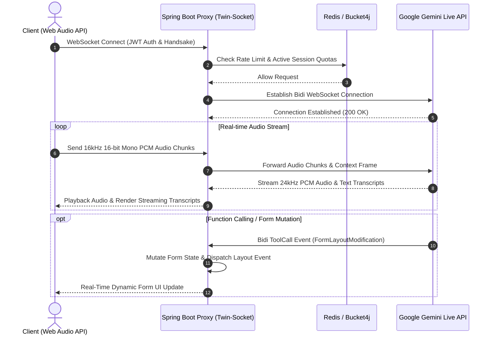

# reForm — Next-Gen AI-Powered Conversational Form Engine & Co-Builder


**reForm** is an enterprise-grade, real-time conversational form platform. It bridges static web forms with multi-modal AI agents powered by **Google Gemini 2.0 Live API** over low-latency WebSockets, Retrieval-Augmented Generation (RAG), dynamic schema reflection, and multi-agent workflow orchestration.

---

## 📸 Key Capabilities & 4-Mode Spectrum

reForm introduces a unified 4-mode architecture allowing forms to transition seamlessly from traditional inputs to full real-time voice conversations.

| Mode | Name | Interface | Engine & Pipeline |
| :--- | :--- | :--- | :--- |
| **Mode 1** | **Static Form Engine** | Standard Web UI | Dynamic Schema-Driven React 19 UI with real-time field validation. |
| **Mode 2** | **Chat Assistant (Copilot)** | Text Assistant Drawer | Contextual LLM assistant guiding users through complex form completion via text. |
| **Mode 3** | **Cascaded Voice Agent** | Voice Input / Output | STT $\rightarrow$ LLM $\rightarrow$ TTS cascade pipeline with VAD & barge-in support. |
| **Mode 4** | **Native Gemini Live Agent** | Bidirectional Audio (16kHz PCM) | Low-latency WebSockets connected directly to Google Gemini Live API with real-time tool calling & dynamic layout mutations. |

---

## 🏗️ System Architecture & Twin-Socket Model

reForm utilizes a **Twin-Socket Memory Model** inside Spring Boot. The backend acts as a secure bidirectional proxy between the browser Web Audio API and the Google Gemini Bidi WebSocket protocol, enforcing authentication, rate-limiting, and per-session dynamic logging.



---

## 🚀 Key Features

* **Multi-Modal Gemini Live Integration (Mode 4)**: Direct bi-directional WebSocket streaming supporting 16kHz PCM audio input and 24kHz PCM audio output.
* **AI Form Co-Builder & Dynamic Reflection**: Build and modify forms dynamically via natural conversational prompts using reflection-based JSON attribute pipelines.
* **Distributed Rate Limiting**: Tiered rate-limiting powered by **Bucket4j** and **Redis** (Anonymous, Form Filler, Form Builder, and Admin tiers).
* **BYOK & Enterprise Security**: Bring-Your-Own-Key model support, JWT handshake interceptor, and secure token validation guards.
* **Dynamic Per-Session Logging**: Isolated, per-session Logback auditing (`logback-spring.xml`) for detailed execution trace and event analytics.

---

## 🛠️ Technology Stack

### Backend
* **Language & Runtime**: Java 21 (LTS)
* **Framework**: Spring Boot 3.x, Spring WebFlux, Spring WebSocket
* **Security & Auth**: Spring Security, JWT (JSON Web Tokens)
* **Rate Limiting & Caching**: Bucket4j, Redis (Lettuce Client)
* **Database**: PostgreSQL 15, Spring Data JPA
* **Logging**: Logback, SLF4J

### Frontend
* **Framework**: Next.js 16 (App Router)
* **UI Library**: React 19, TypeScript
* **Styling**: Tailwind CSS v4
* **Audio & Real-time**: Web Audio API (`AudioContext`, `ScriptProcessorNode`, PCM ArrayBuffer processing)

---

## 💻 Prerequisites

Ensure you have the following installed on your machine before setup:
* **Java**: JDK 21+
* **Node.js**: Node 20+
* **Docker & Docker Compose**: (For PostgreSQL & Redis)
* **Gemini API Key**: Obtain a key from [Google AI Studio](https://aistudio.google.com/)

---

## 🏁 Quick Start Guide

### 1. Repository Setup
```bash
git clone https://github.com/KiwisCodes/reForm-Web-App.git
cd reForm-Web-App
```

### 2. Infrastructure Setup (Database & Redis)
Spin up PostgreSQL and Redis containers using Docker Compose:
```bash
cd backend
docker-compose up -d
```
* PostgreSQL: `localhost:5432` (`reform_db`)
* Redis: `localhost:6379`

### 3. Backend Environment & Launch
Set up your Gemini API key and run the Spring Boot backend:
```bash
export GEMINI_API_KEY="your-google-gemini-api-key"
export JWT_SECRET_KEY="your-256bit-super-secure-jwt-secret"

./mvnw spring-boot:run
```
> The backend server will start on `http://localhost:8080` (WebSocket endpoint: `ws://localhost:8080/ws/v1/voice`).

### 4. Frontend Environment & Launch
In a new terminal window, navigate to `frontend`:
```bash
cd frontend
npm install
npm run dev
```
> The Next.js frontend app will launch at `http://localhost:3000`.

---

## 🛡️ Security & Rate Limiting Tiers

Rate limits are dynamically enforced per IP / User token via **Bucket4j + Redis**:

| Tier | Capacity | Refill Tokens | Refill Period |
| :--- | :---: | :---: | :---: |
| **ANONYMOUS** | 10 req | 2 tokens | 10 seconds |
| **FORM_FILLER** | 30 req | 5 tokens | 10 seconds |
| **FORM_BUILDER** | 60 req | 10 tokens | 10 seconds |
| **ADMIN** | 120 req | 20 tokens | 10 seconds |

---

## 📂 Repository Structure

```text
reForm-Web-App/
├── .gitignore                  # Root Git ignore configuration
├── README.md                   # Project documentation
├── backend/                    # Java Spring Boot 3 Backend
│   ├── docker-compose.yml      # Infrastructure (PostgreSQL 15 & Redis 7)
│   ├── pom.xml                 # Maven build dependencies
│   ├── knowledge/              # Technical specs & architectural documentation
│   └── src/
│       ├── main/java/com/reForm/backend/
│       │   ├── ai/             # Gemini Live, WebSockets, Agents, & RAG
│       │   ├── auth/           # Security, JWT, & Handshake Interceptors
│       │   ├── core/           # Rate Limiting & Interceptors
│       │   ├── form/           # Form entities, DTOs, & Services
│       │   ├── submission/     # Form submission processing
│       │   └── user/           # User management
│       └── main/resources/
│           ├── application.yml # Core configuration
│           └── logback-spring.xml # Dynamic per-session logback rules
└── frontend/                   # Next.js 16 Frontend App
    ├── package.json            # NPM dependencies & scripts
    ├── next.config.ts          # Next.js configuration
    └── src/
        └── app/
            ├── page.tsx        # Mode 4 Live Voice Agent Tester & Dynamic Form UI
            └── layout.tsx      # Root layout
```

---

## 🧪 Testing & Verification

### Backend Tests
Execute unit and integration tests:
```bash
cd backend
./mvnw test
```

### WebSocket Voice Agent Verification
1. Start Backend (`:8080`) and Frontend (`:3000`).
2. Open `http://localhost:3000` in your browser.
3. Click **Unlock Audio**, then **Connect WebSocket**.
4. Activate Microphone to interact with the **Gemini 2.0 Live Voice Agent**.

---

## 📄 License

This project is licensed under the MIT License - see the LICENSE file for details.
