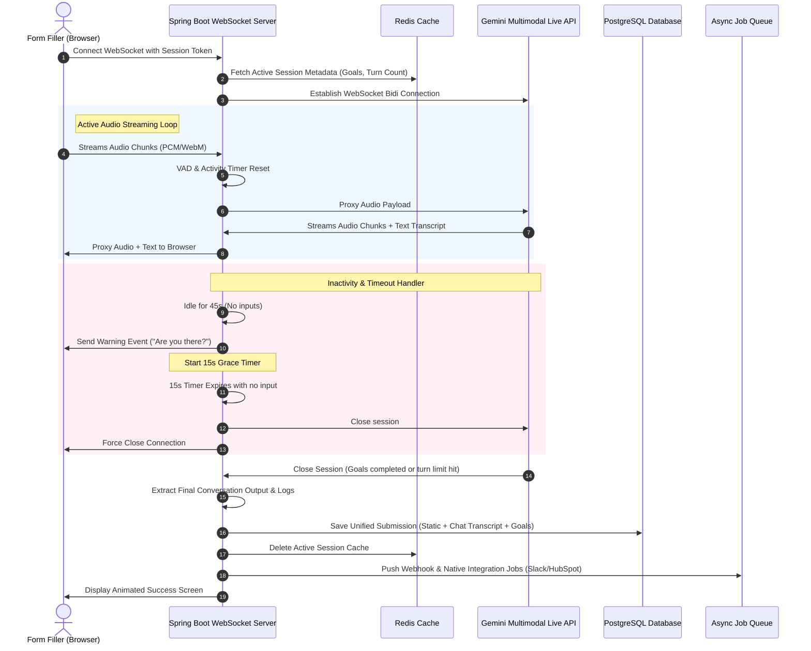

# reForm App: System Architecture & Design Specification

reForm is an omni-modal form platform featuring static inputs and a real-time conversational voice/text filler experience powered by Gemini, combined with an AI-assisted drag-and-drop form builder. This document details the architectural specifications, database models, agent definitions, and code modifications required to implement the platform.

---

## Architectural Specifications & Design Decisions

Through our design alignment, we resolved the following key architectural boundaries:

1. **Credit Ledger System**: Credit consumption is calculated based on actual Gemini API resource costs (input/output tokens and audio minutes) with a platform-configured markup rate. Balance checks are enforced in real-time.
2. **Audio Streaming**: A direct browser-to-backend WebSocket connection is established. The Spring Boot backend acts as a secure proxy, relaying PCM audio chunks to the Gemini Multimodal Live API (WebSockets) in real-time, masking API credentials and tracking token/minute consumption on the fly.
3. **Session State Management**: Active session state (chat history, extracted goals, turn count, timers) is cached in Redis for fast, low-latency lookups. Completed sessions are persisted permanently in PostgreSQL upon session closure or timeout.
4. **Form Co-Builder (Form Architect)**: The builder assistant generates and returns the complete updated list of blocks as a structured JSON array on each iteration (using Gemini Flash Structured Outputs), making it simple for the frontend to render the preview.
5. **Guardrails & Moderation**: Primary conversational constraints and safety redirections are embedded directly in the Gemini Live session's system instructions (for zero-latency enforcement), while a fast, asynchronous text classifier runs on the backend to flag violations or trigger session-level warnings.
6. **File Storage & Vision Processing**: Uploaded files (diagrams, resumes, etc.) are saved to a platform-owned storage service (e.g., local disk for development, AWS S3 / Google Cloud Storage for production). They are sent as inline base64 media blocks in the Gemini API payloads.
7. **Webhooks & Integrations**: When a submission completes, integration events are pushed to an asynchronous Redis or database queue, executing deliveries with exponential backoff retries.
8. **RBAC & Multi-Tenancy**: Roles (`ADMIN`, `CREATOR`, `VIEWER`) are scoped per workspace, defined in a dedicated `WorkspaceMember` membership entity. The creator of the workspace can grant edit permissions to other members.
9. **Unified Submissions**: Static answers, conversational transcripts, audio recording URLs, goals met, and score summaries are stored in a single unified `Submission` entity using PostgreSQL JSONB columns.

---

## Technical Architecture

Below is the design overview of the data flow during an active voice session:

---

## Proposed Changes

We will modularize implementation into components across the `backend` and `frontend`.

### 1. Database & Domain Layer (PostgreSQL & Spring JPA)

#### [MODIFY] [User.java](file:///Users/apple/Coding-projects/reForm-Web-App/backend/src/main/java/com/reform/backend/user/entity/User.java)
- Remove global role column from `User` entity to support workspace-specific roles.
- Map workspace membership through a new `WorkspaceMember` join entity.

#### [MODIFY] [Workspace.java](file:///Users/apple/Coding-projects/reForm-Web-App/backend/src/main/java/com/reform/backend/user/entity/Workspace.java)
- Replace `@ManyToMany` direct mapping to `members` with a `@OneToMany` mapping to `WorkspaceMember`.

#### [NEW] [WorkspaceMember.java](file:///Users/apple/Coding-projects/reForm-Web-App/backend/src/main/java/com/reform/backend/user/entity/WorkspaceMember.java)
- Define a join entity mapping `User` to `Workspace`.
- Add fields for `WorkspaceRole` (`ADMIN`, `CREATOR`, `VIEWER`).
- Add a boolean field `canEdit` for custom write privileges.

#### [MODIFY] [Submission.java](file:///Users/apple/Coding-projects/reForm-Web-App/backend/src/main/java/com/reform/backend/submission/entity/Submission.java)
- Add columns:
  - `status` (`DRAFT`, `IN_PROGRESS`, `COMPLETED`, `ABORTED`).
  - `staticResponses` (`JSONB` mapping of form block keys to strings/arrays).
  - `transcript` (`Text` or `JSONB` containing the chronological chat bubbles).
  - `extractedGoals` (`JSONB` indicating goal completion checklist).
  - `evaluation` (`JSONB` containing sentiment, scores, thematic tags).
  - `totalCostCredits` (`BigDecimal` representing usage fee).

#### [NEW] [CreditLedger.java](file:///Users/apple/Coding-projects/reForm-Web-App/backend/src/main/java/com/reform/backend/billing/entity/CreditLedger.java)
- Add transactional credit ledger entity mapping workspace ID, action type (e.g., `FORM_SUBMISSION`, `CO_BUILDER_PROMPT`), credit amount, and timestamp.

---

### 2. Live Websocket & Orchestration Layer

#### [NEW] [GeminiWebSocketHandler.java](file:///Users/apple/Coding-projects/reForm-Web-App/backend/src/main/java/com/reform/backend/websocket/GeminiWebSocketHandler.java)
- Implement `WebSocketHandler` to accept connection requests for active interview sessions.
- Establish WebSocket client connection to the external Gemini Multimodal Live API.
- Manage bidirectional proxying:
  - Client microphone packets -> Gemini Live session.
  - Gemini voice response chunks -> Client browser speaker.
- Monitor active session activity timeouts (VAD silence threshold of 45 seconds + 15 seconds warning).
- Accumulate token usage headers and audio duration to update workspace credit ledgers.

#### [NEW] [RedisSessionService.java](file:///Users/apple/Coding-projects/reForm-Web-App/backend/src/main/java/com/reform/backend/websocket/RedisSessionService.java)
- Manage transient state of active chat sessions: transcript storage buffer, goals list, and current turn tracker.

---

### 3. Agent Integration Services (Gemini Integration)

#### [NEW] [GeminiClient.java](file:///Users/apple/Coding-projects/reForm-Web-App/backend/src/main/java/com/reform/backend/core/service/GeminiClient.java)
- Standard HTTP/REST integration for the **Form Architect Agent** (generating list of blocks from prompts or uploaded PDFs using Gemini Flash with structured JSON output).
- Integration for **Guardrail & Moderation Agent** (running async classification checks on inputs).
- Integration for **Vision & Document Parser Agent** (handling PDF syllabus parses or JPEG diagrams).

---

### 4. Security & Permissions Update

#### [MODIFY] [WorkspaceSecurity.java](file:///Users/apple/Coding-projects/reForm-Web-App/backend/src/main/java/com/reform/backend/auth/security/WorkspaceSecurity.java)
- Re-write `isOwner` and `isMember` to evaluate permissions against the new `WorkspaceMember` table.
- Implement helper methods to check role requirements (e.g., `@PreAuthorize("@workspaceSecurity.hasRole(authentication, #workspaceId, 'CREATOR')")`).

---

### 5. Webhooks & Background Queue (Redis-Backed)

#### [NEW] [WebhookDispatcher.java](file:///Users/apple/Coding-projects/reForm-Web-App/backend/src/main/java/com/reform/backend/integration/WebhookDispatcher.java)
- Listens to `SubmissionCompletedEvent`.
- Adds webhook tasks to an in-memory or Redis queue.
- Implements HTTP client POST delivery with retry schedules.

---

### 6. Frontend Layouts & UX Components (React/Next.js)

#### [NEW] [FormBuilderPage](file:///Users/apple/Coding-projects/reForm-Web-App/frontend/src/app/builder/page.tsx)
- Visual drag-and-drop workspace layout.
- Split-screen preview mode (visual builder on left, interactive mockup rendering block structures in real-time on right).
- Integrated Chatbot panel (Text/Voice modes) to prompt modifications.
- Inline comment bubble overlays upon block hover.

#### [NEW] [FormFillerPage](file:///Users/apple/Coding-projects/reForm-Web-App/frontend/src/app/form/[slug]/page.tsx)
- Unified entry form for static questions (Step 1).
- Smooth transition fade-in to the Omni-modal Chat interface (Step 2).
- Dynamic visual components (choice buttons, dropzones, sliders) generated from WebSocket JSON schemas.
- Interactive audio recorder with wave animation and real-time speech-to-text text preview.

---

## Verification Plan

### Automated Tests
- Write JUnit tests for `WorkspaceSecurity` to verify role-based permissions (ADMIN vs CREATOR vs VIEWER).
- Mock Gemini API responses and verify the credit deduction logic in `CreditLedgerService`.
- Test WebSocket handler silence timers under simulated inactivity delays.

### Manual Verification
- Deploy local Spring Boot backend alongside Next.js frontend.
- Launch the form creator, speak commands, verify block JSON generation.
- Access the public form link, fill out static fields, begin the voice interview, speak answers, upload a diagram image, verify that the submission results correctly sync to PostgreSQL, and that webhooks dispatch successfully.
