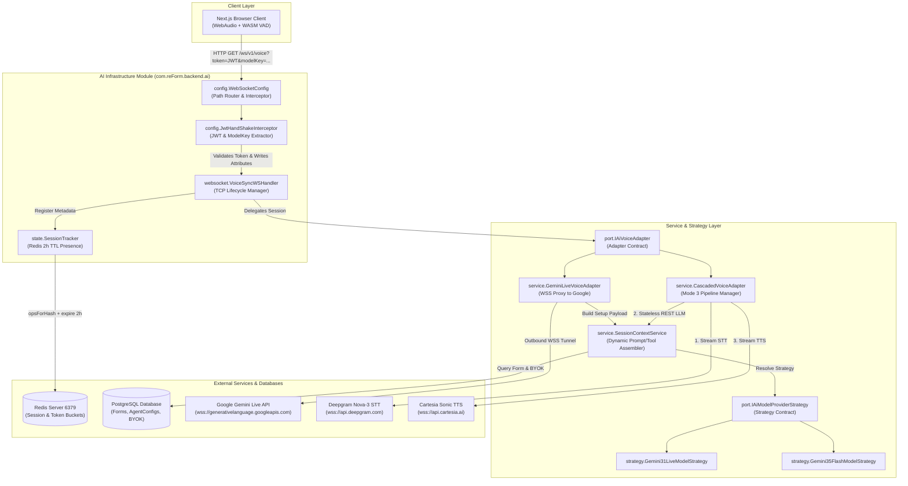
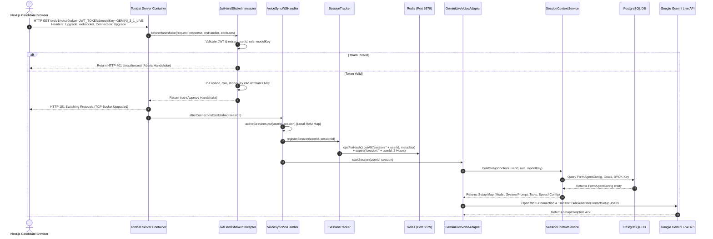
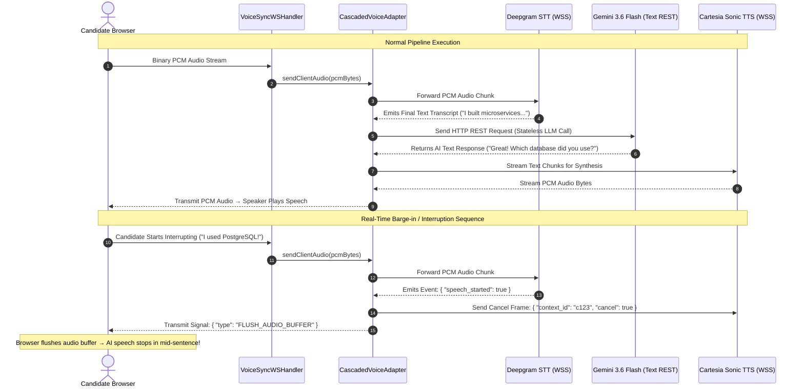
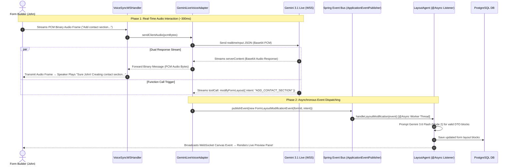
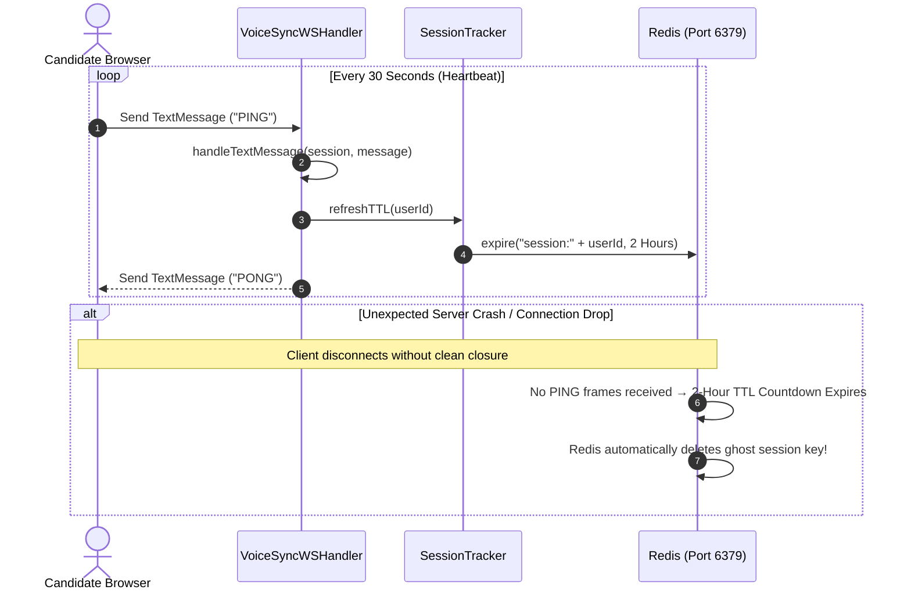

# 21. Mermaid System Architecture & Sequence Diagrams
**Document Version:** 1.0  
**Target System:** reForm Modular Monolith (`com.reForm.backend.ai`)  
**Author:** Senior Technical Lead & AI System Architect  

---

## Diagram 1: Unified Package & Component Layout (`com.reForm.backend.ai`)

---

## Diagram 2: Handshake, Authentication, & Session Initialization Sequence

---

## Diagram 3: Mode 3 Voice Cascaded Pipeline & Barge-in Interruption Sequence

---

## Diagram 4: Mode 4 Real-Time Voice + Mode 2 Multi-Agent Event Sequence

---

## Diagram 5: Distributed State & Heartbeat Ping-Pong Sequence

