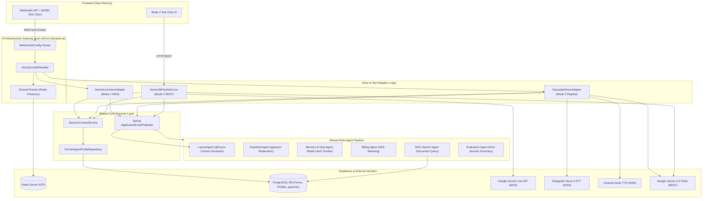
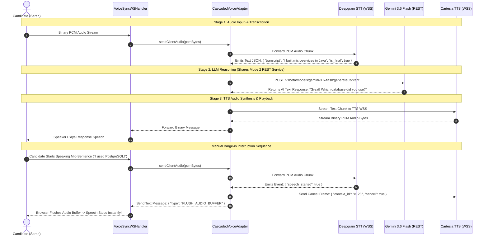
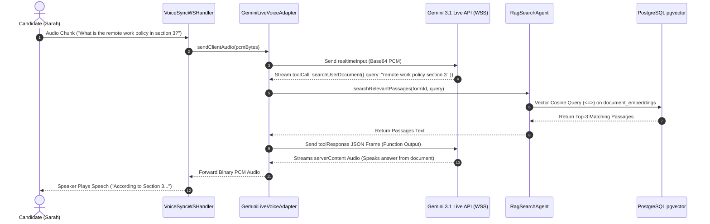

# System Diagrams & Comprehensive Sequence Flows
**Document Version:** 3.0 (Unified 4-Mode & Mode 3 Cascaded Voice Flows)  
**Location:** `backend/knowledge/pth/week3/06_system_diagrams_and_sequence_flows.md`  
**Target System:** reForm Modular Monolith (`com.reForm.backend.ai`)  

---

## Diagram 1: Unified 4-Mode Component Architecture

---

## Diagram 2: Mode 3 Complete Cascaded Voice Pipeline & Barge-in Sequence Flow

---

## Diagram 3: In-Session Document RAG Tool Calling Sequence Flow (Mode 4)

