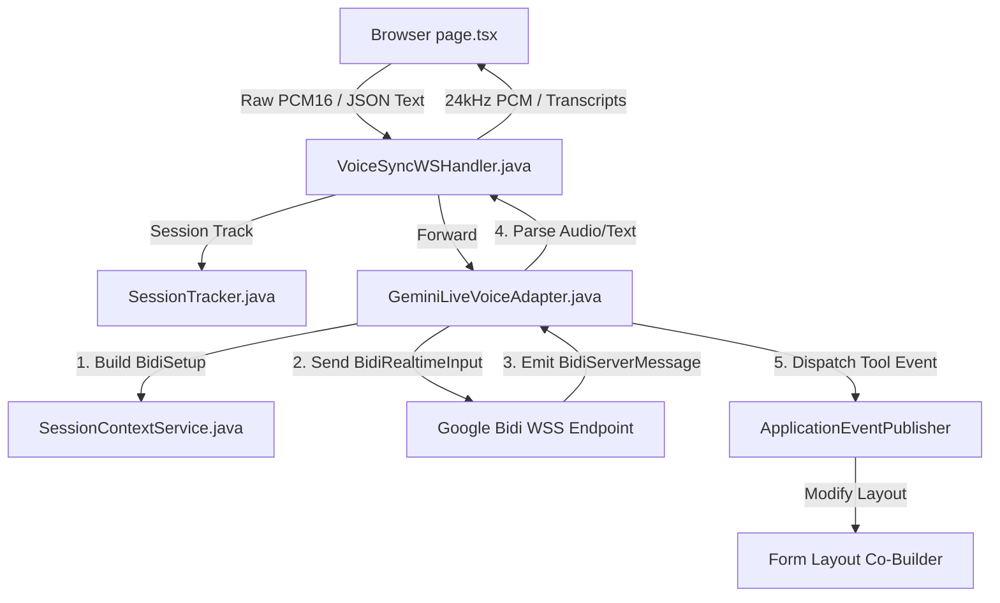

# 10. Mode 4 Gemini Live Voice Implementation Retrospective & Complete Bidi API Specification

**Document Version:** 4.0  
**Target System:** reForm Monolith (`com.reForm.backend.ai` & Next.js Frontend)  
**Author:** Senior Technical Lead & AI System Architect  

---

## 1. Terminology Clarification: Gemini Live API vs. Bidi API

### Are "Gemini Live API" and "Bidi API" the same thing?
**Yes, they refer to the exact same underlying technology, but at different abstraction levels:**

1. **Gemini Live API (Product & Feature Name):**  
   The user-facing marketing and feature name given by Google for real-time, low-latency, bidirectional audio/video/text multimodal interaction with Gemini models.
2. **Bidi API (`BidiGenerateContent`) (Protocol & Engineering Specification):**  
   The exact low-level gRPC/WebSocket protocol method name (**Bidi**rectional **GenerateContent**) and JSON message schema family defined by Google's engineering team (`BidiGenerateContentSetup`, `BidiGenerateContentRealtimeInput`, `BidiGenerateContentServerMessage`, `BidiGenerateContentToolResponse`).

### Why we use both terms in reForm:
* We use **Gemini Live API** when referring to the **Mode 4 feature capabilities** (Voice Co-Builder, 24kHz audio streaming, native voice synthesis).
* We use **Bidi API** when referring to the **exact WebSocket JSON schemas and class handlers** implemented in `GeminiLiveVoiceAdapter.java` and `SessionContextService.java`.

---

## 2. Full Bidi API Endpoint Reference & URLs

### A. Official Full Bidi WebSocket Endpoint URL (v1beta)
```text
wss://generativelanguage.googleapis.com/ws/google.ai.generativelanguage.v1beta.GenerativeService.BidiGenerateContent?key=YOUR_API_KEY
```
* **Protocol:** WebSockets (`wss://`)
* **Host:** `generativelanguage.googleapis.com`
* **Service RPC Path:** `/ws/google.ai.generativelanguage.v1beta.GenerativeService.BidiGenerateContent`
* **Authentication Query Param:** `key=YOUR_API_KEY`

### B. Ephemeral Token Bidi Endpoint URL
```text
wss://generativelanguage.googleapis.com/ws/google.ai.generativelanguage.v1beta.GenerativeService.BidiGenerateContentConstrained?access_token={short-lived-token}
```

### C. reForm Internal Backend Inbound Endpoint
```text
ws://localhost:8080/ws/v1/voice?token=test_token
```

---

## 3. Official Google Bidi WebSockets API Specification

*(Complete Reference Schema from Google Live API Documentation)*

### A. Supported Client Messages
A client message sent over the Bidi WebSocket must contain **exactly one** of the following top-level keys:
```json
{
  "setup": "BidiGenerateContentSetup",
  "clientContent": "BidiGenerateContentClientContent",
  "realtimeInput": "BidiGenerateContentRealtimeInput",
  "toolResponse": "BidiGenerateContentToolResponse"
}
```

| Message | Description |
|---|---|
| `BidiGenerateContentSetup` | Session configuration payload sent in the first message upon connection. |
| `BidiGenerateContentClientContent` | Incremental conversation history updates appended to prompt context. |
| `BidiGenerateContentRealtimeInput` | Streaming audio (PCM16 16kHz), video, or text input sent continuously. |
| `BidiGenerateContentToolResponse` | Execution output returned in response to a server `toolCall`. |

---

### B. Complete Bidi Types & Message Schema Reference

#### 1. `BidiGenerateContentSetup`
Configuration payload sent in the first message.
* `model`: Resource name format `models/{model}` (e.g. `models/gemini-3.1-flash-live-preview`).
* `generationConfig`: Generation parameters (`responseModalities`: `["AUDIO"]`, `speechConfig`: `{ "voiceConfig": { "prebuiltVoiceConfig": { "voiceName": "Puck" } } }`).
* `systemInstruction`: User-provided system persona prompt.
* `tools[]`: List of tool/function declarations available for execution.
* `realtimeInputConfig`: Automatic activity detection & sensitivity settings.
* `sessionResumption`: Resumption handle configuration.
* `contextWindowCompression`: Trigger tokens and sliding window configuration.

#### 2. `BidiGenerateContentRealtimeInput`
Streaming user input.
* `audio`: `{ "data": "BASE64_PCM", "mimeType": "audio/pcm;rate=16000" }` (Realtime audio input stream).
* `video`: `{ "data": "BASE64_IMAGE", "mimeType": "image/jpeg" }` (Realtime video input stream).
* `text`: Realtime text input string.
* `mediaChunks`: **DEPRECATED**. Use `audio`, `video`, or `text` instead.
* `activityStart` / `activityEnd`: Explicit user activity markers when automatic detection is disabled.
* `audioStreamEnd`: Signal indicating microphone stream closure.

#### 3. `BidiGenerateContentServerMessage`
Top-level response payload received from Google:
* `setupComplete`: Sent when setup configuration is accepted.
* `serverContent`: Contains `modelTurn` (parts with text & `inlineData` 24kHz audio), `inputTranscription`, `outputTranscription`, `turnComplete`, `interrupted`, and `generationComplete`.
* `toolCall`: Contains `functionCalls[]` (`name`, `id`, `args`).
* `toolCallCancellation`: Sent if a pending tool call is cancelled due to barge-in.
* `sessionResumptionUpdate`: Emits `newHandle` and `resumable` status.
* `usageMetadata`: `promptTokenCount`, `responseTokenCount`, `totalTokenCount`, `promptTokensDetails[]`, `responseTokensDetails[]`.
* `goAway`: Warning notice before server disconnect.

#### 4. `BidiGenerateContentToolResponse`
Client response to server function calls:
```json
{
  "toolResponse": {
    "functionResponses": [
      {
        "id": "call_id_123",
        "name": "modifyFormLayout",
        "response": { "result": { "status": "SUCCESS" } }
      }
    ]
  }
}
```

---

## 4. How We Used the Bidi Specification to Build Mode 4

Every step of the Mode 4 feature in reForm was built by mapping Google's Bidi specification directly into Java Spring Boot components:



1. **Session Setup (`BidiGenerateContentSetup`):**  
   In [SessionContextService.java](file:///Users/apple/Coding-projects/reForm-Web-App/backend/src/main/java/com/reForm/backend/ai/service/SessionContextService.java), we built the setup dictionary containing `models/gemini-3.1-flash-live-preview`, `generationConfig` with `AUDIO` modality & voice `Puck`, system instructions, and tool declarations (`modifyFormLayout`, `searchUserDocument`).
2. **Audio Streaming (`BidiGenerateContentRealtimeInput`):**  
   In [GeminiLiveVoiceAdapter.java](file:///Users/apple/Coding-projects/reForm-Web-App/backend/src/main/java/com/reForm/backend/ai/service/GeminiLiveVoiceAdapter.java), we converted raw 16kHz PCM audio bytes to Base64 and wrapped them in `realtimeInput.audio: { mimeType: "audio/pcm;rate=16000", data: base64Audio }`.
3. **Response Parsing (`BidiGenerateContentServerMessage`):**  
   In `processGooglePayload`, we parsed `serverContent.modelTurn.parts[].inlineData.data`, decoded Base64 PCM to raw binary 24kHz bytes, and forwarded `inputTranscription` and `outputTranscription` to the client.
4. **Silent Tool Call Execution (`BidiGenerateContentToolCall` & `ToolResponse`):**  
   When Gemini emitted `toolCall`, we published `FormLayoutModificationEvent` via Spring's `ApplicationEventPublisher` and returned `BidiGenerateContentToolResponse` containing `functionResponses[]`.

---

## 5. Low-Level Mechanics & Concurrency Architecture

### A. Concurrency Protection (`ConcurrentWebSocketSessionDecorator`)
Tomcat manages WebSocket TCP connections with thread pools. When candidate microphone audio arrives at ~50 binary frames per second while outbound Gemini threads simultaneously attempt to write audio/text back to the client session, raw Tomcat `WebSocketSession.sendMessage()` throws `IllegalStateException`.

Both inbound and outbound WebSocket session handles are wrapped in `ConcurrentWebSocketSessionDecorator` with a **10MB buffer limit** (`10485760` bytes) and a **10,000 ms send timeout**:
```java
WebSocketSession safeClientSession = new ConcurrentWebSocketSessionDecorator(clientSession, 10000, 10485760);
WebSocketSession safeGeminiSession = new ConcurrentWebSocketSessionDecorator(session, 10000, 10485760);
```

### B. Security & Query-Param Handshake Authentication
Standard browser WebSockets (`new WebSocket("ws://...")`) do not permit custom HTTP headers (`Authorization: Bearer <token>`).
1. **Spring Security Route Unlocking ([SecurityConfig.java](file:///Users/apple/Coding-projects/reForm-Web-App/backend/src/main/java/com/reForm/backend/auth/config/SecurityConfig.java)):**
   Exposed `/ws/v1/voice/**` in `SecurityFilterChain`:
   ```java
   .requestMatchers("/ws/v1/voice/**").permitAll()
   ```
2. **Query-Param Token Interceptor ([WebSocketConfig.java](file:///Users/apple/Coding-projects/reForm-Web-App/backend/src/main/java/com/reForm/backend/ai/config/WebSocketConfig.java)):**
   Implemented `JwtHandShakeInterceptor` to read `?token=JWT` from the HTTP upgrade URI before protocol upgrade and bind `userId` and `role` to session attributes.

### C. Tomcat & Container Buffer Scaling
Configured `ServletServerContainerFactoryBean` in `WebSocketConfig.java` and `WebSocketContainer` in `GeminiLiveVoiceAdapter.java` setting text and binary buffer limits to **10MB (10,485,760 bytes)** to eliminate WebSocket Code `1009` ("Buffer too small") crashes on large audio frames.

---

## 6. Retrospective: Errors Encountered & Solutions

### Error 1: Setup Payload `generationConfig` Placement
* **Issue:** `responseModalities` was placed at top-level `setup` root instead of inside `generationConfig`.
* **Fix:** Updated `SessionContextService.java` to nest `generationConfig` properly under `setup`.

### Error 2: Deprecated `media_chunks` Field (WebSocket Code 1007)
* **Issue:** Google closed connection with `code=1007, reason=realtime_input.media_chunks is deprecated`.
* **Fix:** Updated `sendClientAudio` in `GeminiLiveVoiceAdapter.java` to package audio under `realtimeInput.audio: { mimeType: "audio/pcm;rate=16000", data: base64Audio }`.

### Error 3: Tomcat & Spring WebSocket Buffer Overflow (WebSocket Code 1009)
* **Issue:** Tomcat threw `code=1009, reason=Buffer size: [8,192], Message size: [13,008]`.
* **Fix:** Added `ServletServerContainerFactoryBean` in `WebSocketConfig.java` and `WebSocketContainer` in `GeminiLiveVoiceAdapter.java` setting text and binary buffer limits to **10MB**.

### Error 4: Mic Echo Feedback & 2-Word Speech Cutoff
* **Issue:** AI speech cut off after 2 words because laptop speakers played AI sound back into the microphone, triggering Gemini native barge-in (`interrupted: true`).
* **Fix:** Added audio queue scheduling lock, `turnComplete` tracking, and a feedback guard in `page.tsx` that pauses mic chunk forwarding while AI audio is playing.

---

## 7. Summary of Codebase Modifications

- [SecurityConfig.java](file:///Users/apple/Coding-projects/reForm-Web-App/backend/src/main/java/com/reForm/backend/auth/config/SecurityConfig.java): Permitted `/ws/v1/voice/**` path for HTTP upgrade handshake.
- [WebSocketConfig.java](file:///Users/apple/Coding-projects/reForm-Web-App/backend/src/main/java/com/reForm/backend/ai/config/WebSocketConfig.java): Registered `/ws/v1/voice`, query-param JWT interceptor, and 10MB `ServletServerContainerFactoryBean`.
- [SessionContextService.java](file:///Users/apple/Coding-projects/reForm-Web-App/backend/src/main/java/com/reForm/backend/ai/service/SessionContextService.java): `setupMap` payload nesting fix.
- [GeminiLiveVoiceAdapter.java](file:///Users/apple/Coding-projects/reForm-Web-App/backend/src/main/java/com/reForm/backend/ai/service/GeminiLiveVoiceAdapter.java): 10MB container buffer limits, `sendClientText`, `sendClientAudio` schema, `toolCall` array processing, `ConcurrentWebSocketSessionDecorator` integration.
- [IAiVoiceAdapter.java](file:///Users/apple/Coding-projects/reForm-Web-App/backend/src/main/java/com/reForm/backend/ai/port/IAiVoiceAdapter.java): Added `sendClientText` method declaration.
- [VoiceSyncWSHandler.java](file:///Users/apple/Coding-projects/reForm-Web-App/backend/src/main/java/com/reForm/backend/ai/websocket/VoiceSyncWSHandler.java): Forwarding client JSON text frames to `aiVoiceAdapter`.
- [page.tsx](file:///Users/apple/Coding-projects/reForm-Web-App/frontend/src/app/page.tsx): Web Audio player queue, horizontal word-by-word streaming text renderer, duplicate text filter, and barge-in toggle.
