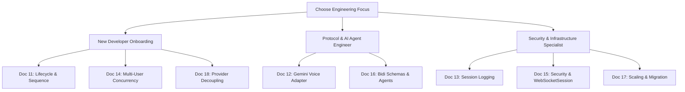

# 10. Mode 4 Master Syllabus, Sitemap & Table of Contents Specification

**Document Version:** 2.0  
**Target System:** reForm Monolith (`com.reForm.backend.ai` & Next.js Frontend)  
**Author:** Senior Technical Lead & AI System Architect  

---

## 1. Overview & Knowledge Base Architecture

To prevent single-file clutter and provide a clear sitemap for engineers, the reForm Mode 4 Real-Time Voice Architecture specification is split into **8 specialized topic specifications** indexed from **Document 11 through Document 18** under [`backend/knowledge/pth/week3/`](file:///Users/apple/Coding-projects/reForm-Web-App/backend/knowledge/pth/week3/).

This master syllabus provides an itemized Table of Contents (TOC), component sitemap, and reading guide across all sub-specifications.

---

## 2. Master Curriculum Sitemap Table

| Spec # | Specification Title & Document Link | Primary Technical Focus | Key Code Symbols / Frameworks |
| :--- | :--- | :--- | :--- |
| **11** | [11_mode4_end_to_end_connection_lifecycle_and_sequence_diagram.md](file:///Users/apple/Coding-projects/reForm-Web-App/backend/knowledge/pth/week3/11_mode4_end_to_end_connection_lifecycle_and_sequence_diagram.md) | End-to-End Handshake & Sequence Flow | `VoiceSyncWSHandler`, Socket FD `#42`/`#89`, Tomcat NIO Selector, Automatic vs Manual Execution Matrix |
| **12** | [12_mode4_gemini_live_voice_adapter_and_payload_processing.md](file:///Users/apple/Coding-projects/reForm-Web-App/backend/knowledge/pth/week3/12_mode4_gemini_live_voice_adapter_and_payload_processing.md) | Proxy Adapter & Payload Processing | `GeminiLiveVoiceAdapter`, `GoogleBidiWebSocketHandler`, Tagged Union Dispatcher, SOLID Analysis |
| **13** | [13_mode4_per_session_dynamic_logging_architecture.md](file:///Users/apple/Coding-projects/reForm-Web-App/backend/knowledge/pth/week3/13_mode4_per_session_dynamic_logging_architecture.md) | Per-Session Isolated Logging | Logback `SiftingAppender`, SLF4J `MDC.put("sessionId", userId)`, `logs/sessions/{userId}.log` |
| **14** | [14_mode4_multi_user_concurrency_and_twin_socket_memory_model.md](file:///Users/apple/Coding-projects/reForm-Web-App/backend/knowledge/pth/week3/14_mode4_multi_user_concurrency_and_twin_socket_memory_model.md) | Concurrency & RAM Layout | Twin-Socket Memory Model, `ConcurrentWebSocketSessionDecorator`, Concurrent Write Race Conditions, 10MB Sizing Math |
| **15** | [15_mode4_security_authentication_and_interceptor_guards.md](file:///Users/apple/Coding-projects/reForm-Web-App/backend/knowledge/pth/week3/15_mode4_security_authentication_and_interceptor_guards.md) | Handshake Security & `WebSocketSession` | `JwtHandshakeInterceptor`, Guard Clause Inversion, `WebSocketSession` IoC Callback Receiving Model |
| **16** | [16_mode4_google_bidi_websocket_protocol_spec_and_schemas.md](file:///Users/apple/Coding-projects/reForm-Web-App/backend/knowledge/pth/week3/16_mode4_google_bidi_websocket_protocol_spec_and_schemas.md) | Protocol Schemas & Multi-Agent Pipeline | Bidi 6 Server Capabilities, `LayoutAgent` Mode 2 Block Mutations (`ADD`/`UPDATE`/`DELETE`), Jackson `ObjectMapper` |
| **17** | [17_mode4_production_scaling_architectures_and_zero_downtime_migration.md](file:///Users/apple/Coding-projects/reForm-Web-App/backend/knowledge/pth/week3/17_mode4_production_scaling_architectures_and_zero_downtime_migration.md) | Production Scaling & Migration | `ServletServerContainerFactoryBean` 10MB Bean, Retrospective Error Fixes, WebRTC / Direct Tokens / Rust Sidecar |
| **18** | [18_ai_provider_decoupling_and_4mode_unified_architecture.md](file:///Users/apple/Coding-projects/reForm-Web-App/backend/knowledge/pth/week3/18_ai_provider_decoupling_and_4mode_unified_architecture.md) | Provider Decoupling & Unified Architecture | `IAiVoiceAdapter`, `AiVoiceAdapterFactory`, Mode 3 (Cascaded STT/LLM/TTS) vs Mode 4, Unified 4-Mode Component Reuse Matrix |

---

## 3. Detailed Syllabus & Topic Breakdown

### [Document 11: End-to-End Connection Lifecycle & Sequence Diagram](file:///Users/apple/Coding-projects/reForm-Web-App/backend/knowledge/pth/week3/11_mode4_end_to_end_connection_lifecycle_and_sequence_diagram.md)
1. **Architectural Scope**: Distinction between Gemini Live Bidi WSS vs standard Unary REST APIs.
2. **Terminology**: Gemini Live API (Product Name) vs. Bidi API (`BidiGenerateContent` Protocol Specification).
3. **Sequence Diagram**: 4-phase sequence flow from browser click to active voice streaming.
4. **OS Kernel & Tomcat Mechanics**: OS TCP Socket File Descriptors (`Socket FD #42` vs `#89`) and Tomcat NIO Selector thread dispatching (`nio-8080-exec-1`).
5. **Automatic vs Manual Execution Matrix**: 12-step table identifying automatic engine steps vs custom Java code steps.

---

### [Document 12: Gemini Live Voice Adapter & Payload Processing](file:///Users/apple/Coding-projects/reForm-Web-App/backend/knowledge/pth/week3/12_mode4_gemini_live_voice_adapter_and_payload_processing.md)
1. **Adapter Architecture**: `GeminiLiveVoiceAdapter.java` proxy responsibilities.
2. **Buffer Helper**: `WebSocketSessionUtils.wrapSafeSession` session wrapping.
3. **Outbound Handler**: `GoogleBidiWebSocketHandler` inner class managing Socket 2 lifecycle.
4. **Single-Responsibility Tree**: Decomposed `processGooglePayload` helper method hierarchy (`handleSetupComplete`, `handleServerContent`, `handleToolCall`, `handleRawBinaryAudio`).
5. **SOLID Principles Analysis**:
   - `wrapSafeSession` SRP code smell analysis.
   - `GoogleBidiWebSocketHandler` inner class OCP analysis.
   - Response handling division of responsibilities (`VoiceSyncWSHandler` vs `GeminiLiveVoiceAdapter`).
6. **Simultaneous Perception Mechanics**: 50-microsecond CPU execution of `TextMessage` and `BinaryMessage` explaining user perception.

---

### [Document 13: Per-Session Dynamic Logging Architecture](file:///Users/apple/Coding-projects/reForm-Web-App/backend/knowledge/pth/week3/13_mode4_per_session_dynamic_logging_architecture.md)
1. **Problem Statement**: Preventing thread log pollution across multi-user concurrent voice sessions.
2. **SLF4J MDC Binding**: Thread-local context injection (`MDC.put("sessionId", userId)` / `MDC.remove("sessionId")` in `try-finally` blocks).
3. **Logback `SiftingAppender`**: Configuration in `logback-spring.xml` using `<discriminator>`.
4. **Storage Structure**: Dynamic file routing under `backend/logs/sessions/{userId}.log`.

---

### [Document 14: Multi-User Concurrency & Twin-Socket Memory Model](file:///Users/apple/Coding-projects/reForm-Web-App/backend/knowledge/pth/week3/14_mode4_multi_user_concurrency_and_twin_socket_memory_model.md)
1. **Proxy Overview**: 4 core reasons for backend proxying (API Key Security, Auth & Roles, Base64 Encoding, Tool Call Interception).
2. **Twin-Socket Memory Model**: Inbound Socket 1 (Browser $\leftrightarrow$ Server) vs Outbound Socket 2 (Server $\leftrightarrow$ Google), $2N$ socket count formula.
3. **JVM Heap Layout**: Class & attribute storage breakdown (`activeSessions` ConcurrentHashMap, `safeClientSession`, `geminiSession`, Redis presence).
4. **Multi-Threaded Concurrent Write Protection**: Detailed race condition analysis (`nio-8080-exec-1` vs `scheduled-task-3` throwing `IllegalStateException: TEXT_FULL_WRITING` without `ConcurrentWebSocketSessionDecorator`).
5. **Mathematical Buffer Sizing**: 8KB default failure vs 10MB optimal sizing vs 100MB JVM `OutOfMemoryError` RAM calculation.

---

### [Document 15: Security Authentication & Interceptor Guards](file:///Users/apple/Coding-projects/reForm-Web-App/backend/knowledge/pth/week3/15_mode4_security_authentication_and_interceptor_guards.md)
1. **Security Architecture**: WebSocket query token authentication (`ws://...?token=JWT`).
2. **`JwtHandshakeInterceptor`**: Flattened control flow using guard clause inversion, `[PRODUCTION_ALERT_REMOVE_BEFORE_PROD]` comments, and `ITokenProvider` validation.
3. **Spring Security Integration**: `SecurityConfig.java` permitAll configuration for `/ws/v1/voice/**`.
4. **Spring `WebSocketSession` Deep Dive**: 4-question framework, IoC event-driven callback receiving model (`handleTextMessage`/`handleBinaryMessage`), client vs server lifecycle, and `session.getAttributes()` map.

---

### [Document 16: Google Bidi WebSocket Protocol Spec & Schemas](file:///Users/apple/Coding-projects/reForm-Web-App/backend/knowledge/pth/week3/16_mode4_google_bidi_websocket_protocol_spec_and_schemas.md)
1. **Endpoints**: Official Bidi WSS URL vs reForm internal WSS URL.
2. **6 Bidi Server Capabilities**: Polymorphic tagged union tree (`setupComplete`, `serverContent`, `toolCall`, `sessionResumptionUpdate`, `toolCallCancellation`, `goAway`) with twin-socket routing rules and processing pipeline.
3. **JSON Schemas**: Concrete payloads for `BidiGenerateContentSetup`, `realtimeInput`, `serverContent`, `toolCall`, and `toolResponse`.
4. **Mode 2 `LayoutAgent` Specification**: Block Architect Agent operating in **Mode 2 (Structured REST JSON Mode)** using Gemini Flash for `ADD_BLOCK`, `UPDATE_BLOCK`, `DELETE_BLOCK`, `REORDER_BLOCKS`.
5. **Form Filler Multi-Agent Pipeline**: 6 specialist sub-agents (Guardrail, Memory/Goal, Billing/VAD, RAG Search, Canvas Sync, Evaluation/Scoring).
6. **Class Framework**: Systematic 4-question analysis for Jackson `ObjectMapper`, `StandardWebSocketClient`, and `AbstractWebSocketHandler`.

---

### [Document 17: Production Scaling Architectures & Zero-Downtime Migration](file:///Users/apple/Coding-projects/reForm-Web-App/backend/knowledge/pth/week3/17_mode4_production_scaling_architectures_and_zero_downtime_migration.md)
1. **Tomcat Container Engineering**: `ServletServerContainerFactoryBean` 10MB bean override and 4-question class framework.
2. **Retrospective Error Fixes**: Fixes for `generationConfig` placement, `media_chunks` deprecation, 10MB buffer overflows, and mic echo feedback cutoff.
3. **JS to Java Concept Mapping**: Comparative reference table between Node.js `ws` and Java Spring WebSockets.
4. **Production Scaling**: Capacity limits (~150-300 users per node), 5-column comparison table, and detailed architectural breakdowns:
   - **Approach A**: WebRTC Media Gateway (UDP audio).
   - **Approach B**: Ephemeral Direct Client Tokens (Direct WSS).
   - **Approach C**: C++ / Rust Media Proxy Sidecar (gRPC relay).
5. **Zero-Downtime Migration**: Decision matrix, recommendation roadmap, and blue-green canary deployment using Spring feature flags (`app.voice.engine=V1`).

---

### [Document 18: AI Provider Decoupling & Unified 4-Mode Architecture](file:///Users/apple/Coding-projects/reForm-Web-App/backend/knowledge/pth/week3/18_ai_provider_decoupling_and_4mode_unified_architecture.md)
1. **Provider Decoupling**: `IAiVoiceAdapter` strategy interface and `AiVoiceAdapterFactory` for vendor abstraction (Google vs OpenAI).
2. **Production Voice Routing**: Dynamic mode selection via query params (`ws://...?mode=MODE_3`).
3. **Mode 3 Cascaded Architecture**: 3-stage pipeline (Deepgram Nova-3 STT WSS $\rightarrow$ Gemini 3.6 Flash REST LLM $\rightarrow$ Cartesia Sonic TTS WSS).
4. **Unified 4-Mode Component Reuse Matrix**: Reuse breakdown showing how Modes 1, 2, 3, and 4 share `FormAiAgentProfile`, `SessionContextService`, `Gemini36FlashService`, `RagSearchAgent`, `LayoutAgent`, `GuardrailAgent`, and `EvaluationAgent`.

---

## 4. Recommended Engineer Reading Paths

