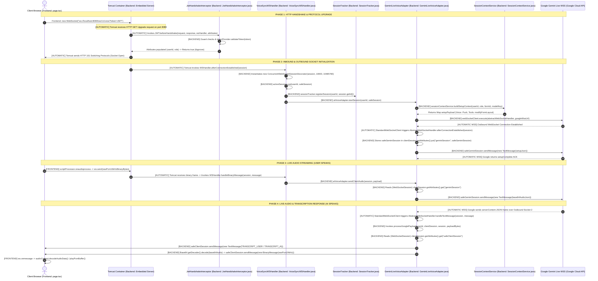

# 11. Mode 4 End-to-End Connection Lifecycle & Sequence Diagram Specification

**Document Version:** 1.0  
**Target System:** reForm Monolith (`com.reForm.backend.ai` & Next.js Frontend)  
**Parent Specification:** [10_mode4_implementation_retrospective_and_js_to_java_mapping.md](file:///Users/apple/Coding-projects/reForm-Web-App/backend/knowledge/pth/week3/10_mode4_implementation_retrospective_and_js_to_java_mapping.md)  

---

## 1. Architectural Scope & API Usage

### API Used for Mode 4
Mode 4 **exclusively uses the Google Gemini Live API (`BidiGenerateContent` WebSockets)**. We do **not** use the standard REST Chatbot API (`generateContent`) for Mode 4.

| Feature Area | API Technology Used | Protocol & Endpoint |
| :--- | :--- | :--- |
| **Mode 4 (Native Live Voice Co-Builder)** | **Google Gemini Live API (Bidi WSS)** | Full-Duplex WebSockets (`wss://generativelanguage.googleapis.com/ws/google.ai.generativelanguage.v1beta.GenerativeService.BidiGenerateContent?key=...`) |
| **Mode 1 & Mode 2 (Form Schema / Chatbot)** | Standard Gemini REST API | Unary HTTP REST (`POST /v1beta/models/gemini-2.5-flash:generateContent`) |

---

## 2. Terminology: Gemini Live API vs. Bidi API

* **Gemini Live API (Product Name):** Google's user-facing feature name for real-time, low-latency, bidirectional audio/video/text multimodal interaction.
* **Bidi API (`BidiGenerateContent`) (Protocol Specification):** The underlying **WebSocket protocol method** and JSON message schema family defined by Google's engineering team (`BidiGenerateContentSetup`, `BidiGenerateContentRealtimeInput`, `BidiGenerateContentServerMessage`, `BidiGenerateContentToolResponse`).

---

## 3. End-to-End Connection Lifecycle Sequence Diagram

Below is the exact step-by-step journey from the moment a user clicks **"Connect Voice Chat"** in the browser to active multi-user streaming.



---

## 4. Step-by-Step Component & Method Responsibilities

### Step 1: User Triggers Connection (Frontend: `frontend/src/app/page.tsx`)
* **Trigger Origin:** Human user clicks "Connect" button in Next.js UI.
* **Exact Method Invoked:** `connectWebSocket()` in [page.tsx](file:///Users/apple/Coding-projects/reForm-Web-App/frontend/src/app/page.tsx).
* **Execution Code:**
  ```javascript
  const ws = new WebSocket("ws://localhost:8080/ws/v1/voice?token=" + token);
  ```
* **Protocol Action:** Browser sends an HTTP GET request with headers `Upgrade: websocket` and `Connection: Upgrade` to `localhost:8080`.

### Step 2: Handshake Security Interception (Backend: Tomcat & `JwtHandshakeInterceptor.java`)
* **Trigger Origin:** **AUTOMATIC**. Tomcat's embedded Servlet Engine intercepts port 8080 HTTP upgrade requests before opening the socket.
* **Exact Method Invoked:** `JwtHandshakeInterceptor.beforeHandshake(ServerHttpRequest request, ServerHttpResponse response, WebSocketHandler wsHandler, Map<String, Object> attributes)` in [JwtHandshakeInterceptor.java](file:///Users/apple/Coding-projects/reForm-Web-App/backend/src/main/java/com/reForm/backend/ai/config/JwtHandshakeInterceptor.java).
* **Execution Code:**
  1. Checks `request instanceof ServletServerHttpRequest`.
  2. Extracts token query parameter `extractParam(query, "token")`.
  3. Calls `tokenProvider.validateToken(token)` to verify JWT signature.
  4. Populates session attributes: `attributes.put("userId", userId); attributes.put("role", role);`.
* **Handshake Result:** **AUTOMATIC**. Tomcat returns `HTTP 101 Switching Protocols` to the browser, upgrading the connection to full-duplex WebSocket.

### Step 3: Inbound Socket Lifecycle & State Registration (Backend: Tomcat, `VoiceSyncWSHandler.java`, `SessionTracker.java`)
* **Trigger Origin:** **AUTOMATIC**. Tomcat's WebSocket engine triggers the handler immediately after HTTP 101 protocol upgrade succeeds.
* **Exact Method Invoked:** `VoiceSyncWSHandler.afterConnectionEstablished(WebSocketSession session)` in [VoiceSyncWSHandler.java](file:///Users/apple/Coding-projects/reForm-Web-App/backend/src/main/java/com/reForm/backend/ai/websocket/VoiceSyncWSHandler.java).
* **Execution Code:**
  1. Wraps raw socket: `WebSocketSession safeSession = GeminiLiveVoiceAdapter.wrapSafeSession(session);`.
  2. Stores in server RAM: `activeSessions.put(userId, safeSession);`.
  3. Registers Redis presence: `sessionTracker.registerSession(userId, session.getId());`.
  4. Hands off to AI layer: `aiVoiceAdapter.startSession(userId, safeSession);`.

### Step 4: Outbound Gemini Tunnel Setup (Backend: `GeminiLiveVoiceAdapter.java` & `SessionContextService.java`)
* **Trigger Origin:** Invoked by `VoiceSyncWSHandler.afterConnectionEstablished(...)`.
* **Exact Methods Invoked:**
  1. `SessionContextService.buildSetupContext(userId, role, formId, requestedModelKey)` in [SessionContextService.java](file:///Users/apple/Coding-projects/reForm-Web-App/backend/src/main/java/com/reForm/backend/ai/service/SessionContextService.java).
  2. `StandardWebSocketClient.execute(AbstractWebSocketHandler handler, String url)` in [GeminiLiveVoiceAdapter.java](file:///Users/apple/Coding-projects/reForm-Web-App/backend/src/main/java/com/reForm/backend/ai/service/GeminiLiveVoiceAdapter.java).
* **Where `AbstractWebSocketHandler` Comes From:**
  It is implemented as a clean, named private inner class `GoogleBidiWebSocketHandler extends AbstractWebSocketHandler` inside `GeminiLiveVoiceAdapter.java`:
  ```java
  private class GoogleBidiWebSocketHandler extends AbstractWebSocketHandler {
      @Override
      public void afterConnectionEstablished(WebSocketSession session) throws Exception { ... }

      @Override
      protected void handleTextMessage(WebSocketSession session, TextMessage message) throws Exception { ... }
  }
  ```
* **Bidirectional Linkage Setup (How Socket 1 & Socket 2 know each other):**
  1. **Linking Socket 1 $\rightarrow$ Socket 2:**  
     Inside `GoogleBidiWebSocketHandler.afterConnectionEstablished`, the outbound Google session (Socket 2) is wrapped using `wrapSafeSession(session)` and saved directly into Inbound Socket 1's attribute map:
     ```java
     clientSession.getAttributes().put("geminiSession", safeGeminiSession);
     ```
  2. **Linking Socket 2 $\rightarrow$ Socket 1:**  
     `GoogleBidiWebSocketHandler` receives `clientSession` (Socket 1) as a constructor parameter. When `handleTextMessage` triggers on Socket 2, it passes the stored `clientSession` to `processGooglePayload(userId, clientSession, session, ...)`!

### Step 5: Live Audio Streaming - User Speaking (Frontend & Backend Multi-User Routing)
* **Trigger Origin:** User speaks into microphone.
* **Frontend Method:** Web Audio API `scriptProcessor.onaudioprocess` in [page.tsx](file:///Users/apple/Coding-projects/reForm-Web-App/frontend/src/app/page.tsx) captures PCM16 16kHz audio chunks and calls `ws.send(rawPcmArrayBuffer)`.

```text
  User A's Laptop                                                            User B's Laptop
  (Mic PCM Audio)                                                            (Mic PCM Audio)
         │                                                                          │
  [TCP Packets]                                                              [TCP Packets]
         ▼                                                                          ▼
 ┌──────────────────────────────────────────────────────────────────────────────────────────┐
 │ OPERATING SYSTEM KERNEL (Network Interface Card)                                         │
 │ Routes Packets to Socket File Descriptor #42                             Routes Packets to Socket File Descriptor #89
 └──────────────────────────────────────────────────────────────────────────────────────────┘
         │                                                                          │
         ▼                                                                          ▼
 ┌──────────────────────────────────────────────────────────────────────────────────────────┐
 │ TOMCAT EMBEDDED ENGINE (Java NIO Selector)                                               │
 │ Maps Socket FD #42 -> NioChannel A                                       Maps Socket FD #89 -> NioChannel B
 │ Maps NioChannel A  -> WebSocketSession A                                 Maps NioChannel B  -> WebSocketSession B
 └──────────────────────────────────────────────────────────────────────────────────────────┘
         │                                                                          │
         │ (Assigns Thread nio-8080-exec-1)                                        │ (Assigns Thread nio-8080-exec-2)
         ▼                                                                          ▼
 VoiceSyncWSHandler.handleBinaryMessage(clientSessionA, msg)                 VoiceSyncWSHandler.handleBinaryMessage(clientSessionB, msg)
```

* **How Tomcat Identifies Which User's Session to Pass as Argument (`clientSession`):**
  1. **OS Kernel Level (TCP Socket File Descriptors):** When User A speaks, TCP audio packets arrive on Tomcat's network port 8080. Operating System kernel routes the packets to User A's unique **Socket File Descriptor** (e.g. Socket FD #42). User B's packets go to Socket FD #89.
  2. **Tomcat Engine Level (Java NIO Channel Lookup):** Tomcat uses Java NIO Selectors (`NioEndpoint`). When packets arrive on Socket FD #42, Tomcat's Selector looks up its internal channel map to find the `NioChannel` object representing User A.
  3. **Spring Framework Level (`WebSocketSession` Object):** Tomcat retrieves the exact `StandardWebSocketSession` instance (`clientSessionA`) that was instantiated during User A's HTTP 101 handshake.
  4. **NIO Thread Dispatch:** Tomcat assigns worker thread `nio-8080-exec-1` to execute `VoiceSyncWSHandler.handleBinaryMessage(clientSessionA, message)`. **The exact `clientSessionA` object for User A is automatically passed as the first method parameter!**
* **Backend Adapter Forwarding:**
  1. `handleBinaryMessage` extracts `byte[] payload = message.getPayload().array()` and calls `aiVoiceAdapter.sendClientAudio(clientSessionA, payload)`.
  2. `GeminiLiveVoiceAdapter.sendClientAudio(clientSessionA, payload)` reads `clientSessionA.getAttributes().get("geminiSession")`. This retrieves User A's dedicated **Outbound Socket 2A**.
  3. Encodes PCM bytes to Base64 JSON and calls `geminiSessionA.sendMessage(new TextMessage(base64AudioJson))` to send to Google Tunnel A.

### Step 6: Live Audio & Transcription Response - AI Speaking (Backend & Frontend)
* **Trigger Origin:** Google Gemini Live WSS sends model response frames over Outbound Socket 2.
* **Backend Outbound Callback:** **AUTOMATIC**. Spring `StandardWebSocketClient` receives text frame and automatically invokes `AbstractWebSocketHandler.handleTextMessage(WebSocketSession session, TextMessage message)` (inside `GoogleBidiWebSocketHandler`).
* **Backend Processing & Bidirectional Socket Matching:**
  1. `handleTextMessage` invokes `processGooglePayload(userId, clientSession, session, message.getPayload().getBytes(...))`.
  2. **How Google Socket 2 matches Client Socket 1:**  
     `processGooglePayload` receives the captured `clientSession` reference (Socket 1). It reads `WebSocketSession activeClient = (WebSocketSession) clientSession.getAttributes().get("safeClientSession")`.
  3. **Transcriptions:** If JSON contains `inputTranscription` or `outputTranscription`, sends `activeClient.sendMessage(new TextMessage(TRANSCRIPT_USER / TRANSCRIPT_AI))`.
  4. **Audio Decoding:** If JSON contains `inlineData`, decodes Base64 to raw PCM 24kHz bytes `Base64.getDecoder().decode(base64Audio)` and sends `activeClient.sendMessage(new BinaryMessage(rawPcmBytes))`.
* **Frontend Playback Callback:** **AUTOMATIC**. Browser receives WebSocket frame `ws.onmessage = (event) => { ... }`.
  - If text JSON: Appends word to streaming transcript UI.
  - If binary PCM bytes: `audioContext.decodeAudioData()` enqueues PCM buffer into Web Audio API speaker queue for immediate real-time playback.
