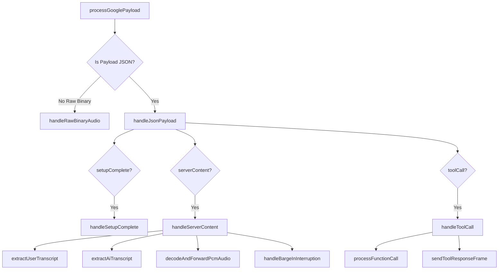

# 12. Mode 4 Gemini Live Voice Adapter & Payload Processing Specification

**Document Version:** 1.0  
**Target System:** reForm Monolith (`com.reForm.backend.ai` & Next.js Frontend)  
**Parent Specification:** [10_mode4_master_syllabus_and_table_of_contents.md](file:///Users/apple/Coding-projects/reForm-Web-App/backend/knowledge/pth/week3/10_mode4_master_syllabus_and_table_of_contents.md)  

---

## 1. Deep Dive: `GeminiLiveVoiceAdapter.java` Architecture

The centerpiece of the Mode 4 backend is [GeminiLiveVoiceAdapter.java](file:///Users/apple/Coding-projects/reForm-Web-App/backend/src/main/java/com/reForm/backend/ai/service/GeminiLiveVoiceAdapter.java). It acts as an outbound proxy manager bridging the browser WebSocket connection to Google's Bidi Generative Service endpoint.

### Core Responsibilities of `GeminiLiveVoiceAdapter`
1. **Session Tunneling:** Connects to Google's WSS endpoint using a 10MB `StandardWebSocketClient`.
2. **Concurrently Wrapped Sockets:** Centralizes session safety via `wrapSafeSession(WebSocketSession session)` using `ConcurrentWebSocketSessionDecorator` (10MB buffer limit, 10s send timeout).
3. **Audio & Text Proxying:** Converts client 16kHz PCM audio bytes to Base64 `realtimeInput.audio` frames, decodes Google 24kHz Base64 audio back to raw binary bytes, and forwards transcriptions.
4. **Silent Tool Execution:** Catches `toolCall` frames, dispatches Spring `ApplicationEventPublisher` events, and returns `toolResponse` frames.
5. **Session MDC Logging Context**: Injects `MDC.put("sessionId", userId)` to stream every frame's log output into isolated per-session log files (`logs/sessions/{userId}.log`).

---

## 2. Centralized Buffer Factory & Session Wrapping Helper

To eliminate magic numbers (`10485760`, `10000`) and duplicate code across handlers, `GeminiLiveVoiceAdapter` provides static constants and a factory method:

```java
public static final int BUFFER_10MB = 10485760; // 10MB (10 * 1024 * 1024 bytes)
public static final int SEND_TIMEOUT_MS = 10000;  // 10 second send timeout

/**
 * HELPER METHOD: WRAP SESSION IN THREAD-SAFE DECORATOR
 * Ensures every socket has a thread-safe LinkedBlockingQueue buffer (10MB) to prevent write collisions.
 */
public static WebSocketSession wrapSafeSession(WebSocketSession session) {
    if (session instanceof ConcurrentWebSocketSessionDecorator) {
        return session;
    }
    return new ConcurrentWebSocketSessionDecorator(session, SEND_TIMEOUT_MS, BUFFER_10MB);
}
```

---

## 3. Named Outbound Handler Class (`GoogleBidiWebSocketHandler`)

Instead of inline anonymous inner classes, outbound Socket 2 lifecycle events are managed by `GoogleBidiWebSocketHandler`:

```java
@RequiredArgsConstructor
private class GoogleBidiWebSocketHandler extends AbstractWebSocketHandler {
    private final String userId;
    private final WebSocketSession clientSession;
    private final Role role;
    private final String formId;
    private final String requestedModelKey;

    @Override
    public void afterConnectionEstablished(WebSocketSession session) throws Exception {
        log.info("Outbound WebSocket connection to Google Gemini Live established for user: {}", userId);
        
        WebSocketSession safeGeminiSession = wrapSafeSession(session);
        clientSession.getAttributes().put("geminiSession", safeGeminiSession);

        Map<String, Object> setupPayload = sessionContextService.buildSetupContext(userId, role, formId, requestedModelKey);
        String setupJson = objectMapper.writeValueAsString(Map.of("setup", setupPayload));
        log.info("[SENDING SETUP TO GEMINI LIVE]: {}", setupJson);
        safeGeminiSession.sendMessage(new TextMessage(setupJson));
    }

    @Override
    protected void handleTextMessage(WebSocketSession session, TextMessage message) throws Exception {
        processGooglePayload(userId, clientSession, session, message.getPayload().getBytes(StandardCharsets.UTF_8));
    }

    @Override
    protected void handleBinaryMessage(WebSocketSession session, BinaryMessage message) throws Exception {
        ByteBuffer buffer = message.getPayload();
        byte[] rawBytes = new byte[buffer.remaining()];
        buffer.get(rawBytes);
        processGooglePayload(userId, clientSession, session, rawBytes);
    }
}
```

---

## 4. Decomposed `processGooglePayload` Single-Responsibility Helper Tree

`processGooglePayload` routes incoming Google frames using a clean, single-responsibility method hierarchy:



---

## 5. Detailed Breakdown of Helper Functions

### 1. Main Dispatcher & MDC Context Setup
```java
private void processGooglePayload(String userId, WebSocketSession clientSession, WebSocketSession geminiSession, byte[] payload) {
    MDC.put("sessionId", userId);
    try {
        String payloadStr = new String(payload, StandardCharsets.UTF_8).trim();

        if (payloadStr.startsWith("{") && payloadStr.endsWith("}")) {
            log.info("[RAW GEMINI JSON RESPONSE]: {}", payloadStr);
            JsonNode root = objectMapper.readTree(payloadStr);
            handleJsonPayload(userId, clientSession, geminiSession, root);
        } else {
            handleRawBinaryAudio(clientSession, payload);
        }
    } catch (Exception e) {
        log.error("Error processing Google WebSocket payload for user: {}", userId, e);
    } finally {
        MDC.remove("sessionId");
    }
}
```

### 2. Polymorphic Tagged Union Dispatcher (`handleJsonPayload`)
```java
private void handleJsonPayload(String userId, WebSocketSession clientSession, WebSocketSession geminiSession, JsonNode root) throws IOException {
    if (root.has("setupComplete")) {
        handleSetupComplete(userId);
    }
    if (root.has("serverContent")) {
        handleServerContent(clientSession, root.get("serverContent"));
    }
    if (root.has("toolCall")) {
        handleToolCall(clientSession, geminiSession, root.path("toolCall"));
    }
}
```

### 3. Server Content Helper (`handleServerContent`)
```java
private void handleServerContent(WebSocketSession clientSession, JsonNode serverContent) throws IOException {
    WebSocketSession activeClient = (WebSocketSession) clientSession.getAttributes().get("safeClientSession");
    if (activeClient == null || !activeClient.isOpen()) {
        return;
    }

    extractUserTranscript(activeClient, serverContent);
    extractAiTranscript(activeClient, serverContent);
    decodeAndForwardPcmAudio(activeClient, serverContent);
    handleBargeInInterruption(activeClient, serverContent);
}

private void extractUserTranscript(WebSocketSession activeClient, JsonNode serverContent) throws IOException {
    if (serverContent.has("inputTranscription")) {
        String userTranscript = serverContent.path("inputTranscription").path("text").asText();
        log.info("[Candidate Transcribed Text]: {}", userTranscript);
        activeClient.sendMessage(new TextMessage(objectMapper.writeValueAsString(Map.of(
            "type", "TRANSCRIPT_USER",
            "text", userTranscript
        ))));
    }
}

private void extractAiTranscript(WebSocketSession activeClient, JsonNode serverContent) throws IOException {
    if (serverContent.has("outputTranscription")) {
        String aiTranscript = serverContent.path("outputTranscription").path("text").asText();
        log.info("[AI Speaker Transcribed Text]: {}", aiTranscript);
        activeClient.sendMessage(new TextMessage(objectMapper.writeValueAsString(Map.of(
            "type", "TRANSCRIPT_AI",
            "text", aiTranscript
        ))));
    }
}

private void decodeAndForwardPcmAudio(WebSocketSession activeClient, JsonNode serverContent) throws IOException {
    JsonNode parts = serverContent.path("modelTurn").path("parts");
    if (parts.isArray()) {
        for (JsonNode part : parts) {
            if (part.has("inlineData")) {
                String base64Audio = part.path("inlineData").path("data").asText();
                byte[] rawPcm = Base64.getDecoder().decode(base64Audio);
                log.info("[FORWARDING DECODED PCM AUDIO TO CLIENT]: {} bytes", rawPcm.length);
                activeClient.sendMessage(new BinaryMessage(rawPcm));
            }
        }
    }
}
```

## 6. SOLID Principles Architecture & Coupling Analysis

### 1. `wrapSafeSession` SRP Violation Analysis
* **Current Code**: `VoiceSyncWSHandler` calls `GeminiLiveVoiceAdapter.wrapSafeSession(session)` to wrap client sockets in a 10MB `ConcurrentWebSocketSessionDecorator`.
* **Single Responsibility Principle (SRP) Violation**: `VoiceSyncWSHandler` manages **Inbound Client Sockets (Browser $\leftrightarrow$ Backend)**. It should NOT depend on `GeminiLiveVoiceAdapter` (which manages **Outbound AI Sockets Backend $\leftrightarrow$ Google**) just to wrap a generic Spring `WebSocketSession`.
* **Refactoring Solution**: Extract `wrapSafeSession` into a standalone utility class (`WebSocketSessionUtils.wrapSafeSession(session)`) or configure decorator wrapping directly inside `WebSocketConfig`.

### 2. Inner Class (`GoogleBidiWebSocketHandler`) OCP Analysis
* **Encapsulation (Good)**: Declaring `GoogleBidiWebSocketHandler` as a `private` inner class keeps socket event listeners hidden from the rest of Spring.
* **Open-Closed Principle (OCP) Violation (Bad)**: It tightly couples `GeminiLiveVoiceAdapter` to Spring's `AbstractWebSocketHandler` and Google's Bidi WSS protocol. If Google deprecates the Bidi WSS API or if we swap Google for OpenAI Realtime Voice, `GeminiLiveVoiceAdapter` must be modified.
* **Clean Architecture Solution**: Define a generic strategy interface `IAiVoiceAdapter` and extract `GoogleBidiVoiceProvider.java` into its own file.

### 3. Response Handling & Division of Responsibilities
* **Inbound Gateway (`VoiceSyncWSHandler`)**: Accepts incoming client browser connections, authenticates JWT tokens, tracks online presence in Redis, and routes client audio bytes to the AI layer.
* **AI Output Forwarding (`GeminiLiveVoiceAdapter`)**: When Google sends AI audio and transcript frames over Socket 2, `processGooglePayload` reads Socket 1 (`safeClientSession`) from the attributes map and calls `activeClient.sendMessage(...)` to push raw 24kHz PCM binary audio frames to the browser.
* **Ideal Clean Architecture**: `GeminiLiveVoiceAdapter` should emit callback events to `VoiceSyncWSHandler`, allowing `VoiceSyncWSHandler` to execute `sendMessage(...)` directly.

---

## 7. Tagged Union Dispatcher & Simultaneous Perception Mechanics

### 1. `handleRawBinaryAudio` Socket 1 Delivery
```java
private void handleRawBinaryAudio(WebSocketSession clientSession, byte[] rawBytes) throws IOException {
    WebSocketSession activeClient = (WebSocketSession) clientSession.getAttributes().get("safeClientSession");
    if (activeClient != null && activeClient.isOpen()) {
        log.info("[FORWARDING RAW BINARY PCM AUDIO TO CLIENT]: {} bytes", rawBytes.length);
        activeClient.sendMessage(new BinaryMessage(rawBytes));
    }
}
```
* `activeClient` is **Socket 1** (the inbound client connection to User A's browser).
* `new BinaryMessage(rawBytes)` wraps 24kHz PCM bytes in a WebSocket **Binary Frame** (Opcode `0x2`).
* `sendMessage()` writes the binary frame to Tomcat, pushing it to OS Kernel `SO_SNDBUF` $\rightarrow$ TCP network $\rightarrow$ Browser `ws.onmessage`.

### 2. Why Text & Audio Feel 100% Simultaneous to the User
* **Protocol Rule**: Every WebSocket frame is strictly either Text (Opcode `0x1`) or Binary (Opcode `0x2`).
* **Google Payload**: Google packs both `outputTranscription` text and Base64 audio into a single `serverContent` JSON text frame.
* **50-Microsecond Execution**: When `processGooglePayload` receives the frame, it sends `TextMessage("TRANSCRIPT_AI")` to Socket 1, decodes the Base64 audio into binary bytes, and immediately sends `BinaryMessage(rawPcm)` to Socket 1 in the next line of code.
* **Perception**: Both messages execute on the CPU in **less than 0.05 milliseconds (50 microseconds)**. Because the human auditory/visual perception threshold is ~100ms, the eye and ear perceive text and sound at the exact same instant!

```java
private void handleBargeInInterruption(WebSocketSession activeClient, JsonNode serverContent) throws IOException {
    if (serverContent.path("interrupted").asBoolean(false)) {
        log.info("Native barge-in detected by Gemini. Sending FLUSH signal to client.");
        activeClient.sendMessage(new TextMessage("{\"type\":\"INTERRUPTED\"}"));
    }
}
```

### 4. Tool Execution Helper (`handleToolCall`)
```java
private void handleToolCall(WebSocketSession clientSession, WebSocketSession geminiSession, JsonNode toolCallNode) throws IOException {
    JsonNode functionCalls = toolCallNode.path("functionCalls");
    List<Map<String, Object>> functionResponses = new ArrayList<>();

    if (functionCalls.isArray()) {
        for (JsonNode functionCall : functionCalls) {
            String callId = functionCall.path("id").asText();
            String functionName = functionCall.path("name").asText();
            log.info("Gemini Live issued toolCall '{}' (id: {})", functionName, callId);

            Map<String, Object> responseMap = processFunctionCall(clientSession, functionCall, callId, functionName);
            functionResponses.add(responseMap);
        }
    }

    if (!functionResponses.isEmpty()) {
        sendToolResponseFrame(geminiSession, functionResponses);
    }
}

private Map<String, Object> processFunctionCall(WebSocketSession clientSession, JsonNode functionCall, String callId, String functionName) {
    if ("modifyFormLayout".equals(functionName)) {
        String formId = (String) clientSession.getAttributes().get("formId");
        String userIntent = functionCall.path("args").path("userIntent").asText();
        String targetBlockId = functionCall.path("args").path("targetBlockId").asText(null);

        eventPublisher.publishEvent(new FormLayoutModificationEvent(formId, userIntent, targetBlockId));

        return Map.of(
            "id", callId,
            "name", functionName,
            "response", Map.of("result", Map.of("status", "SUCCESS", "message", "Form layout modification executed"))
        );
    } else if ("searchUserDocument".equals(functionName)) {
        String query = functionCall.path("args").path("query").asText();
        log.info("Executing searchUserDocument toolCall for query: {}", query);
        return Map.of(
            "id", callId,
            "name", functionName,
            "response", Map.of("result", Map.of("status", "SUCCESS", "content", "Document context retrieved for: " + query))
        );
    } else {
        return Map.of(
            "id", callId,
            "name", functionName,
            "response", Map.of("result", Map.of("status", "SUCCESS"))
        );
    }
}

private void sendToolResponseFrame(WebSocketSession geminiSession, List<Map<String, Object>> functionResponses) throws IOException {
    WebSocketSession activeGemini = wrapSafeSession(geminiSession);
    if (activeGemini.isOpen()) {
        Map<String, Object> toolResponseFrame = Map.of(
            "toolResponse", Map.of("functionResponses", functionResponses)
        );
        String json = objectMapper.writeValueAsString(toolResponseFrame);
        activeGemini.sendMessage(new TextMessage(json));
        log.info("[SENT TOOL RESPONSE TO GEMINI LIVE]: {}", json);
    }
}
```
