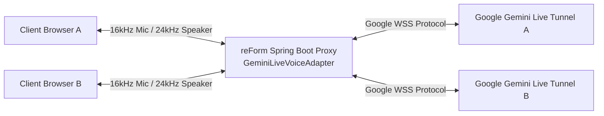
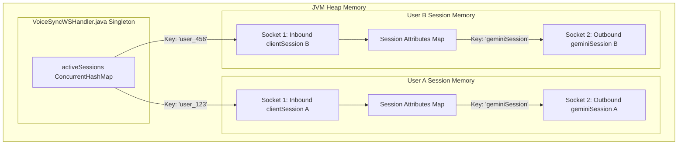

# 14. Mode 4 Multi-User Concurrency & Twin-Socket Memory Model Specification

**Document Version:** 3.0  
**Target System:** reForm Monolith (`com.reForm.backend.ai` & Next.js Frontend)  
**Parent Specification:** [10_mode4_implementation_retrospective_and_js_to_java_mapping.md](file:///Users/apple/Coding-projects/reForm-Web-App/backend/knowledge/pth/week3/10_mode4_implementation_retrospective_and_js_to_java_mapping.md)  

---

## 1. Proxy Architecture Overview

`GeminiLiveVoiceAdapter` acts as a **Backend Proxy / Adapter** sitting between client browsers and Google's Cloud AI infrastructure:



### Why a Backend Proxy is Required (4 Core Reasons)
1. **API Key Security**: Direct browser connections to Google would expose the platform's secret `GEMINI_API_KEY` in browser DevTools. The proxy keeps the API key safely on the backend server.
2. **Authentication & Authorization**: The proxy validates JWT tokens, user roles (`FORM_BUILDER`), and form permissions before opening an AI voice session.
3. **Data Translation & Base64 PCM Encoding**: The browser streams raw 16kHz binary PCM audio. The proxy formats those bytes into Google's `realtimeInput.audio` Base64 JSON schema.
4. **Tool Call Interception & Database Modification**: When Gemini decides to call a function (e.g. `modifyFormLayout`), the proxy catches the request, executes database operations via Spring events, and returns `toolResponse` frames.

---

## 2. Multi-User Concurrency & Twin-Socket Memory Storage Deep Dive

Mode 4 supports **simultaneous multi-user voice conversations** without state corruption or voice cross-talk. To understand how, we must look at **exactly where socket objects live in JVM memory**.

### A. Inbound vs. Outbound Definition & Total WebSocket Count

#### How many WebSockets are there per user?
There are **exactly 2 WebSockets** per active user session.

```text
               WEBSOCKET #1                                       WEBSOCKET #2
            (INBOUND SOCKET)                                   (OUTBOUND SOCKET)
            
  Browser Client  <===============>  reForm Backend Server  <===============>  Google Cloud Gemini Live
 (Your Computer)                    (Spring Boot / Tomcat)                   (wss://generativelanguage.googleapis.com)
```

1. **Inbound WebSocket (Socket #1):**
   * **Connection:** Browser Client $\leftrightarrow$ Spring Boot Backend.
   * **Meaning of "Inbound":** Initiated by the external browser client coming *into* your server (`ws://localhost:8080/ws/v1/voice`).
   * **Traffic Flow:** Receives raw 16kHz PCM mic audio bytes from browser; sends back 24kHz PCM AI audio bytes and transcript text.
2. **Outbound WebSocket (Socket #2):**
   * **Connection:** Spring Boot Backend $\leftrightarrow$ Google Cloud Gemini Live.
   * **Meaning of "Outbound":** Initiated by your Spring Boot backend going *out* to Google's servers (`wss://generativelanguage.googleapis.com/ws/...`).
   * **Traffic Flow:** Sends Base64 audio JSON (`realtimeInput.audio`) to Google; receives model audio chunks (`serverContent`) and tool calls (`toolCall`).

> [!IMPORTANT]
> **Total WebSocket Count Formula:**  
> If there are **$N$ concurrent active voice callers**, there are exactly **$2N$ active WebSocket TCP connections** on the server ($N$ inbound client connections + $N$ outbound Google connections).

---

### B. The Twin Socket Pair per User Session

For **every connected user** (e.g. User A), the backend maintains **TWO separate WebSocket socket objects** in Java RAM:

```text
 ┌─────────────────────────────────────────────────────────────────────────────────────────────────────────────┐
 │ USER A SESSION MEMORY (userId: "user_123")                                                                  │
 │                                                                                                             │
 │  ┌──────────────────────────────────────────────┐        ┌───────────────────────────────────────────────┐  │
 │  │ SOCKET 1: INBOUND CLIENT SOCKET              │        │ SOCKET 2: OUTBOUND GEMINI LIVE SOCKET         │  │
 │  │ (Browser Client <---> Spring Boot)           │        │ (Spring Boot <---> Google Cloud WSS)          │  │
 │  │                                              │        │                                               │  │
 │  │ Class: StandardWebSocketSession (Tomcat)     │        │ Class: StandardWebSocketSession (Client WSS)  │  │
 │  │ Wrapper: ConcurrentWebSocketSessionDec.      │ <====> │ Wrapper: ConcurrentWebSocketSessionDec.       │  │
 │  │ Stored In: VoiceSyncWSHandler.activeSessions │        │ Stored In: clientSession.attributes["gemini"] │  │
 │  └──────────────────────────────────────────────┘        └───────────────────────────────────────────────┘  │
 └─────────────────────────────────────────────────────────────────────────────────────────────────────────────┘
```

---

### C. Memory Storage Breakdown by Class & Attribute

```text
 ┌──────────────────────────────────────────────────────────────────────────────────────────────────┐
 │ VOICE SYNC WS HANDLER (Singleton Component Memory)                                               │
 │ activeSessions = ConcurrentHashMap<String, WebSocketSession>                                      │
 │                                                                                                  │
 │  Key: "user-123" ────────────────> Value: WebSocketSession (Socket 1: Browser <-> Server)        │
 │                                             │                                                    │
 │                                             ├── attributes["userId"] = "user-123"                 │
 │                                             ├── attributes["role"] = FORM_BUILDER                │
 │                                             ├── attributes["safeClientSession"] = Socket 1       │
 │                                             │                                                    │
 │                                             └── attributes["geminiSession"] ─────────────────────┼──┐
 └──────────────────────────────────────────────────────────────────────────────────────────────────┘  │
                                                                                                       │
 ┌──────────────────────────────────────────────────────────────────────────────────────────────────┐  │
 │ OUTBOUND GEMINI TUNNEL SESSION (Attached inside Socket 1 Attributes Map)                         │  │
 │                                                                                                  │  │
 │  WebSocketSession (Socket 2: Server <-> Google Live WSS) <──────────────────────────────────────┘  │
 │   └── Bound to lexical closure inside GoogleBidiWebSocketHandler                                 │
 └──────────────────────────────────────────────────────────────────────────────────────────────────┘
```



#### 1. Inbound Socket 1 (Browser <---> Backend)
* **Creating Class:** `VoiceSyncWSHandler.java` (triggered when client initiates `ws://localhost:8080/ws/v1/voice`).
* **Object Type:** `org.springframework.web.socket.handler.ConcurrentWebSocketSessionDecorator` (wrapping Tomcat's `StandardWebSocketSession`).
* **Storage Location 1 (Server RAM):** Stored inside the `VoiceSyncWSHandler` singleton instance map:
  ```java
  private final ConcurrentHashMap<String, WebSocketSession> activeSessions = new ConcurrentHashMap<>();
  // Map Entry -> Key: "user_123" | Value: safeSession (Socket 1)
  ```
* **Storage Location 2 (Distributed Redis):** Registered in Redis by `SessionTracker.java`:
  ```text
  Key: "session:user_123" -> Value: "c463049b-8714-4326-bc2e-541bcda7b44e" (TTL: 2 Hours)
  ```

#### 2. Outbound Socket 2 (Backend <---> Google Gemini Live WSS)
* **Creating Class:** `GeminiLiveVoiceAdapter.java` (triggered inside `startSession`).
  ```java
  StandardWebSocketClient webSocketClient = new StandardWebSocketClient(container);
  webSocketClient.execute(handler, googleWssUrl);
  ```
* **Object Type:** `org.springframework.web.socket.handler.ConcurrentWebSocketSessionDecorator` (wrapping Spring's `StandardWebSocketClient` session).
* **Storage Location (Inside Inbound Socket's Attributes Map):**
  The outbound Socket 2 is attached directly to Socket 1's attribute map:
  ```java
  clientSession.getAttributes().put("geminiSession", safeGeminiSession);
  ```
* **Reverse Match Pointer (Socket 2 $\rightarrow$ Socket 1):**  
  `GoogleBidiWebSocketHandler` receives `clientSession` (Socket 1) as a constructor parameter. When Google sends a frame back over Socket 2, `GoogleBidiWebSocketHandler` passes the stored `clientSession` reference directly into `processGooglePayload(...)`.

---

## 3. Data Flow Execution & Queue Mechanisms in Multi-User Runtime

### 1. Shared Singleton Adapter vs. Per-Socket Private Queues
* **Single Shared Adapter Instance (`GeminiLiveVoiceAdapter`):**  
  Because `GeminiLiveVoiceAdapter` is a Spring `@Component`, there is **exactly 1 shared Singleton instance** in JVM memory. All users (Alice, Bob, etc.) invoke methods on this same single adapter instance concurrently. It is 100% thread-safe because it stores no user state in class fields.
* **No Global Bottleneck Queue:**  
  There is **NO global single queue** blocking users against each other.
* **Private Per-Socket Buffer Queues:**  
  Instead, every socket wrapped in `ConcurrentWebSocketSessionDecorator` owns its **own isolated internal buffer queue (`LinkedBlockingQueue`)**. If 100 users are connected, there are **200 independent private queues** operating concurrently in RAM (1 inbound queue + 1 outbound queue per user).

---

### 2. Concrete Multi-User Example: Alice & Bob Talking Simultaneously

Imagine **Alice** and **Bob** speak into their microphones at the exact same millisecond:

```text
  ALICE'S PIPELINE                                                 BOB'S PIPELINE
  ================                                                 ==============
  Alice's Browser                                                  Bob's Browser
       │ (Mic PCM Audio)                                                │ (Mic PCM Audio)
       ▼                                                                ▼
  [Socket 1A (Inbound)]                                            [Socket 1B (Inbound)]
  Queue A1 (Private Buffer Queue)                                  Queue B1 (Private Buffer Queue)
       │                                                                │
       ├─────────────────────────────────┐  ┌───────────────────────────┤
       │ (Tomcat Thread nio-8080-exec-1) │  │ (Tomcat Thread nio-8080-exec-2)
       ▼                                 ▼  ▼                           ▼
  ┌─────────────────────────────────────────────────────────────────────────┐
  │  SINGLETON ADAPTER INSTANCE: GeminiLiveVoiceAdapter.sendClientAudio()   │
  └─────────────────────────────────────────────────────────────────────────┘
       │ (Reads Socket 2A from Attr A)                                  │ (Reads Socket 2B from Attr B)
       ▼                                                                ▼
  [Socket 2A (Outbound Gemini A)]                                  [Socket 2B (Outbound Gemini B)]
  Queue A2 (Private Buffer Queue)                                  Queue B2 (Private Buffer Queue)
       │                                                                │
       ▼                                                                ▼
  Google Gemini Live Tunnel A                                      Google Gemini Live Tunnel B
```

#### Detailed Execution Sequence:
1. **Tomcat Parallel Execution:**  
   Tomcat assigns `nio-8080-exec-1` to process Alice's frame and `nio-8080-exec-2` to process Bob's frame. Both threads execute **in parallel across separate CPU cores**.
2. **Adapter Invocation:**  
   Both threads enter the single shared `GeminiLiveVoiceAdapter` instance at the same time.
3. **Attribute Lookup:**  
   - Thread 1 reads `clientSessionA.getAttributes().get("geminiSession")` $\rightarrow$ Retrieves **Socket 2A**.
   - Thread 2 reads `clientSessionB.getAttributes().get("geminiSession")` $\rightarrow$ Retrieves **Socket 2B**.
4. **Queue Insertion:**  
   - Alice's audio payload is enqueued into **Queue A2** (Alice's private outbound socket queue).
   - Bob's audio payload is enqueued into **Queue B2** (Bob's private outbound socket queue).
5. **Isolation Guarantee:**  
   Alice's traffic never touches Queue B1 or B2, and Bob's traffic never touches Queue A1 or A2. Neither user ever experiences a bottleneck or audio leak from another user!

---

### 3. Step-by-Step Packet Queue Progression for User A

1. **User A Speaks:** User A's browser sends binary PCM bytes over **Inbound Socket 1A**.
2. **Tomcat Route & Thread Parallelism:** Tomcat hands the frame to worker thread `nio-8080-exec-1`.
3. **Adapter Lookup:** `VoiceSyncWSHandler` passes `clientSessionA` to `GeminiLiveVoiceAdapter.sendClientAudio(clientSessionA, payload)`.
4. **Outbound Lookup:** `sendClientAudio` reads **Outbound Socket 2A** from `clientSessionA`'s attributes.
5. **Per-Socket Buffer Enqueue (`ConcurrentWebSocketSessionDecorator`):**  
   If Socket 2A is currently busy writing a previous frame, the new frame is placed into Socket 2A's private `LinkedBlockingQueue` (up to `10MB` limit and `10,000ms` send timeout).
6. **Kernel TCP Send Queue (`SO_SNDBUF`):** The OS kernel places formatted Base64 JSON packets into the OS socket send buffer queue (`SO_SNDBUF`) for transmission over the wire to Google in FIFO sequence.

---

## 4. Complete List of 6 Bidi Server Message Capabilities & Twin-Socket Handling

Google's official `BidiGenerateContentServerMessage` specification defines **6 top-level message variants in total**. When Outbound Socket 2 receives any of these 6 payload variants from Google, `GeminiLiveVoiceAdapter.processGooglePayload` delegates to specialized handler methods to process and forward frames to Inbound Socket 1:

| Variant Key | Purpose & Capability | Handled in reForm? | Handler Method & Twin-Socket Routing |
| :--- | :--- | :--- | :--- |
| **`setupComplete`** | Confirms initial session setup is accepted by Google. | ✅ Yes | `handleSetupComplete(...)` logs confirmation and sends setup ACK JSON frame over Socket 1 to browser. |
| **`serverContent`** | Delivers model 24kHz PCM audio, text transcriptions, barge-in flags (`interrupted`), and grounding metadata. | ✅ Yes | `handleServerContent(...)` decodes Base64 PCM audio to binary byte arrays, forwards raw PCM to Socket 1, and emits transcription JSON. |
| **`toolCall`** | Requests execution of registered function calls (`functionCalls[]`). | ✅ Yes | `handleToolCall(...)` parses arguments, fires Spring `FormLayoutModificationEvent`, sends `toolResponse` frame over Socket 2 to Google. |
| **`sessionResumptionUpdate`** | Delivers new session handles for automatic session reconnection. | ✅ Yes | Stores session resumption handle in Socket 1's attribute map for reconnection recovery. |
| **`toolCallCancellation`** | Notifies client to cancel a pending tool call if the user interrupted mid-turn. | 🔮 Production Ready | Cancels background task execution if user spoke before function execution finished. |
| **`goAway`** | Server notice before session disconnect (e.g. 30-minute token expiration). | 🔮 Production Ready | Sends graceful disconnect JSON frame to Socket 1 to trigger auto-reconnect on frontend. |

### Detailed Processing Pipeline for the 6 Variants

1. **`setupComplete` Capability:**  
   Once Google accepts the system prompt, model name, and tool declarations sent on Socket 2, Google returns `{"setupComplete": {}}`. `handleSetupComplete` catches this and notifies the frontend browser on Socket 1 that voice streaming is active.
2. **`serverContent` Capability:**  
   Contains model audio chunks (`inlineData.data`), user input transcription (`inputTranscription.text`), AI output transcription (`outputTranscription.text`), and interruption signals (`interrupted: true`). Raw Base64 audio is decoded into raw binary bytes and sent directly to Socket 1 as binary WebSocket frames.
3. **`toolCall` Capability:**  
   Contains function call requests (e.g., `modifyFormLayout`). The adapter extracts args, publishes a Spring application event, builds a `toolResponse` frame, and sends it back to Google over Socket 2.
4. **`sessionResumptionUpdate` Capability:**  
   Delivers a session token allowing seamless reconnection if network drops.
5. **`toolCallCancellation` Capability:**  
   If the user barges in while Gemini is preparing a tool call, Google sends `toolCallCancellation` to drop pending function calls.
6. **`goAway` Capability:**  
   Sent by Google prior to server maintenance or 30-minute session limits to prompt graceful client re-handshake.
