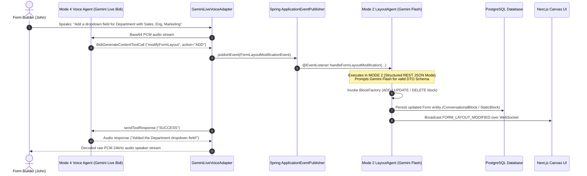

# 16. Mode 4 Google Bidi WebSocket Protocol Spec & Multi-Agent Architecture Specification

**Document Version:** 2.0  
**Target System:** reForm Monolith (`com.reForm.backend.ai` & Next.js Frontend)  
**Parent Specification:** [10_mode4_master_syllabus_and_table_of_contents.md](file:///Users/apple/Coding-projects/reForm-Web-App/backend/knowledge/pth/week3/10_mode4_master_syllabus_and_table_of_contents.md)  

---

## 1. Full Bidi API Endpoint Reference & URLs

### A. Official Full Bidi WebSocket Endpoint URL (v1beta)
```text
wss://generativelanguage.googleapis.com/ws/google.ai.generativelanguage.v1beta.GenerativeService.BidiGenerateContent?key=YOUR_GEMINI_API_KEY
```

### B. reForm Internal Backend Inbound Endpoint
```text
ws://localhost:8080/ws/v1/voice?token=JWT_BEARER_TOKEN&formId=FORM_UUID
```

---

## 2. Complete List of 6 Bidi Server Message Variants & Twin-Socket Handling

According to Google's official Bidi API specification (`BidiGenerateContentServerMessage`), response frames sent from Google over the WebSocket are **polymorphic tagged unions**. 

Every JSON frame returned by Google contains an optional `usageMetadata` field and **EXACTLY ONE** top-level payload key from the following 6 union variants:

```text
BidiGenerateContentServerMessage
 ├── 1. setupComplete           (BidiGenerateContentSetupComplete ACK)
 ├── 2. serverContent           (BidiGenerateContentServerContent audio/text/interrupted)
 ├── 3. toolCall                (BidiGenerateContentToolCall functionCalls)
 ├── 4. toolCallCancellation    (BidiGenerateContentToolCallCancellation)
 ├── 5. sessionResumptionUpdate (BidiGenerateContentSessionResumptionUpdate)
 └── 6. goAway                  (BidiGenerateContentGoAway server shutdown)
```

### Complete List of 6 Bidi Server Message Capabilities & Twin-Socket Routing

When Outbound Socket 2 receives any of these 6 payload variants from Google, `GeminiLiveVoiceAdapter.processGooglePayload` delegates to specialized handler methods to process and forward frames to Inbound Socket 1:

| Variant Key | Purpose & Capability | Handled in reForm? | Handler Method & Twin-Socket Routing |
| :--- | :--- | :--- | :--- |
| **`setupComplete`** | Confirms initial session setup is accepted by Google. | ✅ Yes | `handleSetupComplete(...)` logs confirmation and sends setup ACK JSON frame over Socket 1 to browser. |
| **`serverContent`** | Delivers model 24kHz PCM audio, text transcriptions, barge-in flags (`interrupted`), and grounding metadata. | ✅ Yes | `handleServerContent(...)` decodes Base64 PCM audio to binary byte arrays, forwards raw PCM to Socket 1, and emits transcription JSON. |
| **`toolCall`** | Requests execution of registered function calls (`functionCalls[]`). | ✅ Yes | `handleToolCall(...)` parses arguments, fires Spring `FormLayoutModificationEvent`, sends `toolResponse` frame over Socket 2 to Google. |
| **`sessionResumptionUpdate`** | Delivers new session handles for automatic session reconnection. | ✅ Yes | Stores session resumption handle in Socket 1's attribute map for reconnection recovery. |
| **`toolCallCancellation`** | Notifies client to cancel a pending tool call if the user interrupted mid-turn. | 🔮 Production Ready | Cancels background task execution if user spoke before function execution finished. |
| **`goAway`** | Server notice before session disconnect (e.g. 30-minute token expiration). | 🔮 Production Ready | Sends graceful disconnect JSON frame to Socket 1 to trigger auto-reconnect on frontend. |

### Detailed Processing Pipeline for the 6 Variants

1. **`setupComplete` Capability:**  
   Once Google accepts the system prompt, model name, and tool declarations sent on Socket 2, Google returns `{"setupComplete": {}}`. `handleSetupComplete` catches this and notifies the frontend browser on Socket 1 that voice streaming is active.
2. **`serverContent` Capability:**  
   Contains model audio chunks (`inlineData.data`), user input transcription (`inputTranscription.text`), AI output transcription (`outputTranscription.text`), and interruption signals (`interrupted: true`). Raw Base64 audio is decoded into raw binary bytes and sent directly to Socket 1 as binary WebSocket frames.
3. **`toolCall` Capability:**  
   Contains function call requests (e.g., `modifyFormLayout`). The adapter extracts args, publishes a Spring application event, builds a `toolResponse` frame, and sends it back to Google over Socket 2.
4. **`sessionResumptionUpdate` Capability:**  
   Delivers a session token allowing seamless reconnection if network drops.
5. **`toolCallCancellation` Capability:**  
   If the user barges in while Gemini is preparing a tool call, Google sends `toolCallCancellation` to drop pending function calls.
6. **`goAway` Capability:**  
   Sent by Google prior to server maintenance or 30-minute session limits to prompt graceful client re-handshake.

---

## 3. Official Google Bidi WebSockets API Specification & Schemas

### 1. Client Setup Message (`BidiGenerateContentSetup`)
Transmitted outbound to Google immediately after Socket 2 connects:

```json
{
  "setup": {
    "model": "models/gemini-2.0-flash-exp",
    "generationConfig": {
      "responseModalities": ["AUDIO"],
      "speechConfig": {
        "voiceConfig": {
          "prebuiltVoiceConfig": {
            "voiceName": "Puck"
          }
        }
      }
    },
    "systemInstruction": {
      "parts": [
        { "text": "You are reForm Voice Co-Builder AI assistant..." }
      ]
    },
    "tools": [
      {
        "functionDeclarations": [
          {
            "name": "modifyFormLayout",
            "description": "Modifies canvas layout by adding or updating form blocks",
            "parameters": {
              "type": "OBJECT",
              "properties": {
                "userIntent": { "type": "STRING" },
                "targetBlockId": { "type": "STRING" }
              },
              "required": ["userIntent"]
            }
          },
          {
            "name": "searchUserDocument",
            "description": "Performs RAG vector search over uploaded form guideline documents",
            "parameters": {
              "type": "OBJECT",
              "properties": {
                "query": { "type": "STRING" }
              },
              "required": ["query"]
            }
          }
        ]
      }
    ]
  }
}
```

### 2. Client Real-Time Input Message (`BidiGenerateContentRealtimeInput`)
Transmitted outbound to Google ~50 times per second when candidate speaks:

```json
{
  "realtimeInput": {
    "mediaChunks": [
      {
        "mimeType": "audio/pcm;rate=16000",
        "data": "BASE64_ENCODED_PCM16_16KHZ_BYTES"
      }
    ]
  }
}
```

### 3. Server Response Message (`BidiGenerateContentServerContent`)
Returned from Google during AI output audio generation & transcription:

```json
{
  "serverContent": {
    "modelTurn": {
      "parts": [
        {
          "inlineData": {
            "mimeType": "audio/pcm;rate=24000",
            "data": "BASE64_ENCODED_PCM16_24KHZ_BYTES"
          }
        }
      ]
    },
    "inputTranscription": {
      "text": "Add a text input field for Full Name"
    },
    "outputTranscription": {
      "text": "Sure, I have added a Full Name input field to your canvas."
    },
    "interrupted": false,
    "turnComplete": true
  }
}
```

### 4. Server Tool Call Request (`BidiGenerateContentToolCall`)
Returned from Google when Gemini decides to invoke a registered tool:

```json
{
  "toolCall": {
    "functionCalls": [
      {
        "id": "call-abc-123",
        "name": "modifyFormLayout",
        "args": {
          "userIntent": "Add text input field for Full Name",
          "targetBlockId": null
        }
      }
    ]
  }
}
```

### 5. Client Tool Response Message (`BidiGenerateContentToolResponse`)
Sent outbound to Google after backend executes the tool:

```json
{
  "toolResponse": {
    "functionResponses": [
      {
        "id": "call-abc-123",
        "name": "modifyFormLayout",
        "response": {
          "result": {
            "status": "SUCCESS",
            "message": "Form layout modification executed"
          }
        }
      }
    ]
  }
}
```

---

## 4. Phase A: AI Co-Builder Multi-Agent Architecture

In **Phase A**, the Form Builder (John) speaks to the AI to design forms. The system implements a decoupled **Two-Agent Separation of Concerns**:



### The Block Architect Agent: `LayoutAgent` (Operating in Mode 2)

The agent responsible for creating, modifying, reordering, and deleting form blocks is **`LayoutAgent`** (also referred to as `FormLayoutSpecialistAgent`). 

#### Why `LayoutAgent` Operates in Mode 2 (Structured JSON Mode):
- **Mode 4 (Bidi Voice WSS)** is optimized for **real-time audio & fast conversational speech (~300ms)**. It is not designed to produce complex, strictly-validated DTO JSON syntax.
- **Mode 2 (Structured REST API / JSON Mode)** uses **Gemini Flash (`gemini-2.5-flash` / `gemini-3.6-flash`)** with strict JSON schemas (`responseSchema`). This guarantees 100% deterministic, syntax-valid block DTO generation without audio latency bottlenecks.

#### Supported Form Operations handled by `LayoutAgent` (Mode 2):
1. **`ADD_BLOCK`**: Creates new `StaticBlock` (text inputs, dropdowns, checkboxes, dates) or `ConversationalBlock` (voice interview sub-sections) with labels, options, and validation rules.
2. **`UPDATE_BLOCK`**: Modifies existing block metadata (e.g. changing field labels, marking fields as required, updating interview max question limits).
3. **`DELETE_BLOCK`**: Removes specified target block ID and automatically re-indexes remaining canvas block order positions (`orderIndex`).
4. **`REORDER_BLOCKS`**: Re-arranges form section placement on the canvas.

### Two-Agent Roles & Decoupling Rationale

| Agent / Component | Execution Mode | Primary Responsibility | Decoupling Rationale |
| :--- | :--- | :--- | :--- |
| **Primary Voice Agent** (`GeminiLiveVoiceAdapter`) | **Mode 4** (Live Bidi WSS) | Handles real-time speech, low-latency audio proxying (~300ms), conversational tone, and intent extraction (`modifyFormLayout`). | Keeps voice streaming fast & lightweight. Does not block audio streams waiting for database transactions or schema calculations. |
| **Block Architect Agent** (`LayoutAgent` / `FormLayoutEventListener`) | **Mode 2** (REST / JSON Mode) | Receives layout modification events, prompts Gemini Flash in Mode 2 for strict DTO JSON, executes ADD / UPDATE / DELETE operations via `BlockFactory`, persists to PostgreSQL, and broadcasts canvas UI updates. | Can be updated and tested independently. Developers can add 50 new block types without touching any voice code. |

---

## 5. Phase B: Form Filler Multi-Agent Pipeline Architecture

In **Phase B**, Candidate (Sarah) takes an interactive voice interview based on a published form. Underneath, **6 decoupled specialist sub-agents** execute in parallel:

```text
                  THE MULTI-AGENT INTERVIEW PIPELINE
                  
                           [ Candidate Sarah ]
                                    │
                                    ▼
                       [ VoiceSyncWSHandler (WSS) ]
                                    │
                                    ▼
                       [ GeminiLiveVoiceAdapter ]
                                    │
           ┌────────────────────────┼────────────────────────┐
           ▼                        ▼                        ▼
    [ Guardrail Agent ]    [ Memory/Goal Agent ]     [ Billing Agent ]
    (pgvector Moderation)  (Redis Goal Checklist)    (VAD Metering)
           │                        │                        │
           ▼                        ▼                        ▼
    [ RAG Vector Agent ]   [ Form Canvas Context ]   [ Evaluation Agent ]
    (Document Search)      (Live Answers)            (Post-Session Summary)
```

### Breakdown of the 6 Specialist Agents

1. **Guardrail Agent (Content Moderation & Injection Defense)**:
   - Evaluates incoming audio transcripts against prompt injection and toxic language rules using `pgvector` cosine similarity embeddings in ~2ms.
2. **Memory & Goal Tracking Agent**:
   - Maintains session goals in Redis `opsForHash()` (`Goal 1: VERIFIED`, `Goal 2: PENDING`).
   - Signals Gemini Live when all required form questions have been answered to cleanly conclude the interview.
3. **Billing & VAD Metering Agent**:
   - Tracks Voice Activity Detection (VAD). If the candidate is silent for >45s, fires a gentle reminder prompt or pauses streaming to preserve API credit limits.
4. **RAG Vector Search Agent (`searchUserDocument`)**:
   - Performs semantic vector search over uploaded form guidelines when candidate asks questions (e.g. "What is the policy for remote work?").
5. **Canvas State Synchronization Agent**:
   - Updates form field values live on screen as the candidate answers verbally.
6. **Evaluation & Scoring Agent (Post-Session Summary)**:
   - Triggered asynchronously via `@Async` upon socket disconnection.
   - Takes full transcript, prompts Gemini 2.5/3.6 Flash, computes candidate match score (e.g., `92/100`), generates a 1-page summary, and saves a `Submission` entity record.

---

## 6. Jackson & Spring Framework Class Knowledge Framework

### 1. `ObjectMapper` (`tools.jackson.databind.ObjectMapper`)
* **Problem leading to invention**: In early Java web development, programmers constructed JSON using fragile string concatenation (`"{\"key\":\"" + value + "\"}"`) and parsed text using regex.
* **Historical Progression**: Manual String Concatenation $\rightarrow$ Org.json simple parser $\rightarrow$ Jackson 1.x / Gson (2009) $\rightarrow$ Jackson 2.x / Jackson 3 (`tools.jackson`) high-speed streaming AST engine.
* **How to use**: `mapper.writeValueAsString(obj)` for serialization, `mapper.readValue(json, Class)` for deserialization, `mapper.readTree(json)` for AST tree parsing.
* **When to use**: Use for all JSON transformations and DTO schema mappings in Spring Boot.

### 2. `StandardWebSocketClient` (`org.springframework.web.socket.client.standard.StandardWebSocketClient`)
* **Problem leading to invention**: Browsers initiate WebSocket connections natively using `new WebSocket()`. Java backend servers required a standard way to open outbound WebSocket tunnels to external AI clouds.
* **Historical Progression**: Raw HTTP/TCP socket clients $\rightarrow$ Java 11 `HttpClient` WebSocket $\rightarrow$ Spring `StandardWebSocketClient` (standardizes JSR-356 container implementations).
* **How to use**: Instantiate `new StandardWebSocketClient(container)`, then execute `client.execute(handler, googleWssUrl)`.
* **When to use**: Use whenever your backend acts as a client initiating an outbound WSS connection to external services (e.g. Google Gemini Live, Deepgram, Cartesia).

### 3. `AbstractWebSocketHandler` (`org.springframework.web.socket.handler.AbstractWebSocketHandler`)
* **Problem leading to invention**: Implementing Spring's `WebSocketHandler` interface directly forces writing empty boilerplate methods for unused callbacks.
* **Historical Progression**: Direct interface implementation $\rightarrow$ Adapter Pattern `AbstractWebSocketHandler` providing default empty hooks.
* **How to use**: Extend `AbstractWebSocketHandler` and `@Override` only `handleTextMessage`, `handleBinaryMessage`, or `afterConnectionEstablished`.
* **When to use**: Use whenever building custom WebSocket message receivers in Spring.

