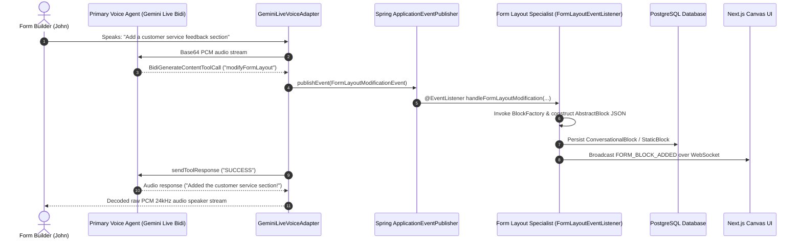

# 16. Mode 4 Google Bidi WebSocket Protocol Spec & Multi-Agent Architecture Specification

**Document Version:** 2.0  
**Target System:** reForm Monolith (`com.reForm.backend.ai` & Next.js Frontend)  
**Parent Specification:** [10_mode4_implementation_retrospective_and_js_to_java_mapping.md](file:///Users/apple/Coding-projects/reForm-Web-App/backend/knowledge/pth/week3/10_mode4_implementation_retrospective_and_js_to_java_mapping.md)  

---

## 1. Full Bidi API Endpoint Reference & URLs

### A. Official Full Bidi WebSocket Endpoint URL (v1beta)
```text
wss://generativelanguage.googleapis.com/ws/google.ai.generativelanguage.v1beta.GenerativeService.BidiGenerateContent?key=YOUR_GEMINI_API_KEY
```

### B. reForm Internal Backend Inbound Endpoint
```text
ws://localhost:8080/ws/v1/voice?token=JWT_BEARER_TOKEN&formId=FORM_UUID
```

---

## 2. Complete List of 6 Bidi Server Message Variants

According to Google's official Bidi API specification (`BidiGenerateContentServerMessage`), response frames sent from Google over the WebSocket are **polymorphic tagged unions**. 

Every JSON frame returned by Google contains an optional `usageMetadata` field and **EXACTLY ONE** top-level payload key from the following 6 union variants:

```text
BidiGenerateContentServerMessage
 ├── 1. setupComplete           (BidiGenerateContentSetupComplete ACK)
 ├── 2. serverContent           (BidiGenerateContentServerContent audio/text/interrupted)
 ├── 3. toolCall                (BidiGenerateContentToolCall functionCalls)
 ├── 4. toolCallCancellation    (BidiGenerateContentToolCallCancellation)
 ├── 5. sessionResumptionUpdate (BidiGenerateContentSessionResumptionUpdate)
 └── 6. goAway                  (BidiGenerateContentGoAway server shutdown)
```

---

## 3. Official Google Bidi WebSockets API Specification & Schemas

### 1. Client Setup Message (`BidiGenerateContentSetup`)
Transmitted outbound to Google immediately after Socket 2 connects:

```json
{
  "setup": {
    "model": "models/gemini-2.0-flash-exp",
    "generationConfig": {
      "responseModalities": ["AUDIO"],
      "speechConfig": {
        "voiceConfig": {
          "prebuiltVoiceConfig": {
            "voiceName": "Puck"
          }
        }
      }
    },
    "systemInstruction": {
      "parts": [
        { "text": "You are reForm Voice Co-Builder AI assistant..." }
      ]
    },
    "tools": [
      {
        "functionDeclarations": [
          {
            "name": "modifyFormLayout",
            "description": "Modifies canvas layout by adding or updating form blocks",
            "parameters": {
              "type": "OBJECT",
              "properties": {
                "userIntent": { "type": "STRING" },
                "targetBlockId": { "type": "STRING" }
              },
              "required": ["userIntent"]
            }
          },
          {
            "name": "searchUserDocument",
            "description": "Performs RAG vector search over uploaded form guideline documents",
            "parameters": {
              "type": "OBJECT",
              "properties": {
                "query": { "type": "STRING" }
              },
              "required": ["query"]
            }
          }
        ]
      }
    ]
  }
}
```

### 2. Client Real-Time Input Message (`BidiGenerateContentRealtimeInput`)
Transmitted outbound to Google ~50 times per second when candidate speaks:

```json
{
  "realtimeInput": {
    "mediaChunks": [
      {
        "mimeType": "audio/pcm;rate=16000",
        "data": "BASE64_ENCODED_PCM16_16KHZ_BYTES"
      }
    ]
  }
}
```

### 3. Server Response Message (`BidiGenerateContentServerContent`)
Returned from Google during AI output audio generation & transcription:

```json
{
  "serverContent": {
    "modelTurn": {
      "parts": [
        {
          "inlineData": {
            "mimeType": "audio/pcm;rate=24000",
            "data": "BASE64_ENCODED_PCM16_24KHZ_BYTES"
          }
        }
      ]
    },
    "inputTranscription": {
      "text": "Add a text input field for Full Name"
    },
    "outputTranscription": {
      "text": "Sure, I have added a Full Name input field to your canvas."
    },
    "interrupted": false,
    "turnComplete": true
  }
}
```

### 4. Server Tool Call Request (`BidiGenerateContentToolCall`)
Returned from Google when Gemini decides to invoke a registered tool:

```json
{
  "toolCall": {
    "functionCalls": [
      {
        "id": "call-abc-123",
        "name": "modifyFormLayout",
        "args": {
          "userIntent": "Add text input field for Full Name",
          "targetBlockId": null
        }
      }
    ]
  }
}
```

### 5. Client Tool Response Message (`BidiGenerateContentToolResponse`)
Sent outbound to Google after backend executes the tool:

```json
{
  "toolResponse": {
    "functionResponses": [
      {
        "id": "call-abc-123",
        "name": "modifyFormLayout",
        "response": {
          "result": {
            "status": "SUCCESS",
            "message": "Form layout modification executed"
          }
        }
      }
    ]
  }
}
```

---

## 4. Phase A: AI Co-Builder Multi-Agent Architecture

In **Phase A**, the Form Builder (John) speaks to the AI to design forms. The system implements a decoupled **Two-Agent Separation of Concerns**:



### Two-Agent Roles & Decoupling Rationale

| Agent / Component | Primary Responsibility | Decoupling Rationale |
| :--- | :--- | :--- |
| **Primary Voice Agent** (`GeminiLiveVoiceAdapter`) | Handles real-time speech, low-latency audio proxying (~300ms), conversational tone, and intent extraction. | Keeps voice streaming fast & lightweight. Does not block audio streams waiting for database transactions or schema calculations. |
| **Form Layout Co-Builder Specialist** (`FormLayoutEventListener` & `BlockFactory`) | Specialized domain agent responsible for form blocks, layout rules, validation, PostgreSQL JSONB persistence, and canvas UI sync. | Can be updated and tested independently. Developers can add 50 new block types without touching any voice code. |

---

## 5. Phase B: Form Filler Multi-Agent Pipeline Architecture

In **Phase B**, Candidate (Sarah) takes an interactive voice interview based on a published form. Underneath, **6 decoupled specialist sub-agents** execute in parallel:

```text
                  THE MULTI-AGENT INTERVIEW PIPELINE
                  
                           [ Candidate Sarah ]
                                    │
                                    ▼
                       [ VoiceSyncWSHandler (WSS) ]
                                    │
                                    ▼
                       [ GeminiLiveVoiceAdapter ]
                                    │
           ┌────────────────────────┼────────────────────────┐
           ▼                        ▼                        ▼
    [ Guardrail Agent ]    [ Memory/Goal Agent ]     [ Billing Agent ]
    (pgvector Moderation)  (Redis Goal Checklist)    (VAD Metering)
           │                        │                        │
           ▼                        ▼                        ▼
    [ RAG Vector Agent ]   [ Form Canvas Context ]   [ Evaluation Agent ]
    (Document Search)      (Live Answers)            (Post-Session Summary)
```

### Breakdown of the 6 Specialist Agents

1. **Guardrail Agent (Content Moderation & Injection Defense)**:
   - Evaluates incoming audio transcripts against prompt injection and toxic language rules using `pgvector` cosine similarity embeddings in ~2ms.
2. **Memory & Goal Tracking Agent**:
   - Maintains session goals in Redis `opsForHash()` (`Goal 1: VERIFIED`, `Goal 2: PENDING`).
   - Signals Gemini Live when all required form questions have been answered to cleanly conclude the interview.
3. **Billing & VAD Metering Agent**:
   - Tracks Voice Activity Detection (VAD). If the candidate is silent for >45s, fires a gentle reminder prompt or pauses streaming to preserve API credit limits.
4. **RAG Vector Search Agent (`searchUserDocument`)**:
   - Performs semantic vector search over uploaded form guidelines when candidate asks questions (e.g. "What is the policy for remote work?").
5. **Canvas State Synchronization Agent**:
   - Updates form field values live on screen as the candidate answers verbally.
6. **Evaluation & Scoring Agent (Post-Session Summary)**:
   - Triggered asynchronously via `@Async` upon socket disconnection.
   - Takes full transcript, prompts Gemini 2.5/3.6 Flash, computes candidate match score (e.g., `92/100`), generates a 1-page summary, and saves a `Submission` entity record.
