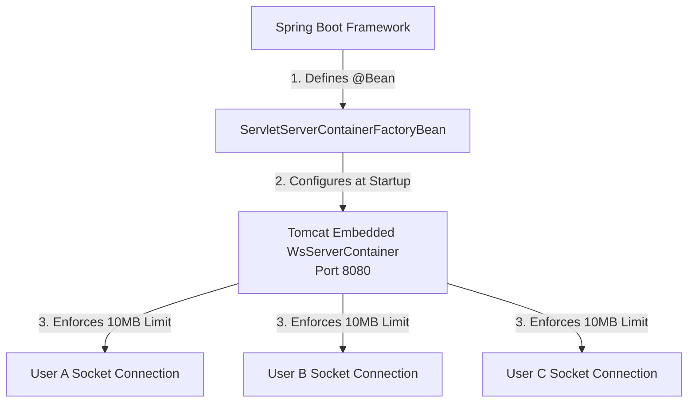
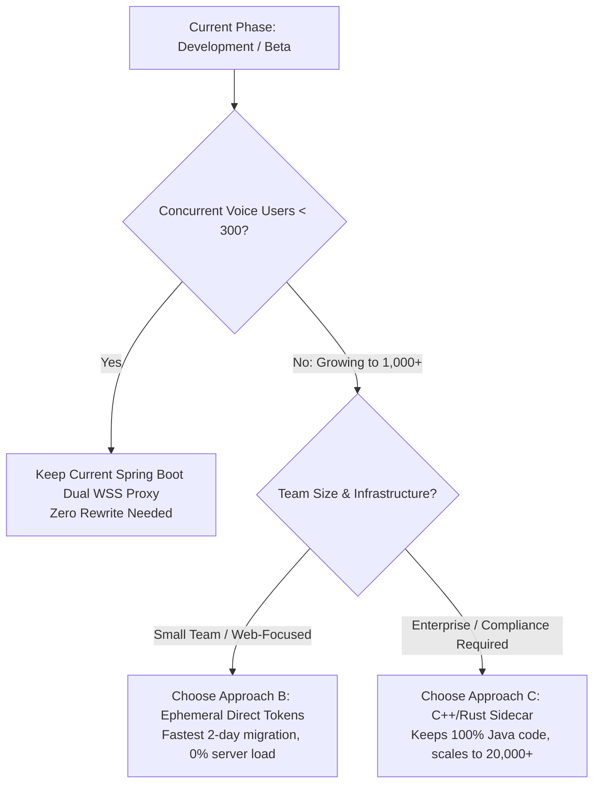
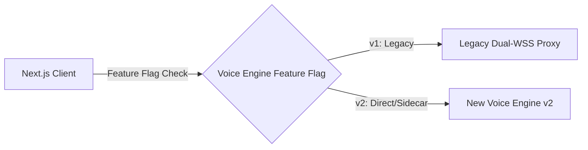

# 17. Mode 4 Production Scaling Architectures & Zero-Downtime Migration Specification

**Document Version:** 3.0  
**Target System:** reForm Monolith (`com.reForm.backend.ai` & Next.js Frontend)  
**Parent Specification:** [10_mode4_master_syllabus_and_table_of_contents.md](file:///Users/apple/Coding-projects/reForm-Web-App/backend/knowledge/pth/week3/10_mode4_master_syllabus_and_table_of_contents.md)  

---

## 1. Low-Level Tomcat WebSocket Container Engineering (`ServletServerContainerFactoryBean`)

By default, Tomcat allocates a small 8KB text buffer and 8KB binary buffer per WebSocket connection. Because high-resolution 16kHz/24kHz audio frames and JSON tool declarations routinely exceed 8KB, Tomcat will throw a `MaxTextMessageSizeExceededException` or `MaxBinaryMessageSizeExceededException` and terminate the socket connection with **WebSocket Error Code 1009 ("Buffer too small")**.

### Container Configuration Bean (`WebSocketConfig.java`)
```java
/**
 * CONFIG OVERRIDE: Increase Tomcat Inbound/Outbound WebSocket Buffer Limit to 10MB
 * Prevents WebSocket Code 1009 ("Buffer too small") errors when receiving large Gemini audio payloads.
 */
@Bean
public ServletServerContainerFactoryBean createWebSocketContainer() {
    ServletServerContainerFactoryBean container = new ServletServerContainerFactoryBean();
    container.setMaxTextMessageBufferSize(10485760); // 10MB
    container.setMaxBinaryMessageBufferSize(10485760); // 10MB
    container.setAsyncSendTimeout(10000L);
    return container;
}
```



### Class Knowledge Framework: `ServletServerContainerFactoryBean`

* **(1) Problem that led to its invention**: Default Tomcat WebSocket buffer size is **8 KB (8,192 bytes)**. Transmitting high-resolution PCM audio frames or large form tool definitions routinely exceeds 8KB, causing Tomcat to throw `WebSocket Error Code 1009 ("Buffer too small")` and terminate the connection.
* **(2) Historical Progression**: Manual `web.xml` Tomcat XML configs $\rightarrow$ Programmatic `WsServerContainer` ServletContext attributes $\rightarrow$ Spring `@Bean` `ServletServerContainerFactoryBean`.
* **(3) How to use it**: Declare as a `@Bean` in `WebSocketConfig.java` and set `.setMaxTextMessageBufferSize(10485760)` and `.setMaxBinaryMessageBufferSize(10485760)`.
* **(4) When to use it**: Use in any Spring Boot WebSockets application that handles binary media streaming or large JSON payload structures.


---

## 2. Retrospective: Errors Encountered & Solutions

### Error 1: Setup Payload `generationConfig` Placement
* **Issue:** `responseModalities` was placed at top-level `setup` root instead of inside `generationConfig`.
* **Fix:** Updated `SessionContextService.java` to nest `generationConfig` properly under `setup`.

### Error 2: Deprecated `media_chunks` Field (WebSocket Code 1007)
* **Issue:** Google closed connection with `code=1007, reason=realtime_input.media_chunks is deprecated`.
* **Fix:** Updated `sendClientAudio` in `GeminiLiveVoiceAdapter.java` to package audio under `realtimeInput.audio: { mimeType: "audio/pcm;rate=16000", data: base64Audio }`.

### Error 3: Tomcat & Spring WebSocket Buffer Overflow (WebSocket Code 1009)
* **Issue:** Tomcat threw `code=1009, reason=Buffer size: [8,192], Message size: [13,008]`.
* **Fix:** Added `ServletServerContainerFactoryBean` in `WebSocketConfig.java` and `WebSocketContainer` in `GeminiLiveVoiceAdapter.java` setting text and binary buffer limits to **10MB**.

### Error 4: Mic Echo Feedback & 2-Word Speech Cutoff
* **Issue:** AI speech cut off after 2 words because laptop speakers played AI sound back into the microphone, triggering Gemini native barge-in (`interrupted: true`).
* **Fix:** Added audio queue scheduling lock, `turnComplete` tracking, and a feedback guard in `page.tsx` that pauses mic chunk forwarding while AI audio is playing.

---

## 3. Summary of Codebase Modifications & Concept Mapping

### Summary of Files Modified
- [JwtHandshakeInterceptor.java](file:///Users/apple/Coding-projects/reForm-Web-App/backend/src/main/java/com/reForm/backend/ai/config/JwtHandshakeInterceptor.java): Separated file, flattened control flow with early returns, added `[PRODUCTION_ALERT_REMOVE_BEFORE_PROD]` comments.
- [WebSocketConfig.java](file:///Users/apple/Coding-projects/reForm-Web-App/backend/src/main/java/com/reForm/backend/ai/config/WebSocketConfig.java): Injected `JwtHandshakeInterceptor` bean, removed inner static class, configured 10MB `ServletServerContainerFactoryBean`.
- [GeminiLiveVoiceAdapter.java](file:///Users/apple/Coding-projects/reForm-Web-App/backend/src/main/java/com/reForm/backend/ai/service/GeminiLiveVoiceAdapter.java): 10MB container buffer limits, `sendClientText`, `sendClientAudio` schema, `toolCall` array processing, `processGooglePayload` implementation, educational Javadocs.
- [SessionContextService.java](file:///Users/apple/Coding-projects/reForm-Web-App/backend/src/main/java/com/reForm/backend/ai/service/SessionContextService.java): `setupMap` payload nesting fix and tool definitions.
- [VoiceSyncWSHandler.java](file:///Users/apple/Coding-projects/reForm-Web-App/backend/src/main/java/com/reForm/backend/ai/websocket/VoiceSyncWSHandler.java): Forwarding client JSON text frames to `aiVoiceAdapter`.
- [SecurityConfig.java](file:///Users/apple/Coding-projects/reForm-Web-App/backend/src/main/java/com/reForm/backend/auth/config/SecurityConfig.java): Permitted `/ws/v1/voice/**` path for HTTP upgrade handshake.
- [page.tsx](file:///Users/apple/Coding-projects/reForm-Web-App/frontend/src/app/page.tsx): Web Audio player queue, horizontal word-by-word streaming text renderer, duplicate text filter, and barge-in toggle.

### JavaScript to Java Concept Mapping Reference
| JavaScript / Node.js Feature | Equivalent Java / Spring Boot Feature |
| :--- | :--- |
| `new ws.WebSocket(url)` | `StandardWebSocketClient.execute(...)` |
| `ws.on('message', (data) => {})` | `@Override handleTextMessage(...)` / `handleBinaryMessage(...)` |
| `ws.send(JSON.stringify(payload))` | `session.sendMessage(new TextMessage(json))` |
| `ws.send(pcmBuffer)` | `session.sendMessage(new BinaryMessage(bytes))` |
| `EventEmitter.emit('modify')` | `eventPublisher.publishEvent(new FormLayoutModificationEvent(...))` |

---

## 4. Production Scaling Architectures & Zero-Downtime Migration Strategy

### A. Current Architecture Capacity & Limitations
* **Current Pattern:** Spring Boot Dual WebSocket Proxy (1 Inbound + 1 Outbound per user).
* **Current Capacity:** **~150 to 300 concurrent talking users** per Spring Boot instance (supporting **1,000–5,000 active web users** browsing).
* **Limitations at 1,000+ Concurrent Voice Users:**
  1. **Dual Socket Memory Overhead:** 20,000 open TCP connections for 10,000 users.
  2. **Double Base64 Encoding/Decoding:** CPU-intensive conversion between raw binary PCM and JSON Base64 strings.
  3. **JVM Garbage Collection (GC) Pressure:** Millions of short-lived byte arrays causing micro-pauses in audio playback.

---

### B. Comparison of Production Scaling Approaches

| Feature / Metric | Approach A: WebRTC Gateway | Approach B: Ephemeral Direct Tokens | Approach C: C++/Rust Sidecar Proxy |
| :--- | :--- | :--- | :--- |
| **Protocol** | WebSockets (Signaling) + UDP (Audio/Video) | Pure WebSockets (WSS) | Pure WebSockets (WSS) + gRPC |
| **Java Code Reuse** | 🔴 Low (Voice layer rewritten) | 🟡 High (80% kept; proxy removed) | 🟢 100% (Zero Java Code Lost) |
| **Concurrent Capacity** | 🚀 50,000+ users | 🚀 100,000+ users (Serverless scale) | 🚀 20,000+ users per sidecar |
| **Latency** | ⚡ Lowest (~50-100ms) | ⚡ Ultra-Low (~150ms) | ⚡ Low (~200ms) |
| **Implementation Effort** | 🛠️ High (Requires TURN/STUN) | 🛠️ Low/Medium (1-2 days) | 🛠️ Medium (Sidecar Container) |

---

### C. Detailed Architectural Breakdown of the 3 Production Patterns

#### Approach A: WebRTC Media Gateway (UDP Audio Streaming)
> **Used by:** Zoom, Google Meet, OpenAI Realtime WebRTC, Discord

```text
[ Browser ] ─── UDP (WebRTC Audio Stream) ───► [ WebRTC Media Gateway (C++/Rust) ] ───► [ Gemini / OpenAI ]
     │                                                     ▲
     └─── HTTP GET /api/v1/webrtc/token (Signaling) ───────┴─ [ Spring Boot Backend ]
```
* **Mechanism:** Audio streams over **UDP** instead of TCP. Packet drops do not freeze playback.
* **Security:** Backend issues short-lived SDP tokens to negotiate WebRTC media sessions.

#### Approach B: Ephemeral Direct Tokens (Client Direct WSS)
> **Used by:** Firebase, Supabase, AWS STS, OpenAI Direct Realtime

```text
1. [ Browser ] ─────────── GET /api/v1/voice/token ───────────► [ Spring Boot Backend ]
                                                                        │
2. [ Browser ] ◄────────── Short-Lived Token (Valid 60s) ───────────────┘
       │
3. [ Browser ] ═══════════ Direct WSS Connection ═════════════► [ Google Gemini Live Cloud ]
```
* **Mechanism:** Spring Boot calls Google OAuth to issue a 60-second temporary access key. The browser opens **only 1 WebSocket directly to Google**.
* **Why it scales:** Spring Boot touches zero audio bytes. Server memory and CPU usage stay near **0%**.

#### Approach C: C++ / Rust Media Proxy Sidecar (Zero-Copy Audio Relay)
> **Used by:** Enterprise Financial & B2B AI Voice Platforms

```text
 ┌────────────────────────────────────────────────────────────────────────────────────────┐
 │ REFORM BACKEND CONTAINER / KUBERNETES POD                                              │
 │                                                                                        │
 │ ┌──────────────────────────────────────┐       ┌─────────────────────────────────────┐ │
 │ │ Rust / C++ Sidecar (Media Proxy)     │       │ Spring Boot Monolith (Your App)     │ │
 │ │                                      │       │                                     │ │
 │ │ • High-performance WSS audio relay   │ gRPC  │ • Handles Auth & JWT validation     │ │
 │ │ • Uses zero-copy kernel buffers      │◄═════►│ • SessionContextService             │ │
 │ │ • 10,000+ connections / 50MB RAM     │       │ • FormService & Database Writes     │ │
 │ └──────────────────────────────────────┘       └─────────────────────────────────────┘ │
 └────────────────────────────────────────────────────────────────────────────────────────┘
```
* **Mechanism:** A lightweight C++ or Rust binary (`tokio-tungstenite`) runs right alongside Spring Boot. It proxies raw WebSocket audio bytes using zero-copy OS buffers and calls Spring Boot over high-speed **gRPC** only when a `toolCall` occurs.

---

### D. Decision Matrix: Which One to Choose & When to Migrate?



#### Recommendation Roadmap
1. **Right Now (Development, Demos & Early Launch):**  
   **Keep your current Spring Boot dual-WSS proxy.** It supports ~200 active talking users (~2,000 active web visitors) with **zero extra infrastructure complexity**.
2. **When to Migrate:**  
   Migrate when your concurrent voice sessions exceed **200 simultaneous callers** or when backend CPU usage exceeds 70%.
3. **Best Migration Choice:**  
   **Choose Approach B (Ephemeral Direct Tokens)** for web apps, or **Approach C (Rust/C++ Sidecar)** if you need strictly controlled enterprise audio interception.

---

### E. Zero-Downtime Live Migration Strategy with Active Customers

To upgrade your live production system while active customers are using the application:



1. **Step 1: Implement Server Feature Flags (`app.voice.engine=V1`)**  
   Add a dynamic feature flag endpoint (`GET /api/v1/config/voice`) returning `"V1_PROXY"` or `"V2_DIRECT"`.
2. **Step 2: Build V2 Endpoints Alongside V1 (Parallel Coexistence)**  
   Create the new token/sidecar endpoints without removing `GeminiLiveVoiceAdapter`. Old clients continue connecting to `ws://localhost:8080/ws/v1/voice` uninterrupted.
3. **Step 3: Blue-Green Canary Rollout (10% -> 50% -> 100%)**  
   Enable V2 for 10% of users via the feature flag. Monitor error rates and latency.
4. **Step 4: Graceful Drain of Legacy Connections**  
   Once 100% of new connections route to V2, existing V1 connections naturally finish their calls and close. Deprecate V1 safely with zero downtime.
