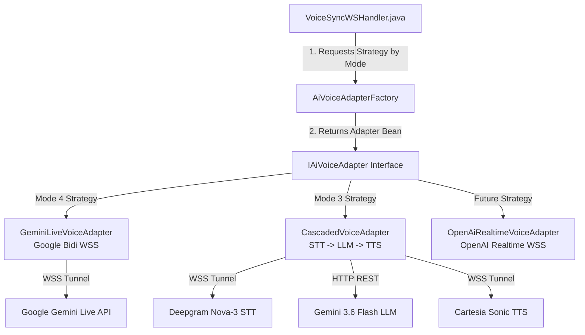

# 18. AI Provider Decoupling & Unified 4-Mode Architecture Specification

**Document Version:** 1.0  
**Target System:** reForm Monolith (`com.reForm.backend.ai` & Next.js Frontend)  
**Parent Specification:** [10_mode4_master_syllabus_and_table_of_contents.md](file:///Users/apple/Coding-projects/reForm-Web-App/backend/knowledge/pth/week3/10_mode4_master_syllabus_and_table_of_contents.md)  

---

## 1. Provider Decoupling Architecture (`IAiVoiceAdapter` & Factory Pattern)

To avoid tight coupling to any single AI cloud vendor (e.g. Google Cloud Gemini vs. OpenAI Realtime Voice) or voice architecture (Mode 3 Cascaded vs. Mode 4 Native Live), reForm uses the **Strategy Pattern** combined with a **Factory Pattern** (`AiVoiceAdapterFactory`).



### Strategy Interface Definition: `IAiVoiceAdapter.java`
```java
package com.reForm.backend.ai.service;

import org.springframework.web.socket.WebSocketSession;

public interface IAiVoiceAdapter {
    void startSession(String userId, WebSocketSession clientSession);
    void sendClientText(WebSocketSession clientSession, String text);
    void sendClientAudio(WebSocketSession clientSession, byte[] pcmAudio);
    void closeSession(WebSocketSession clientSession);
}
```

---

## 2. High-Level Production Routing: Mode 3 vs. Mode 4

When a client browser connects to the WebSocket endpoint, it specifies the desired voice mode via URI query parameters:

```text
ws://localhost:8080/ws/v1/voice?token=JWT_BEARER_TOKEN&formId=FORM_UUID&mode=MODE_3
```

### Handler Routing Implementation (`VoiceSyncWSHandler.java`)
```java
@Override
public void afterConnectionEstablished(WebSocketSession session) throws Exception {
    WebSocketSession safeSession = wrapSafeSession(session);
    String userId = (String) session.getAttributes().get("userId");
    String modeStr = (String) session.getAttributes().getOrDefault("mode", "MODE_4");

    activeSessions.put(userId, safeSession);
    sessionTracker.registerSession(userId, session.getId());

    // Retrieve selected adapter strategy from factory:
    IAiVoiceAdapter adapter = adapterFactory.getAdapter(VoiceMode.valueOf(modeStr));
    adapter.startSession(userId, safeSession);
}
```

---

## 3. Comparative Architecture: Mode 3 vs. Mode 4

| Feature / Metric | Mode 3 (Cascaded Voice Pipeline) | Mode 4 (Native Live Voice) |
| :--- | :--- | :--- |
| **Primary Use Case** | Candidate Form Filling & Interviews | Form Builder Voice Co-Building |
| **Pipeline Stages** | 3 Microservices (STT $\rightarrow$ LLM $\rightarrow$ TTS) | 1 Native Audio-to-Audio Model |
| **STT Provider** | Deepgram Nova-3 over WebSocket (`wss://api.deepgram.com`) | Integrated natively inside Gemini Live |
| **LLM Provider** | **Gemini 3.6 Flash via Unary HTTP REST** (Shared with Mode 2!) | Integrated natively inside Gemini Live |
| **TTS Provider** | Cartesia Sonic over WebSocket (`wss://api.cartesia.ai`) | Integrated natively inside Gemini Live |
| **End-to-End Latency** | ~700ms (100ms STT + 400ms LLM + 200ms TTS) | ~300ms Native Audio Streaming |
| **Cost Efficiency** | 🚀 **~35% Cheaper** (~$0.0176 / min) | ~$0.0270 / min |
| **Barge-in Mechanism** | Explicit FLUSH frame triggered on STT `speech_started` | Native AI model turn interruption (`interrupted: true`) |

---

## 4. Unified 4-Mode Component Reuse Matrix

To enforce clean architecture, all 4 AI modes share core domain entities, security context builders, and sub-agent microservices without code duplication:

```text
 ┌─────────────────────────────────────────────────────────────────────────────┐
 │ UNIFIED REUSE MATRIX ACROSS MODES 1, 2, 3, & 4                              │
 │                                                                             │
 │ Component / Subsystem              │ Mode 1 / 2 (Text)│ Mode 3 (Cascaded)│ Mode 4 (Live)│
 ├────────────────────────────────────┼──────────────────┼──────────────────┼──────────────┤
 │ FormAiAgentProfile (PostgreSQL DB) │     REUSED       │     REUSED       │    REUSED    │
 │ SessionContextService (Prompt/RAG) │     REUSED       │     REUSED       │    REUSED    │
 │ Gemini 3.6 Flash Service (REST)    │   PRIMARY LLM    │   PRIMARY LLM    │ TOOL SUB-LLM │
 │ IAiVoiceAdapter Interface          │       N/A        │  CascadedAdapter │ GeminiLive   │
 │ FormLayoutModificationEvent (EDA)  │     REUSED       │     REUSED       │    REUSED    │
 │ GuardrailAgent (pgvector)          │     REUSED       │     REUSED       │    REUSED    │
 │ MemoryGoalAgent (Redis Hash)       │     REUSED       │     REUSED       │    REUSED    │
 │ RagSearchAgent (searchUserDocument)│     REUSED       │     REUSED       │    REUSED    │
 │ EvaluationAgent (Summary Report)   │     REUSED       │     REUSED       │    REUSED    │
 └────────────────────────────────────┴──────────────────┴──────────────────┴──────────────┘
```

### Core Architecture Reuse Guarantees
1. **Mode 1 & Mode 2 (Text Chat & Form Generation)**: Uses `Gemini36FlashService` via HTTP REST. When a user submits text, it executes `SessionContextService.buildSetupContext()`, queries `FormAiAgentProfile`, runs `GuardrailAgent` and `RagSearchAgent`, and returns structured JSON.
2. **Mode 3 (Voice Cascaded)**: Captures 16kHz mic audio via Deepgram STT, routes transcribed text directly into `Gemini36FlashService` (the **exact same REST service used by Mode 2!**), and streams response text to Cartesia TTS.
3. **Mode 4 (Voice Native Live)**: Uses `GeminiLiveVoiceAdapter` for real-time audio streaming over WebSockets, while sharing the exact same `FormAiAgentProfile`, `SessionContextService`, `RagSearchAgent`, and `LayoutAgent`!
