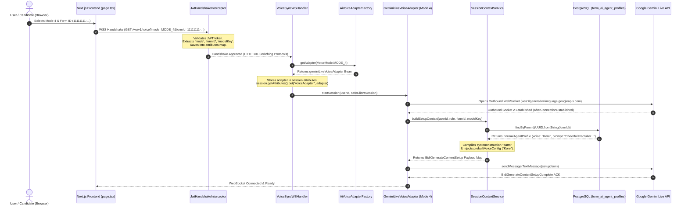
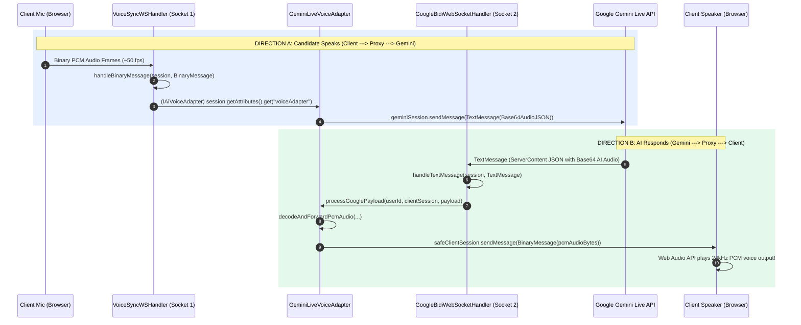
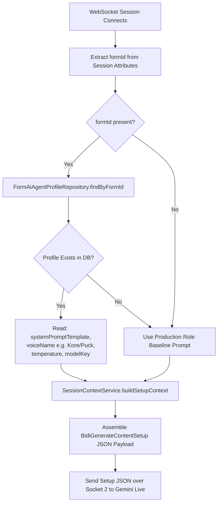

# Week 4 System Diagrams & Sequence Flows

**Document Version:** 1.0  
**Target System:** reForm Core Monolith (`com.reForm.backend.ai` & Next.js Frontend)  

---

## Diagram 1: End-to-End User Mode & Model Selection Sequence Flow

This diagram visualizes what happens when a user selects a mode (e.g. Mode 4 vs Mode 3) and a form in the UI, and how the system resolves the strategy and database prompt underneath.

---

## Diagram 2: Inbound & Outbound Dual WebSocket Proxy Routing (Direction A & B)

This diagram shows exact Java function calls for mic audio streaming and AI voice playback.

---

## Diagram 3: Database Prompt & Voice Persona Hydration Flow

How `SessionContextService` retrieves database entities and builds Google's `setup` frame:

---

## Diagram 4: Mode 3 vs Mode 4 Execution Comparison

| Step / Layer | **Mode 4: Voice Native Live** | **Mode 3: Voice Cascaded Pipeline** |
| :--- | :--- | :--- |
| **Strategy Bean** | `GeminiLiveVoiceAdapter` | `CascadedVoiceAdapter` |
| **Factory Key** | `VoiceMode.MODE_4` | `VoiceMode.MODE_3` |
| **STT Engine** | Built-in native to Gemini Live | Deepgram Nova-3 over WebSocket (`wss://api.deepgram.com`) |
| **LLM Engine** | Gemini 3.1 Live (`gemini-3.1-flash-live-preview`) | Gemini 3.6 Flash via Unary HTTP REST |
| **TTS Engine** | Built-in native to Gemini Live | Cartesia Sonic over WebSocket (`wss://api.cartesia.ai`) |
| **Latency** | 🚀 **~300ms Native Audio** | ~700ms - 900ms Cascaded Pipeline |
| **Barge-in** | Native model turn detection (`interrupted: true`) | STT `speech_started` event triggers Cartesia flush |
