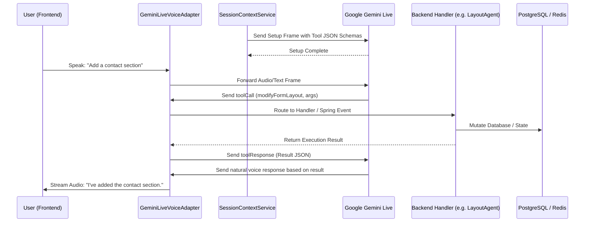
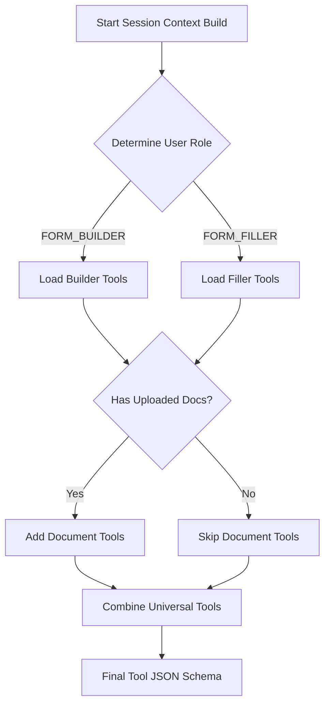

# AI Function Calling Tool Catalog and Architecture

**Location:** `backend/knowledge/pth/week4/03_ai_tool_calling_catalog_and_architecture.md`
**Target System:** reForm Platform (`com.reForm.backend.ai`)

## 1. The Problem: Why AI Needs Tools
By default, AI models are strictly text and audio conversationalists. In isolation, an LLM acting as a form builder or interviewer is essentially a chatbot that can only talk—it cannot save collected data to a database, modify the actual layout of a form, terminate active websocket sessions, or look up documents. 

To transition from an isolated conversational model to a functional **agent**, the AI needs "hands" to perform real-world actions. Function calling (or Tool Calling) bridges this gap. It allows the AI model to output structured commands requesting the application to perform side effects (e.g., executing SQL, invoking REST APIs, or modifying frontend UI) on its behalf.

## 2. How Tool Calling Works in reForm (Architecture)

In the reForm backend, AI tools are seamlessly integrated with the Google Gemini Multimodal Live API over WebSockets. The complete flow is as follows:

1. **Schema Registration:** Before the conversation starts, `SessionContextService.buildToolDeclarations()` constructs the JSON schemas for all tools applicable to the current user role and session context. These schemas are included in the initial `setup` frame sent to Gemini.
2. **Context Awareness:** Gemini receives these schemas and becomes aware of what external capabilities it possesses.
3. **Intent Detection:** During the voice or text conversation, if the user expresses an intent that matches a tool's description (e.g., "Add a contact section"), Gemini suspends its standard response generation.
4. **Tool Call Emission:** Gemini emits a `toolCall` message containing the function name and extracted arguments over WebSocket 2.
5. **Handler Routing:** The `GeminiLiveVoiceAdapter` receives the `toolCall`, parses it, and routes it to the corresponding Spring Event, Service, or Sub-Agent (e.g., `LayoutAgent`).
6. **Execution:** The backend handler executes the business logic (database mutation, vector search, UI push, etc.).
7. **Response Injection:** The backend generates a `toolResponse` with the outcome of the action and sends it back to Gemini over WebSocket 2.
8. **Conversation Continuation:** Gemini uses the `toolResponse` to synthesize a natural language response (e.g., "I've added the contact section for you!").



## 3. Tool Selection Logic (Who Gets Which Tools)

Not all agents have access to all tools. Loading unnecessary tools consumes valuable token budget in the context window and increases the risk of the model hallucinating incorrect tool usages. In `SessionContextService.buildToolDeclarations()`, tools are strictly gated using dynamic logic:

- **Role-Based Gating:** Is the user acting as a `FORM_BUILDER` (creating the form) or a `FORM_FILLER` (taking the interview/quiz)?
- **Context-Based Gating:** Does the session actually require specific tools? (e.g., `hasDocuments` flag enables `searchUserDocument`).

**Decision Tree Flow:**


## 4. Complete Tool Catalog (18 Tools)

Below is the exhaustive list of the 18 tools integrated into the reForm platform, categorized by domain.

### Section A: Universal Tools (Both Roles)

#### 1. `endSession`
- **Why it exists:** AI models do not inherently know how to "hang up." We need a mechanism to explicitly terminate WebSocket connections, stop billing agents, and trigger frontend cleanup when the user wants to leave.
- **When it fires:** "I'm done for now", "Goodbye", "End the interview."
- **What the backend does:** Gracefully closes the Bidi WebSocket, triggers `saveSessionTranscript` and `saveAudioRecording`, and emits a session closed event to the frontend.
- **JSON schema:**
  ```json
  {
    "name": "endSession",
    "description": "Ends the current voice or text session and closes the connection.",
    "parameters": { "type": "OBJECT", "properties": {} }
  }
  ```
- **Roles/Modes:** Both (Builder M2/M4, Filler M2/M3/M4)

#### 2. `searchUserDocument`
- **Why it exists:** Large knowledge bases or company handbooks cannot fit entirely inside the LLM context window. RAG (Retrieval-Augmented Generation) is needed to look up exact facts dynamically.
- **When it fires:** "What is the company's vacation policy?" (Filler) or "Look up the standard disclaimer text." (Builder).
- **What the backend does:** Executes a `pgvector` HNSW cosine similarity search on the `document_embeddings` table and returns the top-3 text passages to the AI.
- **JSON schema:**
  ```json
  {
    "name": "searchUserDocument",
    "description": "Queries uploaded user documents to retrieve exact answers.",
    "parameters": {
      "type": "OBJECT",
      "properties": {
        "query": { "type": "STRING", "description": "The specific question or topic to search." }
      },
      "required": ["query"]
    }
  }
  ```
- **Roles/Modes:** Both (if `hasDocuments` is true)

### Section B: Form Builder Tools (Mode 2 / Mode 4)

#### 3. `modifyFormLayout`
- **Why it exists:** The Builder needs to verbally instruct the AI to construct the form visually on the frontend canvas.
- **When it fires:** "Add a multi-choice question about their favorite color."
- **What the backend does:** Dispatches `FormLayoutModificationEvent`, intercepted by `LayoutAgent`. The database `blocks` column is updated, and a WebSocket push updates the React UI.
- **JSON schema:**
  ```json
  {
    "name": "modifyFormLayout",
    "description": "Triggers structural modifications to the form layout canvas.",
    "parameters": {
      "type": "OBJECT",
      "properties": {
        "userIntent": { "type": "STRING" },
        "targetBlockId": { "type": "STRING" }
      },
      "required": ["userIntent"]
    }
  }
  ```
- **Roles/Modes:** Builder (M2/M4)

#### 4. `configureFillerPersona`
- **Why it exists:** The Form Builder must dictate the personality, tone, and behavior of the AI that will eventually interview the Form Fillers.
- **When it fires:** "Make the interviewer sound very strict and corporate."
- **What the backend does:** Updates the `FormAiAgentProfile` in PostgreSQL, modifying the saved `voiceName`, `temperature`, and `systemPromptTemplate`.
- **JSON schema:**
  ```json
  {
    "name": "configureFillerPersona",
    "description": "Sets the AI tone, voice, and personality settings for the form filler agent.",
    "parameters": {
      "type": "OBJECT",
      "properties": {
        "tone": { "type": "STRING" },
        "voiceName": { "type": "STRING" }
      }
    }
  }
  ```
- **Roles/Modes:** Builder (M2/M4)

#### 5. `publishForm`
- **Why it exists:** When the Builder is finished, they need to lock the layout and generate a shareable URL to distribute to users.
- **When it fires:** "I'm done building. Let's publish it."
- **What the backend does:** Transitions the form status to `PUBLISHED`, locks layout modifications, and generates a public UUID slug.
- **JSON schema:**
  ```json
  {
    "name": "publishForm",
    "description": "Publishes the form and generates a shareable public URL.",
    "parameters": { "type": "OBJECT", "properties": {} }
  }
  ```
- **Roles/Modes:** Builder (M2/M4)

### Section C: Form Filler Tools (Mode 2 / Mode 3 / Mode 4)

#### 6. `saveFieldResponse`
- **Why it exists:** To prevent data loss if a session drops. The AI must persist answers to the database iteratively as they are provided, rather than waiting for the end.
- **When it fires:** "My email is test@example.com."
- **What the backend does:** Validates the payload against the field schema and upserts a record in the `submission_responses` table.
- **JSON schema:**
  ```json
  {
    "name": "saveFieldResponse",
    "description": "Persists a validated answer for a specific form field.",
    "parameters": {
      "type": "OBJECT",
      "properties": {
        "blockId": { "type": "STRING" },
        "answerValue": { "type": "STRING" }
      },
      "required": ["blockId", "answerValue"]
    }
  }
  ```
- **Roles/Modes:** Filler (M2/M3/M4)

#### 7. `evaluateResponse`
- **Why it exists:** For quizzes, triage forms, or technical interviews, the AI must instantly score the user's answer and provide feedback or branch logic.
- **When it fires:** (Implicitly after the user answers a graded question).
- **What the backend does:** Computes the score based on rubrics and writes to `submission_evaluations`.
- **JSON schema:**
  ```json
  {
    "name": "evaluateResponse",
    "description": "Scores a candidate's answer against a rubric.",
    "parameters": {
      "type": "OBJECT",
      "properties": {
        "blockId": { "type": "STRING" },
        "score": { "type": "NUMBER" },
        "feedback": { "type": "STRING" }
      }
    }
  }
  ```
- **Roles/Modes:** Filler (M2/M3/M4)

#### 8. `skipQuestion`
- **Why it exists:** Users may refuse to answer or find a question inapplicable. The AI needs a way to bypass it gracefully.
- **When it fires:** "I don't want to answer that." or "That doesn't apply to me."
- **What the backend does:** Records a skip in the database with the provided reason and advances the internal session tracker pointer to the next block.
- **JSON schema:**
  ```json
  {
    "name": "skipQuestion",
    "description": "Skips an optional or non-applicable question.",
    "parameters": {
      "type": "OBJECT",
      "properties": {
        "blockId": { "type": "STRING" },
        "reason": { "type": "STRING" }
      }
    }
  }
  ```
- **Roles/Modes:** Filler (M2/M3/M4)

#### 9. `lookupFormProgress`
- **Why it exists:** To orient users in long, multi-step conversational forms without visual progress bars.
- **When it fires:** "How many questions are left?"
- **What the backend does:** Calculates total blocks vs. answered blocks in PostgreSQL and returns the completion percentage.
- **JSON schema:**
  ```json
  {
    "name": "lookupFormProgress",
    "description": "Checks the completion progress of the current form.",
    "parameters": { "type": "OBJECT", "properties": {} }
  }
  ```
- **Roles/Modes:** Filler (M2/M3/M4)

#### 10. `flagForHumanReview`
- **Why it exists:** The AI should not make definitive decisions on highly ambiguous, dangerous, or high-liability answers (e.g., medical triage).
- **When it fires:** "I've been having severe chest pain."
- **What the backend does:** Annotates the response with `FLAGGED`, marks the submission status as `REQUIRES_REVIEW`, and triggers an async notification to the form owner.
- **JSON schema:**
  ```json
  {
    "name": "flagForHumanReview",
    "description": "Flags a specific response for manual human review.",
    "parameters": {
      "type": "OBJECT",
      "properties": {
        "blockId": { "type": "STRING" },
        "reason": { "type": "STRING" }
      }
    }
  }
  ```
- **Roles/Modes:** Filler (M2/M3/M4)

### Section D: File & Document Tools (Both Roles)

#### 11. `requestFileUpload`
- **Why it exists:** Sometimes a conversation reveals the need for a file that wasn't strictly required by the form template (e.g., asking for an ad-hoc portfolio PDF).
- **When it fires:** "Please upload a copy of your driver's license."
- **What the backend does:** Emits a `FILE_UPLOAD_REQUESTED` event to the frontend, forcing the React UI to dynamically render a drag-and-drop zone.
- **JSON schema:**
  ```json
  {
    "name": "requestFileUpload",
    "description": "Triggers the frontend UI to display a file upload zone.",
    "parameters": { "type": "OBJECT", "properties": { "documentType": { "type": "STRING" } } }
  }
  ```
- **Roles/Modes:** Both

#### 12. `analyzeUploadedFile`
- **Why it exists:** Once a file is uploaded, the conversational AI cannot natively "see" it without invoking a specialized pipeline.
- **When it fires:** "Can you look at the chart I just uploaded?"
- **What the backend does:** Routes the file bytes to Gemini Vision (if image) or Apache Tika/OCR (if document) to generate a textual description to feed back into the chat.
- **JSON schema:**
  ```json
  {
    "name": "analyzeUploadedFile",
    "description": "Processes an uploaded file via Vision or OCR to extract its text/visual content.",
    "parameters": { "type": "OBJECT", "properties": { "fileId": { "type": "STRING" } } }
  }
  ```
- **Roles/Modes:** Both

#### 13. `extractStructuredData`
- **Why it exists:** Forms need precise fields (First Name, SSN), but uploaded docs (resumes, W2s) are unstructured.
- **When it fires:** (Implicitly triggered when a user uploads a resume instead of typing answers).
- **What the backend does:** Prompts a background Gemini Flash task with a JSON schema to extract key-value pairs from the document text, subsequently filling the form fields.
- **JSON schema:**
  ```json
  {
    "name": "extractStructuredData",
    "description": "Pulls specific key-value fields from an unstructured document.",
    "parameters": { "type": "OBJECT", "properties": { "fileId": { "type": "STRING" }, "schema": { "type": "STRING" } } }
  }
  ```
- **Roles/Modes:** Both

#### 14. `generateContentFromDocument`
- **Why it exists:** A teacher or recruiter might want the AI to instantly author an entire form/quiz directly from syllabus or job description PDFs.
- **When it fires:** "Create a 5-question quiz based on this biology syllabus."
- **What the backend does:** Sends the document to Gemini Flash with a prompt to output structured layout blocks, which are then passed to the `LayoutAgent`.
- **JSON schema:**
  ```json
  {
    "name": "generateContentFromDocument",
    "description": "Generates form or quiz layout blocks based on uploaded material.",
    "parameters": { "type": "OBJECT", "properties": { "fileId": { "type": "STRING" }, "instructions": { "type": "STRING" } } }
  }
  ```
- **Roles/Modes:** Builder (M2/M4)

### Section E: Audio & Transcript Tools

#### 15. `saveAudioRecording`
- **Why it exists:** Compliance (HR, Legal, Healthcare) dictates that voice interviews must be archived.
- **When it fires:** Triggered during `endSession` or explicitly mid-call.
- **What the backend does:** Compresses the raw PCM audio buffer into a `.webm` or `.mp3` format and uploads it to an S3 bucket or local filesystem.
- **JSON schema:**
  ```json
  {
    "name": "saveAudioRecording",
    "description": "Stores the active voice session audio buffer for replay.",
    "parameters": { "type": "OBJECT", "properties": {} }
  }
  ```
- **Roles/Modes:** Both

#### 16. `saveSessionTranscript`
- **Why it exists:** Form owners need a readable, searchable record of the exact dialogue that occurred during a filler session.
- **When it fires:** Triggered during `endSession` or checkpointing.
- **What the backend does:** Persists the complete, timestamped conversation text array as JSON into the `session_transcripts` table.
- **JSON schema:**
  ```json
  {
    "name": "saveSessionTranscript",
    "description": "Persists the full conversation text.",
    "parameters": { "type": "OBJECT", "properties": {} }
  }
  ```
- **Roles/Modes:** Both

### Section F: Dynamic UI & Notification Tools

#### 17. `renderDynamicUI`
- **Why it exists:** Voice and text aren't always the most efficient inputs. For complex data (calendars, star ratings), pushing a visual widget is better.
- **When it fires:** "Please select a date for your appointment."
- **What the backend does:** Emits a WebSocket payload to the frontend containing instructions to render a specific React widget in the chat log.
- **JSON schema:**
  ```json
  {
    "name": "renderDynamicUI",
    "description": "Pushes interactive UI widgets (date pickers, buttons) into the chat interface.",
    "parameters": { "type": "OBJECT", "properties": { "widgetType": { "type": "STRING" } } }
  }
  ```
- **Roles/Modes:** Both

#### 18. `sendNotification`
- **Why it exists:** The Builder/Owner may need real-time alerts if a Filler completes a critical action or submits an emergency flag.
- **When it fires:** Triggered internally by the AI when a condition matches user-defined alert rules.
- **What the backend does:** Pushes alerts to the owner's dashboard, sends emails, or triggers external webhooks/Slack messages.
- **JSON schema:**
  ```json
  {
    "name": "sendNotification",
    "description": "Sends real-time alerts to the form owner.",
    "parameters": { "type": "OBJECT", "properties": { "message": { "type": "STRING" }, "urgency": { "type": "STRING" } } }
  }
  ```
- **Roles/Modes:** Filler (M2/M3/M4)

## 5. Tool Availability Matrix

| Tool Name | Builder (M2/M4) | Filler (M2/M3/M4) | Context Required |
| :--- | :---: | :---: | :--- |
| `endSession` | ✅ | ✅ | None |
| `searchUserDocument` | ✅ | ✅ | `hasDocuments == true` |
| `modifyFormLayout` | ✅ | ❌ | None |
| `configureFillerPersona` | ✅ | ❌ | None |
| `publishForm` | ✅ | ❌ | None |
| `saveFieldResponse` | ❌ | ✅ | None |
| `evaluateResponse` | ❌ | ✅ | None |
| `skipQuestion` | ❌ | ✅ | None |
| `lookupFormProgress` | ❌ | ✅ | None |
| `flagForHumanReview` | ❌ | ✅ | None |
| `requestFileUpload` | ✅ | ✅ | None |
| `analyzeUploadedFile` | ✅ | ✅ | `hasUploadedFiles == true` |
| `extractStructuredData` | ✅ | ✅ | `hasUploadedFiles == true` |
| `generateContentFromDocument`| ✅ | ❌ | `hasUploadedFiles == true` |
| `saveAudioRecording` | ✅ | ✅ | Voice Session Active |
| `saveSessionTranscript` | ✅ | ✅ | None |
| `renderDynamicUI` | ✅ | ✅ | None |
| `sendNotification` | ❌ | ✅ | None |

## 7. Complete Implementation Catalog of All 18 Tool Handlers (`com.reForm.backend.ai.tool.handler.*`)

All 18 tools have clean, decoupled `@Component` strategy implementations in the backend:

| Tool Name | Sub-Package | Handler Class Name | Key Responsibility |
|:---|:---|:---|:---|
| `endSession` | `handler.universal` | `EndSessionToolHandler.java` | 3-Stage session disconnect & billing termination |
| `searchUserDocument` | `handler.universal` | `SearchUserDocumentToolHandler.java` | In-session RAG search over uploaded PDFs/resumes |
| `modifyFormLayout` | `handler.builder` | `ModifyFormLayoutToolHandler.java` | Dispatches `FormLayoutModificationEvent` to `LayoutAgent` |
| `configureFillerPersona` | `handler.builder` | `ConfigureFillerPersonaToolHandler.java` | Persists prompt template, voice, and temperature to PostgreSQL |
| `publishForm` | `handler.builder` | `PublishFormToolHandler.java` | Updates form status to `PUBLISHED` & generates public URL |
| `generateContentFromDocument` | `handler.builder` | `GenerateContentFromDocToolHandler.java` | Generates quiz/interview items from reference docs |
| `saveFieldResponse` | `handler.filler` | `SaveFieldResponseToolHandler.java` | Persists validated answer to database |
| `evaluateResponse` | `handler.filler` | `EvaluateResponseToolHandler.java` | Scores responses (0-100) & records feedback |
| `skipQuestion` | `handler.filler` | `SkipQuestionToolHandler.java` | Records skip reason & advances question tracker |
| `lookupFormProgress` | `handler.filler` | `LookupFormProgressToolHandler.java` | Returns total vs. answered fields & % completion |
| `flagForHumanReview` | `handler.filler` | `FlagForHumanReviewToolHandler.java` | Flags suspicious/urgent answers for human review |
| `requestFileUpload` | `handler.file` | `RequestFileUploadToolHandler.java` | Renders dynamic upload dropzone in client chat UI |
| `analyzeUploadedFile` | `handler.file` | `AnalyzeUploadedFileToolHandler.java` | Vision/OCR analysis of uploaded files |
| `extractStructuredData` | `handler.file` | `ExtractStructuredDataToolHandler.java` | Extracts key-value pairs from documents |
| `saveAudioRecording` | `handler.audio` | `SaveAudioRecordingToolHandler.java` | Compresses & stores raw PCM session audio |
| `saveSessionTranscript` | `handler.audio` | `SaveSessionTranscriptToolHandler.java` | Persists timestamped user/AI chat transcript |
| `renderDynamicUI` | `handler.ui` | `RenderDynamicUIToolHandler.java` | Pushes interactive widgets (buttons, stars) to chat UI |
| `sendNotification` | `handler.ui` | `SendNotificationToolHandler.java` | Sends real-time alerts to dashboard, email, or Slack |

---
*Updated for reForm Architecture v2.0*

