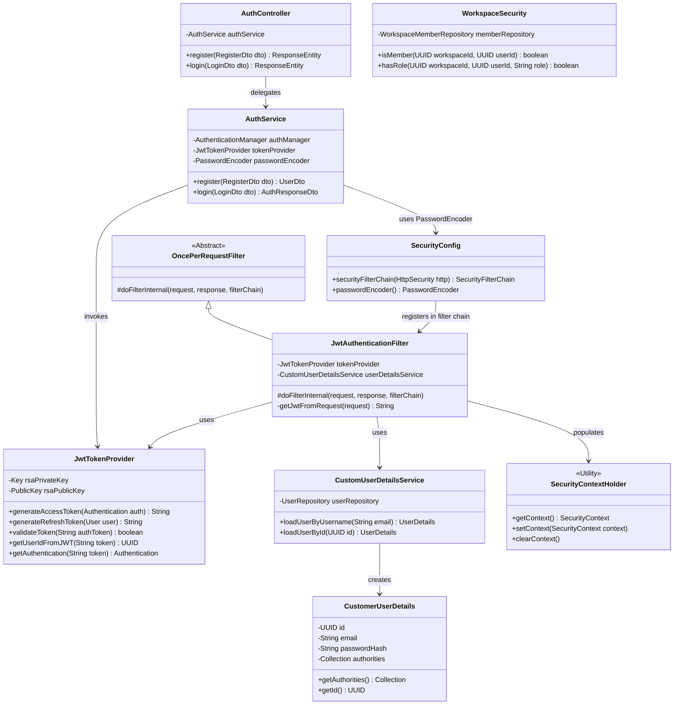
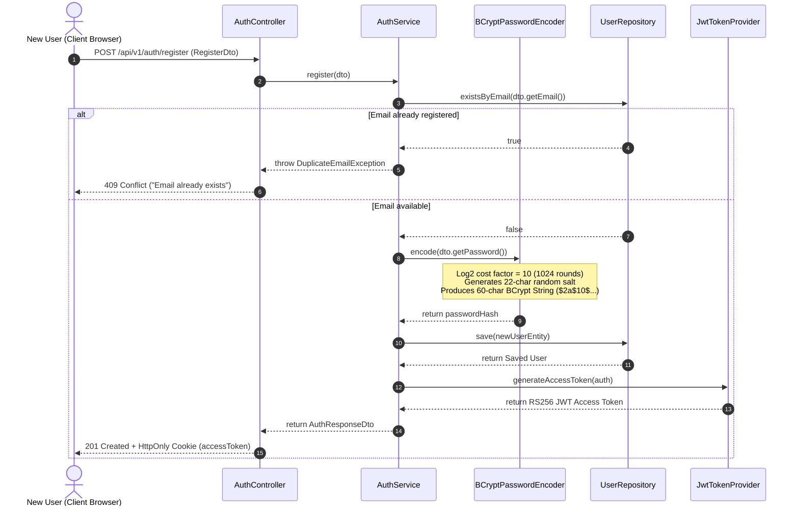
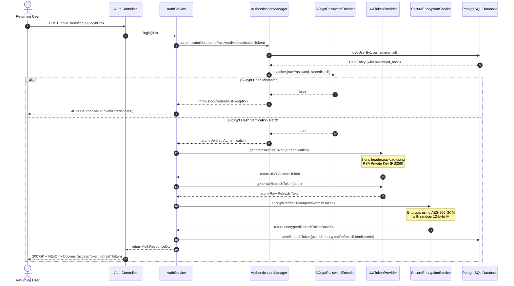
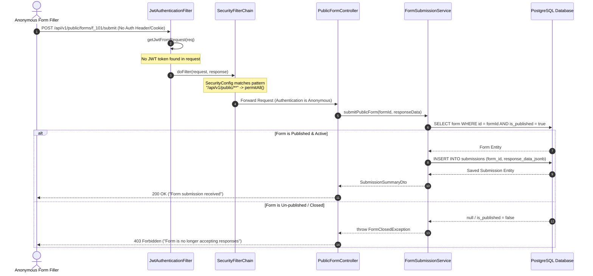
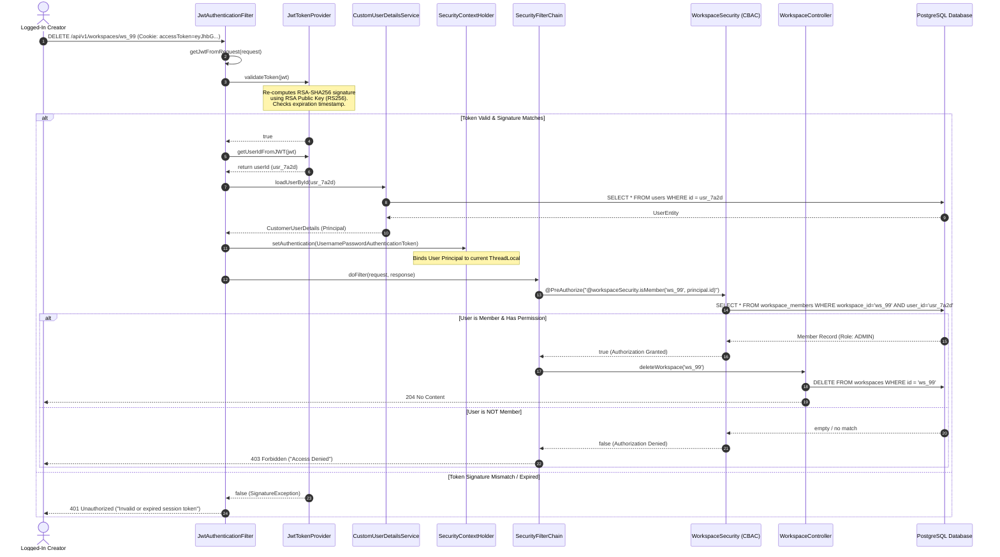
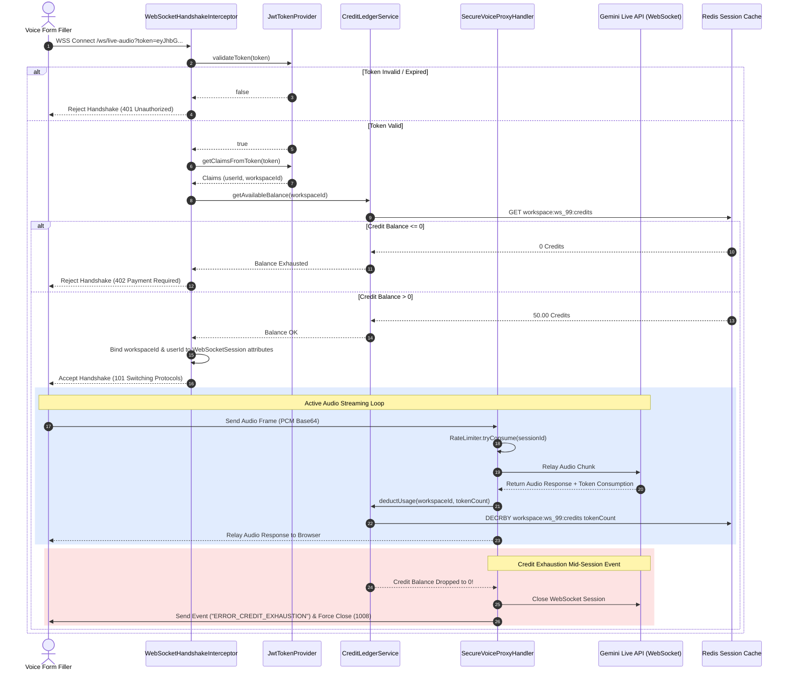

# 🔑 05: Master JWT Architecture, Security Concepts & Execution Lifecycles in reForm-Web-App

---

## 📌 Document Overview & Architectural Purpose

This master specification details the complete **Stateless Security Architecture** of `reForm-Web-App`. It consolidates and unifies all security concepts from **File #4 (`04_cybersecurity_review_and_mastery_guide.md`)** with the detailed backend implementation blueprints from **Week 1 (`pth/week1/13-21`)**.

---

# Table of Contents
1. [Low-Level Foundation: Servlets, Web Containers & HTTP Processing](#1-low-level-foundation-servlets-web-containers--http-processing)
   - [1.1 TCP Sockets to Tomcat Servlet Containers](#11-tcp-sockets-to-tomcat-servlet-containers)
   - [1.2 Nginx Web Server vs. Tomcat Web Application Container](#12-nginx-web-server-vs-tomcat-web-application-container)
   - [1.3 Spring's Front Controller: The DispatcherServlet](#13-springs-front-controller-the-dispatcherservlet)
2. [General to Detail: The Mechanics of JWT in reForm-Web-App](#2-general-to-detail-the-mechanics-of-jwt-in-reform-web-app)
   - [2.1 Why Stateless JWT Authentication?](#21-why-stateless-jwt-authentication)
   - [2.2 Anatomy & Cryptographic Structure of a reForm JWT](#22-anatomy--cryptographic-structure-of-a-reform-jwt)
3. [Mapping JWT to File #4 Security Concepts](#3-mapping-jwt-to-file-4-security-concepts)
   - [3.1 Comprehensive 14-Point Security Cross-Reference Matrix](#31-comprehensive-14-point-security-cross-reference-matrix)
   - [3.2 Deep Security Concept Mappings](#32-deep-security-concept-mappings)
4. [Spring Security Filter Chain & Component Architecture](#4-spring-security-filter-chain--component-architecture)
   - [4.1 The Complete 15-Filter Execution Pipeline](#41-the-complete-15-filter-execution-pipeline)
   - [4.2 Why `OncePerRequestFilter`? (Double-Filter Execution Prevention)](#42-why-onceperrequestfilter-double-filter-execution-prevention)
   - [4.3 SecurityContextHolder & ThreadLocal Execution Strategy](#43-securitycontextholder--threadlocal-execution-strategy)
   - [4.4 Component Class Diagram & Method Call Registry](#44-component-class-diagram--method-call-registry)
5. [Complete Lifecycle Execution Flows (All 5 Use Cases)](#5-complete-lifecycle-execution-flows-all-5-use-cases)
   - [Case 1: User Account Registration (`/api/v1/auth/register`)](#case-1-user-account-registration-apiv1authregister)
   - [Case 2: User Login & Token Generation (`/api/v1/auth/login`)](#case-2-user-login--token-generation-apiv1authlogin)
   - [Case 3: Unsecured / Public Form Submission (`/api/v1/public/forms/{formId}/submit`)](#case-3-unsecured--public-form-submission-apiv1publicformsformidsubmit)
   - [Case 4: Subsequent Authenticated REST Request (`/api/v1/workspaces/...`)](#case-4-subsequent-authenticated-rest-request-apiv1workspaces)
   - [Case 5: Subsequent Authenticated WebSocket Voice Streaming Session (`wss://...`)](#case-5-subsequent-authenticated-websocket-voice-streaming-session-wss)
6. [Authorization Paradigms: Global RBAC vs. Instance-Level CBAC](#6-authorization-paradigms-global-rbac-vs-instance-level-cbac)
   - [6.1 The "Alice & Bob" Flaw (Security through Obfuscation)](#61-the-alice--bob-flaw-security-through-obfuscation)
   - [6.2 Context/Resource-Based Access Control (CBAC) via SpEL](#62-contextresource-based-access-control-cbac-via-spel)

---

# 1. Low-Level Foundation: Servlets, Web Containers & HTTP Processing

Before configuring high-level Spring Security filters, we must examine the underlying mechanics of how Java web containers handle network traffic.

## 1.1 TCP Sockets to Tomcat Servlet Containers

At the lowest network layer, an operating system knows nothing about HTTP or REST annotations (`@GetMapping`, `@PostMapping`). The OS kernel only manages raw **TCP Network Sockets** receiving sequential byte streams on physical ports (e.g. Port 8080).

```
[ Raw TCP Byte Stream ] ──► [ Tomcat Socket (Port 8080) ] ──► [ Parsed HttpServletRequest ] ──► [ Servlet Filter Chain ]
```

### The 5-Step Servlet Container Transformation:
1. **Socket Listening**: Embedded Apache Tomcat listens on network port `8080`.
2. **Byte Parsing**: Tomcat receives raw TCP bytes and parses ASCII headers, request paths, query parameters, and payload streams.
3. **Object Instantiation**: Tomcat wraps these raw bytes into standardized Java objects: `HttpServletRequest` and `HttpServletResponse`.
4. **Filter Execution**: Tomcat passes the request through the sequential **Servlet Filter Chain** (`FilterChain`).
5. **Byte Serialization**: After controller execution, Tomcat serializes the `HttpServletResponse` object back into raw TCP network bytes and transmits them to the client.

---

## 1.2 Nginx Web Server vs. Tomcat Web Application Container

In enterprise production deployments, Nginx and Tomcat handle completely different responsibilities:

```
                  ┌──────────────────────────────────────────────┐
                  │                 WEB SERVER                   │ (e.g., Nginx)
                  │  - Handles static files (HTML, CSS, JS, Img) │
                  │  - Terminates TLS 1.3 SSL certificates       │
                  │  - Load Balancer & Reverse Proxy             │
                  └──────────────────────┬───────────────────────┘
                                         │ (Reverse Proxies cleartext HTTP)
                                         ▼
                  ┌──────────────────────────────────────────────┐
                  │              WEB APPLICATION                 │ (e.g., Embedded Tomcat)
                  │  - Runs Java Virtual Machine (JVM)           │
                  │  - Executes compiled Java bytecode (.class)  │
                  │  - Manages Servlet Lifecycles & Security     │
                  └──────────────────────────────────────────────┘
```

* **Nginx (Web Server & Reverse Proxy)**: Written in native C. Extremely fast at serving static assets, terminating TLS 1.3 certificates, and load balancing traffic. Nginx *cannot* execute Java bytecode.
* **Apache Tomcat (Servlet Container)**: Runs inside the JVM. Manages thread pools, Servlet lifecycles, and executes Spring Security filter chains.

---

## 1.3 Spring's Front Controller: The DispatcherServlet

In legacy Java web apps, developers wrote separate `HttpServlet` classes for every route mapped inside a bloated `web.xml`. Spring Web MVC resolved this via the **Front Controller Pattern**, registering **exactly one master Servlet**: the `DispatcherServlet` (mapped to catch all paths `/`).

```
[ Incoming Request ] ──► [ Filter Chain (Security Guards) ] ──► [ DispatcherServlet ] ──► [ HandlerMapping ] ──► [ @RestController ]
```

The `DispatcherServlet` acts as an internal switchboard:
1. Intercepts requests that successfully pass through the Security Filter Chain.
2. Inspects class annotations (`@RestController`, `@RequestMapping`).
3. Deserializes JSON request bodies into Java DTOs using Jackson.
4. Invokes the controller method and converts returned DTOs into JSON HTTP responses.

---

# 2. General to Detail: The Mechanics of JWT in reForm-Web-App

## 2.1 Why Stateless JWT Authentication?

In monolithic applications, user sessions are maintained **statefully** in server memory (`HttpSession`). When a user logs in, the server stores session data in RAM and sets a session cookie (`JSESSIONID`).

### Why Stateful Sessions Fail in `reForm-Web-App`:
1. **Real-Time Voice Streaming**: `reForm-Web-App` proxies live PCM audio frames between web browsers and the Gemini Multimodal Live API over WebSockets. Memory-bound stateful sessions cause server RAM bottlenecks under heavy streaming load.
2. **Microservice Scalability**: In a multi-instance cloud cluster, stateful sessions require expensive sticky sessions or centralized session DB lookups on every single incoming audio packet.

### The Stateless JWT Solution:
A **JSON Web Token (JWT)** is a **stateless, self-contained identity ticket**. The token carries the user's identity (`userId`), workspace (`workspaceId`), assigned roles (`role`), and expiration timestamp (`exp`). Because the token is signed using an **RSA Private Key (RS256)**, any microservice can verify its authenticity using the **RSA Public Key** (`jwks.json`) without querying PostgreSQL or Redis.

---

## 2.2 Anatomy & Cryptographic Structure of a reForm JWT

A `reForm-Web-App` JWT consists of three distinct parts separated by dots (`.`):

$$\text{Base64URL(Header)} \ . \ \text{Base64URL(Payload)} \ . \ \text{Base64URL(Signature)}$$

```
          ┌────────────────────────────────────────────────────────┐
          │                        HEADER                          │
          │  {"alg": "RS256", "typ": "JWT"}                        │
          └───────────────────────────┬────────────────────────────┘
                                      │  (Base64URL Encoded)
                                      ▼
          ┌────────────────────────────────────────────────────────┐
          │                        PAYLOAD                         │
          │  {"sub": "usr_7a2d4f9e", "email": "sarah@app.com",     │
          │   "workspaceId": "ws_101", "role": "CREATOR",          │
          │   "iat": 1770000000, "exp": 1770003600}                │
          └───────────────────────────┬────────────────────────────┘
                                      │  (Base64URL Encoded)
                                      ▼
          ┌────────────────────────────────────────────────────────┐
          │                       SIGNATURE                        │
          │  RSA-SHA256( Base64(Header) + "." + Base64(Payload),   │
          │               PrivateKey )                             │
          └────────────────────────────────────────────────────────┘
```

### 🔍 Key Components Breakdown:
1. **Header**: Declares the token type (`JWT`) and digital signature algorithm (`RS256` - RSA Signature with SHA-256).
2. **Payload (Claims)**:
   * `sub` (*Subject*): User UUID.
   * `email`: User's authenticated email address.
   * `workspaceId`: Primary workspace scope.
   * `role`: User role within the workspace (`CREATOR`, `ADMIN`, `VIEWER`).
   * `iat` (*Issued At*): UNIX timestamp when token was created.
   * `exp` (*Expiration*): Short 1-hour expiration timestamp.
3. **Signature**: Cryptographic proof generated by the Auth Server's **RSA Private Key**. If an attacker alters even 1 character in the Payload, the signature check fails instantly.

---

# 3. Mapping JWT to File #4 Security Concepts

The JWT architecture in `reForm-Web-App` directly operationalizes the security concepts established in **File #4 (`04_cybersecurity_review_and_mastery_guide.md`)**:

## 3.1 Comprehensive 14-Point Security Cross-Reference Matrix

| File #4 Level & Concept | Core Security Principle | How JWT in `reForm-Web-App` Implements It |
| :--- | :--- | :--- |
| **Level 1.1: CIA Triad** | Confidentiality, Integrity, Availability | **Integrity**: Verified via RS256 signature.<br>**Confidentiality**: Protected in transit via TLS 1.3 (`https://`, `wss://`). |
| **Level 1.3: Least Privilege (PoLP)** | Minimum required permissions | JWT carries workspace role claims (`VIEWER`, `CREATOR`), restricting API access. |
| **Level 3.1: Hashing vs Encoding vs Encryption** | Base64 vs. BCrypt vs. AES vs. RSA | JWT Payload is **Base64URL Encoded** (Not encrypted!). Password uses **BCrypt Hash**. Refresh Token uses **AES-256-GCM Encryption**. |
| **Level 3.2: Symmetric Encryption** | AES-256-GCM for storage | Long-lived JWT Refresh Tokens in PostgreSQL are encrypted using **AES-256-GCM**. |
| **Level 3.3: Asymmetric Encryption** | RSA Public/Private Keypair | Auth Server signs JWTs with **RSA Private Key**. Microservices verify via **RSA Public Key** (`jwks.json`). |
| **Level 3.4: Password Protection** | BCrypt Adaptive Salting & Hashing | `/api/v1/auth/login` verifies BCrypt password hash (`$2a$10$...`) before issuing signed JWT. |
| **Level 3.5: Digital Signatures** | Non-Repudiation & Payload Tamper Check | `JwtDecoder` re-computes `RSA-SHA256(Header.Payload)`. Tampered claims (`VIEWER` $\rightarrow$ `ADMIN`) fail signature checks. |
| **Level 3.6: PKI & TLS 1.3** | Secure transport tunnels | JWT `Bearer` tokens sent in HTTP headers & WebSockets are protected from eavesdropping via TLS 1.3. |
| **Level 4.1: AuthN vs AuthZ** | Identity vs Permissions | **AuthN**: Verified when JWT signature and expiration pass.<br>**AuthZ**: Evaluated when `@PreAuthorize` checks roles/CBAC. |
| **Level 4.2: Access Control Models** | RBAC vs ABAC/CBAC | Roles in JWT populate `GrantedAuthority` (RBAC). SpEL evaluators check database relationships (CBAC). |
| **Level 4.3: OIDC & JWT Security** | Rejecting `alg: none` & key confusion | Spring Security pins `RS256` explicitly, rejecting unsigned or tampered JWTs. |
| **Level 6.5: Session Security** | XSS Cookie Theft & CSRF Defense | JWT Access Tokens stored in `SameSite=Strict; Secure; HttpOnly` cookies. |
| **Level 7.1: Centralized Logging** | Observability & Audit Trails | `JwtAuthenticationFilter` extracts `userId` and sets `MDC.put("traceId", ...)` for SIEM logging. |
| **Level 9.3: Denial of Wallet (DoW)** | Rate Limiting AI proxies | `SecureVoiceProxyHandler` validates JWT & credit balance before forwarding audio frames to Gemini API. |

---

# 4. Spring Security Filter Chain & Component Architecture

## 4.1 The Complete 15-Filter Execution Pipeline

When an HTTP request enters `reForm-Web-App`, Tomcat routes it through Spring Security's **15-Filter Pipeline** in exact sequential order:

```
[ Incoming HTTP Request ]
          │
          ▼
    ┌───────────────────────────────────────────┐
    │ 1. ChannelProcessingFilter                │ (Enforces HTTPS redirects)
    └─────────────────────┬─────────────────────┘
                          ▼
    ┌───────────────────────────────────────────┐
    │ 2. WebAsyncManagerIntegrationFilter       │ (Propagates SecurityContext to async threads)
    └─────────────────────┬─────────────────────┘
                          ▼
    ┌───────────────────────────────────────────┐
    │ 3. SecurityContextHolderFilter            │ (Clears/loads SecurityContext per request)
    └─────────────────────┬─────────────────────┘
                          ▼
    ┌───────────────────────────────────────────┐
    │ 4. HeaderWriterFilter                     │ (Appends X-Frame-Options, X-Content-Type-Options)
    └─────────────────────┬─────────────────────┘
                          ▼
    ┌───────────────────────────────────────────┐
    │ 5. CorsFilter                             │ (Validates allowed origin domains & pre-flight OPTIONS)
    └─────────────────────┬─────────────────────┘
                          ▼
    ┌───────────────────────────────────────────┐
    │ 6. CsrfFilter                             │ (Disabled for stateless JWT REST API)
    └─────────────────────┬─────────────────────┘
                          ▼
    ┌───────────────────────────────────────────┐
    │ 7. LogoutFilter                           │ (Handles /api/v1/auth/logout token clearance)
    └─────────────────────┬─────────────────────┘
                          ▼
    ┌───────────────────────────────────────────┐
    │ 8. ⭐ JwtAuthenticationFilter             │ (CUSTOM GUARD: Intercepts JWT, verifies RS256)
    └─────────────────────┬─────────────────────┘
                          ▼
    ┌───────────────────────────────────────────┐
    │ 9. UsernamePasswordAuthenticationFilter   │ (Standard form login filter - Skipped in stateless JWT)
    └─────────────────────┬─────────────────────┘
                          ▼
    ┌───────────────────────────────────────────┐
    │ 10. BasicAuthenticationFilter             │ (HTTP Basic Auth - Skipped)
    └─────────────────────┬─────────────────────┘
                          ▼
    ┌───────────────────────────────────────────┐
    │ 11. RequestCacheAwareFilter               │ (Restores cached requests after login)
    └─────────────────────┬─────────────────────┘
                          ▼
    ┌───────────────────────────────────────────┐
    │ 12. SecurityContextHolderAwareRequestFilter│ (Wraps request with SecurityContext methods)
    └─────────────────────┬─────────────────────┘
                          ▼
    ┌───────────────────────────────────────────┐
    │ 13. AnonymousAuthenticationFilter         │ (Assigns AnonymousAuthenticationToken if unauth)
    └─────────────────────┬─────────────────────┘
                          ▼
    ┌───────────────────────────────────────────┐
    │ 14. ExceptionTranslationFilter            │ (Catches AuthException -> 401, AccessDenied -> 403)
    └─────────────────────┬─────────────────────┘
                          ▼
    ┌───────────────────────────────────────────┐
    │ 15. AuthorizationFilter                   │ (Evaluates URL pattern matchers .requestMatchers())
    └─────────────────────┬─────────────────────┘
                          ▼
              [ DispatcherServlet ]
```

---

## 4.2 Why `OncePerRequestFilter`? (Double-Filter Execution Prevention)

Our custom guard `JwtAuthenticationFilter` extends Spring's `OncePerRequestFilter`.

### The Double-Execution Vulnerability in Standard Filters:
In standard Java Servlet containers, a raw `Filter` can be executed multiple times during a single HTTP request if:
1. The request triggers an internal servlet forward (e.g. forwarding to `/error`).
2. An asynchronous background thread dispatch is initiated.

Executing JWT signature verification multiple times per request wastes CPU cycles on expensive RSA calculations and risks corrupting `SecurityContextHolder`.

### The Solution:
`OncePerRequestFilter` sets a unique internal attribute flag on the `HttpServletRequest` during its first run. On any internal forward dispatch, it sees the flag, skips re-execution, and passes the request directly downstream. **This guarantees our JWT validation executes exactly once per HTTP request.**

---

## 4.3 SecurityContextHolder & ThreadLocal Execution Strategy

Once `JwtAuthenticationFilter` verifies an incoming RS256 token signature, it must store the principal details where downstream controllers and services can access them.

```
       ┌────────────────────────────────────────────────────────┐
       │                 SecurityContextHolder                  │
       │  (ThreadLocal Cabinet - routes thread to its folder)   │
       └───────────────────────────┬────────────────────────────┘
                                   │
                                   ▼
       ┌────────────────────────────────────────────────────────┐
       │                    SecurityContext                     │
       │         (The folder containing the active token)       │
       └───────────────────────────┬────────────────────────────┘
                                   │
                                   ▼
       ┌────────────────────────────────────────────────────────┐
       │          UsernamePasswordAuthenticationToken           │
       │   (Principal: CustomerUserDetails, Authorities: ROLE)  │
       └────────────────────────────────────────────────────────┘
```

* **`SecurityContextHolder`**: A utility managing context storage via a **`ThreadLocal`** strategy.
* **`ThreadLocal` Isolation**: Binds the authenticated `SecurityContext` strictly to the single JVM thread assigned by Tomcat to handle the current HTTP request. When Tomcat finishes serving the request, the filter chain executes `SecurityContextHolder.clearContext()` to prevent thread-pool memory leaks across users.

---

## 4.4 Component Class Diagram & Method Call Registry



### Component & Method Call Registry:

1. **`PasswordEncoderConfig.java`**:
   * Declares `@Bean public PasswordEncoder passwordEncoder() { return new BCryptPasswordEncoder(); }`.
   * Configures BCrypt log2 cost factor of 10 ($2^{10} = 1024$ rounds).

2. **`JwtAuthenticationFilter.java`**:
   * Invokes `getJwtFromRequest(request)` to pull bearer token from cookie/header.
   * Invokes `tokenProvider.validateToken(token)` to verify RS256 signature.
   * Invokes `tokenProvider.getUserIdFromJWT(token)` to parse `sub` claim.
   * Invokes `userDetailsService.loadUserById(userId)` to construct `CustomerUserDetails`.
   * Invokes `SecurityContextHolder.getContext().setAuthentication(auth)` to store principal in `ThreadLocal`.
   * Invokes `filterChain.doFilter(request, response)` to proceed downstream.

3. **`JwtTokenProvider.java`**:
   * Invokes `Jwts.builder().signWith(rsaPrivateKey, SignatureAlgorithm.RS256)` during token generation.
   * Invokes `Jwts.parserBuilder().setSigningKey(rsaPublicKey).build().parseClaimsJws(token)` during validation.

4. **`DaoAuthenticationProvider` & `AuthServiceImpl.java`**:
   * Invokes `authenticationManager.authenticate(new UsernamePasswordAuthenticationToken(email, password))` during login.
   * `DaoAuthenticationProvider` calls `CustomUserDetailsService.loadUserByUsername(email)` and `BCryptPasswordEncoder.matches(rawPassword, storedHash)` (extracting salt from stored `$2a$10$...` hash).

---

# 5. Complete Lifecycle Execution Flows (All 5 Use Cases)

---

## Case 1: User Account Registration (`/api/v1/auth/register`)



### 📝 Step-by-Step Execution Commentary:
1. Client submits email and raw password over HTTPS.
2. `AuthService.register()` checks database for email duplication.
3. `BCryptPasswordEncoder.encode()` (from `PasswordEncoderConfig.java`) generates a 22-character random salt and computes a 60-character self-contained BCrypt hash (`$2a$10$...` using 1024 rounds).
4. The user entity is saved to PostgreSQL (`users.password_hash`).
5. `JwtTokenProvider.generateAccessToken()` signs a new RS256 JWT.
6. Server responds with `201 Created` and sets the JWT inside a `SameSite=Strict; Secure; HttpOnly` cookie.

---

## Case 2: User Login & Token Generation (`/api/v1/auth/login`)



### 📝 Step-by-Step Execution Commentary:
1. `AuthService.login()` delegates credentials verification to Spring Security's `AuthenticationManager`.
2. `BCryptPasswordEncoder.matches()` extracts the salt and cost factor directly from the stored 60-character `$2a$10$...` hash string, hashes the incoming raw password, and compares the resulting hashes.
3. Upon successful match, `JwtTokenProvider` signs a short-lived Access Token (1 hour) using the **RSA Private Key (RS256)**.
4. A long-lived Refresh Token (30 days) is generated, encrypted using **AES-256-GCM**, and stored in PostgreSQL.
5. The Access Token is returned to the client inside a secure `HttpOnly` cookie.

---

## Case 3: Unsecured / Public Form Submission (`/api/v1/public/forms/{formId}/submit`)



### 📝 Step-by-Step Execution Commentary:
1. An anonymous end-user submits answers to a public form. No JWT token is attached.
2. `JwtAuthenticationFilter` executes, finds no token, and passes the request down the chain without populating `SecurityContextHolder`.
3. `SecurityFilterChain` matches the route `/api/v1/public/**`, which is whitelisted as `.permitAll()`. Access is granted.
4. `PublicFormController` executes submission processing without requiring user identity.

---

## Case 4: Subsequent Authenticated REST Request (`/api/v1/workspaces/...`)



### 📝 Step-by-Step Execution Commentary:
1. Client sends a REST request carrying the JWT `accessToken` in an `HttpOnly` cookie.
2. `JwtAuthenticationFilter` intercepts the request and passes the token to `JwtTokenProvider.validateToken()`.
3. `JwtTokenProvider` verifies the **RS256 Digital Signature** using the RSA Public Key. If tampered with, execution stops with `401 Unauthorized`.
4. User principal details are loaded and stored in `SecurityContextHolder` (`ThreadLocal`).
5. Spring Security evaluates `@PreAuthorize("@workspaceSecurity.isMember(...)")`. The CBAC evaluator checks PostgreSQL to confirm the user actually belongs to `ws_99`.
6. Upon successful authorization check, `WorkspaceController` executes the workspace deletion.

---

## Case 5: Subsequent Authenticated WebSocket Voice Streaming Session (`wss://...`)



### 📝 Step-by-Step Execution Commentary:
1. Client initiates a real-time WebSocket connection (`wss://api.reform.com/ws/live-audio`).
2. `WebSocketHandshakeInterceptor` extracts the JWT token, validates its RS256 signature via `JwtTokenProvider`, and extracts `workspaceId`.
3. `CreditLedgerService` checks Redis to confirm the workspace has a positive credit balance ($> 0$).
4. If credits exist, the handshake succeeds (`101 Switching Protocols`), and `userId` + `workspaceId` are bound to the `WebSocketSession`.
5. During live audio streaming, `SecureVoiceProxyHandler` verifies rate limits (Bucket4j) and deducts credit usage from Redis on the fly.
6. If credits hit zero mid-stream, the proxy handler sends an `ERROR_CREDIT_EXHAUSTION` event and forcefully closes the WebSocket connection to prevent **Denial of Wallet** attacks.

---

# 6. Authorization Paradigms: Global RBAC vs. Instance-Level CBAC

## 6.1 The "Alice & Bob" Flaw (Security through Obfuscation)

In standard tutorials, Spring Security is taught using simple **Role-Based Access Control (RBAC)**:

```java
// 🛑 INADEQUATE FOR MULTI-TENANT SAAS: Global RBAC Check
@PreAuthorize("hasRole('CREATOR')")
@DeleteMapping("/api/v1/workspaces/{workspaceId}")
public ResponseEntity<Void> deleteWorkspace(@PathVariable UUID workspaceId) {
    workspaceService.delete(workspaceId);
    return ResponseEntity.noContent().build();
}
```

### 🚨 The "Alice and Bob" Flaw:
* Alice is a valid user on `reForm-Web-App` with the global role `ROLE_CREATOR`. She owns Workspace A (`id: 100`).
* Bob is also a valid user with role `ROLE_CREATOR`. He owns Workspace B (`id: 101`).
* Alice discovers Bob's workspace ID (`101`) in a shared link. Alice issues a `DELETE /api/v1/workspaces/101`.
* **Global RBAC Evaluation**: `@PreAuthorize("hasRole('CREATOR')")` checks if Alice has the role `CREATOR`. **Yes, Alice has role `CREATOR`! Access Granted!**
* **Result**: Alice successfully deletes Bob's workspace! Global RBAC fails because roles know nothing about instance-level database relationships!

---

## 6.2 Context/Resource-Based Access Control (CBAC) via SpEL

To solve the Alice and Bob flaw, `reForm-Web-App` enforces **Context/Resource-Based Access Control (CBAC)** using **Spring Expression Language (SpEL)** connected to dedicated security evaluator beans.

### The CBAC Architecture in `reForm-Web-App`:

```java
// ✅ SECURE: Instance-Level CBAC Check using SpEL Bean Evaluator
@RestController
@RequestMapping("/api/v1/workspaces")
public class SecureWorkspaceController {

    @DeleteMapping("/{workspaceId}")
    // SpEL invokes @workspaceSecurity bean, passing workspaceId and active authenticated principal ID
    @PreAuthorize("@workspaceSecurity.hasRole(#workspaceId, principal.id, 'ADMIN')")
    public ResponseEntity<Void> deleteWorkspaceSecure(@PathVariable UUID workspaceId) {
        workspaceService.deleteWorkspace(workspaceId);
        return ResponseEntity.noContent().build();
    }
}
```

```java
// CBAC Evaluator Bean registered in Spring Context
@Component("workspaceSecurity")
public class WorkspaceSecurity {

    private final WorkspaceMemberRepository memberRepository;

    public boolean isMember(UUID workspaceId, UUID userId) {
        if (workspaceId == null || userId == null) return false;
        return memberRepository.existsByWorkspaceIdAndUserId(workspaceId, userId);
    }

    public boolean hasRole(UUID workspaceId, UUID userId, String requiredRole) {
        if (workspaceId == null || userId == null) return false;
        return memberRepository.findByWorkspaceIdAndUserId(workspaceId, userId)
                .map(member -> member.getRole().name().equals(requiredRole))
                .orElse(false);
    }
}
```

---

### ⚖️ Final Summary: RBAC vs. CBAC Comparison Matrix

| Access Control Model | Evaluated By | SpEL Expression Example | Business Question Answered | Vulnerable to Cross-Tenant Attacks? |
| :--- | :--- | :--- | :--- | :--- |
| **RBAC** (Role-Based) | User's global authorities list | `@PreAuthorize("hasRole('ADMIN')")` | *"Is the user an admin in the application?"* | ⚠️ **YES** (If user accesses another tenant's object). |
| **CBAC** (Context-Based) | Database relationship query | `@PreAuthorize("@workspaceSecurity.isMember(#wsId, principal.id)")` | *"Does THIS specific user belong to THIS specific workspace instance?"* | 🏆 **NO** (Strictly isolates multi-tenant data). |

---

## 📌 Summary Reference Checklist for Developers

```
+---------------------------------------------------------------------------------------+
|                    reForm-Web-App JWT & Security Architecture Summary                 |
+---------------------------------------------------------------------------------------+
| 1. Low-Level Pipeline--> OS TCP Sockets -> Tomcat Container -> Filter Chain -> Servlet|
| 2. JWT Format       --> Header.Payload.Signature (Base64URL Encoded, NOT Encrypted!) |
| 3. JWT Signing      --> RS256 Asymmetric RSA Keypair (Auth Server Private, JWKS Public)|
| 4. Refresh Tokens   --> AES-256-GCM Encrypted at rest in PostgreSQL                     |
| 5. Password Check   --> BCrypt ($2a$10$ self-contained hash) verified BEFORE JWT      |
| 6. Token Storage    --> SameSite=Strict; Secure; HttpOnly Cookies                     |
| 7. Interceptor      --> OncePerRequestFilter (JwtAuthenticationFilter)               |
| 8. AuthZ Strategy   --> Global RBAC + Instance-Level CBAC via SpEL Evaluators         |
| 9. Voice Proxy      --> WSS TLS 1.3 + Redis Rate Limiter + Real-Time Credit Ledger  |
+---------------------------------------------------------------------------------------+
```
