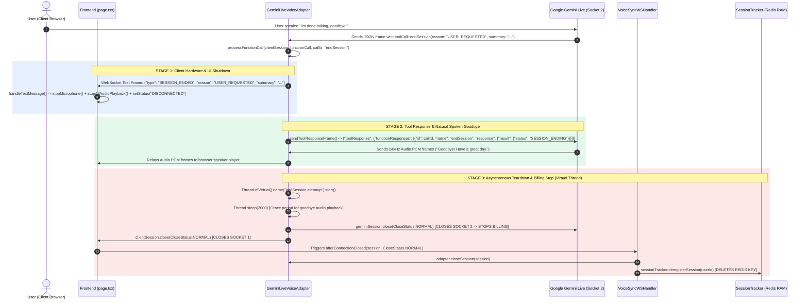

# `endSession` Tool Architecture & Session Teardown Flow

**Document Version:** 1.0  
**Location:** `backend/knowledge/pth/week4/06_end_session_architecture_and_teardown_flow.md`  
**Target System:** reForm Platform (`com.reForm.backend.ai`)  

---

## 1. Problem Statement & Design Rationale

### The Problem
Prior to implementing the `endSession` tool handler, Google Gemini Multimodal Live API sessions had no mechanism for the AI model to initiate a graceful disconnect. When a user indicated they were finished (e.g., *"I'm done talking, goodbye!"*):
1. **Runaway Billing**: Gemini Live would respond to the user's farewell and continue listening for microphone audio. The outbound WebSocket connection (Socket 2) remained open indefinitely, consuming continuous audio token quota.
2. **Resource Leaks**: The browser WebSocket (Socket 1) and server-side session attributes in Spring Boot remained allocated until a network timeout or explicit user tab closure.
3. **Active Hardware**: The client browser's microphone hardware node (`ScriptProcessorNode`) remained active and recording in the background.

### The Solution
The `endSession` tool introduces a **3-Stage Asynchronous Teardown Architecture**:
- **Stage 1 (Client Notification)**: Instantly notifies the client browser via a `SESSION_ENDED` WebSocket message so the UI can turn off the microphone and clear audio buffers.
- **Stage 2 (Final Goodbye Tool Response)**: Returns a `SESSION_ENDING` tool response frame to Gemini Live, allowing Gemini to synthesize its final spoken farewell audio sentence naturally.
- **Stage 3 (Asynchronous Socket Teardown & Redis Cleanup)**: Spawns a lightweight Java Virtual Thread (`Thread.ofVirtual()`) with a 2-second grace period to allow final audio playback, then explicitly closes Socket 2 (Gemini Live WSS) to **stop billing**, closes Socket 1 (Browser WSS), and triggers `SessionTracker.deregisterSession(userId)` to delete session metadata from Redis RAM.

---

## 2. Component & Function Responsibility Matrix

| Component Name | File Path / Location | Class / Interface | Functions & Methods Involved | Role & Responsibility |
|:---|:---|:---|:---|:---|
| **Google Gemini Live API** | External WSS (`wss://generativelanguage.googleapis.com`) | `BidiGenerateContent` | `toolCall(endSession)` | Detects user farewell intent, halts standard text/audio generation, and emits `endSession` toolCall JSON frame. |
| **Voice Adapter** | [`GeminiLiveVoiceAdapter.java`](file:///Users/apple/Coding-projects/reForm-Web-App/backend/src/main/java/com/reForm/backend/ai/service/GeminiLiveVoiceAdapter.java) | `GeminiLiveVoiceAdapter` | `handleToolCall()`, `processFunctionCall()`, `sendToolResponseFrame()`, `closeSession()` | Parses `toolCall`, sends `SESSION_ENDED` to browser, sends `toolResponse` to Gemini, and manages virtual thread teardown timer. |
| **WebSocket Session Utility** | [`WebSocketSessionUtils.java`](file:///Users/apple/Coding-projects/reForm-Web-App/backend/src/main/java/com/reForm/backend/ai/websocket/WebSocketSessionUtils.java) | `WebSocketSessionUtils` | `wrapSafeSession()` | Wraps raw WebSocket session in `ConcurrentWebSocketSessionDecorator` (10MB buffer limit, 10s write timeout) to prevent concurrent frame corruption. |
| **WebSocket Handler** | [`VoiceSyncWSHandler.java`](file:///Users/apple/Coding-projects/reForm-Web-App/backend/src/main/java/com/reForm/backend/ai/websocket/VoiceSyncWSHandler.java) | `VoiceSyncWSHandler` | `afterConnectionClosed()` | Listens for Socket 1 termination event, invokes `adapter.closeSession(session)` and `sessionTracker.deregisterSession(userId)`. |
| **Redis Session Tracker** | [`SessionTracker.java`](file:///Users/apple/Coding-projects/reForm-Web-App/backend/src/main/java/com/reForm/backend/ai/service/SessionTracker.java) | `SessionTracker` | `deregisterSession()` | Deletes `"session:" + userId` Redis Hash key and removes presence metadata from Redis RAM. |
| **Frontend UI Component** | [`page.tsx`](file:///Users/apple/Coding-projects/reForm-Web-App/frontend/src/app/page.tsx) | `Mode4TesterPage` | `handleTextMessage()`, `stopMicrophone()`, `stopAllAudioPlayback()`, `setStatus()` | Listens for `SESSION_ENDED`, releases microphone hardware, stops audio context playback, and transitions status to `DISCONNECTED`. |

---

## 3. Comprehensive Sequence UML Diagram



---

## 4. Code Implementation & Walkthrough

### Backend: `GeminiLiveVoiceAdapter.java` (`processFunctionCall`)

```java
} else if ("endSession".equals(functionName)) {
    String reason = functionCall.path("args").path("reason").asText("USER_REQUESTED");
    String summary = functionCall.path("args").path("summary").asText("");
    log.info("🔴 [END SESSION] AI triggered endSession. Reason: {}, Summary: {}", reason, summary);

    // Step 1: Notify the browser that the session is ending
    try {
        WebSocketSession safeClient = WebSocketSessionUtils.wrapSafeSession(clientSession);
        if (safeClient.isOpen()) {
            String endPayload = objectMapper.writeValueAsString(Map.of(
                "type", "SESSION_ENDED",
                "reason", reason,
                "summary", summary
            ));
            safeClient.sendMessage(new TextMessage(endPayload));
            log.info("✅ [SESSION_ENDED sent to browser]");
        }
    } catch (IOException e) {
        log.error("Failed to send SESSION_ENDED to browser", e);
    }

    // Step 2: Schedule socket teardown on a Java Virtual Thread after a 2s delay.
    // The delay gives Gemini time to speak a final goodbye after receiving toolResponse.
    Thread.ofVirtual().name("endSession-cleanup").start(() -> {
        try {
            Thread.sleep(2000);

            // Close Socket 2: Gemini WSS -> STOPS BILLING
            WebSocketSession geminiSession = (WebSocketSession) clientSession.getAttributes().get("geminiSession");
            if (geminiSession != null && geminiSession.isOpen()) {
                geminiSession.close(CloseStatus.NORMAL);
                log.info("✅ [Socket 2 CLOSED] Gemini WSS connection closed -> billing stopped");
            }

            // Close Socket 1: Browser WSS -> Triggers afterConnectionClosed & Redis cleanup
            if (clientSession.isOpen()) {
                clientSession.close(CloseStatus.NORMAL);
                log.info("✅ [Socket 1 CLOSED] Browser WSS connection closed -> Redis cleanup triggered");
            }
        } catch (Exception e) {
            log.error("Error during endSession socket teardown", e);
        }
    });

    return Map.of(
        "id", callId,
        "name", functionName,
        "response", Map.of("result", Map.of("status", "SESSION_ENDING", "message", "Session will close after final goodbye."))
    );
}
```

### Frontend: `page.tsx` (`handleTextMessage`)

```typescript
if (data.type === "SESSION_ENDED") {
  addLog(`🔴 [SESSION ENDED BY AI] Reason: ${data.reason}. Summary: ${data.summary || "N/A"}`);
  stopMicrophone();
  stopAllAudioPlayback();
  setStatus("DISCONNECTED");
  return;
}
```

---

## 5. Verification & Testing Protocol

### Manual Voice Test
1. Launch backend (`./mvnw spring-boot:run`) and frontend (`npm run dev`).
2. Open `http://localhost:3000`, select **Mode 4 (Native Live ~300ms)**, and click **Unlock Audio & Connect**.
3. Speak out loud into the microphone: *"I'm done with the interview now, goodbye!"*

### Expected Verification Logs
- **Backend Logs**:
  ```text
  Gemini Live issued toolCall 'endSession' (id: call_12345)
  🔴 [END SESSION] AI triggered endSession. Reason: USER_REQUESTED, Summary: Completed technical questions.
  ✅ [SESSION_ENDED sent to browser]
  [SENT TOOL RESPONSE TO GEMINI LIVE]: {"toolResponse":...}
  ✅ [Socket 2 CLOSED] Gemini WSS connection closed -> billing stopped
  ✅ [Socket 1 CLOSED] Browser WSS connection closed -> Redis cleanup triggered
  WebSocket connection closed for user: usr_789 (Status: CloseStatus[code=1000, reason=null])
  ```
- **Frontend Logs & UI State**:
  - Log entry: `🔴 [SESSION ENDED BY AI] Reason: USER_REQUESTED`
  - Connection pill changes from `CONNECTED` (green) to `DISCONNECTED` (gray).
  - Microphone indicator turns off (hardware freed).
