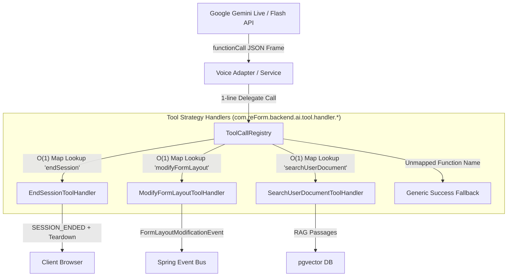

# AI Function Calling Tool Routing: Strategy Pattern Refactoring

**Document Version:** 1.2  
**Location:** `backend/knowledge/pth/week4/07_tool_call_strategy_pattern_refactoring.md`  
**Target System:** reForm Platform (`com.reForm.backend.ai.tool`)  

---

## 1. Executive Summary: Problems to Solutions

### Bad Initial State (Monolithic `if-else` Chain)
Initially, when tool calls were received from Google Gemini Live over WebSockets, `GeminiLiveVoiceAdapter.java` handled execution inside a monolithic `processFunctionCall()` method using hardcoded `if-else if-else` statements:

```java
// ❌ BEFORE (Monolithic Code Smell inside GeminiLiveVoiceAdapter.java)
private Map<String, Object> processFunctionCall(WebSocketSession clientSession, JsonNode functionCall, String callId, String functionName) {
    if ("modifyFormLayout".equals(functionName)) {
        // ... layout modification logic ...
    } else if ("searchUserDocument".equals(functionName)) {
        // ... document search logic ...
    } else if ("endSession".equals(functionName)) {
        // ... session teardown logic ...
    } else {
        return Map.of("id", callId, "name", functionName, "response", Map.of("result", Map.of("status", "SUCCESS")));
    }
}
```

### Why It Was Bad (Architectural Code Smells)

1. **Violation of the Open-Closed Principle (OCP)**:
   - Every time a developer wanted to add a new tool (e.g. `saveFieldResponse`, `publishForm`, `evaluateResponse`), they had to open and edit `GeminiLiveVoiceAdapter.java`. Software modules should be *open for extension, but closed for modification*.
2. **Violation of the Single Responsibility Principle (SRP)**:
   - `GeminiLiveVoiceAdapter` had two completely unrelated responsibilities:
     1. Managing low-latency WebSocket audio proxying between browser and Google.
     2. Housing business logic for 18+ individual domain tools.
3. **Monolithic Testing Bottleneck**:
   - To write a unit test for a single tool (e.g., `endSession`), developers had to instantiate and mock the entire WebSocket infrastructure.
4. **Team Git Merge Collisions**:
   - In a multi-developer team, developers building different tools would simultaneously modify `GeminiLiveVoiceAdapter.java`, creating constant Git merge conflicts.

---

### New Refactored State (Strategy Pattern + Spring Auto-Registration)

We refactored tool execution into a decoupled, domain-driven **Strategy Pattern** architecture under `com.reForm.backend.ai.tool`:

```java
// ✅ AFTER (Clean 1-line Delegation inside GeminiLiveVoiceAdapter.java / CascadedVoiceAdapter.java)
private Map<String, Object> processFunctionCall(WebSocketSession clientSession, JsonNode functionCall, String callId, String functionName) {
    return toolCallRegistry.executeTool(clientSession, functionCall, callId, functionName);
}
```

---

## 2. Design Patterns & Engineering Concepts Explained

### 1. Strategy Pattern (`IToolCallHandler`)
- **Concept**: Defines a family of algorithms, encapsulates each one, and makes them interchangeable.
- **Application in reForm**: `IToolCallHandler` is the strategy interface. Each concrete tool class (`EndSessionToolHandler`, `ModifyFormLayoutToolHandler`, `SearchUserDocumentToolHandler`) encapsulates the execution algorithm for one specific tool.

```java
public interface IToolCallHandler {
    String getFunctionName();
    Map<String, Object> execute(WebSocketSession clientSession, JsonNode functionCall, String callId);
}
```

### 2. Registry / Command Router Pattern (`ToolCallRegistry`)
- **Concept**: Centralizes lookup and routing of strategy implementations via an $O(1)$ Hash Map lookup instead of runtime `if-else` conditionals.
- **Application in reForm**: `ToolCallRegistry` maintains a `Map<String, IToolCallHandler>` mapping tool function names to their corresponding handler beans.

### 3. Inversion of Control (IoC) & Spring Component Scanning
- **Concept**: The framework discovers and wires components automatically at startup rather than requiring manual registration.
- **Application in reForm**: Spring's dependency injection automatically scans all `@Component` beans implementing `IToolCallHandler` and passes them as a `List<IToolCallHandler>` to `ToolCallRegistry`'s constructor:

```java
@Service
public class ToolCallRegistry {
    private final Map<String, IToolCallHandler> handlerMap;

    public ToolCallRegistry(List<IToolCallHandler> handlers) {
        this.handlerMap = handlers.stream()
            .collect(Collectors.toMap(IToolCallHandler::getFunctionName, Function.identity()));
    }
}
```

### 4. Role of Jackson `JsonNode` in Dynamic Parameter Parsing
- **What is `JsonNode`?**  
  `JsonNode` is Jackson's tree-model object representation of a JSON payload (`tools.jackson.databind.JsonNode`). It acts as a dynamic AST (Abstract Syntax Tree) for arbitrary JSON structures.
- **Why do we pass `JsonNode functionCall` into `IToolCallHandler`?**
  1. **Dynamic Tool Schemas**: Each of the 18+ tools receives completely different JSON parameter structures:
     - `modifyFormLayout` $\rightarrow$ `{ "action": "ADD_FIELD", "label": "Email" }`
     - `endSession` $\rightarrow$ `{ "reason": "USER_REQUESTED", "summary": "Done" }`
     - `searchUserDocument` $\rightarrow$ `{ "query": "Return policy" }`
     Without `JsonNode`, we would need 18+ separate Java DTO classes or fragile string manipulation.
  2. **Null-Safe Property Traversal with `.path()`**:
     Standard getters (`node.get("field")`) throw `NullPointerException` if a property is missing. Jackson's `node.path("field")` returns a safe `MissingNode`, allowing tools to safely extract values with fallbacks without server crashes:
     ```java
     JsonNode args = functionCall.path("args"); // Null-safe extraction
     String action = args.path("action").asText("DEFAULT_ACTION");
     ```
  3. **Zero Coupling**: `ToolCallRegistry` and voice adapters do not need to know or validate individual tool schemas — they simply pass the raw `JsonNode` tree to the target strategy handler.

---

## 3. How Tool Selection & Retrieval Works (Step-by-Step Execution Flow)

Here is the exact step-by-step sequence of how the system selects and executes the **one correct tool** out of 18+ registered tools:

```text
[Step 1: Startup Auto-Registration]
  Spring Component Scan → Finds all @Component beans implementing IToolCallHandler
       ↓
  ToolCallRegistry Constructor receives List<IToolCallHandler>
       ↓
  Transforms List into Map<String, IToolCallHandler>:
  {
     "modifyFormLayout"        => ModifyFormLayoutToolHandler instance,
     "configureFillerPersona"  => ConfigureFillerPersonaToolHandler instance,
     "publishForm"             => PublishFormToolHandler instance,
     "endSession"              => EndSessionToolHandler instance,
     ...
  }

[Step 2: Incoming Gemini AI Tool Call]
  Gemini AI returns JSON frame:
  { "functionCall": { "name": "modifyFormLayout", "args": { "action": "ADD_FIELD", "label": "Review" } } }
       ↓
  Voice Adapter extracts functionName = "modifyFormLayout"

[Step 3: O(1) Instant Lookup in Registry]
  toolCallRegistry.executeTool(clientSession, functionCall, callId, "modifyFormLayout")
       ↓
  IToolCallHandler handler = handlerMap.get("modifyFormLayout");
  (Executes hash calculation to retrieve ModifyFormLayoutToolHandler in O(1) constant time — ZERO if-else!)

[Step 4: Strategy Execution & Fallback]
  if (handler != null) {
      return handler.execute(clientSession, functionCall, callId); // Runs domain business logic!
  } else {
      return genericFallbackSuccess(callId, functionName); // Graceful fallback if unhandled
  }
```

---

## 4. Visual Architecture Diagram



---

## 5. Package Directory & Component Organization

```text
com.reForm.backend.ai.tool/
├── port/
│   └── IToolCallHandler.java                 <-- Strategy Port Interface
├── registry/
│   └── ToolCallRegistry.java                <-- Spring Registry Service
└── handler/
    ├── universal/
    │   ├── EndSessionToolHandler.java       <-- [Universal Tool]
    │   └── SearchUserDocumentToolHandler.java<-- [Universal Tool]
    ├── builder/
    │   ├── ModifyFormLayoutToolHandler.java <-- [Form Builder Tool]
    │   ├── ConfigureFillerPersonaToolHandler.java
    │   ├── PublishFormToolHandler.java
    │   └── GenerateContentFromDocToolHandler.java
    ├── filler/
    │   ├── SaveFieldResponseToolHandler.java
    │   ├── EvaluateResponseToolHandler.java
    │   ├── SkipQuestionToolHandler.java
    │   ├── LookupFormProgressToolHandler.java
    │   └── FlagForHumanReviewToolHandler.java
    ├── file/
    │   ├── RequestFileUploadToolHandler.java
    │   ├── AnalyzeUploadedFileToolHandler.java
    │   └── ExtractStructuredDataToolHandler.java
    ├── audio/
    │   ├── SaveAudioRecordingToolHandler.java
    │   └── SaveSessionTranscriptToolHandler.java
    └── ui/
        ├── RenderDynamicUIToolHandler.java
        └── SendNotificationToolHandler.java
```

---

## 6. Architectural Benefits Summary

| Metric | Before (Monolithic `if-else`) | After (Strategy Pattern + Registry) |
|:---|:---|:---|
| **Lookup Time** | $O(N)$ sequential conditional evaluation | $O(1)$ instant Hash Map lookup |
| **Extensibility** | Edit `GeminiLiveVoiceAdapter.java` for every tool | Add 1 standalone `@Component` class |
| **Coupling** | High (Adapter bound to all 18 tools' logic) | Zero (Adapter bound only to `ToolCallRegistry`) |
| **Testability** | Hard (Must mock full WebSocket streaming context) | Easy (Test each tool handler in isolated unit tests) |
| **Git Conflicts** | High risk across team members | Zero risk (Each developer works in isolated handler files) |
| **SOLID Score** | Violates OCP & SRP | Adheres strictly to OCP, SRP, and DIP |
