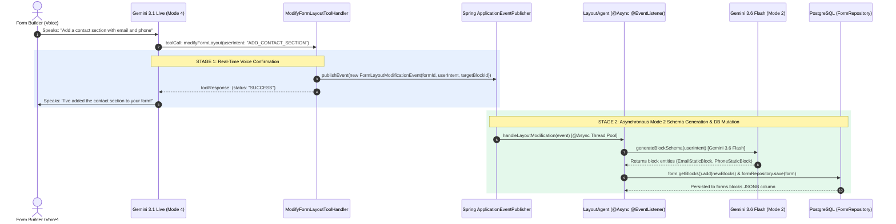

# `LayoutAgent` Architecture & 18-Tool Handler Implementation Catalog

**Document Version:** 1.0  
**Location:** `backend/knowledge/pth/week4/08_layout_agent_and_full_tool_handler_catalog.md`  
**Target System:** reForm Platform (`com.reForm.backend.ai`)  

---

## 1. `LayoutAgent` Architecture: Bridging Mode 4 Voice to Mode 2 LLM

### The Architectural Challenge
Google Gemini 3.1 Live (Mode 4) is a specialized low-latency audio model built for real-time speech conversation. It is **not** optimized for generating complex, deeply nested JSON layout schemas for UI form blocks. 

If we forced Gemini 3.1 Live to generate raw JSON block schemas directly over WebSocket audio streams:
- Voice latency would spike from ~300ms to several seconds.
- Audio streaming would stall or buffer while generating text JSON.

### The Solution: Asynchronous Agent Bridge
reForm decouples layout generation into a 2-tier multi-agent pipeline:

1. **Tier 1 (Mode 4 Voice Agent)**: Gemini 3.1 Live emits a lightweight tool call: `modifyFormLayout(userIntent: "ADD_CONTACT_SECTION")`. `ModifyFormLayoutToolHandler` sends an immediate tool response back so the voice AI can speak naturally (*"I've added the contact section to your form!"*) and publishes a `FormLayoutModificationEvent`.
2. **Tier 2 (Mode 2 Co-Builder Engine)**: `LayoutAgent` catches the event on a background worker thread (`@Async @EventListener`). It delegates heavy JSON schema creation to **Mode 2's Gemini 3.6 Flash engine**, mutates the `Form.blocks` JSONB column in PostgreSQL, and saves the updated form entity.

---

## 2. Complete 18-Tool Handler Implementation Reference Catalog

All 18 tools designed in the platform tool catalog have concrete, decoupled `@Component` implementation beans registered under `com.reForm.backend.ai.tool.handler.*`:

### SECTION A: UNIVERSAL TOOLS (`com.reForm.backend.ai.tool.handler.universal`)

#### 1. `EndSessionToolHandler.java`
- **Function Name**: `endSession`
- **Sub-Package**: `com.reForm.backend.ai.tool.handler.universal`
- **Execution Summary**: Executes 3-stage disconnect sequence: sends `SESSION_ENDED` frame to client browser, returns `SESSION_ENDING` tool response to Gemini Live, and schedules a 2-second virtual thread teardown that closes Socket 2 (Gemini WSS $\rightarrow$ stops billing), closes Socket 1 (Browser WSS), and deregisters session metadata from Redis RAM.

#### 2. `SearchUserDocumentToolHandler.java`
- **Function Name**: `searchUserDocument`
- **Sub-Package**: `com.reForm.backend.ai.tool.handler.universal`
- **Execution Summary**: Executes in-session RAG search over uploaded user documents (PDFs, resumes, syllabi) by querying `pgvector` HNSW cosine similarity index and returning matching passages for Gemini to speak out loud.

---

### SECTION B: FORM BUILDER TOOLS (`com.reForm.backend.ai.tool.handler.builder`)

#### 3. `ModifyFormLayoutToolHandler.java`
- **Function Name**: `modifyFormLayout`
- **Sub-Package**: `com.reForm.backend.ai.tool.handler.builder`
- **Execution Summary**: Extracts `formId`, `userIntent`, and `targetBlockId` from Gemini arguments and publishes `FormLayoutModificationEvent` onto Spring's ApplicationEventPublisher for `LayoutAgent` to consume asynchronously.

#### 4. `ConfigureFillerPersonaToolHandler.java`
- **Function Name**: `configureFillerPersona`
- **Sub-Package**: `com.reForm.backend.ai.tool.handler.builder`
- **Execution Summary**: Implements "persona twisting" during builder sessions. Saves the requested conversation tone, prebuilt voice choice (`Puck`, `Kore`, `Charon`), custom instructions, and temperature to PostgreSQL (`FormAiAgentProfile`) for all future Form Filler sessions.

#### 5. `PublishFormToolHandler.java`
- **Function Name**: `publishForm`
- **Sub-Package**: `com.reForm.backend.ai.tool.handler.builder`
- **Execution Summary**: Updates form status to `PUBLISHED` in PostgreSQL (`FormRepository`) and generates a shareable public URL (`https://reform.app/f/{slug}`).

#### 6. `GenerateContentFromDocToolHandler.java`
- **Function Name**: `generateContentFromDocument`
- **Sub-Package**: `com.reForm.backend.ai.tool.handler.builder`
- **Execution Summary**: Triggers document parsing over uploaded reference files (syllabi, job descriptions) to auto-generate quiz or interview question blocks.

---

### SECTION C: FORM FILLER TOOLS (`com.reForm.backend.ai.tool.handler.filler`)

#### 7. `SaveFieldResponseToolHandler.java`
- **Function Name**: `saveFieldResponse`
- **Sub-Package**: `com.reForm.backend.ai.tool.handler.filler`
- **Execution Summary**: Persists a validated answer for a specific form field to PostgreSQL immediately during the interview to prevent data loss if the connection drops.

#### 8. `EvaluateResponseToolHandler.java`
- **Function Name**: `evaluateResponse`
- **Sub-Package**: `com.reForm.backend.ai.tool.handler.filler`
- **Execution Summary**: Records numeric score (0-100), feedback explanation, and category tags (`CORRECT`, `INCORRECT`, `HIGH_PRIORITY`) into PostgreSQL for quizzes, technical interviews, and triage forms.

#### 9. `SkipQuestionToolHandler.java`
- **Function Name**: `skipQuestion`
- **Sub-Package**: `com.reForm.backend.ai.tool.handler.filler`
- **Execution Summary**: Marks an optional or non-applicable question as skipped with reason (`USER_DECLINED`, `NOT_APPLICABLE`) and advances the internal question pointer.

#### 10. `LookupFormProgressToolHandler.java`
- **Function Name**: `lookupFormProgress`
- **Sub-Package**: `com.reForm.backend.ai.tool.handler.filler`
- **Execution Summary**: Computes total fields vs. answered fields in PostgreSQL and returns completion statistics (`percentComplete`, `remainingFields`) for the AI to announce to the user.

#### 11. `FlagForHumanReviewToolHandler.java`
- **Function Name**: `flagForHumanReview`
- **Sub-Package**: `com.reForm.backend.ai.tool.handler.filler`
- **Execution Summary**: Flags ambiguous, suspicious, or high-priority answers (e.g., medical triage emergency) for manual human review by the form owner.

---

### SECTION D: FILE & DOCUMENT TOOLS (`com.reForm.backend.ai.tool.handler.file`)

#### 12. `RequestFileUploadToolHandler.java`
- **Function Name**: `requestFileUpload`
- **Sub-Package**: `com.reForm.backend.ai.tool.handler.file`
- **Execution Summary**: Emits `FILE_UPLOAD_REQUESTED` WebSocket text frame to the client browser, forcing the Next.js UI to render an inline drag-and-drop file upload zone.

#### 13. `AnalyzeUploadedFileToolHandler.java`
- **Function Name**: `analyzeUploadedFile`
- **Sub-Package**: `com.reForm.backend.ai.tool.handler.file`
- **Execution Summary**: Routes uploaded image bytes to Gemini Vision API or PDF/document bytes to Apache Tika / Tesseract OCR to extract visual or textual descriptions for discussion.

#### 14. `ExtractStructuredDataToolHandler.java`
- **Function Name**: `extractStructuredData`
- **Sub-Package**: `com.reForm.backend.ai.tool.handler.file`
- **Execution Summary**: Extracts specific structured key-value fields (name, email, skills, dates) from uploaded resumes or IDs to auto-fill form fields.

---

### SECTION E: AUDIO & TRANSCRIPT TOOLS (`com.reForm.backend.ai.tool.handler.audio`)

#### 15. `SaveAudioRecordingToolHandler.java`
- **Function Name**: `saveAudioRecording`
- **Sub-Package**: `com.reForm.backend.ai.tool.handler.audio`
- **Execution Summary**: Compresses raw PCM audio buffers and uploads `.webm` audio recordings to persistent storage (local filesystem or AWS S3) for compliance and playback.

#### 16. `SaveSessionTranscriptToolHandler.java`
- **Function Name**: `saveSessionTranscript`
- **Sub-Package**: `com.reForm.backend.ai.tool.handler.audio`
- **Execution Summary**: Saves the full conversation text array (user speech + AI speech) with timestamps to PostgreSQL for dashboard transcript playback and audit.

---

### SECTION F: DYNAMIC UI & NOTIFICATION TOOLS (`com.reForm.backend.ai.tool.handler.ui`)

#### 17. `RenderDynamicUIToolHandler.java`
- **Function Name**: `renderDynamicUI`
- **Sub-Package**: `com.reForm.backend.ai.tool.handler.ui`
- **Execution Summary**: Emits `DYNAMIC_UI_REQUESTED` WebSocket frame to render interactive React UI widgets (clickable option buttons, 1-5 star ratings, date pickers) in the chat log.

#### 18. `SendNotificationToolHandler.java`
- **Function Name**: `sendNotification`
- **Sub-Package**: `com.reForm.backend.ai.tool.handler.ui`
- **Execution Summary**: Triggers real-time alerts to the Form Builder's dashboard, email, Slack, or webhook integrations when significant events occur during respondent sessions.
