# reForm Agent Architecture Master Design

**Author**: Lead Technical Writer & Architect  
**Platform**: reForm Enterprise Form Builder & Conversational AI Platform (`com.reForm.backend.ai`)  
**Target Document**: `backend/knowledge/pth/week4/09_agent_architecture_master_design.md`  
**Date**: 2026-08-05  
**Version**: 1.0.0-RELEASE  

---

## Executive Summary

The **reForm Agent Architecture Master Design** defines the enterprise specification for autonomous, low-latency, conversational AI agents within the reForm platform monolith. Utilizing Java 21, Spring Boot 3.3, Virtual Threads, PostgreSQL `pgvector`, Redis RAM state management, and Google Gemini 3.1 Live / 3.6 Flash models, reForm bridges static web forms and real-time multimodal voice/text micro-interviews.

This document establishes the conceptual framing of "Agentic in 2026", presents the master catalog of all 43 platform agents, sub-agents, tool handlers, and profile entities across 5 distinct processing pipelines, details the complete platform Mermaid architecture, provides per-agent technical deep dives with exact Java 21 data types, evaluates core technology trade-offs, and synthesizes architectural governance principles.

---

## 1. What is Agentic in 2026?

### 1.1 Enterprise Java Spring Boot Definition of "Agent" (2026)

In 2026 enterprise software engineering, an **Agent** is no longer defined as an unconstrained LLM prompt loop or an opaque, third-party Python framework (such as LangChain or CrewAI) running outside the primary application boundary. Within the reForm Java 21 / Spring Boot 3.3 monolith, an **Agent is defined as**:

> **A Spring `@Component` service bean that encapsulates LLM/SLM client invocation, vector database retrieval, state tracking, tool execution strategies, and deterministic safety guardrails within a compiled, type-safe domain boundary.**

Instead of granting LLMs direct, unmediated access to database tables or network sockets, reForm encapsulates intelligence inside Spring IoC components. The LLM acts as an **adaptive reasoning engine**, while the Spring `@Component` agent enforces domain constraints, executes transactional side-effects, manages state transitions in Redis, and streams structured frames over WebSockets.

```
┌────────────────────────────────────────────────────────────────────────────────────────┐
│                                   2026 AGENTIC ENCAPSULATION                           │
│                                                                                        │
│   ┌────────────────────────────────────────────────────────────────────────────────┐   │
│   │                      Spring Boot @Component Agent Boundary                      │   │
│   │                                                                                │   │
│   │   ┌───────────────┐     ┌───────────────────┐     ┌────────────────────────┐   │   │
│   │   │  Perception   │ ──► │  Reasoning (LLM)  │ ──► │  Action (Tool Strategy) │   │   │
│   │   │ (WS / Events) │     │ (Gemini Live/Flash│     │ (IToolCallHandler)     │   │   │
│   │   └───────────────┘     └───────────────────┘     └────────────────────────┘   │   │
│   │           ▲                       │                            │               │   │
│   │           │                       ▼                            ▼               │   │
│   │   ┌───────────────┐     ┌───────────────────┐     ┌────────────────────────┐   │   │
│   │   │ State (Redis) │ ◄── │ Guardrails & RAG  │ ◄── │ Persistence (Postgres) │   │   │
│   │   └───────────────┘     └───────────────────┘     └────────────────────────┘   │   │
│   └────────────────────────────────────────────────────────────────────────────────┘   │
└────────────────────────────────────────────────────────────────────────────────────────┘
```

An Agentic System in reForm is characterized by six fundamental pillars:
1. **Perception**: Receiving continuous, real-time input streams (16kHz PCM audio frames, JSON WebSocket text messages, Spring ApplicationEvents, scheduled cron triggers).
2. **Reasoning & Planning**: Decomposing high-level goals into multi-step execution plans using ReAct loops or structured JSON generation (Gemini 3.1 Live / 3.6 Flash).
3. **Action Execution (Tool Calling)**: Invoking strongly typed domain operations via strategy beans (`IToolCallHandler`) registered in a central registry (`ToolCallRegistry`).
4. **Reflection & Self-Correction**: Validating schema outputs, scoring candidate answers against rubrics post-session, and auto-correcting malformed block definitions.
5. **Stateful Memory**: Retaining short-term working memory in Redis (`opsForHash()`) and long-term semantic memory in PostgreSQL `pgvector` HNSW indexes.
6. **Safety & Guardrails**: Executing sub-2ms embedding similarity checks against injection vectors before LLM context ingestion.

---

### 1.2 Paradigm Mapping Matrix

reForm maps modern agentic AI paradigms directly to Java Spring Boot architectural patterns:

| Agentic Paradigm | Theoretical Definition | reForm Enterprise Implementation Mapping |
| :--- | :--- | :--- |
| **ReAct (Reasoning + Acting)** | Interleaved reasoning ("thought") and action ("tool call") loops where LLM observes tool outputs before responding. | Gemini 3.1 Live emitting WebSocket `toolCall` frames $\rightarrow$ `ToolCallRegistry` executing `@Component` `IToolCallHandler` beans $\rightarrow$ returning `toolResponse` JSON frames back to Gemini over Socket 2. |
| **Plan-and-Execute** | Decomposing high-level user intent into a multi-step sequence of discrete sub-actions. | `LayoutAgent` receiving intent (`ADD_CONTACT_SECTION`), prompting Gemini 3.6 Flash Mode 2 for block JSON schemas, validating constraints via `SchemaAgent`, and appending blocks to PostgreSQL JSONB columns. |
| **Multi-Agent Orchestration** | Deploying specialized concurrent agents handling isolated tasks rather than 1 monolithic prompt. | Form Filler Pipeline where `GuardrailAgent` (safety), `MemoryGoalAgent` (state), `BillingAgent` (metering), `RagSearchAgent` (RAG), and `EvaluationAgent` (scoring) execute in parallel during active voice sessions. |
| **Tool Calling & Registry** | Binding LLM function declarations to executable backend native functions. | `ToolCallRegistry` auto-wiring all 18 `IToolCallHandler` strategy beans via Spring IoC container and dispatching function calls in $O(1)$ constant time. |
| **Reflection & Self-Correction** | In-flight or post-hoc evaluation of output quality, safety, and validity. | `SchemaAgent` validating generated block definitions and auto-healing missing fields; `EvaluationAgent` performing multi-criteria post-session scoring. |
| **Dynamic Sub-Agent Spawning** | Main agent instantiating background worker micro-agents on demand for heavy processing. | `SubAgentFactory` spawning `CodeAnalysisSubAgent`, `DocumentOcrSubAgent`, `AudioTranscriptionSubAgent`, or `ScoringSubAgent` on Spring `AsyncTaskExecutor` Virtual Thread pools. |

---

## 2. Agent Catalog Table

Below is the master catalog of all **43 components** (Agents, Sub-Agents, Tool Handlers, and Profile Entities) across reForm's 5 processing pipelines.

| Agent Name | Pipeline / Category | Status | Primary Role | Primary Tech Stack |
| :--- | :--- | :--- | :--- | :--- |
| `LayoutAgent` | 4.1 Form Builder | **Built** | Form layout modification event processor | Gemini 3.6 Flash + Spring `@Async` + Postgres JSONB |
| `SchemaAgent` | 4.1 Form Builder | **Net-New** | Form block schema compiler & constraint validator | Jackson JsonSchema + Jakarta Validation 3.0 |
| `ThemeAgent` | 4.1 Form Builder | **Net-New** | AI theme & WCAG accessibility synthesizer | Tailwind CSS v4 + Color4j + Gemini 3.6 Flash |
| `TranslationAgent` | 4.1 Form Builder | **Net-New** | Multilingual form localization engine | Gemini 3.6 Flash + Redis String Cache |
| `FormVersioningAgent` | 4.1 Form Builder | **Net-New** | Form schema diffing & migration manager | java-diff-utils + Jackson JsonPatch (RFC 6902) |
| `ConfigureFillerPersonaToolHandler` | 4.1 Form Builder | **Built** | Persists interviewer prompt & voice settings | Spring `@Component` + `FormAiAgentProfileRepository` |
| `ModifyFormLayoutToolHandler` | 4.1 Form Builder | **Built** | Dispatches layout modification events | Spring `@Component` + `ApplicationEventPublisher` |
| `PublishFormToolHandler` | 4.1 Form Builder | **Built** | Locks form layout & generates public slug URL | Spring `@Component` + `FormRepository` |
| `GenerateContentFromDocToolHandler` | 4.1 Form Builder | **Built** | Generates quiz questions from uploaded docs | Spring `@Component` + Gemini 3.6 Flash |
| `AdaptiveBranchingAgent` | 4.2 Form Filler | **Net-New** | Dynamic conditional question DAG traverser | SpEL / MVEL + JGraphT DAG Engine |
| `VoiceSpeechAgent` | 4.2 Form Filler | **Net-New** | Real-time PCM VAD & audio stream processor | Netty ByteBuf + Silero VAD + WebRTC Native |
| `ValidationAgent` | 4.2 Form Filler | **Net-New** | Cross-field business & external API validator | Hibernate Validator + Resilience4j CircuitBreaker |
| `ScoringSubAgent` | 4.2 Form Filler | **Designed** | Multi-criteria competency worker sub-agent | Spring `AsyncTaskExecutor` + Gemini 3.6 Flash |
| `EvaluateResponseToolHandler` | 4.2 Form Filler | **Built** | Scores candidate answer against rubric (0-100) | Spring `@Component` + Jackson JsonNode |
| `FlagForHumanReviewToolHandler` | 4.2 Form Filler | **Built** | Flags suspicious/ambiguous responses for review | Spring `@Component` + Postgres Audit Log |
| `LookupFormProgressToolHandler` | 4.2 Form Filler | **Built** | Queries form completion percentage & counts | Spring `@Component` + Redis Session State |
| `SaveFieldResponseToolHandler` | 4.2 Form Filler | **Built** | Persists field responses to PostgreSQL | Spring `@Component` + `FieldResponseRepository` |
| `SkipQuestionToolHandler` | 4.2 Form Filler | **Built** | Marks field skipped with reason metadata | Spring `@Component` + Postgres Field State |
| `MalwareScanAgent` | 4.3 File & Media | **Net-New** | Security virus & sandbox media inspector | ClamAV REST + Apache Tika Magic Inspection |
| `DocumentOcrSubAgent` | 4.3 File & Media | **Designed** | Scanned document OCR & text extractor | Apache Tika + Tesseract OCR 5.0 |
| `AudioTranscriptionSubAgent` | 4.3 File & Media | **Net-New** | Speaker diarization & STT worker agent | Deepgram STT / Faster-Whisper + Spring AMQP |
| `DocumentChunkingEmbeddingAgent` | 4.3 File & Media | **Net-New** | Semantic chunker & HNSW vector indexer | `text-embedding-004` (768d) + `pgvector` HNSW |
| `AnalyzeUploadedFileToolHandler` | 4.3 File & Media | **Built** | Vision & document analysis execution | Spring `@Component` + Gemini Vision API |
| `ExtractStructuredDataToolHandler` | 4.3 File & Media | **Built** | Extracts key-value fields from files/resumes | Spring `@Component` + Gemini 3.6 Flash |
| `RequestFileUploadToolHandler` | 4.3 File & Media | **Built** | Pushes file upload UI dropzone to browser | Spring `@Component` + WebSocket Text Frame |
| `SaveAudioRecordingToolHandler` | 4.3 File & Media | **Built** | Compresses & uploads session audio PCM to S3 | Spring `@Component` + AWS S3 SDK v2 |
| `SaveSessionTranscriptToolHandler` | 4.3 File & Media | **Built** | Persists timestamped dialogue transcript array | Spring `@Component` + Postgres JSONB |
| `AnalyticsAggregationAgent` | 4.4 Background | **Net-New** | Drop-off & conversion analytics rollups | Postgres Window Functions + Redis Caches |
| `TokenMeteringAgent` | 4.4 Background | **Net-New** | Real-time quota & LLM token billing meter | Redis Lua Scripts + Redisson Distributed Lock |
| `ArchivalAgent` | 4.4 Background | **Net-New** | Compliance retention & cold storage lifecycle | AWS S3 Glacier + Spring Batch 5.0 |
| `CodeAnalysisSubAgent` | 4.4 Background | **Designed** | Sandboxed code syntax & execution checker | Docker Java SDK + GraalVM Sandbox |
| `EvaluationAgent` | 4.4 Background | **Designed** | Post-session summary & scoring report engine | Gemini 3.6 Flash + Spring `@Async` |
| `BillingAgent` | 4.4 Background | **Designed** | VAD silence metering & credit balance check | Spring `@Scheduled` + Redis TTL + VAD Frames |
| `SessionStateAgent` | 4.5 Lifecycle | **Net-New** | Snapshot & WebSocket cluster failover manager | Redis Hash + Redisson + Spring Session |
| `SecurityAuditAgent` | 4.5 Lifecycle | **Net-New** | Real-time PII & prompt injection auditor | Spring Security + OpenSearch Append-Only Log |
| `GuardrailAgent` | 4.5 Lifecycle | **Designed** | Real-time embedding similarity safety guard | `text-embedding-004` + `pgvector` HNSW (<2ms) |
| `MemoryGoalAgent` | 4.5 Lifecycle | **Designed** | In-flight goal state & checklist tracker | Redis `opsForHash()` (`session:{id}:goals`) |
| `RagSearchAgent` | 4.5 Lifecycle | **Designed** | Hybrid vector RAG search engine | `text-embedding-004` + `pgvector` Cosine Search |
| `EndSessionToolHandler` | 4.5 Lifecycle | **Built** | 3-stage graceful socket teardown & cleanup | Spring `@Component` + Java Virtual Threads |
| `SearchUserDocumentToolHandler` | 4.5 Lifecycle | **Built** | In-session vector document retrieval tool | Spring `@Component` + `pgvector` HNSW |
| `RenderDynamicUIToolHandler` | 4.5 Lifecycle | **Built** | Pushes interactive widgets (stars, pickers) | Spring `@Component` + WebSocket Text Frame |
| `SendNotificationToolHandler` | 4.5 Lifecycle | **Built** | Triggers alerts (Dashboard, Email, Slack) | Spring `@Component` + Spring Event Bus |
| `FormAiAgentProfile` | 4.5 Lifecycle | **Built** | Domain Entity holding prompt & voice settings | JPA `@Entity` (`form_ai_agent_profiles`) |

---

## 3. Platform Mermaid Architecture Diagram

The following architecture diagram illustrates the end-to-end event flows, WebSocket twin-sockets, ToolCallRegistry routing, storage systems, and sub-agent workers across all 5 pipelines:

```mermaid
graph TD
    subgraph INGRESS [Client Ingress and Network Layer]
        Browser_UI["React Web Client / Voice UI"]
        HTTP_Api["Spring REST Controllers"]
        WS_Endpoint["/ws/v1/voice Handshake Interceptor"]
        JWT_Interceptor["JwtHandshakeInterceptor"]
    end

    subgraph LIFECYCLE [Pipeline 5: Session Lifecycle Pipeline]
        SessionStateAgent["SessionStateAgent - Redis Snapshot"]
        SecurityAuditAgent["SecurityAuditAgent - OpenSearch Audit"]
        GuardrailAgent["GuardrailAgent - pgvector Sub-2ms Safety"]
        MemoryGoalAgent["MemoryGoalAgent - Redis Goal Tracking"]
        RagSearchAgent["RagSearchAgent - Hybrid RAG Engine"]
        FormAiProfile["FormAiAgentProfile JPA Entity"]
        Tool_EndSession["EndSessionToolHandler"]
        Tool_SearchDoc["SearchUserDocumentToolHandler"]
        Tool_RenderUI["RenderDynamicUIToolHandler"]
        Tool_Notification["SendNotificationToolHandler"]
    end

    subgraph SOCKET_TWIN [Twin-Socket Real-Time Streaming Architecture]
        Socket1["Socket 1: Inbound Browser to/from Server (VoiceSyncWSHandler)"]
        Socket2["Socket 2: Outbound Server to/from Gemini Live WSS (GeminiLiveVoiceAdapter)"]
    end

    subgraph TOOL_ROUTER [Tool Execution Subsystem]
        Registry["ToolCallRegistry O(1) Map Router"]
        IToolPort["IToolCallHandler Strategy Interface"]
    end

    subgraph BUILDER_PIPE [Pipeline 1: Form Builder Pipeline]
        LayoutAgent["LayoutAgent @Async"]
        SchemaAgent["SchemaAgent - Jackson Validator"]
        ThemeAgent["ThemeAgent - Tailwind Synthesizer"]
        TranslationAgent["TranslationAgent - Redis Localizer"]
        VersioningAgent["FormVersioningAgent - RFC 6902 Diff"]
        Tool_ConfigurePersona["ConfigureFillerPersonaToolHandler"]
        Tool_ModifyLayout["ModifyFormLayoutToolHandler"]
        Tool_Publish["PublishFormToolHandler"]
        Tool_GenDoc["GenerateContentFromDocToolHandler"]
    end

    subgraph FILLER_PIPE [Pipeline 2: Form Filler Pipeline]
        AdaptiveBranching["AdaptiveBranchingAgent - SpEL DAG"]
        VoiceSpeech["VoiceSpeechAgent - Netty VAD"]
        ValidationAgent["ValidationAgent - CircuitBreaker"]
        ScoringSub["ScoringSubAgent Worker"]
        Tool_Evaluate["EvaluateResponseToolHandler"]
        Tool_Flag["FlagForHumanReviewToolHandler"]
        Tool_LookupProgress["LookupFormProgressToolHandler"]
        Tool_SaveResponse["SaveFieldResponseToolHandler"]
        Tool_Skip["SkipQuestionToolHandler"]
    end

    subgraph MEDIA_PIPE [Pipeline 3: File and Media Processing Pipeline]
        MalwareScan["MalwareScanAgent - ClamAV / Tika"]
        DocOcr["DocumentOcrSubAgent Worker"]
        AudioTranscription["AudioTranscriptionSubAgent - STT Worker"]
        ChunkEmbed["DocumentChunkingEmbeddingAgent - pgvector"]
        Tool_AnalyzeFile["AnalyzeUploadedFileToolHandler"]
        Tool_ExtractData["ExtractStructuredDataToolHandler"]
        Tool_RequestUpload["RequestFileUploadToolHandler"]
        Tool_SaveAudio["SaveAudioRecordingToolHandler"]
        Tool_SaveTranscript["SaveSessionTranscriptToolHandler"]
    end

    subgraph BACK_PIPE [Pipeline 4: Background Async Pipeline]
        SubFactory["SubAgentFactory Worker Spawner"]
        VirtualThreads["Java VirtualThread Executor Pool"]
        AnalyticsAgent["AnalyticsAggregationAgent Rollups"]
        TokenMetering["TokenMeteringAgent - Redis Lua"]
        ArchivalAgent["ArchivalAgent - S3 Glacier Batch"]
        CodeAnalysis["CodeAnalysisSubAgent Sandbox"]
        EvaluationAgent["EvaluationAgent @Async Report"]
        BillingAgent["BillingAgent VAD Meter"]
    end

    subgraph STORAGE [Data Persistence and State Layer]
        PostgreSQL[("PostgreSQL 16 DB: JSONB Form Blocks, Submissions & Audits, pgvector HNSW Embeddings")]
        RedisCluster[("Redis 7.2 Cluster: Session Hashes, Goal Checklist State, Metering Lua Scripts")]
        S3Storage[("AWS S3 / Glacier: Compressed Audio PCM, User Uploaded Media, Cold Archives")]
    end

    %% Ingress Connections
    Browser_UI -->|HTTP POST| HTTP_Api
    Browser_UI -->|WSS Connection| WS_Endpoint
    WS_Endpoint --> JWT_Interceptor
    JWT_Interceptor -->|Validate JWT| SessionStateAgent
    JWT_Interceptor -->|Register Session| RedisCluster
    JWT_Interceptor -->|Audit Log| SecurityAuditAgent
    JWT_Interceptor -->|Load Profile| FormAiProfile

    %% Twin Socket Initialization
    WS_Endpoint --> Socket1
    Socket1 <-->|Bi-directional Audio PCM| VoiceSpeech
    VoiceSpeech --> GuardrailAgent
    GuardrailAgent -->|Safe Stream| Socket2
    VoiceSpeech --> BillingAgent
    BillingAgent --> RedisCluster

    %% Gemini Live API Interactions
    Socket2 <-->|Mode 4 Bidi Websocket| Gemini_Live["Google Gemini 3.1 Live API"]
    Gemini_Live -->|toolCall Frame| Socket2
    Socket2 --> Registry

    %% Tool Routing
    Registry --> IToolPort
    IToolPort --> Tool_ModifyLayout
    IToolPort --> Tool_ConfigurePersona
    IToolPort --> Tool_Publish
    IToolPort --> Tool_GenDoc
    IToolPort --> Tool_Evaluate
    IToolPort --> Tool_Flag
    IToolPort --> Tool_LookupProgress
    IToolPort --> Tool_SaveResponse
    IToolPort --> Tool_Skip
    IToolPort --> Tool_AnalyzeFile
    IToolPort --> Tool_ExtractData
    IToolPort --> Tool_RequestUpload
    IToolPort --> Tool_SaveAudio
    IToolPort --> Tool_SaveTranscript
    IToolPort --> Tool_EndSession
    IToolPort --> Tool_SearchDoc
    IToolPort --> Tool_RenderUI
    IToolPort --> Tool_Notification

    %% Pipeline Events and Agent Connections
    Tool_ModifyLayout -->|FormLayoutModificationEvent| LayoutAgent
    Tool_ModifyLayout -->|FormThemeGenerationEvent| ThemeAgent
    Tool_ModifyLayout -->|FormTranslationEvent| TranslationAgent
    TranslationAgent --> RedisCluster
    LayoutAgent --> SchemaAgent
    SchemaAgent --> VersioningAgent
    VersioningAgent --> PostgreSQL

    Tool_SaveResponse --> ValidationAgent
    ValidationAgent --> AdaptiveBranching
    AdaptiveBranching --> MemoryGoalAgent

    Tool_RequestUpload --> MalwareScan
    MalwareScan --> DocOcr
    DocOcr --> ChunkEmbed
    ChunkEmbed --> PostgreSQL

    Tool_SaveAudio --> AudioTranscription
    AudioTranscription --> PostgreSQL

    Socket1 -->|Session Disconnect| Tool_EndSession
    Tool_EndSession -->|VirtualThread Teardown| VirtualThreads
    VirtualThreads --> EvaluationAgent
    VirtualThreads --> AnalyticsAgent
    VirtualThreads --> TokenMetering
    VirtualThreads --> SubFactory
    SubFactory --> ScoringSub
    SubFactory --> CodeAnalysis

    %% Storage Binding
    GuardrailAgent <-->|Vector Cosine Check| PostgreSQL
    RagSearchAgent <-->|HNSW Semantic Search| PostgreSQL
    MemoryGoalAgent <-->|Hash State| RedisCluster
    TokenMetering <-->|Atomic Metering| RedisCluster
    ArchivalAgent --> S3Storage
    Tool_SaveAudio --> S3Storage
```



---

## 4. Per-Agent Deep-Dive Sections (Grouped by Pipeline)

---

### 4.1 Form Builder Pipeline Agents & Tool Handlers

#### 1. `LayoutAgent`
1. **Name & Role**: `LayoutAgent` asynchronously processes form layout modification intents, generating and updating PostgreSQL JSONB block arrays without stalling real-time voice streams.
2. **Trigger Mechanism**: Spring Event Bus `@EventListener` consuming `com.reForm.backend.ai.event.FormLayoutModificationEvent`.
3. **Input / Output**:
   - **Input**: `com.reForm.backend.ai.event.FormLayoutModificationEvent`
     ```java
     public record FormLayoutModificationEvent(
         UUID formId,
         String userIntent,
         List<AbstractBlock> targetBlocks,
         String sessionId
     ) {}
     ```
   - **Output**: Updated `com.reForm.backend.form.entity.Form` entity persisted to PostgreSQL and WebSocket JSON frame pushed to `/topic/form-canvas/{formId}`.
4. **Design Pattern**: **Observer Pattern** (`@EventListener`) combined with **Strategy / Factory Pattern** (delegating block schema creation to Gemini 3.6 Flash Mode 2). *WHY*: Decouples high-latency LLM JSON schema generation from low-latency WebSocket connection handlers.
5. **Technology Choice**: **Gemini 3.6 Flash (Mode 2 REST) + Spring `@Async` + Jackson JSONB** over Gemini 3.1 Live. *WHY*: Gemini 3.6 Flash generates complex, nested JSON schemas far more reliably and cheaply than live audio streaming models.
6. **SOLID + KISS Justification**:
   - *SRP*: Dedicated strictly to structural block creation and layout persistence.
   - *OCP*: Extensible by registering new `AbstractBlock` JSON subtypes without modifying event dispatchers.
   - *LSP*: Treats all block implementations (`ConversationalBlock`, `ChoiceStaticBlock`) uniformly.
   - *ISP*: Implements targeted `IFormLayoutEngine` interface.
   - *DIP*: Depends on `FormRepository` abstraction rather than concrete database drivers.
   - *KISS*: Appends validated blocks directly into a single PostgreSQL JSONB array column.
7. **Open Questions**: How should multi-step conversational "Undo" operations be managed if a user says "Undo the last three block additions"?

---

#### 2. `SchemaAgent`
1. **Name & Role**: `SchemaAgent` compiles, validates, and normalizes AI-generated form block JSON definitions against reForm schema specifications before database persistence.
2. **Trigger Mechanism**: Spring Event Bus consuming `com.reForm.backend.ai.event.SchemaCompilationEvent`.
3. **Input / Output**:
   - **Input**: `com.reForm.backend.ai.event.SchemaCompilationEvent`
     ```java
     public record SchemaCompilationEvent(
         UUID formId,
         String rawJsonSchema,
         UUID tenantId,
         String builderSessionId
     ) {}
     ```
   - **Output**: `com.reForm.backend.ai.event.SchemaCompilationResult`
     ```java
     public record SchemaCompilationResult(
         UUID formId,
         List<AbstractBlock> validatedBlocks,
         List<SchemaValidationError> errors,
         boolean isValid
     ) {}
     ```
4. **Design Pattern**: **Strategy Pattern** (block-specific validation rules) combined with **Chain of Responsibility** (syntax check $\rightarrow$ constraint check $\rightarrow$ nesting check). *WHY*: Decouples general JSON validation from specialized domain rules.
5. **Technology Choice**: **Jackson JsonSchema + Jakarta Validation 3.0** over raw string regex. *WHY*: Standard JSON Schema Draft 2020-12 bindings guarantee structural type enforcement and native Java bean validation.
6. **SOLID + KISS Justification**:
   - *SRP*: Focuses exclusively on structural schema compilation and constraint validation.
   - *OCP*: New block types register new validation strategies without altering core compilation logic.
   - *LSP*: All block validators implement `IBlockValidatorStrategy`.
   - *ISP*: Exposes minimal `ISchemaValidator` interface.
   - *DIP*: Depends on `List<IBlockValidatorStrategy>` autowired abstractions.
   - *KISS*: Executes a single linear pass over block AST nodes.
7. **Open Questions**: Should custom client-side validation JavaScript snippets embedded in form blocks be evaluated via GraalVM sandbox or restricted to JSON-declarative rules?

---

#### 3. `ThemeAgent`
1. **Name & Role**: `ThemeAgent` synthesizes custom CSS/Tailwind design systems, color palettes, and typography specs that strictly comply with WCAG 2.1 AA/AAA accessibility standards from natural language branding prompts.
2. **Trigger Mechanism**: Spring Event Bus consuming `com.reForm.backend.ai.event.FormThemeGenerationEvent` or builder tool call `generateFormTheme`.
3. **Input / Output**:
   - **Input**: `com.reForm.backend.ai.event.FormThemeGenerationEvent`
     ```java
     public record FormThemeGenerationEvent(
         UUID formId,
         String brandingPrompt,
         String baseColorHex,
         WCAGLevel targetCompliance
     ) {}
     ```
   - **Output**: `com.reForm.backend.ai.event.FormThemeResult`
     ```java
     public record FormThemeResult(
         UUID formId,
         Map<String, String> cssTokens,
         String tailwindConfigJson,
         boolean wcagCompliant,
         double contrastRatioScore
     ) {}
     ```
4. **Design Pattern**: **Builder Pattern** (step-by-step construction of complex UI themes) combined with **Template Method** (palette generation $\rightarrow$ token mapping $\rightarrow$ contrast audit). *WHY*: Theme generation requires strict sequence where contrast auditing must precede CSS output.
5. **Technology Choice**: **Tailwind CSS v4 Engine + Color4j + Gemini 3.6 Flash** over unconstrained raw CSS generation. *WHY*: Tailwind tokens guarantee consistent frontend rendering while Color4j mathematically verifies WCAG contrast ratios.
6. **SOLID + KISS Justification**:
   - *SRP*: Dedicated entirely to color mathematics, design token generation, and contrast verification.
   - *OCP*: Pluggable theme renderers support new design systems (Shadcn UI, Material 3).
   - *LSP*: All theme generators produce valid `FormThemeResult` payloads.
   - *ISP*: Decouples `IThemeSynthesizer` from `IContrastAuditor`.
   - *DIP*: Depends on `IContrastAuditor` abstraction.
   - *KISS*: Emits flat key-value CSS variable maps directly injectable into DOM element styles.
7. **Open Questions**: How should high-frequency color picker adjustments over WebSockets be throttled to prevent LLM rate limit exhaustion?

---

#### 4. `TranslationAgent`
1. **Name & Role**: `TranslationAgent` translates form question titles, descriptions, option labels, and error messages into 50+ languages while preserving localized validation rules.
2. **Trigger Mechanism**: HTTP POST `/api/v1/forms/{id}/translate` or Spring `com.reForm.backend.ai.event.FormTranslationEvent`.
3. **Input / Output**:
   - **Input**: `com.reForm.backend.ai.event.FormTranslationEvent`
     ```java
     public record FormTranslationEvent(
         UUID formId,
         String targetLanguageCode,
         List<String> targetLanguages,
         boolean preservePlaceholders
     ) {}
     ```
   - **Output**: `com.reForm.backend.ai.event.FormTranslationResult`
     ```java
     public record FormTranslationResult(
         UUID formId,
         String languageCode,
         Map<UUID, TranslatedBlockText> blockTranslations,
         int totalTokensUsed
     ) {}
     ```
4. **Design Pattern**: **Flyweight Pattern** (reusing translation cache for static UI labels like "Submit") combined with **Decorator Pattern** (wrapping raw translations with locale formatting). *WHY*: Eliminates redundant LLM translation costs for common terms across tenants.
5. **Technology Choice**: **Gemini 3.6 Flash + Redis String Cache (`translation:cache:{hash}`)** over Google Cloud Translation API. *WHY*: Gemini contextualizes translations based on form domain (medical vs legal), while Redis caches identical strings.
6. **SOLID + KISS Justification**:
   - *SRP*: Handles only multi-language textual conversion and locale metadata enrichment.
   - *OCP*: Supports custom terminology glossaries per workspace via pluggable context strategies.
   - *LSP*: Implements `ITranslationEngine` contract interchangeable with fallback translation engines.
   - *ISP*: Exposes clean `translate()` method.
   - *DIP*: High-level service depends on `ITranslationCache` and `ILLMProvider` abstractions.
   - *KISS*: Operates on a simple flat dictionary map of block UUID to translated strings.
7. **Open Questions**: Should localized validation rules (e.g., US Zip Code vs UK Postcode regex) automatically swap when display language changes?

---

#### 5. `FormVersioningAgent`
1. **Name & Role**: `FormVersioningAgent` manages semantic versioning (v1.0.0 $\rightarrow$ v1.1.0), schema diffing, and in-flight respondent session migration when published forms are edited.
2. **Trigger Mechanism**: Spring Event Bus consuming `com.reForm.backend.ai.event.FormPublishedEvent` or direct `publishForm` tool call.
3. **Input / Output**:
   - **Input**: `com.reForm.backend.ai.event.FormPublishedEvent`
     ```java
     public record FormPublishedEvent(
         UUID formId,
         int previousVersion,
         int newVersion,
         List<AbstractBlock> oldSchema,
         List<AbstractBlock> newSchema,
         UUID editorUserId
     ) {}
     ```
   - **Output**: `com.reForm.backend.ai.event.FormVersionMigrationResult`
     ```java
     public record FormVersionMigrationResult(
         UUID formId,
         String semanticVersion,
         JsonNode schemaDiffJson,
         int activeSessionsMigrated,
         boolean breakingChangesDetected
     ) {}
     ```
4. **Design Pattern**: **Command Pattern** (encapsulating schema migrations as reversible commands) combined with **Observer Pattern** (notifying session agents on breaking changes). *WHY*: Enables atomic rollback of form schema deployments if live sessions report incompatibility.
5. **Technology Choice**: **java-diff-utils + Jackson JsonPatch (RFC 6902)** over database table cloning. *WHY*: RFC 6902 patches provide low-overhead PostgreSQL JSONB migrations and exact breaking change detection.
6. **SOLID + KISS Justification**:
   - *SRP*: Manages only form versioning history, schema diffing, and session migration compatibility.
   - *OCP*: Migration handlers for new block types register via `IBlockMigrationStrategy`.
   - *LSP*: All diff handlers adhere to `ISchemaDiffEngine`.
   - *ISP*: Clean separation between `IVersionPublisher` and `ISessionMigrationHandler`.
   - *DIP*: Injects abstract `IFormVersionRepository` for database persistence.
   - *KISS*: Emits standard RFC 6902 JSON Patch arrays (`[{"op": "add", "path": "/blocks/3", ...}]`).
7. **Open Questions**: If a published form deletion of a required block invalidates an ongoing 30-minute filler session, should the session auto-adapt or request user re-validation?

---

#### 6. `ConfigureFillerPersonaToolHandler`
1. **Name & Role**: `ConfigureFillerPersonaToolHandler` configures AI interviewer prompt instructions, voice selection, and temperature settings bound 1-to-1 with a form.
2. **Trigger Mechanism**: `ToolCallRegistry.executeTool()` handling Gemini `configureFillerPersona` function call frame.
3. **Input / Output**:
   - **Input**: `WebSocketSession clientSession`, Jackson `JsonNode functionCall`, `String callId`. (Extracted args: `tone`, `voiceName`, `customInstructions`, `temperature`).
   - **Output**: `Map<String, Object>` matching Google Gemini `toolResponse` schema (`"status": "SUCCESS"`).
4. **Design Pattern**: **Strategy Pattern** (`IToolCallHandler`). *WHY*: Encapsulates tool-specific execution logic inside an isolated, auto-wired Spring `@Component`.
5. **Technology Choice**: **Spring Data JPA + `FormAiAgentProfileRepository`** over direct SQL queries. *WHY*: Provides clean ORM mapping and transactional safety for persona updates.
6. **SOLID + KISS Justification**:
   - *SRP*: Single focus of persisting interviewer persona settings to PostgreSQL.
   - *OCP*: Registered automatically by `ToolCallRegistry` without editing registry code.
   - *LSP*: Implements `IToolCallHandler.execute()` strictly.
   - *ISP*: Depends only on two methods in `IToolCallHandler`.
   - *DIP*: Injects `FormAiAgentProfileRepository` abstraction.
   - *KISS*: Updates existing JPA entity fields directly.
7. **Open Questions**: Should custom prompt templates be validated for token length before saving to prevent hitting LLM context limits?

---

#### 7. `ModifyFormLayoutToolHandler`
1. **Name & Role**: `ModifyFormLayoutToolHandler` catches builder voice/text layout edit requests and dispatches asynchronous modification events to `LayoutAgent`.
2. **Trigger Mechanism**: `ToolCallRegistry.executeTool()` handling Gemini `modifyFormLayout` function call frame.
3. **Input / Output**:
   - **Input**: `WebSocketSession clientSession`, Jackson `JsonNode functionCall`, `String callId`. (Extracted args: `userIntent`, `action`, `fieldType`, `label`).
   - **Output**: `Map<String, Object>` Gemini `toolResponse` payload (`"status": "SUCCESS", "message": "Layout event dispatched"`).
4. **Design Pattern**: **Strategy Pattern** (`IToolCallHandler`) + **Command / Event Publisher Pattern**. *WHY*: Bridges synchronous WebSocket tool calls with asynchronous background agent processing.
5. **Technology Choice**: **Spring `ApplicationEventPublisher`** over RabbitMQ. *WHY*: In-memory Spring events eliminate external message broker overhead for monolith layout processing.
6. **SOLID + KISS Justification**:
   - *SRP*: Responsible only for extracting arguments and firing `FormLayoutModificationEvent`.
   - *OCP*: Extensible to publish additional event types without altering handler signature.
   - *LSP*: Adheres strictly to `IToolCallHandler` contract.
   - *ISP*: Exposes only tool handler interface methods.
   - *DIP*: Depends on `ApplicationEventPublisher` interface.
   - *KISS*: One-line event publication call.
7. **Open Questions**: How to handle race conditions if a builder speaks two rapid layout modifications within 100ms?

---

#### 8. `PublishFormToolHandler`
1. **Name & Role**: `PublishFormToolHandler` locks form layout blocks, updates form status to `PUBLISHED`, and returns the public respondent URL.
2. **Trigger Mechanism**: `ToolCallRegistry.executeTool()` handling Gemini `publishForm` function call frame.
3. **Input / Output**:
   - **Input**: `WebSocketSession clientSession`, Jackson `JsonNode functionCall`, `String callId`. (Extracted args: `visibility`).
   - **Output**: `Map<String, Object>` Gemini `toolResponse` payload (`"status": "SUCCESS", "formStatus": "PUBLISHED", "publicUrl": "https://..."`).
4. **Design Pattern**: **Strategy Pattern** (`IToolCallHandler`) + **State Transition Pattern**. *WHY*: Encapsulates form lifecycle state transition from `DRAFT` to `PUBLISHED`.
5. **Technology Choice**: **PostgreSQL Transactional JPA (`FormRepository`)** over manual SQL. *WHY*: Guarantees atomic status updates and unique URL slug generation.
6. **SOLID + KISS Justification**:
   - *SRP*: Focuses exclusively on publishing and locking form entities.
   - *OCP*: New publishing side-effects (e.g. sending Slack webhook) can listen to published events without modifying handler code.
   - *LSP*: Fulfills `IToolCallHandler` contract.
   - *ISP*: Implements concise strategy interface.
   - *DIP*: Depends on `FormRepository` interface.
   - *KISS*: Sets `form.setStatus(FormStatus.PUBLISHED)` and saves entity.
7. **Open Questions**: Should publishing automatically trigger a pre-computed vector index generation for document attachments?

---

#### 9. `GenerateContentFromDocToolHandler`
1. **Name & Role**: `GenerateContentFromDocToolHandler` parses reference document attachments and auto-generates quiz or interview question blocks.
2. **Trigger Mechanism**: `ToolCallRegistry.executeTool()` handling Gemini `generateContentFromDocument` function call frame.
3. **Input / Output**:
   - **Input**: `WebSocketSession clientSession`, Jackson `JsonNode functionCall`, `String callId`. (Extracted args: `fileId`, `contentType`, `count`, `difficulty`).
   - **Output**: `Map<String, Object>` Gemini `toolResponse` payload (`"status": "SUCCESS", "generatedCount": 5`).
4. **Design Pattern**: **Strategy Pattern** (`IToolCallHandler`) + **Factory Pattern** (generating block instances from parsed text). *WHY*: Separates document processing logic from tool call dispatching.
5. **Technology Choice**: **Gemini 3.6 Flash (Mode 2) + Apache Tika** over external text extraction APIs. *WHY*: Tika extracts clean text from PDFs/DOCX, and Gemini Flash structures question blocks rapidly.
6. **SOLID + KISS Justification**:
   - *SRP*: Dedicated strictly to document-driven content generation.
   - *OCP*: Extensible to support new content generation types (e.g. survey blocks, rating scales).
   - *LSP*: Satisfies `IToolCallHandler` contract.
   - *ISP*: Implements lightweight tool interface.
   - *DIP*: Depends on abstract `IDocumentContentExtractor` service.
   - *KISS*: Returns generated block count and dispatches append events.
7. **Open Questions**: How should oversized documents (>50 pages) be summarized before passing to Gemini Flash for question generation?

---

### 4.2 Form Filler Pipeline Agents & Tool Handlers

#### 10. `AdaptiveBranchingAgent`
1. **Name & Role**: `AdaptiveBranchingAgent` evaluates complex conditional logic rules, respondent sentiment, and previous answers in real time to dynamically update the active interview question path.
2. **Trigger Mechanism**: WebSocket frame `ANSWER_SUBMITTED` or Spring `com.reForm.backend.ai.event.FieldAnswerSubmittedEvent`.
3. **Input / Output**:
   - **Input**: `com.reForm.backend.ai.event.FieldAnswerSubmittedEvent`
     ```java
     public record FieldAnswerSubmittedEvent(
         UUID sessionId,
         UUID formId,
         UUID blockId,
         Object answerValue,
         Map<UUID, Object> currentSessionAnswers
     ) {}
     ```
   - **Output**: `com.reForm.backend.ai.event.AdaptiveBranchingResult`
     ```java
     public record AdaptiveBranchingResult(
         UUID sessionId,
         List<UUID> blocksToSkip,
         List<AbstractBlock> dynamicBlocksToInsert,
         UUID nextBlockId,
         boolean branchCompleted
     ) {}
     ```
4. **Design Pattern**: **Interpreter Pattern** (evaluating boolean expression trees against session state) combined with **Directed Acyclic Graph (DAG) Traverser**. *WHY*: Questions represent DAG nodes where conditional expressions dictate edge traversal.
5. **Technology Choice**: **Spring Expression Language (SpEL) + JGraphT** over hardcoded nested `if-else` blocks. *WHY*: SpEL provides safe, high-performance in-memory evaluation of complex logic predicates (`#answers['income'] > 100000`).
6. **SOLID + KISS Justification**:
   - *SRP*: Focuses solely on evaluating question graph traversal and conditional branching rules.
   - *OCP*: New expression operators or context providers can be added without modifying the graph engine.
   - *LSP*: Implements `IBranchingEvaluator` consistently.
   - *ISP*: Exposes `evaluateNextStep()` without exposing internal graph structures.
   - *DIP*: Depends on abstract `ISessionAnswerProvider` to query state.
   - *KISS*: Evaluates expressions against a flat `Map<UUID, Object>` answer map.
7. **Open Questions**: How can we detect and prevent infinite loop cycles when form creators configure conflicting bi-directional conditional branching logic?

---

#### 11. `VoiceSpeechAgent`
1. **Name & Role**: `VoiceSpeechAgent` manages real-time bidirectional PCM audio streams, Voice Activity Detection (VAD), user barge-in suppression, and ambient noise filtering for low-latency Mode 4 sessions.
2. **Trigger Mechanism**: Inbound WebSocket audio binary frames (`wss://.../ws/v1/voice`) or Gemini Live Socket 2 frames.
3. **Input / Output**:
   - **Input**: `com.reForm.backend.ai.event.IncomingAudioFrame`
     ```java
     public record IncomingAudioFrame(
         UUID sessionId,
         byte[] pcmAudioData,
         int sampleRate,
         boolean isFinalFrame,
         long sequenceNumber
     ) {}
     ```
   - **Output**: `com.reForm.backend.ai.event.ProcessedAudioFrame`
     ```java
     public record ProcessedAudioFrame(
         UUID sessionId,
         byte[] cleanedPcmData,
         boolean speechDetected,
         boolean userBargeIn,
         double decibelLevel
     ) {}
     ```
4. **Design Pattern**: **Pipeline Architecture (Pipes & Filters)** combined with **Observer Pattern** (broadcasting VAD state changes to WebSocket handlers). *WHY*: Allows sequential audio transformations (decibel check $\rightarrow$ noise filter $\rightarrow$ VAD classification) with zero buffer copying.
5. **Technology Choice**: **Netty ByteBuf + Silero VAD + WebRTC AudioProcessing native bindings** over standard Java byte arrays. *WHY*: Off-heap `ByteBuf` allocations eliminate JVM GC pauses during high-frequency 20ms audio frame processing.
6. **SOLID + KISS Justification**:
   - *SRP*: Responsible strictly for raw audio signal processing, noise reduction, and VAD framing.
   - *OCP*: Audio filters (echo cancellation, pitch modulation) insert into Netty pipeline without altering stream logic.
   - *LSP*: All audio processors implement `IAudioFilter`.
   - *ISP*: Decoupled into `IVadDetector` and `IAudioStreamProcessor` interfaces.
   - *DIP*: Relies on `IAudioChannelHandler` abstractions.
   - *KISS*: Processes fixed 20ms PCM 16kHz audio chunks with direct ring-buffer memory.
7. **Open Questions**: What is the optimal decibel threshold and frame window to distinguish background room noise from intentional user voice barge-in?

---

#### 12. `ValidationAgent`
1. **Name & Role**: `ValidationAgent` executes real-time field validation, format checking, regex matching, and external API verification (address lookup, tax ID check) on user responses before updating session state.
2. **Trigger Mechanism**: Tool call `saveFieldResponse` or Spring `com.reForm.backend.ai.event.FieldValidationRequestEvent`.
3. **Input / Output**:
   - **Input**: `com.reForm.backend.ai.event.FieldValidationRequestEvent`
     ```java
     public record FieldValidationRequestEvent(
         UUID sessionId,
         UUID blockId,
         String blockType,
         Object submittedValue,
         String validationRulesJson
     ) {}
     ```
   - **Output**: `com.reForm.backend.ai.event.FieldValidationResult`
     ```java
     public record FieldValidationResult(
         UUID sessionId,
         UUID blockId,
         boolean isValid,
         String errorMessage,
         Object normalizedValue,
         Map<String, Object> enrichedMetadata
     ) {}
     ```
4. **Design Pattern**: **Strategy Pattern** (field-specific validators) combined with **Decorator Pattern** (chaining static regex validators with external API validators). *WHY*: Combines lightweight static checks with heavy external HTTP verification cleanly.
5. **Technology Choice**: **Hibernate Validator + Resilience4j CircuitBreaker** over inline regex strings. *WHY*: CircuitBreakers prevent third-party external API outages from blocking live conversational filler sessions.
6. **SOLID + KISS Justification**:
   - *SRP*: Solitary responsibility of validating and normalizing submitted field values.
   - *OCP*: Custom domain validators (IBAN check, NPI check) plug in as new `@Component` implementations of `IFieldValidator`.
   - *LSP*: Substitutable `IFieldValidator` contracts ensure deterministic execution.
   - *ISP*: Exposes segregated `IFieldValidator` and `IExternalValidationProvider` interfaces.
   - *DIP*: Injects set of `IFieldValidator` beans via Spring IoC.
   - *KISS*: Short-circuits on first failing rule to minimize unnecessary external API calls.
7. **Open Questions**: How should asynchronous external validation (requiring 3 seconds) interact with low-latency Mode 4 conversational audio flow?

---

#### 13. `ScoringSubAgent`
1. **Name & Role**: `ScoringSubAgent` is a worker sub-agent spawned during multi-criteria evaluations to score specific domain competencies (e.g. Technical Knowledge, Communication, Leadership) in parallel.
2. **Trigger Mechanism**: `SubAgentFactory.spawnScoringSubAgent()` invoked by `EvaluationAgent` or post-turn event.
3. **Input / Output**:
   - **Input**: Candidate turn transcript, target rubric criterion, scoring weights.
   - **Output**: Criterion score (0-100), rationale snippet, confidence score.
4. **Design Pattern**: **Factory Pattern** (`SubAgentFactory`) + **Worker Thread / Task Queue Pattern**. *WHY*: Offloads computationally heavy grading tasks to background thread pools.
5. **Technology Choice**: **Spring `AsyncTaskExecutor` + Gemini 3.6 Flash (Mode 2)** over monolithic single-prompt grading. *WHY*: Parallel sub-agents scoring isolated rubrics yield higher evaluation accuracy and faster throughput.
6. **SOLID + KISS Justification**:
   - *SRP*: Evaluates exactly one rubric criterion per sub-agent instance.
   - *OCP*: New evaluation rubrics register without altering sub-agent spawning infrastructure.
   - *LSP*: Implements `ISubAgentWorker` contract.
   - *ISP*: Exposes single `executeTask()` method.
   - *DIP*: Depends on `IScoringRubric` abstraction.
   - *KISS*: Returns a simple numerical score and structured explanation text.
7. **Open Questions**: Should scoring sub-agents incorporate past submission benchmark baselines when evaluating candidate responses?

---

#### 14. `EvaluateResponseToolHandler`
1. **Name & Role**: `EvaluateResponseToolHandler` evaluates and scores respondent answers against domain rubrics during active filler sessions.
2. **Trigger Mechanism**: `ToolCallRegistry.executeTool()` handling Gemini `evaluateResponse` function call frame.
3. **Input / Output**:
   - **Input**: `WebSocketSession clientSession`, Jackson `JsonNode functionCall`, `String callId`. (Extracted args: `fieldId`, `score`, `feedback`, `tags`).
   - **Output**: `Map<String, Object>` Gemini `toolResponse` payload (`"status": "EVALUATED", "score": 95.0`).
4. **Design Pattern**: **Strategy Pattern** (`IToolCallHandler`). *WHY*: Provides isolated handler execution for answer scoring calls.
5. **Technology Choice**: **Jackson JsonNode + PostgreSQL `FieldResponse` updates** over in-memory scoring maps. *WHY*: Persists evaluation scores immediately to audit tables.
6. **SOLID + KISS Justification**:
   - *SRP*: Dedicated strictly to recording answer evaluation scores and feedback tags.
   - *OCP*: Extensible to trigger low-score alert events without modifying tool code.
   - *LSP*: Strictly implements `IToolCallHandler`.
   - *ISP*: Minimal strategy interface dependency.
   - *DIP*: Injects `FieldResponseRepository` abstraction.
   - *KISS*: Updates score fields on existing field response record.
7. **Open Questions**: Should low evaluation scores automatically trigger prompt injections encouraging the interviewer to ask follow-up questions?

---

#### 15. `FlagForHumanReviewToolHandler`
1. **Name & Role**: `FlagForHumanReviewToolHandler` flags ambiguous, suspicious, or critical respondent answers for manual human review.
2. **Trigger Mechanism**: `ToolCallRegistry.executeTool()` handling Gemini `flagForHumanReview` function call frame.
3. **Input / Output**:
   - **Input**: `WebSocketSession clientSession`, Jackson `JsonNode functionCall`, `String callId`. (Extracted args: `fieldId`, `priority`, `reason`).
   - **Output**: `Map<String, Object>` Gemini `toolResponse` payload (`"status": "FLAGGED", "priority": "HIGH"`).
4. **Design Pattern**: **Strategy Pattern** (`IToolCallHandler`) + **Observer Pattern**. *WHY*: Encapsulates human-in-the-loop flagging logic and broadcasts notifications.
5. **Technology Choice**: **PostgreSQL Audit Entity + Spring Event Bus (`SendNotificationToolHandler`)** over simple log files. *WHY*: Guarantees persistent review queues for administrative dashboards.
6. **SOLID + KISS Justification**:
   - *SRP*: Sole responsibility of marking responses for administrative review.
   - *OCP*: Review priorities (`LOW`, `HIGH`, `CRITICAL`) extend cleanly via ENUMs.
   - *LSP*: Fulfills `IToolCallHandler` contract.
   - *ISP*: Implements concise tool handler methods.
   - *DIP*: Depends on `ReviewQueueRepository` interface.
   - *KISS*: Inserts a single flag record into the human review queue table.
7. **Open Questions**: Should flagging a response for human review pause the active conversational session or allow it to proceed?

---

#### 16. `LookupFormProgressToolHandler`
1. **Name & Role**: `LookupFormProgressToolHandler` queries and calculates current form completion statistics (answered fields, remaining fields, completion percentage).
2. **Trigger Mechanism**: `ToolCallRegistry.executeTool()` handling Gemini `lookupFormProgress` function call frame.
3. **Input / Output**:
   - **Input**: `WebSocketSession clientSession`, Jackson `JsonNode functionCall`, `String callId`. (No mandatory args).
   - **Output**: `Map<String, Object>` Gemini `toolResponse` payload (`"totalFields": 10, "answeredFields": 5, "percentComplete": 50`).
4. **Design Pattern**: **Strategy Pattern** (`IToolCallHandler`). *WHY*: Encapsulates session progress calculation logic.
5. **Technology Choice**: **Redis `opsForHash()` Session State Query** over heavy database SQL queries. *WHY*: Sub-millisecond RAM reads for active session answer counts.
6. **SOLID + KISS Justification**:
   - *SRP*: Dedicated exclusively to progress percentage calculations.
   - *OCP*: Extensible to calculate section-level progress without breaking global progress contract.
   - *LSP*: Fulfills `IToolCallHandler` contract.
   - *ISP*: Minimal method dependencies.
   - *DIP*: Depends on `SessionTracker` abstraction.
   - *KISS*: Divides answered count by total count and multiplies by 100.
7. **Open Questions**: How should skipped non-required fields factor into completion percentage calculations?

---

#### 17. `SaveFieldResponseToolHandler`
1. **Name & Role**: `SaveFieldResponseToolHandler` immediately persists validated respondent field answers to PostgreSQL to prevent data loss during long voice calls.
2. **Trigger Mechanism**: `ToolCallRegistry.executeTool()` handling Gemini `saveFieldResponse` function call frame.
3. **Input / Output**:
   - **Input**: `WebSocketSession clientSession`, Jackson `JsonNode functionCall`, `String callId`. (Extracted args: `fieldId`, `value`, `confidence`).
   - **Output**: `Map<String, Object>` Gemini `toolResponse` payload (`"status": "SAVED", "savedValue": "Java 21"`).
4. **Design Pattern**: **Strategy Pattern** (`IToolCallHandler`) + **Repository Pattern**. *WHY*: Guarantees transactional persistence per answered question turn.
5. **Technology Choice**: **PostgreSQL `FieldResponse` JPA Entity + Spring Data JPA** over bulk post-session inserts. *WHY*: Real-time persistence prevents response loss if the user's connection drops mid-call.
6. **SOLID + KISS Justification**:
   - *SRP*: Handles solely the persistence of field response values.
   - *OCP*: Extensible via Spring JPA entity listeners (`@PrePersist`, `@PostPersist`).
   - *LSP*: Complies strictly with `IToolCallHandler`.
   - *ISP*: Exposes only handler strategy methods.
   - *DIP*: Injects `FieldResponseRepository` interface.
   - *KISS*: Saves entity directly via repository `save()` call.
7. **Open Questions**: If a respondent revisits and updates a previously answered field, should past values be versioned or overwritten?

---

#### 18. `SkipQuestionToolHandler`
1. **Name & Role**: `SkipQuestionToolHandler` marks non-applicable form fields as skipped, recording skip reasons and advancing the active question pointer.
2. **Trigger Mechanism**: `ToolCallRegistry.executeTool()` handling Gemini `skipQuestion` function call frame.
3. **Input / Output**:
   - **Input**: `WebSocketSession clientSession`, Jackson `JsonNode functionCall`, `String callId`. (Extracted args: `fieldId`, `reason`).
   - **Output**: `Map<String, Object>` Gemini `toolResponse` payload (`"status": "SKIPPED", "fieldId": "field-1", "reason": "USER_DECLINED"`).
4. **Design Pattern**: **Strategy Pattern** (`IToolCallHandler`). *WHY*: Encapsulates field skip execution logic.
5. **Technology Choice**: **PostgreSQL `FieldResponse` Status Flag (`SKIPPED`)** over deletion. *WHY*: Preserves complete audit trails of why questions were omitted.
6. **SOLID + KISS Justification**:
   - *SRP*: Dedicated purely to handling question skip requests.
   - *OCP*: Skip reason metadata types extend cleanly without code changes.
   - *LSP*: Implements `IToolCallHandler` contract.
   - *ISP*: Minimal interface contract.
   - *DIP*: Depends on `FieldResponseRepository` abstraction.
   - *KISS*: Saves field response record marked with `status = SKIPPED`.
7. **Open Questions**: Should skipping a required field automatically prompt the AI interviewer to politely ask for confirmation before skipping?

---

### 4.3 File & Media Processing Pipeline Agents & Tool Handlers

#### 19. `MalwareScanAgent`
1. **Name & Role**: `MalwareScanAgent` inspects uploaded files for binary malware signatures, suspicious embedded scripts, and container vulnerabilities before passing files to OCR or RAG indexing pipelines.
2. **Trigger Mechanism**: Spring Event Bus consuming `com.reForm.backend.ai.event.DocumentUploadedEvent`.
3. **Input / Output**:
   - **Input**: `com.reForm.backend.ai.event.DocumentUploadedEvent`
     ```java
     public record DocumentUploadedEvent(
         UUID documentId,
         UUID workspaceId,
         String fileKey,
         String contentType,
         long fileSizeBytes,
         byte[] headerBytes
     ) {}
     ```
   - **Output**: `com.reForm.backend.ai.event.MalwareScanResult`
     ```java
     public record MalwareScanResult(
         UUID documentId,
         ScanStatus status,
         String virusName,
         String fileHashSha256,
         boolean safeForProcessing
     ) {}
     ```
4. **Design Pattern**: **Chain of Responsibility** (magic header check $\rightarrow$ signature scan $\rightarrow$ sandbox heuristic scan) combined with **Observer Pattern**. *WHY*: Fast-fails known malicious files at step 1 before incurring heavy processing overhead.
5. **Technology Choice**: **ClamAV REST Container + Apache Tika (MIME spoofing detection)** over simple extension checks. *WHY*: ClamAV provides enterprise open-source virus scanning while Tika detects file extension spoofing attacks.
6. **SOLID + KISS Justification**:
   - *SRP*: Exclusively handles file safety, virus detection, and binary integrity validation.
   - *OCP*: Additional scan engines (VirusTotal API) append to scan chain seamlessly.
   - *LSP*: All scan stages implement `IScanStage`.
   - *ISP*: Clean interface `IMalwareScanner`.
   - *DIP*: Orchestration depends on high-level `IScanStage` interface.
   - *KISS*: Fast-fails immediately if MIME headers contradict actual magic bytes.
7. **Open Questions**: Should infected files be hard-deleted immediately or retained in an isolated quarantine S3 bucket for forensic analysis?

---

#### 20. `DocumentOcrSubAgent`
1. **Name & Role**: `DocumentOcrSubAgent` extracts clean text from scanned images and PDF attachments using optical character recognition engines.
2. **Trigger Mechanism**: `SubAgentFactory.spawnDocumentOcrSubAgent()` processing file upload events.
3. **Input / Output**:
   - **Input**: Image/PDF byte array, document mime type, language hints.
   - **Output**: Extracted raw text string, bounding box metadata, OCR confidence score.
4. **Design Pattern**: **Factory Pattern** (`SubAgentFactory`) + **Adapter Pattern** (abstracting OCR engine instances). *WHY*: Isolates native image processing libraries from primary application server threads.
5. **Technology Choice**: **Apache Tika + Tesseract OCR 5.0 (Native C++ bindings)** over cloud OCR APIs. *WHY*: Eliminates third-party per-page API costs and reduces network latency for standard document scans.
6. **SOLID + KISS Justification**:
   - *SRP*: Single focus of extracting raw text from binary document images.
   - *OCP*: New OCR engines (AWS Textract, Google Vision) register via `IOcrEngine` adapters.
   - *LSP*: Fulfills `ISubAgentWorker` contract.
   - *ISP*: Exposes clean `extractText()` interface.
   - *DIP*: Depends on `IOcrEngine` abstraction.
   - *KISS*: Returns clean plain text string strips of control characters.
7. **Open Questions**: How should multi-column layout scanned PDFs be parsed to maintain correct reading order during text extraction?

---

#### 21. `AudioTranscriptionSubAgent`
1. **Name & Role**: `AudioTranscriptionSubAgent` performs high-accuracy asynchronous speech-to-text transcription, speaker diarization, and sentiment tagging on recorded voice sessions.
2. **Trigger Mechanism**: Spring Event Bus consuming `com.reForm.backend.ai.event.AudioTranscriptionRequestEvent`.
3. **Input / Output**:
   - **Input**: `com.reForm.backend.ai.event.AudioTranscriptionRequestEvent`
     ```java
     public record AudioTranscriptionRequestEvent(
         UUID audioId,
         UUID sessionId,
         String audioFileUrl,
         String audioFormat,
         String targetLanguage
     ) {}
     ```
   - **Output**: `com.reForm.backend.ai.event.AudioTranscriptionResult`
     ```java
     public record AudioTranscriptionResult(
         UUID audioId,
         String fullTranscriptText,
         List<TranscriptSegment> segments,
         String dominantSentiment,
         double wordConfidenceScore
     ) {}
     ```
4. **Design Pattern**: **Worker Thread / Task Queue Pattern** (offloading heavy audio processing) combined with **Adapter Pattern** (STT provider abstraction). *WHY*: Long audio files take seconds/minutes to transcribe and must execute asynchronously.
5. **Technology Choice**: **Deepgram Nova-3 / Faster-Whisper + Spring AMQP** over synchronous REST API calls. *WHY*: Message queues prevent HTTP timeouts and support exponential retry backoffs for long audio jobs.
6. **SOLID + KISS Justification**:
   - *SRP*: Dedicated to audio-to-text conversion, speaker diarization, and confidence scoring.
   - *OCP*: Pluggable `ISpeechToTextProvider` supports switching between Deepgram, Whisper, and Google STT.
   - *LSP*: All STT adapters return unified `AudioTranscriptionResult` records.
   - *ISP*: Segregated `ITranscriptionEngine` and `IDiarizationEngine` interfaces.
   - *DIP*: Depends on `ISpeechToTextProvider` abstraction.
   - *KISS*: Emits transcript segments with explicit start/end timestamps in milliseconds.
7. **Open Questions**: For multi-speaker interviews, how can speaker diarization accurately map audio segments to candidate vs interviewer dialogue?

---

#### 22. `DocumentChunkingEmbeddingAgent`
1. **Name & Role**: `DocumentChunkingEmbeddingAgent` parses document text into semantic chunks, generates vector embeddings, and indexes them in PostgreSQL `pgvector` HNSW indexes for RAG search.
2. **Trigger Mechanism**: Spring Event Bus consuming `com.reForm.backend.ai.event.DocumentIngestionEvent`.
3. **Input / Output**:
   - **Input**: `com.reForm.backend.ai.event.DocumentIngestionEvent`
     ```java
     public record DocumentIngestionEvent(
         UUID documentId,
         UUID workspaceId,
         String extractedText,
         Map<String, String> metadata
     ) {}
     ```
   - **Output**: `com.reForm.backend.ai.event.DocumentEmbeddingResult`
     ```java
     public record DocumentEmbeddingResult(
         UUID documentId,
         int totalChunksCreated,
         int embeddingsStored,
         String vectorIndexName,
         long processingTimeMs
     ) {}
     ```
4. **Design Pattern**: **Pipeline Pattern** (Text Extraction $\rightarrow$ Semantic Chunking $\rightarrow$ Embedding Generation $\rightarrow$ Vector Storage) combined with **Strategy Pattern** (chunking algorithms). *WHY*: Decouples text chunking logic from vector embedding API invocation.
5. **Technology Choice**: **Google `text-embedding-004` (768d) + PostgreSQL `pgvector` (HNSW index `vector_cosine_ops`)** over Pinecone/Weaviate. *WHY*: Storing vectors inside PostgreSQL eliminates multi-database sync overhead and maintains ACID compliance.
6. **SOLID + KISS Justification**:
   - *SRP*: Handles semantic text chunking, embedding generation, and vector database indexing.
   - *OCP*: Chunking strategies (`IChunkingStrategy`) extend for tabular data, code, or markdown without touching indexers.
   - *LSP*: Substitutable `IEmbeddingModel` abstraction (Gemini, OpenAI, Cohere).
   - *ISP*: Exposes clean `IEmbeddingIndexer` interface.
   - *DIP*: Depends on `IVectorRepository` and `IEmbeddingModel` abstractions.
   - *KISS*: Uses standard 768-dimensional float arrays stored in native PostgreSQL `vector` columns.
7. **Open Questions**: What is the optimal chunk size (e.g. 512 tokens with 64-token overlap) to maximize recall precision during real-time voice RAG queries?

---

#### 23. `AnalyzeUploadedFileToolHandler`
1. **Name & Role**: `AnalyzeUploadedFileToolHandler` invokes multimodal vision models or text analysis tools on user-uploaded file attachments.
2. **Trigger Mechanism**: `ToolCallRegistry.executeTool()` handling Gemini `analyzeUploadedFile` function call frame.
3. **Input / Output**:
   - **Input**: `WebSocketSession clientSession`, Jackson `JsonNode functionCall`, `String callId`. (Extracted args: `fileId`, `analysisType`, `question`).
   - **Output**: `Map<String, Object>` Gemini `toolResponse` payload (`"status": "ANALYZED", "analysis": "..."`).
4. **Design Pattern**: **Strategy Pattern** (`IToolCallHandler`) + **Adapter Pattern**. *WHY*: Encapsulates multimodal file analysis tool execution.
5. **Technology Choice**: **Gemini 3.6 Flash Vision API + Apache Tika** over external vision microservices. *WHY*: Gemini native vision capabilities extract insights directly from image files and charts.
6. **SOLID + KISS Justification**:
   - *SRP*: Focuses purely on analyzing uploaded file content.
   - *OCP*: Extensible to support new analysis types (`SUMMARIZE`, `DATA_EXTRACT`) via ENUMs.
   - *LSP*: Fulfills `IToolCallHandler` contract.
   - *ISP*: Minimal tool strategy dependencies.
   - *DIP*: Depends on `IFileAnalysisService` interface.
   - *KISS*: Returns analysis result string directly in tool response map.
7. **Open Questions**: How should multi-page image files (PDFs converted to PNGs) be batched when sending to vision model APIs?

---

#### 24. `ExtractStructuredDataToolHandler`
1. **Name & Role**: `ExtractStructuredDataToolHandler` extracts structured key-value field pairs (e.g. full name, email, work history) from uploaded resumes and documents.
2. **Trigger Mechanism**: `ToolCallRegistry.executeTool()` handling Gemini `extractStructuredData` function call frame.
3. **Input / Output**:
   - **Input**: `WebSocketSession clientSession`, Jackson `JsonNode functionCall`, `String callId`. (Extracted args: `fileId`, `fieldsToExtract`).
   - **Output**: `Map<String, Object>` Gemini `toolResponse` payload (`"status": "EXTRACTED", "extractedFields": "fullName,email"`).
4. **Design Pattern**: **Strategy Pattern** (`IToolCallHandler`). *WHY*: Encapsulates structured data extraction logic for file tool calls.
5. **Technology Choice**: **Gemini 3.6 Flash (Mode 2) Structured JSON Output** over regex parsers. *WHY*: LLM JSON mode handles unstructured resume variations far better than static regular expressions.
6. **SOLID + KISS Justification**:
   - *SRP*: Sole responsibility of extracting key-value field pairs from files.
   - *OCP*: Extraction target field schemas extend dynamically per form requirements.
   - *LSP*: Implements `IToolCallHandler` contract.
   - *ISP*: Concise interface methods.
   - *DIP*: Depends on `IStructuredDataExtractor` abstraction.
   - *KISS*: Returns extracted fields as a flat JSON key-value map.
7. **Open Questions**: How to handle confidence scores when extracted fields (e.g. phone number) are ambiguous in the source document?

---

#### 25. `RequestFileUploadToolHandler`
1. **Name & Role**: `RequestFileUploadToolHandler` pushes interactive WebSocket UI frames prompting the user browser to display a file drag-and-drop zone.
2. **Trigger Mechanism**: `ToolCallRegistry.executeTool()` handling Gemini `requestFileUpload` function call frame.
3. **Input / Output**:
   - **Input**: `WebSocketSession clientSession`, Jackson `JsonNode functionCall`, `String callId`. (Extracted args: `label`, `acceptedTypes`).
   - **Output**: `Map<String, Object>` Gemini `toolResponse` payload (`"status": "UPLOAD_ZONE_RENDERED"`). Client frame pushed: `{"type": "FILE_UPLOAD_REQUESTED", ...}`.
4. **Design Pattern**: **Strategy Pattern** (`IToolCallHandler`) + **Observer / Client Push Pattern**. *WHY*: Bridges backend AI decisions with real-time browser UI widget rendering.
5. **Technology Choice**: **Spring WebSocket Session (`WebSocketSessionUtils.wrapSafeSession`)** over HTTP long-polling. *WHY*: Delivers sub-10ms UI widget render triggers directly over existing WebSocket connections.
6. **SOLID + KISS Justification**:
   - *SRP*: Dedicated to triggering file upload UI rendering on the client browser.
   - *OCP*: Extensible to support custom file size limit parameters cleanly.
   - *LSP*: Satisfies `IToolCallHandler` contract.
   - *ISP*: Minimal strategy interface methods.
   - *DIP*: Depends on `WebSocketSession` abstraction.
   - *KISS*: Sends a JSON text frame with type `FILE_UPLOAD_REQUESTED`.
7. **Open Questions**: Should requesting a file upload automatically pause voice stream audio output until the file upload completes?

---

#### 26. `SaveAudioRecordingToolHandler`
1. **Name & Role**: `SaveAudioRecordingToolHandler` compresses and persists raw session PCM audio streams to AWS S3 storage for audit compliance and grading.
2. **Trigger Mechanism**: `ToolCallRegistry.executeTool()` handling Gemini `saveAudioRecording` function call frame.
3. **Input / Output**:
   - **Input**: `WebSocketSession clientSession`, Jackson `JsonNode functionCall`, `String callId`. (Extracted args: `scope`, `label`, `retentionDays`).
   - **Output**: `Map<String, Object>` Gemini `toolResponse` payload (`"status": "RECORDING_SAVED", "retentionDays": 90`).
4. **Design Pattern**: **Strategy Pattern** (`IToolCallHandler`) + **Adapter Pattern** (S3 storage adapter). *WHY*: Encapsulates audio archival side-effects.
5. **Technology Choice**: **FFmpeg / Opus Audio Compression + AWS S3 SDK v2** over raw WAV storage. *WHY*: Opus compression reduces audio storage footprint by 85% while maintaining voice clarity.
6. **SOLID + KISS Justification**:
   - *SRP*: Sole focus of compressing and persisting session audio streams.
   - *OCP*: Pluggable storage providers (S3, GCP Cloud Storage, Azure Blob) via `IAudioStorageAdapter`.
   - *LSP*: Fulfills `IToolCallHandler` contract.
   - *ISP*: Minimal interface dependency.
   - *DIP*: Depends on `IAudioStorageAdapter` interface.
   - *KISS*: Stores compressed Opus files under S3 key `audio/{sessionId}.opus`.
7. **Open Questions**: How should audio encryption keys be rotated for enterprise tenants with strict HIPAA/SOC2 requirements?

---

#### 27. `SaveSessionTranscriptToolHandler`
1. **Name & Role**: `SaveSessionTranscriptToolHandler` persists full timestamped conversation dialogue arrays to PostgreSQL for audit logging and analytics.
2. **Trigger Mechanism**: `ToolCallRegistry.executeTool()` handling Gemini `saveSessionTranscript` function call frame.
3. **Input / Output**:
   - **Input**: `WebSocketSession clientSession`, Jackson `JsonNode functionCall`, `String callId`. (Extracted args: `includeTimestamps`, `includeEvaluation`).
   - **Output**: `Map<String, Object>` Gemini `toolResponse` payload (`"status": "TRANSCRIPT_SAVED"`).
4. **Design Pattern**: **Strategy Pattern** (`IToolCallHandler`) + **Repository Pattern**. *WHY*: Encapsulates dialogue transcript persistence.
5. **Technology Choice**: **PostgreSQL JSONB (`Submission.transcript`)** over text log files. *WHY*: JSONB column indexing enables fast structured querying of dialogue turns.
6. **SOLID + KISS Justification**:
   - *SRP*: Dedicated purely to transcript formatting and persistence.
   - *OCP*: Extensible to format transcripts as PDF or Markdown without changing tool logic.
   - *LSP*: Fulfills `IToolCallHandler` contract.
   - *ISP*: Minimal interface contract.
   - *DIP*: Depends on `SubmissionRepository` abstraction.
   - *KISS*: Writes transcript JSON array directly to database row.
7. **Open Questions**: Should PII redactor filters automatically sanitize transcript text before database write operations?

---

### 4.4 Background Pipeline Agents

#### 28. `AnalyticsAggregationAgent`
1. **Name & Role**: `AnalyticsAggregationAgent` asynchronously aggregates form completion metrics, block drop-off rates, average turn durations, and response distributions across workspace forms into Redis/PostgreSQL OLAP caches.
2. **Trigger Mechanism**: Scheduled Cron Trigger (`0 */5 * * * *` - every 5 mins) or Spring `com.reForm.backend.ai.event.SessionEndedEvent`.
3. **Input / Output**:
   - **Input**: `com.reForm.backend.ai.event.AnalyticsAggregationRequest`
     ```java
     public record AnalyticsAggregationRequest(
         UUID workspaceId,
         UUID formId,
         Instant startTime,
         Instant endTime
     ) {}
     ```
   - **Output**: `com.reForm.backend.ai.event.AnalyticsAggregationResult`
     ```java
     public record AnalyticsAggregationResult(
         UUID formId,
         long totalSessions,
         double completionRate,
         double avgDurationSeconds,
         Map<UUID, Double> blockDropoffRates,
         Map<String, Long> sentimentBreakdown
     ) {}
     ```
4. **Design Pattern**: **Aggregator Pattern** combined with **Batch Executor Pattern** (running scheduled map-reduce aggregation over session submissions). *WHY*: Prevents heavy analytical SQL queries from executing on active OLTP transaction threads.
5. **Technology Choice**: **PostgreSQL Window Functions + Redis Hash Caches (`analytics:form:{id}`)** over synchronous per-request aggregation. *WHY*: Background rollups prevent analytics queries from slowing down live transactional DB queries.
6. **SOLID + KISS Justification**:
   - *SRP*: Responsible purely for computing, caching, and serving workspace analytics metrics.
   - *OCP*: New metric calculators (e.g. voice engagement score) implement `IMetricCalculator` and register automatically.
   - *LSP*: All metric calculators return standardized metric data structures.
   - *ISP*: Segregated `IAnalyticsAggregator` interface.
   - *DIP*: Depends on `ISubmissionRepository` analytical abstraction.
   - *KISS*: Pre-aggregates hourly bucket totals into flat Redis Hashes for instant dashboard rendering.
7. **Open Questions**: Should real-time analytics for active live sessions be pushed via WebSockets or polled periodically by the dashboard UI?

---

#### 29. `TokenMeteringAgent`
1. **Name & Role**: `TokenMeteringAgent` tracks real-time LLM token consumption, speech synthesis audio duration (seconds), and vector storage usage per workspace, enforcing quota limits and updating billing balances atomically.
2. **Trigger Mechanism**: Spring Event Bus consuming `com.reForm.backend.ai.event.BillingUsageEvent`.
3. **Input / Output**:
   - **Input**: `com.reForm.backend.ai.event.BillingUsageEvent`
     ```java
     public record BillingUsageEvent(
         UUID workspaceId,
         UUID sessionId,
         String meterType,
         long unitsUsed
     ) {}
     ```
   - **Output**: `com.reForm.backend.ai.event.TokenMeteringResult`
     ```java
     public record TokenMeteringResult(
         UUID workspaceId,
         long totalBalanceRemaining,
         boolean quotaExceeded,
         boolean warningThresholdReached,
         String currentTier
     ) {}
     ```
4. **Design Pattern**: **Observer Pattern** (listening to resource consumption events across the system) combined with **Token Bucket Pattern** (managing workspace quota buckets). *WHY*: Decouples metering logic cleanly from core application tool handlers.
5. **Technology Choice**: **Redis Lua Scripts (Atomic Decrby & Bucket Check) + Redisson Distributed Locks** over relational DB updates. *WHY*: High-frequency token events during voice streaming require sub-millisecond atomic decrements in RAM.
6. **SOLID + KISS Justification**:
   - *SRP*: Sole responsibility of tracking resource consumption and enforcing workspace quota balances.
   - *OCP*: New resource meters (OCR page count, video processing minutes) are added by registering new `MeterType` ENUM values.
   - *LSP*: Guarantees deterministic atomic quota calculation across all meter types.
   - *ISP*: Exposes minimal `IMeteringService` interface with `recordUsage()` and `checkQuota()`.
   - *DIP*: Injects abstract `IQuotaCacheRepository` interface.
   - *KISS*: Uses single Redis Lua script execution per usage event to eliminate race conditions.
7. **Open Questions**: When a workspace exhausts its credit quota mid-interview, should the agent gracefully terminate the session with a polite voice message or allow a small buffer overage?

---

#### 30. `ArchivalAgent`
1. **Name & Role**: `ArchivalAgent` executes automated lifecycle policies for completed sessions, soft-deleted forms, and expired media files, archiving cold data into Amazon S3 Glacier and enforcing compliance data retention rules.
2. **Trigger Mechanism**: Scheduled Cron Trigger (`0 0 2 * * *` - daily at 2:00 AM) or Spring `com.reForm.backend.ai.event.DataArchivalTriggerEvent`.
3. **Input / Output**:
   - **Input**: `com.reForm.backend.ai.event.ArchivalJobConfig`
     ```java
     public record ArchivalJobConfig(
         UUID workspaceId,
         int retentionDays,
         boolean compressFiles,
         String targetStorageTier
     ) {}
     ```
   - **Output**: `com.reForm.backend.ai.event.ArchivalJobResult`
     ```java
     public record ArchivalJobResult(
         int sessionsArchived,
         int filesTransferredToGlacier,
         long bytesReclaimed,
         List<UUID> purgedSessionIds,
         boolean statusSuccess
     ) {}
     ```
4. **Design Pattern**: **Command Pattern** (encapsulating archival policies as executable batch jobs) combined with **Strategy Pattern** (storage provider tiering). *WHY*: Decouples execution timing from specific cloud storage providers.
5. **Technology Choice**: **AWS S3 Glacier Client + Spring Batch 5.0** over manual SQL deletion queries. *WHY*: Spring Batch provides chunk-based processing, transaction retry, and failure recovery for millions of database records.
6. **SOLID + KISS Justification**:
   - *SRP*: Dedicated exclusively to data retention, cold storage archiving, and compliance purging.
   - *OCP*: Archival destinations (AWS S3, GCP Storage, Azure Blob) plug in via `IStorageArchiver` strategies.
   - *LSP*: Substitutable storage target strategies adhere to `IStorageArchiver`.
   - *ISP*: Exposes `IArchivalJobManager` interface.
   - *DIP*: Relies on abstract `ISessionArchivalRepository` and `IStorageArchiver`.
   - *KISS*: Uses standard date-partitioned storage keys (`archives/YYYY/MM/form_{id}.tar.gz`).
7. **Open Questions**: How should GDPR "Right to be Forgotten" hard-deletion requests override scheduled multi-year compliance archival retentions?

---

#### 31. `CodeAnalysisSubAgent`
1. **Name & Role**: `CodeAnalysisSubAgent` is a worker sub-agent spawned during technical coding interviews to analyze, compile, and execute spoken or submitted candidate code inside a sandboxed container.
2. **Trigger Mechanism**: `SubAgentFactory.spawnCodeAnalysisSubAgent()` invoked upon candidate code submission.
3. **Input / Output**:
   - **Input**: Source code string, target programming language (Java, Python, JS), test input parameters.
   - **Output**: Execution output string, compilation status, memory footprint, runtime latency (ms).
4. **Design Pattern**: **Factory Pattern** (`SubAgentFactory`) + **Sandbox / Strategy Pattern**. *WHY*: Isolates untrusted candidate code execution from the main application server JVM.
5. **Technology Choice**: **Docker Java SDK + GraalVM Sandbox Container** over direct JVM `Runtime.getRuntime().exec()`. *WHY*: Container sandboxing enforces CPU/RAM memory limits and blocks unauthorized system calls.
6. **SOLID + KISS Justification**:
   - *SRP*: Dedicated entirely to sandboxed code compilation, execution, and static analysis.
   - *OCP*: Additional programming language runners register via `ICodeRunnerStrategy`.
   - *LSP*: Satisfies `ISubAgentWorker` contract.
   - *ISP*: Minimal interface dependency (`analyzeCode()`).
   - *DIP*: Depends on `ISandboxContainerEngine` abstraction.
   - *KISS*: Returns a structured JSON result containing `stdout`, `stderr`, and `exitCode`.
7. **Open Questions**: What CPU time limits (e.g., 2000ms) should be enforced to prevent candidate code infinite loops from tying up container resources?

---

#### 32. `EvaluationAgent`
1. **Name & Role**: `EvaluationAgent` analyzes complete session transcripts post-call, computes overall candidate scores (0-100), generates executive summary reports, and persists `Submission` records.
2. **Trigger Mechanism**: Spring Event Bus `@EventListener` consuming `com.reForm.backend.ai.event.SessionEndedEvent`.
3. **Input / Output**:
   - **Input**: Complete timestamped session transcript array, form scoring rubric configuration.
   - **Output**: `Submission` entity persisted in PostgreSQL containing candidate score, summary report, strengths, and red flags.
4. **Design Pattern**: **Observer Pattern** (`@Async @EventListener`) + **Factory Pattern**. *WHY*: Heavy multi-criteria summary generation runs asynchronously post-call, maintaining zero voice call latency impact.
5. **Technology Choice**: **Gemini 3.6 Flash (Mode 2 REST) + Spring `@Async` + PostgreSQL** over real-time call evaluation. *WHY*: Gemini 3.6 Flash synthesizes full transcripts into structured PDF/Markdown summaries rapidly and cost-effectively post-call.
6. **SOLID + KISS Justification**:
   - *SRP*: Sole responsibility of post-session response analysis and evaluation summary generation.
   - *OCP*: Extensible to emit candidate summary emails or webhook notifications post-evaluation.
   - *LSP*: Fulfills `ISessionEvaluator` contract.
   - *ISP*: Exposes clean `evaluateSession()` interface.
   - *DIP*: Depends on `SubmissionRepository` interface.
   - *KISS*: Writes evaluated score and summary Markdown text directly to database `Submission` row.
7. **Open Questions**: Should candidate score calculations support weighted custom formula expressions defined by form creators?

---

#### 33. `BillingAgent`
1. **Name & Role**: `BillingAgent` monitors active voice stream silence (VAD signals), tracks open-mic duration, and protects platform tenants from runaway LLM token costs.
2. **Trigger Mechanism**: Continuous frontend VAD socket frame signals and Spring `@Scheduled` heartbeat timer.
3. **Input / Output**:
   - **Input**: VAD audio state signals, session start timestamp, active user balance.
   - **Output**: Warning prompt injection ("Are you still there?"), stream pause signal, or connection termination.
4. **Design Pattern**: **Observer / Timer Pattern**. *WHY*: Monitors session duration and audio silence thresholds continuously in the background.
5. **Technology Choice**: **Spring `@Scheduled` + Redis TTL + VAD Socket Signals** over blocking threads. *WHY*: Non-blocking scheduled checks inspect thousands of concurrent sessions with minimal CPU overhead.
6. **SOLID + KISS Justification**:
   - *SRP*: Focuses exclusively on voice stream metering, silence detection, and financial billing limits.
   - *OCP*: Billing thresholds (e.g. 45s silence warning, 120s auto-close) configure via application properties.
   - *LSP*: Fulfills `IBillingMonitor` contract.
   - *ISP*: Minimal interface dependency.
   - *DIP*: Depends on `SessionTracker` and `TokenMeteringAgent` abstractions.
   - *KISS*: Pauses socket stream if silence timer exceeds configured threshold.
7. **Open Questions**: Should silence warnings be spoken verbally by the AI voice persona or pushed as silent browser UI notifications first?

---

### 4.5 Session Lifecycle Pipeline Agents & Tool Handlers

#### 34. `SessionStateAgent`
1. **Name & Role**: `SessionStateAgent` maintains multi-turn conversation state snapshots, handles WebSocket connection drops, and orchestrates seamless session state migration across backend application cluster nodes.
2. **Trigger Mechanism**: Inbound WebSocket connection frames, client heartbeat pings, or socket reconnect events.
3. **Input / Output**:
   - **Input**: `com.reForm.backend.ai.event.SessionStateSnapshotEvent`
     ```java
     public record SessionStateSnapshotEvent(
         UUID sessionId,
         UUID formId,
         UUID userId,
         String sessionPhase,
         Map<String, Object> stateVariables,
         int turnCount
     ) {}
     ```
   - **Output**: `com.reForm.backend.ai.event.SessionStateRecoveryResult`
     ```java
     public record SessionStateRecoveryResult(
         UUID sessionId,
         SessionStatus status,
         Map<String, Object> restoredState,
         String targetNodeId,
         boolean reconnectedSuccessfully
     ) {}
     ```
4. **Design Pattern**: **Memento Pattern** (capturing and restoring session state snapshots) combined with **State Pattern** (managing session transitions: `INIT` $\rightarrow$ `ACTIVE` $\rightarrow$ `PAUSED` $\rightarrow$ `TERMINATED`). *WHY*: Restores past state snapshots cleanly without exposing internal state fields.
5. **Technology Choice**: **Redis Hash (`session:state:{id}`) + Redisson Distributed State Engine + Spring Session** over local JVM heap maps. *WHY*: Centralized Redis RAM allows any backend server node in a horizontally scaled cluster to resume a reconnected WebSocket session instantly.
6. **SOLID + KISS Justification**:
   - *SRP*: Focuses strictly on conversation state persistence, snapshotting, and cluster failover recovery.
   - *OCP*: Session state serializers support new formats (Kryo, Protobuf, Jackson JSON) via `ISerializerStrategy`.
   - *LSP*: Guaranteed state recovery contract across node failures.
   - *ISP*: Segregated `ISessionStateStore` interface.
   - *DIP*: Interacts with abstract `ISessionCache` interface.
   - *KISS*: Stores session state as serialized JSON strings in Redis with explicit TTL (30 mins).
7. **Open Questions**: In high-frequency Mode 4 voice streams (100ms updates), should state snapshots be persisted synchronously after every turn or asynchronously via a write-behind buffer?

---

#### 35. `SecurityAuditAgent`
1. **Name & Role**: `SecurityAuditAgent` monitors active sessions for anomalous behavior, prompt injection attacks, unauthorized access attempts, PII leakage, and rate limit violations, writing immutable audit trails.
2. **Trigger Mechanism**: Spring Event Bus consuming `com.reForm.backend.ai.event.SecurityAuditEvent` or interceptor filter triggers (`JwtHandshakeInterceptor`).
3. **Input / Output**:
   - **Input**: `com.reForm.backend.ai.event.SecurityAuditEvent`
     ```java
     public record SecurityAuditEvent(
         UUID sessionId,
         UUID userId,
         String clientIp,
         String requestPath,
         AuditSeverity severity,
         String payloadSnippet,
         String detectedThreat
     ) {}
     ```
   - **Output**: `com.reForm.backend.ai.event.SecurityAuditResult`
     ```java
     public record SecurityAuditResult(
         UUID auditId,
         ActionTaken action,
         boolean sessionBlocked,
         String alertNotificationId,
         Instant loggedTimestamp
     ) {}
     ```
4. **Design Pattern**: **Interceptor Pattern** (intercepting active requests and events) combined with **Observer Pattern** (broadcasting security alerts). *WHY*: Guarantees zero modification to business logic code paths during security audit monitoring.
5. **Technology Choice**: **Spring Security Filter Chain + Logback MDC + OpenSearch Append-Only Audit Index** over database log tables. *WHY*: External log aggregators handle high-volume audit event streams without impacting transactional DB write performance.
6. **SOLID + KISS Justification**:
   - *SRP*: Solely dedicated to security inspection, threat flagging, and compliance audit trail generation.
   - *OCP*: Threat detection rules (SQLi patterns, XSS regex, PII detection) register as pluggable `ISecurityRule` beans.
   - *LSP*: All threat detectors return standardized `SecurityAuditResult` records.
   - *ISP*: Clean interface `ISecurityAuditor`.
   - *DIP*: Depends on abstract `IAuditLogRepository` interface.
   - *KISS*: Uses standard W3C log formatting with SLF4J MDC context variables (IP, SessionId, WorkspaceId).
7. **Open Questions**: Should detected PII (e.g. credit card numbers spoken in voice) be masked in RAM before reaching Gemini LLM or intercepted post-transcript generation?

---

#### 36. `GuardrailAgent`
1. **Name & Role**: `GuardrailAgent` intercepts real-time voice and text transcripts, executing sub-2ms embedding similarity checks against toxic/jailbreak prompt vectors before LLM context ingestion.
2. **Trigger Mechanism**: Synchronous invocation per turn in `GeminiLiveVoiceAdapter` / `VoiceSyncWSHandler`.
3. **Input / Output**:
   - **Input**: Transcript text chunk string.
   - **Output**: `GuardrailResult` (`boolean safe`, `float similarityScore`, `String category`).
4. **Design Pattern**: **Chain of Responsibility / Strategy Pattern**. *WHY*: Evaluates sequential security checks (regex blocklist $\rightarrow$ embedding similarity check $\rightarrow$ policy validator).
5. **Technology Choice**: **Google `text-embedding-004` (768d) + PostgreSQL `pgvector` Cosine Similarity Query (`<=>`)** over external moderation APIs. *WHY*: Sub-2ms in-database vector cosine checks eliminate external network latency during live voice sessions.
6. **SOLID + KISS Justification**:
   - *SRP*: Exclusive focus on safety, prompt injection filtering, and content policy validation.
   - *OCP*: New threat vector categories append to vector table without code edits.
   - *LSP*: Fulfills `IGuardrailChecker` contract.
   - *ISP*: Minimal interface dependency.
   - *DIP*: Depends on `IVectorGuardrailRepository` abstraction.
   - *KISS*: Reuses existing `pgvector` database infrastructure.
7. **Open Questions**: What similarity threshold (e.g. 0.85 cosine score) yields the optimal balance between false positive safety triggers and actual injection detection?

---

#### 37. `MemoryGoalAgent`
1. **Name & Role**: `MemoryGoalAgent` manages active interview goals and checklist states in Redis RAM, preventing the AI interviewer from repeating questions or losing track of required fields.
2. **Trigger Mechanism**: Updated per conversational turn during Form Filler sessions.
3. **Input / Output**:
   - **Input**: Respondent transcript text, current field ID.
   - **Output**: Map of goal states (`VERIFIED`, `PENDING`, `SKIPPED`) and system instruction context injection snippet.
4. **Design Pattern**: **State Pattern** (managing goal state transitions). *WHY*: Encapsulates interview goal progression logic cleanly.
5. **Technology Choice**: **Redis `opsForHash()` (`session:{sessionId}:goals`)** over PostgreSQL writes. *WHY*: Redis provides sub-millisecond RAM read/write speed required during active multi-turn voice sessions.
6. **SOLID + KISS Justification**:
   - *SRP*: Isolates state checklist tracking logic from conversational voice generation.
   - *OCP*: Extensible to support complex multi-goal dependencies without changing core hash updates.
   - *LSP*: Fulfills `IMemoryGoalTracker` contract.
   - *ISP*: Minimal interface methods (`getGoalStatus()`, `updateGoal()`).
   - *DIP*: Depends on `RedisTemplate` abstraction.
   - *KISS*: Key-value hash structure allows atomic updates without database locking.
7. **Open Questions**: How should partial goal completions (e.g., respondent answered 2 of 3 required sub-questions) be represented in the prompt context snippet?

---

#### 38. `RagSearchAgent`
1. **Name & Role**: `RagSearchAgent` retrieves factual knowledge from uploaded company documents, handbooks, and rubrics during active filler sessions.
2. **Trigger Mechanism**: Executed when Gemini emits `searchUserDocument` function tool call.
3. **Input / Output**:
   - **Input**: Search query string, topK count (default: 3).
   - **Output**: Top-K relevant document text passages with similarity scores.
4. **Design Pattern**: **Repository / Strategy Pattern**. *WHY*: Encapsulates vector similarity search and hybrid full-text retrieval logic.
5. **Technology Choice**: **Google `text-embedding-004` (768d) + PostgreSQL `pgvector` HNSW Index (`vector_cosine_ops`) + tsvector Hybrid Search** over pure vector search. *WHY*: Hybrid search combines semantic embedding recall with exact keyword string matching for high precision.
6. **SOLID + KISS Justification**:
   - *SRP*: Dedicated purely to knowledge retrieval and document chunk ranking.
   - *OCP*: Search strategies (vector-only, keyword-only, hybrid) swap via configuration.
   - *LSP*: Implements `IRagSearchEngine` contract.
   - *ISP*: Concise interface methods.
   - *DIP*: Depends on `pgvector` repository abstraction.
   - *KISS*: Returns top-3 text snippets concatenated into a single string for tool response payload.
7. **Open Questions**: How to balance vector similarity scoring when user documents contain conflicting information across different uploaded file versions?

---

#### 39. `EndSessionToolHandler`
1. **Name & Role**: `EndSessionToolHandler` performs a 3-stage asynchronous session teardown, releasing client mic hardware, sending final goodbye audio, and closing twin WebSockets cleanly.
2. **Trigger Mechanism**: `ToolCallRegistry.executeTool()` handling Gemini `endSession` function call frame.
3. **Input / Output**:
   - **Input**: `WebSocketSession clientSession`, Jackson `JsonNode functionCall`, `String callId`. (Extracted args: `reason`, `summary`).
   - **Output**: `Map<String, Object>` Gemini `toolResponse` payload (`"status": "SESSION_ENDING"`).
4. **3-Stage Teardown Architecture**:
   - **Stage 1 (Browser UI Frame)**: Sends `SESSION_ENDED` JSON payload to client browser UI immediately to release mic hardware & clear local audio buffers.
   - **Stage 2 (Gemini Tool Response)**: Returns `SESSION_ENDING` status frame to Gemini Live API over Socket 2.
   - **Stage 3 (Virtual Thread Cleanup)**: Spawns `Thread.ofVirtual().name("endSession-cleanup").start(...)` with a 2-second grace period (allows Gemini to speak final goodbye audio out loud). Closes Socket 2 (`geminiSession.close()`) to stop Gemini billing, then closes Socket 1 (`clientSession.close()`) to trigger Redis presence deregistration in `afterConnectionClosed`.
5. **Design Pattern**: **Strategy Pattern** (`IToolCallHandler`) + **Asynchronous Teardown Pattern**. *WHY*: Guarantees clean resource release without dropping final spoken audio frames.
6. **Technology Choice**: **Java 21 Virtual Threads (`Thread.ofVirtual()`) + Jackson JsonNode** over fixed ThreadPool. *WHY*: Lightweight Virtual Threads wait out 2-second audio grace periods without consuming OS platform threads or blocking Tomcat pools.
7. **SOLID + KISS Justification**:
   - *SRP*: Sole responsibility of managing graceful 3-stage session termination.
   - *OCP*: Teardown hooks (triggering post-call evaluation, updating billing) attach via `SessionEndedEvent`.
   - *LSP*: Fulfills `IToolCallHandler` contract.
   - *ISP*: Minimal strategy interface.
   - *DIP*: Depends on `WebSocketSession` and `ApplicationEventPublisher` abstractions.
   - *KISS*: 3 clear sequential stages with explicit logging.
8. **Open Questions**: What happens if the browser client abruptly drops TCP connection before `endSession` stage 1 completes?

---

#### 40. `SearchUserDocumentToolHandler`
1. **Name & Role**: `SearchUserDocumentToolHandler` executes semantic vector RAG search queries over user documents during active voice/text sessions.
2. **Trigger Mechanism**: `ToolCallRegistry.executeTool()` handling Gemini `searchUserDocument` function call frame.
3. **Input / Output**:
   - **Input**: `WebSocketSession clientSession`, Jackson `JsonNode functionCall`, `String callId`. (Extracted args: `query`).
   - **Output**: `Map<String, Object>` Gemini `toolResponse` payload (`"status": "SUCCESS", "content": "Document context..."`).
4. **Design Pattern**: **Strategy Pattern** (`IToolCallHandler`). *WHY*: Encapsulates tool-driven vector retrieval.
5. **Technology Choice**: **`RagSearchAgent` Delegation + `pgvector`** over inline database queries. *WHY*: Delegates retrieval logic to dedicated RAG agent bean.
6. **SOLID + KISS Justification**:
   - *SRP*: Responsible only for extracting query arguments and executing RAG retrieval.
   - *OCP*: Extensible to support filtering by document ID without altering tool handler contract.
   - *LSP*: Implements `IToolCallHandler`.
   - *ISP*: Minimal interface dependency.
   - *DIP*: Depends on `RagSearchAgent` abstraction.
   - *KISS*: Calls `ragSearchAgent.search(query)` and wraps result in tool response map.
7. **Open Questions**: How should search results be formatted if no relevant passages exceed the minimum similarity score?

---

#### 41. `RenderDynamicUIToolHandler`
1. **Name & Role**: `RenderDynamicUIToolHandler` pushes interactive UI widget frames (buttons, star ratings, date pickers) to client browser screens during conversational filling.
2. **Trigger Mechanism**: `ToolCallRegistry.executeTool()` handling Gemini `renderDynamicUI` function call frame.
3. **Input / Output**:
   - **Input**: `WebSocketSession clientSession`, Jackson `JsonNode functionCall`, `String callId`. (Extracted args: `componentType`, `options`, `prompt`).
   - **Output**: `Map<String, Object>` Gemini `toolResponse` payload (`"status": "UI_RENDERED"`). Client frame pushed: `{"type": "DYNAMIC_UI_REQUESTED", ...}`.
4. **Design Pattern**: **Strategy Pattern** (`IToolCallHandler`) + **Client Push Pattern**. *WHY*: Allows AI persona to dynamically request rich interactive frontend component rendering over WebSockets.
5. **Technology Choice**: **Spring WebSocket Text Frame (`WebSocketSessionUtils.wrapSafeSession`)** over static forms. *WHY*: Delivers real-time interactive widget render signals directly into React client state.
6. **SOLID + KISS Justification**:
   - *SRP*: Single focus of pushing dynamic UI rendering signals to client sessions.
   - *OCP*: New UI widget types (`BUTTONS`, `RATING_STARS`, `DATE_PICKER`, `SLIDER`) extend via ENUMs.
   - *LSP*: Fulfills `IToolCallHandler` contract.
   - *ISP*: Concise interface dependencies.
   - *DIP*: Depends on `WebSocketSession` abstraction.
   - *KISS*: Sends JSON text frame containing widget component type and options string.
7. **Open Questions**: Should user interaction with a dynamic UI widget (e.g. clicking a star rating) emit a synthetic text frame back to Gemini as spoken dialogue input?

---

#### 42. `SendNotificationToolHandler`
1. **Name & Role**: `SendNotificationToolHandler` triggers real-time alerts and notifications across Dashboard, Email, Slack, or Webhook channels.
2. **Trigger Mechanism**: `ToolCallRegistry.executeTool()` handling Gemini `sendNotification` function call frame.
3. **Input / Output**:
   - **Input**: `WebSocketSession clientSession`, Jackson `JsonNode functionCall`, `String callId`. (Extracted args: `channel`, `priority`, `title`, `body`).
   - **Output**: `Map<String, Object>` Gemini `toolResponse` payload (`"status": "NOTIFICATION_SENT"`).
4. **Design Pattern**: **Strategy Pattern** (`IToolCallHandler`) + **Observer / Notification Pattern**. *WHY*: Decouples notification trigger logic from concrete channel notification handlers.
5. **Technology Choice**: **Spring `ApplicationEventPublisher` + Notification Dispatcher** over synchronous HTTP calls. *WHY*: Asynchronous event publication ensures external notification delivery delays (Slack HTTP API) never block conversational voice streams.
6. **SOLID + KISS Justification**:
   - *SRP*: Dedicated purely to dispatching notification requests.
   - *OCP*: New notification channels (SMS, Push Notification) register as event listeners without editing tool code.
   - *LSP*: Satisfies `IToolCallHandler` contract.
   - *ISP*: Minimal interface dependency.
   - *DIP*: Depends on `ApplicationEventPublisher` interface.
   - *KISS*: Publishes notification event containing channel, priority, title, and body.
7. **Open Questions**: How should notification rate limits be enforced if an AI persona attempts to send 20 urgent alerts within 1 minute?

---

#### 43. `FormAiAgentProfile`
1. **Name & Role**: `FormAiAgentProfile` is the core database entity holding AI persona instructions, model key selection, voice choice, temperature, and BYOK API keys bound 1-to-1 with a `Form`.
2. **Trigger Mechanism**: JPA Entity queried by `SessionContextService` during WebSocket session initialization.
3. **Input / Output**:
   - **Data Fields**:
     - `UUID id` (Primary Key)
     - `Form form` (`@OneToOne` LAZY mapping to `Form`)
     - `String modelKey` (e.g. `"GEMINI_3_1_LIVE"`)
     - `String systemPromptTemplate` (Text column containing prompt with `{{placeholders}}`)
     - `String voiceName` (e.g. `"Puck"`, `"Kore"`, `"Charon"`, `"Aoede"`, `"Fenrir"`)
     - `Float temperature` (Default: `0.7f`)
     - `String byokApiKeyEncrypted` (AES-256-GCM encrypted user API key)
4. **Design Pattern**: **Domain Entity Pattern** + **Active Record / Data Mapper Pattern** (Spring Data JPA). *WHY*: Represents persistent AI configuration state within the relational database domain model.
5. **Technology Choice**: **PostgreSQL 16 Table (`form_ai_agent_profiles`) + Spring Data JPA (`FormAiAgentProfileRepository`)** over JSON configuration files. *WHY*: Relational foreign keys enforce 1-to-1 integrity with `Form` entities while encrypted columns secure BYOK API keys.
6. **SOLID + KISS Justification**:
   - *SRP*: Sole responsibility of encapsulating persistent AI persona configuration fields.
   - *OCP*: Extensible by adding columns (e.g., `maxTokens`, `topP`) without altering existing domain methods.
   - *LSP*: Inherits standard `BaseEntity` fields (`id`, `createdAt`, `updatedAt`).
   - *ISP*: Exposes getter/setter properties cleanly.
   - *DIP*: Repositories depend on interface `JpaRepository<FormAiAgentProfile, UUID>`.
   - *KISS*: Flat JPA entity class mapped directly to relational table.
7. **Open Questions**: How should BYOK API key rotation and master key re-encryption be managed across millions of stored profile records?

---

## 5. Technology Decision Matrix

The following decision matrix provides a comprehensive side-by-side comparison of primary technology selections against key industry alternatives, detailing specific architectural trade-offs:

| Architectural Component | Selected Technology | Alternative Technology | Decision Rationale & Architectural Comparison |
| :--- | :--- | :--- | :--- |
| **Vector Storage & Search** | **PostgreSQL `pgvector` (HNSW Index)** | Pinecone / Qdrant / Weaviate | **Selected**: `pgvector` keeps relational form metadata, submissions, and vector embeddings in a single ACID-compliant database. Sub-5ms cosine search (`<=>`) over HNSW indexes meets voice latency requirements while eliminating external vector DB licensing, synchronization pipelines, and ops complexity.<br>**Alternative**: Standalone vector DBs require complex dual-write transaction managers and sync pipelines to keep relational metadata aligned with vector IDs. |
| **Session & Goal State RAM** | **Redis 7.2 (`opsForHash()` & Lua)** | Hazelcast / Apache Ignite | **Selected**: Redis provides sub-millisecond RAM read/write speed for session presence, VAD silence counters, and interview goal checklists. Redis Lua scripts enable atomic multi-key quota updates during high-frequency token metering. Native Spring Session integration simplifies cluster failover.<br>**Alternative**: Hazelcast introduces larger memory overhead and complex cluster topology management for simple session key-value storage. |
| **Live Multimodal Voice Engine** | **Google Gemini 3.1 Live API** | OpenAI Realtime API / ElevenLabs | **Selected**: Gemini 3.1 Live API supports native WebSocket audio-to-audio streaming (~300ms latency), direct function tool calling, custom voice selection, and significantly lower token pricing ($0.0006/min vs $0.06/min for OpenAI Realtime).<br>**Alternative**: OpenAI Realtime API is 10x more expensive per minute and lacks native 24kHz audio sampling capabilities available in Gemini Live. |
| **Text Layout & Co-Builder Engine** | **Google Gemini 3.6 Flash** | OpenAI GPT-4o / Claude 3.5 Sonnet | **Selected**: Gemini 3.6 Flash delivers ultra-fast token generation speed, low cost, and exceptional JSON Schema Draft 2020-12 adherence for Mode 2 text chat and `LayoutAgent` structural block generation.<br>**Alternative**: GPT-4o offers higher general knowledge but incurs 5x latency and token cost without providing superior structured JSON schema generation. |
| **Async Concurrency Model** | **Java 21 Virtual Threads (`Thread.ofVirtual()`)** | Reactive WebFlux / Fixed ThreadPool | **Selected**: Virtual Threads enable creating millions of lightweight threads with minimal RAM footprint. Perfect for blocking I/O (S3 uploads, DB queries) and 2-second grace period timers in `EndSessionToolHandler` without Reactive callback complexity or callback hell.<br>**Alternative**: Reactive WebFlux introduces non-blocking code complexity and stack trace obfuscation that complicates enterprise debugging and maintenance. |
| **Internal Messaging & Event Bus** | **Spring `ApplicationEventPublisher`** | Apache Kafka / RabbitMQ | **Selected**: In-memory Spring ApplicationEvents decouple monolith components (`LayoutAgent`, `ValidationAgent`, `EvaluationAgent`) cleanly without introducing message broker infrastructure overhead, message serialization costs, or network hops.<br>**Alternative**: Kafka/RabbitMQ add unnecessary ops complexity for intra-monolith event propagation (reserved for external worker queues like `AudioTranscriptionSubAgent`). |

---

## 6. Design Principles Summary

Architectural governance across the reForm agent ecosystem strictly enforces the following core engineering principles:

### 6.1 SOLID Principles Compliance Summary
- **Single Responsibility Principle (SRP)**: Each agent and tool handler bean owns exactly one operational domain. `GeminiLiveVoiceAdapter` handles ONLY low-latency WebSocket frame proxying; `ToolCallRegistry` handles ONLY tool routing; `LayoutAgent` handles ONLY structural form layout persistence.
- **Open-Closed Principle (OCP)**: Adding tool handler #19 requires creating a single standalone `@Component` implementing `IToolCallHandler`. `ToolCallRegistry` auto-detects the new bean at startup via Spring IoC with ZERO code changes to existing adapters or registries.
- **Liskov Substitution Principle (LSP)**: All 18 tool handlers strictly fulfill the `IToolCallHandler.execute()` contract. Adapters (`GeminiLiveVoiceAdapter`, `CascadedVoiceAdapter`) implement `IAiVoiceAdapter` interchangeably.
- **Interface Segregation Principle (ISP)**: Interfaces are lean and focused. `IToolCallHandler` defines only two methods (`getFunctionName()`, `execute()`), preventing implementers from depending on unused framework methods.
- **Dependency Inversion Principle (DIP)**: High-level orchestrators (`SessionContextService`, `LayoutAgent`) depend on abstract repository interfaces (`FormRepository`) and strategy ports (`IAiVoiceAdapter`), never on concrete low-level database or network implementations.

---

### 6.2 KISS, DRY, and YAGNI Governance
- **KISS (Keep It Simple, Stupid)**: Reusing PostgreSQL with `pgvector` instead of introducing external vector databases (Qdrant/Pinecone). Reusing Spring's internal event bus for intra-monolith communication instead of deploying Kafka clusters. Standardizing on Java 21 `record` types for immutable DTOs.
- **DRY (Don't Repeat Yourself)**: Centralizing prompt compilation, tool declaration gating, and model provider resolution inside `SessionContextService`. Sharing `FormAiAgentProfile` across all operational modes (Mode 1, Mode 2, Mode 3, Mode 4).
- **YAGNI (You Aren't Gonna Need It)**: Avoiding premature microservice fragmentation. Architecting reForm as a modular monolith in Java Spring Boot 3.3 preserves rapid deployment simplicity while maintaining clear package boundaries for future service splitting if needed.

---

### 6.3 Event-Driven Decoupling
- Domain operations emit strongly typed, immutable Java 21 `record` events residing in `com.reForm.backend.ai.event.*`.
- Heavy background processing (layout generation, OCR extraction, audio transcription, candidate evaluation report generation) executes asynchronously on dedicated Virtual Thread pools (`@Async @EventListener`), keeping real-time voice call latency strictly under 300ms.

---

### 6.4 Security & RBAC Tool Gating
- `SessionContextService` inspects the active user role (`FORM_BUILDER` vs `FORM_FILLER`) during WebSocket handshake setup.
- Builder tool declarations (`modifyFormLayout`, `configureFillerPersona`, `publishForm`) are strictly filtered out of system instructions for filler sessions, preventing prompt injection attacks from executing administrative form modifications.
- Real-time `GuardrailAgent` vector cosine checks inspect input transcripts in sub-2ms, blocking toxic content and jailbreak patterns before LLM context ingestion.

---

### 6.5 Resiliency & Fault Tolerance
- **Graceful Teardown**: `EndSessionToolHandler` executes a 3-stage teardown sequence (Browser UI Notification $\rightarrow$ Gemini Tool Response $\rightarrow$ 2-second Virtual Thread Grace Period) ensuring final goodbye audio frames are spoken out loud without truncation.
- **Circuit Breakers**: External HTTP validation lookup APIs in `ValidationAgent` are wrapped with Resilience4j CircuitBreakers to prevent third-party outages from crashing live filler voice calls.
- **Twin-Socket Memory Protection**: WebSocket sessions are wrapped in `ConcurrentWebSocketSessionDecorator` (10MB buffer limit, 10s send timeout), preventing thread race conditions and Tomcat socket buffer overflow exceptions.

---

*End of Master Design Document.*
