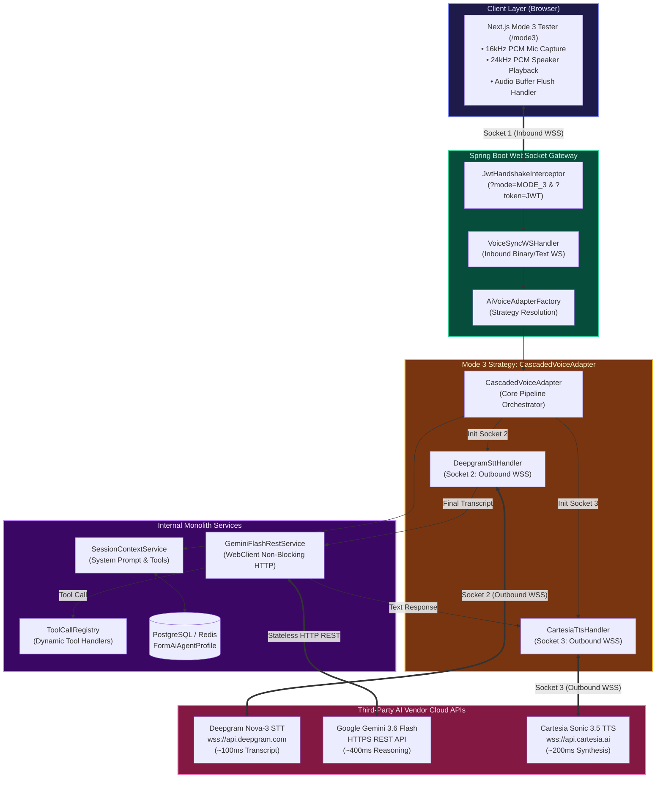

# Mode 3 Cascaded Voice Architecture — Dark Mode & Theme-Adaptive Master Guide

## 1. Overview & Architecture Strategy

**Mode 3 (Cascaded Voice Pipeline)** implements a 3-stage, multi-vendor voice streaming architecture:
1. **Speech-to-Text (STT)**: Deepgram Nova-3 over outbound WebSocket (`wss://api.deepgram.com`) (~100ms transcript latency + real-time VAD speech start detection for barge-in).
2. **LLM Reasoning**: Google Gemini 3.6 Flash over non-blocking HTTP REST (`GeminiFlashRestService.java`) (~350ms reasoning latency + 18 function calling tool declarations).
3. **Text-to-Speech (TTS)**: Cartesia Sonic 3.5 over outbound WebSocket (`wss://api.cartesia.ai`) (~150ms 24kHz PCM audio synthesis).

---

## 2. Master System Component Architecture Diagram (Dark/Light Adaptive)

---

## 3. Ultra-Detailed Sequence Diagram (Dark Mode Native Contrast)

```mermaid
sequenceDiagram
    autonumber
    actor Client as Next.js Browser (/mode3)
    participant Jwt as JwtHandshakeInterceptor
    participant WS as VoiceSyncWSHandler
    participant Factory as AiVoiceAdapterFactory
    participant Adapter as CascadedVoiceAdapter
    participant SessionCtx as SessionContextService
    participant DG_Handler as DeepgramSttHandler (Socket 2)
    participant DG_API as Deepgram Nova-3 WSS
    participant GeminiService as GeminiFlashRestService
    participant GeminiAPI as Gemini 3.6 Flash REST
    participant Registry as ToolCallRegistry
    participant ToolHandler as ModifyFormLayoutToolHandler
    participant TTS_Handler as CartesiaTtsHandler (Socket 3)
    participant TTS_API as Cartesia Sonic 3.5 WSS

    %% 1. Handshake & Initialization (Dark Indigo)
    rect rgb(30, 27, 75)
        Note over Client, TTS_API: 1. Handshake, Auth & Strategy Resolution
        Client->>Jwt: HTTP Upgrade GET /ws/voice-sync?mode=MODE_3&token=JWT
        Jwt->>Jwt: beforeHandshake(): Authenticate token, extract role, mode & formId
        Jwt-->>WS: Handshake Approved
        WS->>WS: afterConnectionEstablished(session)
        WS->>Factory: getAdapter(VoiceMode.MODE_3)
        Factory-->>WS: Return CascadedVoiceAdapter bean
        WS->>Adapter: startSession(userId, safeSession)
        Adapter->>SessionCtx: compileSystemInstruction(role, profile, null)
        SessionCtx-->>Adapter: Return systemPrompt
        Adapter->>SessionCtx: buildToolDeclarations(role, true, true)
        SessionCtx-->>Adapter: Return 18 function declarations
        Adapter->>Adapter: connectDeepgramStt(userId, clientSession)
        Adapter->>DG_API: execute(new DeepgramSttHandler(), headers, deepgramWssUrl)
        DG_API-->>DG_Handler: afterConnectionEstablished(session)
        DG_Handler->>DG_Handler: Start keep-alive timer (silent PCM every 5s)
        Adapter->>Adapter: connectCartesiaTts(userId, clientSession)
        Adapter->>TTS_API: execute(new CartesiaTtsHandler(), headers, cartesiaWssUrl)
        TTS_API-->>TTS_Handler: afterConnectionEstablished(session)
    end

    %% 2. Audio Streaming & Speech-to-Text (Dark Amber)
    rect rgb(120, 53, 15)
        Note over Client, DG_API: 2. Audio Capture & Speech-to-Text (STT)
        Client->>Client: startMicrophone(): AudioWorklet captures 16kHz PCM
        Client->>WS: Send BinaryMessage(pcmAudioBytes)
        WS->>WS: handleBinaryMessage(session, message)
        WS->>Adapter: sendClientAudio(clientSession, audioBytes)
        Adapter->>DG_API: deepgramSession.sendMessage(new BinaryMessage(audioBytes))
        DG_API-->>DG_Handler: handleTextMessage(session, message)
        DG_Handler->>DG_Handler: Parse JSON root.path("is_final").asBoolean()
        DG_Handler->>Adapter: onFinalTranscript(userId, clientSession, "Can you add a new customer review block?")
        Adapter->>Client: sendMessage(new TextMessage("TRANSCRIPT_USER"))
    end

    %% 3. Gemini 3.6 Flash Reasoning & Tool Call (Dark Emerald)
    rect rgb(6, 78, 59)
        Note over Adapter, ToolHandler: 3. Gemini 3.6 Flash Reasoning & Tool Execution
        Adapter->>GeminiService: callGemini(systemPrompt, transcript, tools)
        GeminiService->>GeminiService: Build HTTP Body (systemInstruction, contents, tools)
        GeminiService->>GeminiAPI: POST /v1beta/models/gemini-3.6-flash:generateContent
        GeminiAPI-->>GeminiService: Return HTTP 200 JSON (candidates[0].content.parts)
        GeminiService-->>Adapter: processGeminiRestResponse(userId, clientSession, responseJson)
        
        alt Part 1: Function Call Execution
            Adapter->>Adapter: Detect part.has("functionCall") -> name: "modifyFormLayout"
            Adapter->>Registry: executeTool(clientSession, functionCall, callId, "modifyFormLayout")
            Registry->>ToolHandler: execute(clientSession, args, callId)
            ToolHandler->>ToolHandler: Update PostgreSQL form layout
            ToolHandler->>Client: sendMessage(new TextMessage("FORM_LAYOUT_MODIFIED"))
        end

        alt Part 2: AI Text Response Generation
            Adapter->>Adapter: Detect part.has("text") -> "I have added a customer review block."
            Adapter->>Client: sendMessage(new TextMessage("TRANSCRIPT_AI"))
            Adapter->>Adapter: sendTextToCartesia(clientSession, "I have added a customer review block.")
        end
    end

    %% 4. TTS Audio Synthesis & Playback (Dark Pink)
    rect rgb(131, 24, 67)
        Note over Adapter, Client: 4. Text-to-Speech (TTS) Synthesis & Speaker Playback
        Adapter->>TTS_API: cartesiaSession.sendMessage(new TextMessage(cartesiaFrameJSON))
        TTS_API-->>TTS_Handler: handleTextMessage(session, message)
        TTS_Handler->>TTS_Handler: Parse JSON: type=="chunk", extract base64 "data"
        TTS_Handler->>TTS_Handler: Base64.getDecoder().decode(base64Audio) -> byte[] rawPcm
        TTS_Handler->>Client: safeClientSession.sendMessage(new BinaryMessage(rawPcm))
        Client->>Client: playPcm16Chunk(arrayBuffer): Web Audio API plays 24kHz PCM!
        TTS_API-->>TTS_Handler: handleTextMessage(session, message) -> type=="done"
        TTS_Handler->>Adapter: clientSession.getAttributes().put("isAiSpeaking", false)
    end

    %% 5. Barge-in Interruption (Dark Rose)
    rect rgb(153, 27, 27)
        Note over Client, TTS_API: 5. Barge-in Interruption Handling
        Client->>DG_API: Candidate interrupts while AI is speaking
        DG_API-->>DG_Handler: handleTextMessage(session, message) -> speech_started: true
        DG_Handler->>Adapter: triggerBargeIn(clientSession)
        Adapter->>TTS_API: Send cancel frame {"context_id": "c123", "cancel": true}
        Adapter->>Client: sendMessage(new TextMessage("FLUSH_AUDIO_BUFFER"))
        Client->>Client: stopAllAudioPlayback(): Stop active sources & clear queue!
    end
```

---

## 4. All User Questions & Technical QA Record

### Q1: "so there will be 3 sockets per user?"
**Answer:** Yes (1 Inbound Client WSS, 1 Outbound Deepgram STT WSS, 1 Outbound Cartesia TTS WSS).

### Q2: "are the 2 apis free for testing?"
**Answer:** Yes (Deepgram $200 free trial, Cartesia $5 free trial).

### Q3: "i see deepgram have both tts and stt, why we need cartesia, is it better or cheaper?"
**Answer:** Deepgram Nova-3 is specialized for STT (~100ms), Cartesia Sonic 3.5 is specialized for high-quality TTS (~150ms).

### Q4: "stop using gemini 2.0, its gone, use gemini flash 3.6 - make a strategy for this model gemini-3.6-flash not gemini 2 or 2.5"
**Answer:** Created [`Gemini36FlashModelStrategy.java`](file:///Users/apple/Coding-projects/reForm-Web-App/backend/src/main/java/com/reForm/backend/ai/strategy/Gemini36FlashModelStrategy.java).

### Q5: "i cannot hear the ai speaking back, tell me why, is it because i have no money for cartesia?"
**Answer:** Cartesia sends Base64 audio inside JSON text frames (`type: "chunk"`). `CascadedVoiceAdapter` was missing Base64 decoding in `CartesiaTtsHandler.handleTextMessage`. Added Base64 decoding & `BinaryMessage(rawPcm)` forwarding.

### Q6: "it is now 2026, go search for cartesia model_id"
**Answer:** Updated Cartesia model ID to `"sonic-3.5"`.

### Q7: "i tested and there is nothing wrong with mode 4, look at mode 4 and find the errors for mode 3"
**Answer:** Mode 4 decoded `inlineData.data` Base64 to `BinaryMessage(rawPcm)`. Applied identical decoding to Mode 3.

---

## 5. Key Files Created & Modified

| File Path | Description |
| :--- | :--- |
| [`CascadedVoiceAdapter.java`](file:///Users/apple/Coding-projects/reForm-Web-App/backend/src/main/java/com/reForm/backend/ai/service/CascadedVoiceAdapter.java) | Mode 3 3-stage orchestrator, twin outbound WebSockets, silent keep-alive frames, auto-reconnect, and Base64 PCM audio chunk forwarding. |
| [`GeminiFlashRestService.java`](file:///Users/apple/Coding-projects/reForm-Web-App/backend/src/main/java/com/reForm/backend/ai/service/GeminiFlashRestService.java) | Stateless HTTP REST service invoking `gemini-3.6-flash:generateContent`. |
| [`Gemini36FlashModelStrategy.java`](file:///Users/apple/Coding-projects/reForm-Web-App/backend/src/main/java/com/reForm/backend/ai/strategy/Gemini36FlashModelStrategy.java) | Model strategy bean registering `GEMINI_3_6_FLASH`. |
| [`WebClientConfig.java`](file:///Users/apple/Coding-projects/reForm-Web-App/backend/src/main/java/com/reForm/backend/core/config/WebClientConfig.java) | Configures Spring WebClient with 10MB memory buffer. |
| [`frontend/src/app/mode3/page.tsx`](file:///Users/apple/Coding-projects/reForm-Web-App/frontend/src/app/mode3/page.tsx) | Mode 3 frontend tester UI with Web Audio API 24kHz PCM playback & mic streaming. |
