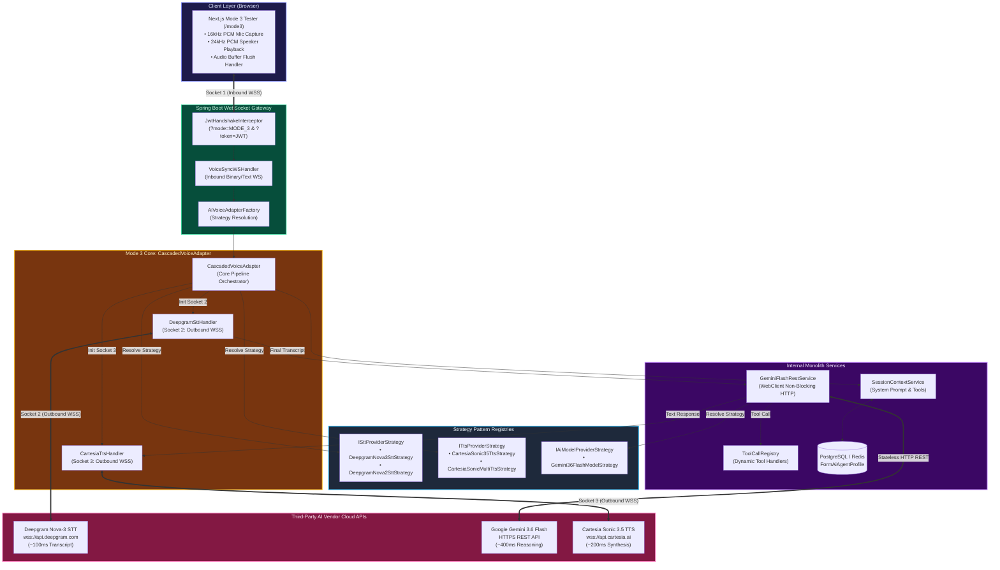

# Mode 3 Cascaded Voice Architecture — Complete Master Guide & Architectural QA Record

## 1. Overview & Architecture Strategy

**Mode 3 (Cascaded Voice Pipeline)** implements a 3-stage, multi-vendor voice streaming architecture:
1. **Speech-to-Text (STT Strategy)**: `ISttProviderStrategy` (`DeepgramNova3SttStrategy`) over outbound WebSocket (`wss://api.deepgram.com`) (~100ms transcript latency + real-time VAD speech start detection for barge-in).
2. **LLM Reasoning**: Google Gemini 3.6 Flash over non-blocking HTTP REST (`GeminiFlashRestService.java`) (~350ms reasoning latency + 18 function calling tool declarations).
3. **Text-to-Speech (TTS Strategy)**: `ITtsProviderStrategy` (`CartesiaSonic35TtsStrategy`) over outbound WebSocket (`wss://api.cartesia.ai`) (~150ms 24kHz PCM audio synthesis).

---

## 2. Master System Component Architecture Diagram (Strategy Pattern & Dark Mode Native)

---

## 3. Ultra-Detailed Sequence Diagram (Dark Mode Native)

```mermaid
sequenceDiagram
    autonumber
    actor Client as Next.js Browser (/mode3)
    participant Jwt as JwtHandshakeInterceptor
    participant WS as VoiceSyncWSHandler
    participant Factory as AiVoiceAdapterFactory
    participant Adapter as CascadedVoiceAdapter
    participant SessionCtx as SessionContextService
    participant SttStrat as ISttProviderStrategy (Nova3)
    participant TtsStrat as ITtsProviderStrategy (Sonic35)
    participant DG_Handler as DeepgramSttHandler (Socket 2)
    participant DG_API as Deepgram Nova-3 WSS
    participant GeminiService as GeminiFlashRestService
    participant GeminiAPI as Gemini 3.6 Flash REST
    participant Registry as ToolCallRegistry
    participant ToolHandler as ModifyFormLayoutToolHandler
    participant TTS_Handler as CartesiaTtsHandler (Socket 3)
    participant TTS_API as Cartesia Sonic 3.5 WSS

    %% 1. Handshake & Initialization (Dark Indigo)
    rect rgb(30, 27, 75)
        Note over Client, TTS_API: 1. Handshake, Auth & Strategy Resolution
        Client->>Jwt: HTTP Upgrade GET /ws/voice-sync?mode=MODE_3&token=JWT
        Jwt->>Jwt: beforeHandshake(): Authenticate token, extract role, mode & formId
        Jwt-->>WS: Handshake Approved
        WS->>WS: afterConnectionEstablished(session)
        WS->>Factory: getAdapter(VoiceMode.MODE_3)
        Factory-->>WS: Return CascadedVoiceAdapter bean
        WS->>Adapter: startSession(userId, safeSession)
        Adapter->>SessionCtx: compileSystemInstruction(role, profile, null)
        SessionCtx-->>Adapter: Return systemPrompt
        Adapter->>SessionCtx: buildToolDeclarations(role, true, true)
        SessionCtx-->>Adapter: Return 18 function declarations
        Adapter->>SttStrat: buildWebSocketUrl(apiKey, options)
        SttStrat-->>Adapter: Return wss://api.deepgram.com URL
        Adapter->>Adapter: connectDeepgramStt(userId, clientSession)
        Adapter->>DG_API: execute(new DeepgramSttHandler(), headers, deepgramWssUrl)
        DG_API-->>DG_Handler: afterConnectionEstablished(session)
        DG_Handler->>DG_Handler: Start keep-alive timer (silent PCM every 5s)
        Adapter->>TtsStrat: buildWebSocketUrl(apiKey)
        TtsStrat-->>Adapter: Return wss://api.cartesia.ai URL
        Adapter->>Adapter: connectCartesiaTts(userId, clientSession)
        Adapter->>TTS_API: execute(new CartesiaTtsHandler(), headers, cartesiaWssUrl)
        TTS_API-->>TTS_Handler: afterConnectionEstablished(session)
    end

    %% 2. Audio Streaming & Speech-to-Text (Dark Amber)
    rect rgb(120, 53, 15)
        Note over Client, DG_API: 2. Audio Capture & Speech-to-Text (STT)
        Client->>Client: startMicrophone(): AudioWorklet captures 16kHz PCM
        Client->>WS: Send BinaryMessage(pcmAudioBytes)
        WS->>WS: handleBinaryMessage(session, message)
        WS->>Adapter: sendClientAudio(clientSession, audioBytes)
        Adapter->>DG_API: deepgramSession.sendMessage(new BinaryMessage(audioBytes))
        DG_API-->>DG_Handler: handleTextMessage(session, message)
        DG_Handler->>DG_Handler: evaluateBargeIn(root) & extractFinalTranscript(root)
        DG_Handler->>Adapter: onFinalTranscript(userId, clientSession, "Can you add a new customer review block?")
        Adapter->>Client: sendMessage(new TextMessage("TRANSCRIPT_USER"))
    end

    %% 3. Gemini 3.6 Flash Reasoning & Tool Call (Dark Emerald)
    rect rgb(6, 78, 59)
        Note over Adapter, ToolHandler: 3. Gemini 3.6 Flash Reasoning & Tool Execution
        Adapter->>GeminiService: callGemini(systemPrompt, transcript, tools)
        GeminiService->>GeminiService: Build HTTP Body (systemInstruction, contents, tools)
        GeminiService->>GeminiAPI: POST /v1beta/models/gemini-3.6-flash:generateContent
        GeminiAPI-->>GeminiService: Return HTTP 200 JSON (candidates[0].content.parts)
        GeminiService-->>Adapter: processGeminiRestResponse(userId, clientSession, responseJson)
        
        alt Part 1: Function Call Execution
            Adapter->>Adapter: Detect part.has("functionCall") -> name: "modifyFormLayout"
            Adapter->>Registry: executeTool(clientSession, functionCall, callId, "modifyFormLayout")
            Registry->>ToolHandler: execute(clientSession, args, callId)
            ToolHandler->>ToolHandler: Update PostgreSQL form layout
            ToolHandler->>Client: sendMessage(new TextMessage("FORM_LAYOUT_MODIFIED"))
        end

        alt Part 2: AI Text Response Generation
            Adapter->>Adapter: Detect part.has("text") -> "I have added a customer review block."
            Adapter->>Client: sendMessage(new TextMessage("TRANSCRIPT_AI"))
            Adapter->>Adapter: sendTextToCartesia(clientSession, "I have added a customer review block.")
        end
    end

    %% 4. TTS Audio Synthesis & Playback (Dark Pink)
    rect rgb(131, 24, 67)
        Note over Adapter, Client: 4. Text-to-Speech (TTS) Synthesis & Speaker Playback
        Adapter->>TtsStrat: buildSynthesisPayload(objectMapper, text, voiceId, contextId)
        TtsStrat-->>Adapter: Return JSON frame string
        Adapter->>TTS_API: cartesiaSession.sendMessage(new TextMessage(cartesiaFrameJSON))
        TTS_API-->>TTS_Handler: handleTextMessage(session, message)
        TTS_Handler->>TTS_Handler: handleAudioChunkFrame(root): Base64 decode -> byte[] rawPcm
        TTS_Handler->>Client: safeClientSession.sendMessage(new BinaryMessage(rawPcm))
        Client->>Client: playPcm16Chunk(arrayBuffer): Web Audio API plays 24kHz PCM!
        TTS_API-->>TTS_Handler: handleTextMessage(session, message) -> type=="done"
        TTS_Handler->>Adapter: clientSession.getAttributes().put("isAiSpeaking", false)
    end

    %% 5. Barge-in Interruption (Dark Rose)
    rect rgb(153, 27, 27)
        Note over Client, TTS_API: 5. Barge-in Interruption Handling
        Client->>DG_API: Candidate interrupts while AI is speaking
        DG_API-->>DG_Handler: evaluateBargeIn() -> speech_started: true
        DG_Handler->>Adapter: triggerBargeIn(clientSession)
        Adapter->>TtsStrat: buildCancelPayload(objectMapper, contextId)
        TtsStrat-->>Adapter: Return cancel JSON string
        Adapter->>TTS_API: Send cancel frame {"context_id": "c123", "cancel": true}
        Adapter->>Client: sendClientFlushSignal(): Send INTERRUPTED & FLUSH_AUDIO_BUFFER
        Client->>Client: stopAllAudioPlayback(): Stop active sources & clear queue!
    end
```

---

## 4. All User Questions & Technical QA Record

### Q1: "so there will be 3 sockets per user?"
**Answer:** Yes (1 Inbound Client WSS, 1 Outbound Deepgram STT WSS, 1 Outbound Cartesia TTS WSS).

### Q2: "are the 2 apis free for testing?"
**Answer:** Yes (Deepgram $200 free trial, Cartesia $5 free trial).

### Q3: "i see deepgram have both tts and stt, why we need cartesia, is it better or cheaper?"
**Answer:** Deepgram Nova-3 is specialized for STT (~100ms), Cartesia Sonic 3.5 is specialized for high-quality TTS (~150ms).

### Q4: "stop using gemini 2.0, its gone, use gemini flash 3.6 - make a strategy for this model gemini-3.6-flash not gemini 2 or 2.5"
**Answer:** Created [`Gemini36FlashModelStrategy.java`](file:///Users/apple/Coding-projects/reForm-Web-App/backend/src/main/java/com/reForm/backend/ai/strategy/Gemini36FlashModelStrategy.java).

### Q5: "i cannot hear the ai speaking back, tell me why, is it because i have no money for cartesia?"
**Answer:** Cartesia sends Base64 audio inside JSON text frames (`type: "chunk"`). `CascadedVoiceAdapter` was missing Base64 decoding in `CartesiaTtsHandler.handleTextMessage`. Added Base64 decoding & `BinaryMessage(rawPcm)` forwarding.

### Q6: "it is now 2026, go search for cartesia model_id"
**Answer:** Updated Cartesia model ID to `"sonic-3.5"`.

### Q7: "i tested and there is nothing wrong with mode 4, look at mode 4 and find the errors for mode 3"
**Answer:** Mode 4 decoded `inlineData.data` Base64 to `BinaryMessage(rawPcm)`. Applied identical decoding to Mode 3.

---

## 5. Key Files Created & Modified

| File Path | Description |
| :--- | :--- |
| [`ISttProviderStrategy.java`](file:///Users/apple/Coding-projects/reForm-Web-App/backend/src/main/java/com/reForm/backend/ai/strategy/stt/ISttProviderStrategy.java) | Strategy interface for STT model variations (`DEEPGRAM_NOVA_3`, `DEEPGRAM_NOVA_2`). |
| [`ITtsProviderStrategy.java`](file:///Users/apple/Coding-projects/reForm-Web-App/backend/src/main/java/com/reForm/backend/ai/strategy/tts/ITtsProviderStrategy.java) | Strategy interface for TTS model variations (`CARTESIA_SONIC_3_5`, `CARTESIA_SONIC_MULTILINGUAL`). |
| [`CascadedVoiceAdapter.java`](file:///Users/apple/Coding-projects/reForm-Web-App/backend/src/main/java/com/reForm/backend/ai/service/CascadedVoiceAdapter.java) | Mode 3 3-stage orchestrator refactored with STT/TTS strategies, SRP method decomposition, and `@PreDestroy` thread pool cleanup. |
| [`GeminiFlashRestService.java`](file:///Users/apple/Coding-projects/reForm-Web-App/backend/src/main/java/com/reForm/backend/ai/service/GeminiFlashRestService.java) | Stateless HTTP REST service dynamically invoking model strategy IDs. |
| [`application.yml`](file:///Users/apple/Coding-projects/reForm-Web-App/backend/src/main/resources/application.yml) | Centralized voice configuration properties for STT and TTS defaults. |

---

## 6. Strategy Pattern Architectural Mastery & Educational QA

### Q: "Tell me when do I use Strategy Pattern?"
**Answer:** Use the Strategy Pattern when you have **multiple ways to perform the exact same task** (e.g. transcribing audio, synthesizing speech, formatting LLM requests, calculating tax) and you want to **select or swap between these behaviors at runtime** (via configuration, database profile, or API parameters) without modifying client code.

---

### Q: "What problems lead to the need of this pattern?"

1. **The Giant `if-else` or `switch` Anti-Pattern**: Without Strategy, adding a new model or vendor forces you to add another branch to a growing wall of conditionals. This violates the **Open/Closed Principle (OCP)**.
2. **Coupling Core Logic to Third-Party Vendor Details**: Embedding Deepgram query strings or Cartesia JSON frame constructions directly inside `CascadedVoiceAdapter` ties your pipeline code to external API changes.
3. **Inability to Swap Models at Runtime**: Hardcoding `nova-3` or `sonic-3.5` inside methods prevents switching models dynamically per customer or form.

---

### Q: "What questions to ask to know when to use it?"

Ask yourself these **4 diagnostic questions**:
1. *"Do I have multiple algorithms/implementations that achieve the same operational goal?"*
2. *"Should the specific implementation be chosen at runtime based on context or config?"*
3. *"Am I writing a switch or if-else statement to select between variations?"*
4. *"Will new variations or vendor models be added in the future?"*

👉 If you answer **YES** to 2 or more of these questions, apply the **Strategy Pattern**!

---

### Q: "Are there other patterns that are similar but easy to misunderstand and confuse with Strategy?"

| Pattern | Primary Focus | Key Difference vs Strategy |
| :--- | :--- | :--- |
| **Strategy Pattern** | **"HOW to do a behavior/algorithm"** | Swaps *algorithms* sharing an identical interface at runtime (`DeepgramNova3SttStrategy` vs `WhisperSttStrategy`). |
| **Factory Pattern** | **"CREATING objects"** | Focuses on *instantiating* the object, not *executing the algorithm* (`AiVoiceAdapterFactory.getAdapter(mode)`). |
| **State Pattern** | **"WHAT STATE an object is in"** | Structurally identical to Strategy, but the *state object transitions itself automatically* as workflow progresses (`Draft` $\rightarrow$ `Published`). Strategy is picked explicitly by the caller. |
| **Template Method** | **"ALGORITHM SKELETON"** | Uses *Inheritance (`abstract class`)* instead of Interfaces / Composition. |
| **Adapter Pattern** | **"INTERFACE CONVERSION"** | Converts an incompatible 3rd-party interface so it can collaborate with your code. |
