# 11: Platform Mermaid Architecture Diagram

**Author**: Lead Technical Writer & Architect  
**Platform**: reForm Enterprise Form Builder & Conversational AI Platform (`com.reForm.backend.ai`)  
**Target Document**: `backend/knowledge/pth/week4/11_platform_mermaid_architecture_diagram.md`  
**Date**: 2026-08-13  
**Version**: 2.0.0-RELEASE  

---

## 3. Platform Mermaid Architecture Diagram

The following architecture diagram illustrates the end-to-end event flows, WebSocket twin-sockets, ToolCallRegistry routing, storage systems, and sub-agent workers across all 5 pipelines:

```mermaid
graph TD
    subgraph INGRESS [Client Ingress and Network Layer]
        Browser_UI["React Web Client / Voice UI"]
        HTTP_Api["Spring REST Controllers"]
        WS_Endpoint["/ws/v1/voice Handshake Interceptor"]
        JWT_Interceptor["JwtHandshakeInterceptor"]
    end

    subgraph LIFECYCLE [Pipeline 5: Session Lifecycle Pipeline]
        SessionStateAgent["SessionStateAgent - Redis Snapshot"]
        SecurityAuditAgent["SecurityAuditAgent - OpenSearch Audit"]
        GuardrailAgent["GuardrailAgent - pgvector Sub-2ms Safety"]
        MemoryGoalAgent["MemoryGoalAgent - Redis Goal Tracking"]
        RagSearchAgent["RagSearchAgent - Hybrid RAG Engine"]
        FormAiProfile["FormAiAgentProfile JPA Entity"]
        Tool_EndSession["EndSessionToolHandler"]
        Tool_SearchDoc["SearchUserDocumentToolHandler"]
        Tool_RenderUI["RenderDynamicUIToolHandler"]
        Tool_Notification["SendNotificationToolHandler"]
    end

    subgraph SOCKET_TWIN [Twin-Socket Real-Time Streaming Architecture]
        Socket1["Socket 1: Inbound Browser to/from Server (VoiceSyncWSHandler)"]
        Socket2["Socket 2: Outbound Server to/from Gemini Live WSS (GeminiLiveVoiceAdapter)"]
    end

    subgraph TOOL_ROUTER [Tool Execution Subsystem]
        Registry["ToolCallRegistry O(1) Map Router"]
        IToolPort["IToolCallHandler Strategy Interface"]
    end

    subgraph BUILDER_PIPE [Pipeline 1: Form Builder Pipeline]
        LayoutAgent["LayoutAgent @Async"]
        SchemaAgent["SchemaAgent - Jackson Validator"]
        ThemeAgent["ThemeAgent - Tailwind Synthesizer"]
        TranslationAgent["TranslationAgent - Redis Localizer"]
        VersioningAgent["FormVersioningAgent - RFC 6902 Diff"]
        Tool_ConfigurePersona["ConfigureFillerPersonaToolHandler"]
        Tool_ModifyLayout["ModifyFormLayoutToolHandler"]
        Tool_Publish["PublishFormToolHandler"]
        Tool_GenDoc["GenerateContentFromDocToolHandler"]
    end

    subgraph FILLER_PIPE [Pipeline 2: Form Filler Pipeline]
        AdaptiveBranching["AdaptiveBranchingAgent - SpEL DAG"]
        VoiceSpeech["VoiceSpeechAgent - Netty VAD"]
        ValidationAgent["ValidationAgent - CircuitBreaker"]
        ScoringSub["ScoringSubAgent Worker"]
        Tool_Evaluate["EvaluateResponseToolHandler"]
        Tool_Flag["FlagForHumanReviewToolHandler"]
        Tool_LookupProgress["LookupFormProgressToolHandler"]
        Tool_SaveResponse["SaveFieldResponseToolHandler"]
        Tool_Skip["SkipQuestionToolHandler"]
    end

    subgraph MEDIA_PIPE [Pipeline 3: File and Media Processing Pipeline]
        MalwareScan["MalwareScanAgent - ClamAV / Tika"]
        DocOcr["DocumentOcrSubAgent Worker"]
        AudioTranscription["AudioTranscriptionSubAgent - STT Worker"]
        ChunkEmbed["DocumentChunkingEmbeddingAgent - pgvector"]
        Tool_AnalyzeFile["AnalyzeUploadedFileToolHandler"]
        Tool_ExtractData["ExtractStructuredDataToolHandler"]
        Tool_RequestUpload["RequestFileUploadToolHandler"]
        Tool_SaveAudio["SaveAudioRecordingToolHandler"]
        Tool_SaveTranscript["SaveSessionTranscriptToolHandler"]
    end

    subgraph BACK_PIPE [Pipeline 4: Background Async Pipeline]
        SubFactory["SubAgentFactory Worker Spawner"]
        VirtualThreads["Java VirtualThread Executor Pool"]
        AnalyticsAgent["AnalyticsAggregationAgent Rollups"]
        TokenMetering["TokenMeteringAgent - Redis Lua"]
        ArchivalAgent["ArchivalAgent - S3 Glacier Batch"]
        CodeAnalysis["CodeAnalysisSubAgent Sandbox"]
        EvaluationAgent["EvaluationAgent @Async Report"]
        BillingAgent["BillingAgent VAD Meter"]
    end

    subgraph STORAGE [Data Persistence and State Layer]
        PostgreSQL[("PostgreSQL 16 DB: JSONB Form Blocks, Submissions & Audits, pgvector HNSW Embeddings")]
        RedisCluster[("Redis 7.2 Cluster: Session Hashes, Goal Checklist State, Metering Lua Scripts")]
        S3Storage[("AWS S3 / Glacier: Compressed Audio PCM, User Uploaded Media, Cold Archives")]
    end

    %% Ingress Connections
    Browser_UI -->|HTTP POST| HTTP_Api
    Browser_UI -->|WSS Connection| WS_Endpoint
    WS_Endpoint --> JWT_Interceptor
    JWT_Interceptor -->|Validate JWT| SessionStateAgent
    JWT_Interceptor -->|Register Session| RedisCluster
    JWT_Interceptor -->|Audit Log| SecurityAuditAgent
    JWT_Interceptor -->|Load Profile| FormAiProfile

    %% Twin Socket Initialization
    WS_Endpoint --> Socket1
    Socket1 <-->|Bi-directional Audio PCM| VoiceSpeech
    VoiceSpeech --> GuardrailAgent
    GuardrailAgent -->|Safe Stream| Socket2
    VoiceSpeech --> BillingAgent
    BillingAgent --> RedisCluster

    %% Gemini Live API Interactions
    Socket2 <-->|Mode 4 Bidi Websocket| Gemini_Live["Google Gemini 3.1 Live API"]
    Gemini_Live -->|toolCall Frame| Socket2
    Socket2 --> Registry

    %% Tool Routing
    Registry --> IToolPort
    IToolPort --> Tool_ModifyLayout
    IToolPort --> Tool_ConfigurePersona
    IToolPort --> Tool_Publish
    IToolPort --> Tool_GenDoc
    IToolPort --> Tool_Evaluate
    IToolPort --> Tool_Flag
    IToolPort --> Tool_LookupProgress
    IToolPort --> Tool_SaveResponse
    IToolPort --> Tool_Skip
    IToolPort --> Tool_AnalyzeFile
    IToolPort --> Tool_ExtractData
    IToolPort --> Tool_RequestUpload
    IToolPort --> Tool_SaveAudio
    IToolPort --> Tool_SaveTranscript
    IToolPort --> Tool_EndSession
    IToolPort --> Tool_SearchDoc
    IToolPort --> Tool_RenderUI
    IToolPort --> Tool_Notification

    %% Pipeline Events and Agent Connections
    Tool_ModifyLayout -->|FormLayoutModificationEvent| LayoutAgent
    Tool_ModifyLayout -->|FormThemeGenerationEvent| ThemeAgent
    Tool_ModifyLayout -->|FormTranslationEvent| TranslationAgent
    TranslationAgent --> RedisCluster
    LayoutAgent --> SchemaAgent
    SchemaAgent --> VersioningAgent
    VersioningAgent --> PostgreSQL

    Tool_SaveResponse --> ValidationAgent
    ValidationAgent --> AdaptiveBranching
    AdaptiveBranching --> MemoryGoalAgent

    Tool_RequestUpload --> MalwareScan
    MalwareScan --> DocOcr
    DocOcr --> ChunkEmbed
    ChunkEmbed --> PostgreSQL

    Tool_SaveAudio --> AudioTranscription
    AudioTranscription --> PostgreSQL

    Socket1 -->|Session Disconnect| Tool_EndSession
    Tool_EndSession -->|VirtualThread Teardown| VirtualThreads
    VirtualThreads --> EvaluationAgent
    VirtualThreads --> AnalyticsAgent
    VirtualThreads --> TokenMetering
    VirtualThreads --> SubFactory
    SubFactory --> ScoringSub
    SubFactory --> CodeAnalysis

    %% Storage Binding
    GuardrailAgent <-->|Vector Cosine Check| PostgreSQL
    RagSearchAgent <-->|HNSW Semantic Search| PostgreSQL
    MemoryGoalAgent <-->|Hash State| RedisCluster
    TokenMetering <-->|Atomic Metering| RedisCluster
    ArchivalAgent --> S3Storage
    Tool_SaveAudio --> S3Storage
```

