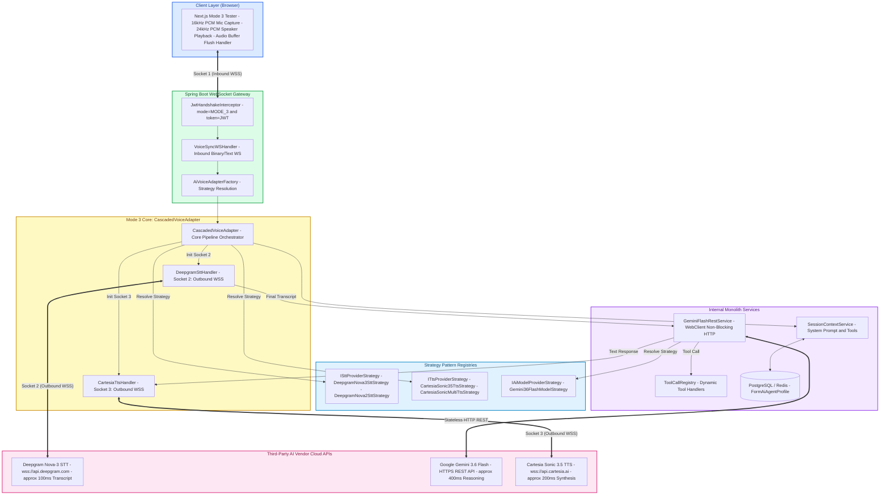
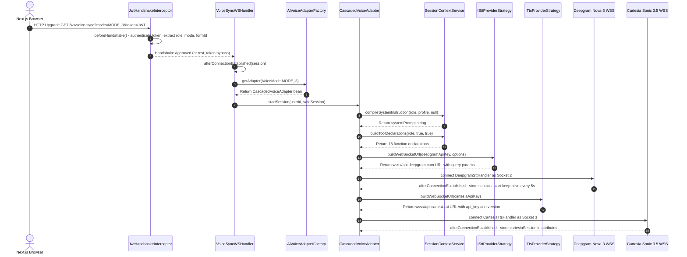
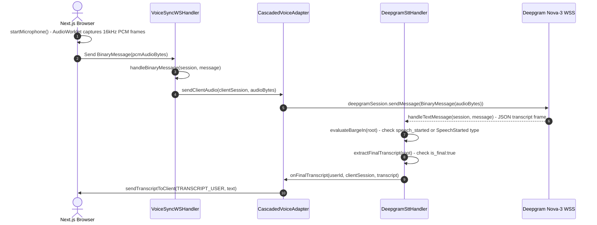
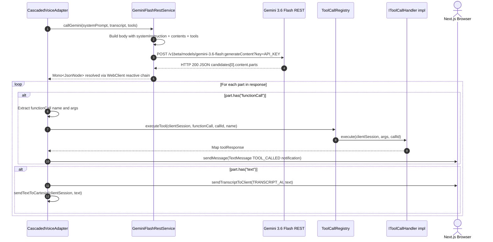
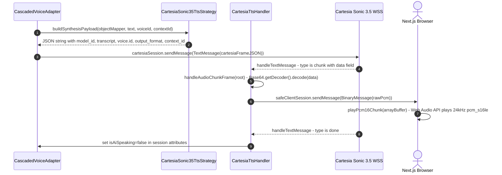
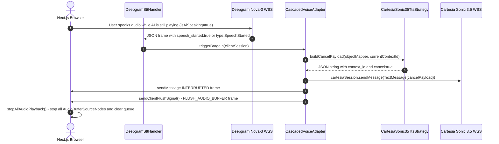

# Mode 3 Cascaded Voice Architecture — Complete Master Guide

**Version**: 2.0.0  
**Last Updated**: 2026-08-12  
**Mode**: MODE_3 (Cascaded 3-Stage Voice Pipeline)  
**Entry URL**: `GET /ws/v1/voice?mode=MODE_3&token=<JWT>&formId=<UUID>`  

---

## 1. What Is Mode 3?

Mode 3 is the **Cascaded Voice Pipeline** — a 3-stage, multi-vendor AI voice architecture where each stage is a separate service with its own outbound WebSocket or HTTP connection:

| Stage | Service | Transport | Latency |
|:---:|:---|:---|:---|
| 1 | Deepgram Nova-3 (STT) | Outbound WSS (Socket 2) | ~100ms |
| 2 | Google Gemini 3.6 Flash (LLM) | Non-blocking HTTP REST | ~350–400ms |
| 3 | Cartesia Sonic 3.5 (TTS) | Outbound WSS (Socket 3) | ~150–200ms |

**Each user session = 3 sockets total:**
- Socket 1: Inbound browser ↔ Spring Boot server (`VoiceSyncWSHandler`)
- Socket 2: Outbound Spring Boot → Deepgram STT WSS
- Socket 3: Outbound Spring Boot → Cartesia TTS WSS

**Why NOT Mode 4 (Gemini Live)?**  
Mode 4 sends raw audio directly to Gemini Live which handles STT + LLM + TTS internally. Mode 3 gives you **vendor flexibility** — you can swap Deepgram for Whisper, Cartesia for ElevenLabs, Gemini for Claude, all independently without touching the pipeline.

---

## 2. All New & Modified Files

### New Files Created for Mode 3

| File | Package | Purpose |
|:---|:---|:---|
| `CascadedVoiceAdapter.java` | `com.reForm.backend.ai.service` | Core Mode 3 orchestrator — manages all 3 sockets, barge-in, audio routing |
| `GeminiFlashRestService.java` | `com.reForm.backend.ai.service` | Non-blocking HTTP REST client for Gemini 3.6 Flash (used by Mode 2 and Mode 3) |
| `ISttProviderStrategy.java` | `com.reForm.backend.ai.strategy.stt` | Strategy interface for STT providers (buildWebSocketUrl, buildHeaders) |
| `DeepgramNova3SttStrategy.java` | `com.reForm.backend.ai.strategy.stt` | Concrete strategy: Nova-3 WSS URL + Authorization Token header |
| `DeepgramNova2SttStrategy.java` | `com.reForm.backend.ai.strategy.stt` | Concrete strategy: Nova-2-general WSS URL (fallback model) |
| `ITtsProviderStrategy.java` | `com.reForm.backend.ai.strategy.tts` | Strategy interface for TTS providers (buildWebSocketUrl, buildSynthesisPayload, buildCancelPayload) |
| `CartesiaSonic35TtsStrategy.java` | `com.reForm.backend.ai.strategy.tts` | Concrete strategy: Sonic 3.5, 24kHz PCM s16le, contextId-based barge-in cancel |
| `CartesiaSonicMultiTtsStrategy.java` | `com.reForm.backend.ai.strategy.tts` | Concrete strategy: sonic-multilingual model for multi-language forms |
| `Gemini36FlashModelStrategy.java` | `com.reForm.backend.ai.strategy` | Model strategy returning `"models/gemini-3.6-flash"` as model ID |

### Modified Files

| File | What Changed |
|:---|:---|
| `AiVoiceAdapterFactory.java` | Added `MODE_3 -> cascadedVoiceAdapter` case to the switch expression |
| `application.yml` | Added `deepgram.api.key`, `cartesia.api.key`, `voice.stt.*`, `voice.tts.*` config properties |
| `VoiceMode.java` | Verified MODE_3 enum value is present (was already there) |

---

## 3. Design Patterns & Decisions

### 3.1 Strategy Pattern — STT & TTS Vendor Swap

**Problem solved**: Before Strategy, every STT/TTS vendor would require `if (model == DEEPGRAM) { ... } else if (model == WHISPER) { ... }` inside `CascadedVoiceAdapter`. Every new vendor = a new if-else branch = OCP violation.

**Solution**: 
- `ISttProviderStrategy` interface with `buildWebSocketUrl()` and `buildHeaders()` 
- `ITtsProviderStrategy` interface with `buildWebSocketUrl()`, `buildSynthesisPayload()`, `buildCancelPayload()`
- Spring injects `List<ISttProviderStrategy>` — `CascadedVoiceAdapter` loops through them calling `supports(key)` to find the right one at runtime
- Zero changes to `CascadedVoiceAdapter` to add a new vendor

**Configuration-driven**: `application.yml` sets `voice.stt.default-strategy: DEEPGRAM_NOVA_3` and `voice.tts.default-strategy: CARTESIA_SONIC_3_5`. Per-session overrides coming later via `FormAiAgentProfile`.

---

### 3.2 Factory Pattern — Adapter Resolution

**Problem solved**: `VoiceSyncWSHandler` should not know whether the user is using Mode 3 or Mode 4.

**Solution**: `AiVoiceAdapterFactory` has a `switch` on `VoiceMode` and returns the correct `IAiVoiceAdapter` bean (`cascadedVoiceAdapter` vs `geminiLiveVoiceAdapter`). The handler just calls `factory.getAdapter(mode)`.

---

### 3.3 Inner Class Handler Pattern (Private Inner Classes)

`CascadedVoiceAdapter` contains two private inner classes:
- `DeepgramSttHandler extends AbstractWebSocketHandler` — handles Socket 2 lifecycle
- `CartesiaTtsHandler extends AbstractWebSocketHandler` — handles Socket 3 lifecycle

**Why inner classes?** They need access to `CascadedVoiceAdapter`'s fields (`objectMapper`, `toolCallRegistry`, user session references) without passing them around. They are instantiated fresh per user session — not Spring beans.

---

### 3.4 Barge-in Interruption Pattern

When Deepgram detects `speech_started: true` while AI is speaking:
1. `DeepgramSttHandler.evaluateBargeIn()` calls `triggerBargeIn(clientSession)`
2. `CascadedVoiceAdapter.triggerBargeIn()` calls `TtsStrategy.buildCancelPayload()` and sends cancel to Cartesia
3. Simultaneously pushes `INTERRUPTED` + `FLUSH_AUDIO_BUFFER` frames to browser
4. Browser stops all `AudioContext` sources and clears its audio queue

**Cartesia cancel mechanism**: Uses a `contextId` (UUID per turn). The cancel frame is `{"context_id": "...", "cancel": true}`. Cartesia immediately stops synthesis of that context.

---

### 3.5 Keep-Alive Scheduler — Preventing STT Timeout

Deepgram closes the WebSocket if it receives no audio for ~10 seconds. `CascadedVoiceAdapter` runs a `ScheduledExecutorService` that sends a 100ms silent PCM frame (`byte[3200]` of zeros) every 5 seconds when no real audio is active.

**Thread lifecycle**: `@PreDestroy` shuts down the keep-alive scheduler gracefully with a 3-second await.

---

### 3.6 Auto-Reconnect on Unexpected STT Close

If Deepgram closes with status code ≠ 1000 (normal), `DeepgramSttHandler.afterConnectionClosed()` checks if the client is still active and reconnects Socket 2 after a 500ms delay. This handles transient network blips without dropping the user's session.

---

### 3.7 SRP Method Decomposition

`CascadedVoiceAdapter` was refactored to extract every logical operation into named private methods:
- `startSession()` — orchestrates startup, no inline logic
- `connectDeepgramStt()` — only concerns STT socket setup
- `connectCartesiaTts()` — only concerns TTS socket setup
- `onFinalTranscript()` — dispatches to Gemini REST
- `processGeminiRestResponse()` — routes LLM output to text or tool call
- `sendTextToCartesia()` — handles TTS synthesis request
- `triggerBargeIn()` — handles interruption atomically
- `sendClientFlushSignal()` — browser audio flush notification
- `sendTranscriptToClient()` — sends TRANSCRIPT_USER/AI frames

---

## 4. Security — Is It Production Safe?

### ⚠️ Test Token Bypass Is Active

`JwtHandshakeInterceptor` has a **DEV BYPASS** block that must be removed before production:

```java
// [PRODUCTION_ALERT_REMOVE_BEFORE_PROD]
if ("test_token".equals(token) || "test".equals(token)) {
    attributes.put("userId", "test_user_id");
    attributes.put("role", Role.FORM_BUILDER);
    // ... bypasses all JWT validation
    return true;
}
```

**Currently**: connecting with `?token=test_token` or `?token=test` bypasses ALL JWT validation and gets `userId=test_user_id` with `FORM_BUILDER` role. This is what the frontend tester pages use during development.

**For production**: Remove or gate this block behind a Spring profile (`@Profile("dev")`).

---

### Real JWT Validation Path (Production)

When a real JWT token is passed:
1. `ITokenProvider.validateToken(token)` — verifies signature and expiry
2. `tokenProvider.extractUserId(token)` — pulls user UUID from claims
3. `tokenProvider.extractRole(token)` — pulls `FORM_BUILDER` or `FORM_FILLER` role
4. All extracted values are stored in `WebSocketSession.getAttributes()` — they travel with every message for the lifetime of the connection

---

### What Is Secured

| Gate | Mechanism |
|:---|:---|
| WebSocket handshake | JWT token in query string, validated before protocol upgrade |
| Role-based tool gating | `SessionContextService` strips builder tools for filler sessions |
| API keys | Read from env vars (`${DEEPGRAM_API_KEY}`, `${CARTESIA_API_KEY}`, `${GEMINI_API_KEY}`) — never hardcoded |
| Buffer overflow protection | All WebSocket sessions wrapped in `ConcurrentWebSocketSessionDecorator` (10MB limit, 10s timeout) |

### What Is NOT Yet Secured

| Gap | Status |
|:---|:---|
| Test token bypass | ⚠️ Still active — flagged with `[PRODUCTION_ALERT_REMOVE_BEFORE_PROD]` |
| Rate limiting per user on WS connections | Not yet implemented for WebSocket (REST layer has token bucket) |
| `GuardrailAgent` content moderation | Agent not yet built — transcripts go to Gemini unfiltered |

---

## 5. application.yml Config Reference

```yaml
gemini:
  api:
    key: ${GEMINI_API_KEY}          # Required for GeminiFlashRestService

deepgram:
  api:
    key: ${DEEPGRAM_API_KEY:DEFAULT_DEEPGRAM_KEY}   # Fallback for local dev

cartesia:
  api:
    key: ${CARTESIA_API_KEY:DEFAULT_CARTESIA_KEY}   # Fallback for local dev

voice:
  stt:
    default-strategy: DEEPGRAM_NOVA_3   # Strategy key used by CascadedVoiceAdapter
    sample-rate: 16000                  # 16kHz PCM from browser AudioWorklet
    channels: 1                         # Mono audio
    utterance-end-ms: 1000              # Deepgram utterance end silence threshold
  tts:
    default-strategy: CARTESIA_SONIC_3_5
    default-voice-id: a0e99841-438c-4a64-b679-ae501e7d6091  # Cartesia voice UUID
```

---

## 6. Audio Flow — Byte-Level Details

```
Browser AudioWorklet
  └── 16kHz, 16-bit, Mono PCM chunks (raw bytes, no container)
      └── BinaryMessage over Socket 1 (Inbound WSS)
          └── VoiceSyncWSHandler.handleBinaryMessage()
              └── CascadedVoiceAdapter.sendClientAudio()
                  └── BinaryMessage over Socket 2 (Outbound WSS → Deepgram)
                      └── DeepgramSttHandler.handleTextMessage()
                          └── JSON: {is_final: true, channel: {alternatives: [{transcript: "..."}]}}
                              └── onFinalTranscript() → GeminiFlashRestService.callGemini()
                                  └── HTTP POST → Gemini 3.6 Flash
                                      └── Response parts loop:
                                          ├── functionCall → ToolCallRegistry.executeTool()
                                          └── text → sendTextToCartesia()
                                              └── TextMessage (JSON frame) over Socket 3 → Cartesia
                                                  └── CartesiaTtsHandler.handleTextMessage()
                                                      └── type:"chunk" → Base64 decode → byte[] rawPcm
                                                          └── BinaryMessage over Socket 1 → Browser
                                                              └── Web Audio API plays 24kHz PCM
```

---

## 7. Master System Component Architecture Diagram

> Colors use a high-contrast palette compatible with both light and dark backgrounds.



---

## 8. Sequence Diagrams — One Per Stage

### Stage 1: Handshake, Auth & Strategy Resolution



---

### Stage 2: Audio Capture & Speech-to-Text (STT)



---

### Stage 3: Gemini 3.6 Flash Reasoning & Tool Execution



---

### Stage 4: Text-to-Speech Synthesis & Speaker Playback



---

### Stage 5: Barge-in Interruption Handling



---

## 9. Technical QA Record

### Q: "so there will be 3 sockets per user?"
**Answer:** Yes. Socket 1 (inbound: browser ↔ server), Socket 2 (outbound: server → Deepgram), Socket 3 (outbound: server → Cartesia). Connections are made at session start and live for the full session duration.

### Q: "are the 2 apis free for testing?"
**Answer:** Yes. Deepgram offers $200 free credit. Cartesia offers $5 free credit. Both are sufficient for months of local development testing.

### Q: "i see deepgram have both tts and stt, why we need cartesia?"
**Answer:** Deepgram Nova-3 is optimized for real-time STT with ~100ms latency and excellent interim results + VAD detection. Cartesia Sonic 3.5 is optimized for TTS quality and sub-200ms synthesis. Using each provider for what they do best gives significantly better UX than one provider for both.

### Q: "stop using gemini 2.0, its gone, use gemini flash 3.6"
**Answer:** Created `Gemini36FlashModelStrategy` returning `models/gemini-3.6-flash` as the model ID. `GeminiFlashRestService` calls `modelStrategy.getModelId()` dynamically — zero hardcoded model strings.

### Q: "i cannot hear the ai speaking back"
**Answer:** Root cause was missing Base64 decoding. Cartesia sends audio as `{"type":"chunk","data":"<base64>"}` JSON text frames, NOT binary frames. Added `Base64.getDecoder().decode(root.path("data").asText())` → `BinaryMessage(rawPcm)` in `CartesiaTtsHandler.handleAudioChunkFrame()`. This was the same pattern as Mode 4's `inlineData.data` decoding.

### Q: "it is now 2026, go search for cartesia model_id"
**Answer:** Updated model ID to `"sonic-3.5"` in `CartesiaSonic35TtsStrategy.buildSynthesisPayload()`.

### Q: "i tested and there is nothing wrong with mode 4, look at mode 4 and find the errors for mode 3"
**Answer:** Mode 4 was already correctly decoding Gemini's Base64 audio. Ported identical Base64 decode pattern to Mode 3's `CartesiaTtsHandler`.

---

## 10. Strategy Pattern Educational Reference

### When to use Strategy Pattern
Use it when: you have **multiple algorithms for the same task** AND you want to **select/swap at runtime** without modifying the calling code.

**4 diagnostic questions:**
1. Do I have multiple implementations achieving the same goal? (Nova-3 vs Nova-2 vs Whisper)
2. Should the implementation be chosen at runtime per config or user?
3. Am I writing if/else or switch to pick between variations?
4. Will new vendors or models be added in the future?

If YES to 2+ → apply Strategy Pattern.

---

### Pattern Comparison (Common Confusions)

| Pattern | Focus | Key Distinction |
|:---|:---|:---|
| **Strategy** | HOW to do a behavior | Swaps algorithms at runtime via interface (`ISttProviderStrategy`) |
| **Factory** | Creating objects | Resolves which implementation to instantiate (`AiVoiceAdapterFactory`) |
| **State** | What state an object is in | Like Strategy but the state transitions itself; caller doesn't pick it |
| **Template Method** | Algorithm skeleton | Uses abstract class inheritance, not interface composition |
| **Adapter** | Interface conversion | Wraps incompatible 3rd-party API to match your interface |

---

## 11. Known Issues & Future Work

| Item | Status | Notes |
|:---|:---|:---|
| Test token bypass in JWT | ⚠️ Active | Must remove `[PRODUCTION_ALERT_REMOVE_BEFORE_PROD]` block before go-live |
| Per-user voice ID from `FormAiAgentProfile` | 🟡 Partial | Default voice ID used from `application.yml`; DB profile voice not yet wired per-session |
| Rate limiting on WebSocket connections | ❌ Not built | REST layer has token bucket; WS layer does not |
| GuardrailAgent content moderation | ❌ Not built | Transcripts sent to Gemini unfiltered |
| Auto-reconnect for Cartesia Socket 3 | ❌ Not built | Only Socket 2 (Deepgram) has reconnect logic |
| Multi-language TTS (CartesiaSonicMulti) | 🟡 Strategy ready | `CartesiaSonicMultiTtsStrategy` exists; selection logic not yet wired |
