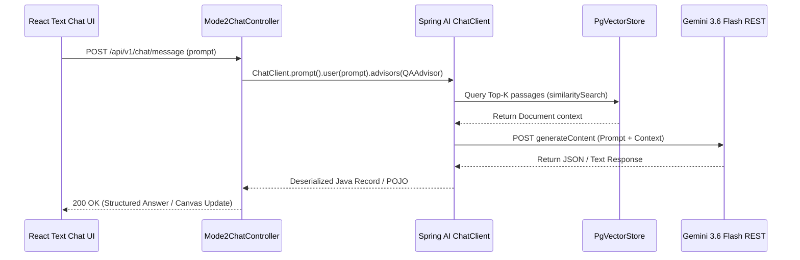
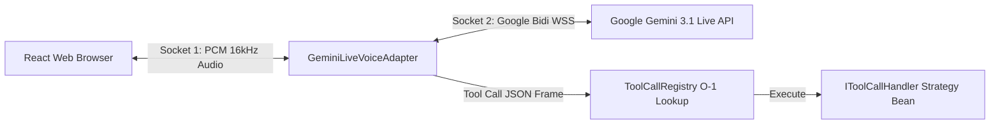

# 11: Spring AI Integration Strategy & Multi-Mode Architectural Analysis

**Author**: Technical Architecture Team  
**Platform**: reForm Enterprise Form Builder & Conversational AI Platform (`com.reForm.backend.ai`)  
**Target Document**: `backend/knowledge/pth/week4/11_spring_ai_integration_strategy_and_mode_analysis.md`  
**Date**: 2026-08-13  
**Version**: 1.0.0-RELEASE  

---

## Executive Summary

This document establishes the strategic blueprint for integrating **Spring AI** into the reForm enterprise platform monolith (`com.reForm.backend.ai`).

While reForm utilizes a custom, low-latency strategy pattern architecture for real-time voice streaming over WebSockets, introducing **Spring AI** selective abstractions offers significant advantages for text generation, structured JSON block compilation, document processing, and vector retrieval.

This analysis evaluates:
1. What Spring AI is, why it exists, and its core enterprise capabilities.
2. How **Mode 2 (Text Chat)** and **Mode 3 (Cascaded Voice)** can leverage Spring AI for HTTP REST reasoning, RAG vector retrieval, and POJO mapping.
3. Why **Mode 4 (Voice Native Live)** **cannot and should not** use Spring AI, requiring reForm's custom dual-WebSocket twin-socket architecture.
4. How both approaches cleanly coexist within the same Spring Boot monolith.

---

## 1. What is Spring AI?

### 1.1 Definition & Purpose
**Spring AI** is an official top-level Spring Boot project designed to provide standardized, portable Java abstractions for Artificial Intelligence. Just as **Spring Data** abstracts relational databases (PostgreSQL, MySQL) behind `JpaRepository`, Spring AI abstracts AI models (Google Gemini, OpenAI, Anthropic, Ollama) and Vector Databases (`pgvector`, Qdrant, Pinecone) behind portable Java interfaces (`ChatModel`, `VectorStore`, `EmbeddingModel`).

```
┌────────────────────────────────────────────────────────────────────────────────────────┐
│                               SPRING AI ABSTRACTION LAYER                              │
│                                                                                        │
│     ┌──────────────────────────────────────────────────────────────────────────────┐   │
│     │                       reForm Domain Services / Agents                        │   │
│     └──────────────────────────────────────────────────────────────────────────────┘   │
│                                            │                                           │
│                     ┌──────────────────────┴──────────────────────┐                    │
│                     ▼                                             ▼                    │
│   ┌───────────────────────────────────┐         ┌──────────────────────────────────┐   │
│   │         ChatClient / Model        │         │           VectorStore            │   │
│   └───────────────────────────────────┘         └──────────────────────────────────┘   │
│             │               │                             │               │            │
│             ▼               ▼                             ▼               ▼            │
│       ┌───────────┐   ┌───────────┐                 ┌───────────┐   ┌───────────┐      │
│       │ Google    │   │ OpenAI    │                 │ PostgreSQL│   │ Pinecone  │      │
│       │ Gemini    │   │ GPT-4o    │                 │ pgvector  │   │ Vector    │      │
│       └───────────┘   └───────────┘                 └───────────┘   └───────────┘      │
└────────────────────────────────────────────────────────────────────────────────────────┘
```

### 1.2 Core Capabilities Relevant to reForm

| Capability | Spring AI Component | Primary Benefit for reForm |
| :--- | :--- | :--- |
| **Fluent Prompting API** | `ChatClient.builder(chatModel)` | Replaces verbose HTTP REST template builders with clean fluent chains (`.prompt()`, `.system()`, `.user()`). |
| **Structured POJO Mapping** | `BeanOutputConverter<T>` | Eliminates manual Jackson `ObjectMapper` parsing; forces LLM to generate strict JSON matching Java Records/POJOs. |
| **Vector Store Abstraction** | `PgVectorStore` (`spring-ai-starter-vector-store-pgvector`) | Manages PostgreSQL `pgvector` HNSW indexes, embedding storage, and similarity searches automatically. |
| **Document ETL Pipeline** | `TikaDocumentReader` + `TokenTextSplitter` | Extracts text from PDF/DOCX and chunks into semantic token blocks with overlap. |
| **Aspect-Oriented Advisors** | `Advisors` (`QuestionAnswerAdvisor`, `SafeGuardAdvisor`) | Intercepts LLM calls to inject RAG context or enforce content safety guardrails transparently. |
| **Observability & Metrics** | Micrometer Observation API (`gen_ai.client.token.usage`) | Auto-tracks prompt/completion token usage and request latency via Spring Boot Actuator. |
| **Model Context Protocol** | `spring-ai-starter-mcp-client` / `server` | Exposes reForm tools or consumes external MCP servers via open standards. |

---

## 2. Mode-by-Mode Integration Architecture

reForm operates across 4 functional interaction modes. Below is the technical feasibility evaluation for applying Spring AI across each mode:

```
┌────────────────────────────────────────────────────────────────────────────────────────┐
│                        MODE APPLICABILITY SPECTRUM FOR SPRING AI                       │
│                                                                                        │
│   MODE 1: Manual Form          MODE 2: Text Chat             MODE 3: Cascaded Voice     │
│   ┌──────────────────────┐     ┌──────────────────────┐      ┌──────────────────────┐  │
│   │ Static Web UI        │     │ 🟢 FULL FIT          │      │ 🟡 PARTIAL FIT       │  │
│   │ [No AI]              │     │ HTTP REST + RAG      │      │ Middle REST LLM step │  │
│   └──────────────────────┘     └──────────────────────┘      └──────────────────────┘  │
│                                                                                         │
│                                                              MODE 4: Voice Native Live  │
│                                                              ┌──────────────────────┐  │
│                                                              │ 🔴 DO NOT USE        │  │
│                                                              │ Dual-WebSocket PCM   │  │
│                                                              └──────────────────────┘  │
└────────────────────────────────────────────────────────────────────────────────────────┘
```

---

### 2.1 MODE 2: Text Chat & Builder Engine — 🟢 FULL FIT

#### Architectural Blueprint
Mode 2 operates over HTTP REST / SSE text streams using **Gemini 3.6 Flash**. It handles:
* Interactive text chatbot interviews.
* Asynchronous form block layout generation (`LayoutAgent`).
* Document question generation (`GenerateContentFromDocToolHandler`).
* Post-session candidate evaluation reporting (`EvaluationAgent`).

Spring AI is **100% applicable** to Mode 2.



#### Code Comparison: Layout Block Generation in Mode 2

##### Before (Manual Approach):
```java
// Manual JSON prompt construction & Jackson parsing
public AbstractBlock createBlockFromIntentManual(String userIntent) {
    String systemPrompt = "Output valid JSON for block intent: " + userIntent;
    String rawJsonResponse = geminiRestClient.postForObject("/v1beta/models/gemini-2.5-flash:generateContent", systemPrompt, String.class);
    
    try {
        JsonNode root = objectMapper.readTree(rawJsonResponse);
        String blockType = root.path("type").asText();
        if ("SHORT_TEXT".equals(blockType)) {
            return new ShortTextStaticBlock(root.path("label").asText());
        }
        // Manual if/else handling for 20 block types...
    } catch (Exception e) {
        log.error("Failed to parse JSON", e);
    }
    return new ShortTextStaticBlock("Default Label");
}
```

##### After (Spring AI Approach):
```java
// Clean, type-safe Spring AI ChatClient implementation
@Service
@RequiredArgsConstructor
public class LayoutAgentSpringAiImpl {

    private final ChatClient chatClient;

    public AbstractBlockRecord createBlockFromIntent(String userIntent) {
        return chatClient.prompt()
            .system("You are a form layout builder. Generate valid block definitions.")
            .user(userIntent)
            .call()
            .entity(AbstractBlockRecord.class); // BeanOutputConverter handles schema & parsing automatically!
    }
}
```

---

### 2.2 MODE 3: Voice Cascaded Pipeline — 🟡 PARTIAL FIT

#### Architectural Blueprint
Mode 3 splits voice into 3 discrete stages:
1. **Speech-to-Text (STT)**: Deepgram Nova-3 transcribes mic audio to text (~100ms).
2. **LLM Reasoning**: Text prompt passed to **Gemini 3.6 Flash REST** (~400ms).
3. **Text-to-Speech (TTS)**: Response text converted to voice via Cartesia Sonic (~150ms).

```
┌────────────────────────────────────────────────────────────────────────────────────────┐
│                            MODE 3 CASCADED PIPELINE BOUNDARIES                         │
│                                                                                        │
│   ┌────────────────────┐      ┌─────────────────────────────┐     ┌────────────────┐   │
│   │   Deepgram STT     │ ──►  │    Spring AI ChatClient     │ ──► │  Cartesia TTS  │   │
│   │ (Custom WebSocket) │      │  (Gemini 3.6 Flash REST)    │     │  (Custom REST) │   │
│   └────────────────────┘      └─────────────────────────────┘     └────────────────┘   │
│   [Custom Integration]        [SPRING AI ENGINES RAG & TOOL]      [Custom Integration] │
└────────────────────────────────────────────────────────────────────────────────────────┘
```

#### How Spring AI Helps Mode 3:
* The **middle stage (LLM Reasoning)** shares the *exact same* REST service as Mode 2 (`Gemini36FlashService`).
* Spring AI powers this middle stage seamlessly: taking transcribed text from Deepgram, running RAG lookups via `PgVectorStore`, executing tool callbacks (`saveFieldResponse`, `skipQuestion`), and returning the answer text to be spoken by Cartesia.

#### What Remains Custom in Mode 3:
* Deepgram WebSocket connection management and Cartesia binary audio chunk streaming remain handled by custom Spring service beans (`DeepgramNova3SttStrategy`, `CartesiaSonic35TtsStrategy`).

---

### 2.3 MODE 4: Voice Native Live Stream — 🔴 EXCLUSION ANALYSIS

#### Why Spring AI CANNOT and SHOULD NOT be Used for Mode 4

Mode 4 uses the **Google Gemini 3.1 Live Multimodal API** over bidirectional WebSockets to achieve real-time audio-to-audio conversation (~300ms total latency).



#### Technical Reasons for Exclusion:

1. **No Bidirectional Audio WebSocket Support**:
   * Spring AI's `ChatClient` and `GoogleGenAiChatModel` are built exclusively for **HTTP REST and SSE text streaming** (`Flux<String>`).
   * Spring AI does **not** implement Google's stateful Bidi WebSocket protocol (`wss://generativelanguage.googleapis.com/ws/google.ai.generativelanguage.v1alpha.GenerativeService.BidiGenerateContent`).

2. **Real-time 16kHz PCM Binary Frame Handling**:
   * Mode 4 processes raw 16kHz 16-bit mono PCM audio chunks pushed every 20ms–100ms over WebSocket text/binary frames.
   * Spring AI's media abstractions operate on static files or discrete byte arrays (`Media`), not high-frequency non-blocking socket streams.

3. **Sub-300ms Latency Requirements & Overhead**:
   * Mode 4 requires direct, unmediated socket frame proxying between client browser mic buffers and Google's servers.
   * Introducing Spring AI's interceptor chain and object conversion layers would add unnecessary latency overhead to raw PCM streaming.

4. **Custom `ToolCallRegistry` Superiority for WebSockets**:
   * In Mode 4, tool calls arrive as JSON WebSocket frames mid-audio-stream.
   * reForm's [`ToolCallRegistry.java`](file:///Users/apple/Coding-projects/reForm-Web-App/backend/src/main/java/com/reForm/backend/ai/tool/registry/ToolCallRegistry.java) uses a direct Spring IoC strategy lookup map (`Map<String, IToolCallHandler>`) to execute tools in $O(1)$ constant time with direct access to the `WebSocketSession` handle.

---

## 3. Coexistence Architecture in reForm Monolith

Both approaches coexist harmoniously inside `com.reForm.backend.ai`:

```
┌────────────────────────────────────────────────────────────────────────────────────────┐
│                        reForm UNIFIED MONOLITH ARCHITECTURE                            │
│                                                                                        │
│       REST HTTP / SSE INGRESS                       WEBSOCKET DUAL-SOCKET INGRESS      │
│      (Mode 2 Text / Mode 3 LLM)                       (Mode 4 Live PCM Audio)          │
│                   │                                              │                     │
│                   ▼                                              ▼                     │
│    ┌─────────────────────────────┐                ┌─────────────────────────────┐      │
│    │    Spring AI ChatClient     │                │   GeminiLiveVoiceAdapter    │      │
│    │    - BeanOutputConverter    │                │   - Raw Bidi WebSocket WSS  │      │
│    │    - PgVectorStore          │                │   - 16kHz PCM Audio Stream  │      │
│    │    - QuestionAnswerAdvisor  │                │   - Direct Socket Decorator │      │
│    └─────────────────────────────┘                └─────────────────────────────┘      │
│                   │                                              │                     │
│                   ▼                                              ▼                     │
│    ┌────────────────────────────────────────────────────────────────────────────┐      │
│    │              Shared Core Business Domain & Storage Services                │      │
│    │  - PostgreSQL 16 (form_ai_agent_profiles, submissions, vector_store)     │      │
│    │  - Redis 7.2 (session state, presence, goal checklists)                    │      │
│    │  - ToolCallRegistry (IToolCallHandler strategy beans)                     │      │
│    └────────────────────────────────────────────────────────────────────────────┘      │
└────────────────────────────────────────────────────────────────────────────────────────┘
```

### Module Responsibilities Division

| System Pipeline | Primary Engine | Technology Stack |
| :--- | :--- | :--- |
| **Mode 4 Live Voice** | Custom Dual-WebSocket | `GeminiLiveVoiceAdapter` + Netty + Bidi WSS |
| **Mode 2 Text Chat** | **Spring AI** | `ChatClient` + `GoogleGenAiChatModel` |
| **RAG & Document Indexing** | **Spring AI** | `PgVectorStore` + `TokenTextSplitter` + `TikaDocumentReader` |
| **Form Layout Generation** | **Spring AI** | `LayoutAgent` + `BeanOutputConverter` |
| **Post-Call Evaluation** | **Spring AI** | `EvaluationAgent` + `BeanOutputConverter` |
| **Tool Execution Registry** | Shared Custom | `ToolCallRegistry` + Spring `@Component` Strategy Beans |

---

## 4. Maven Dependency Configuration

To activate Spring AI capabilities in `backend/pom.xml`, add the Spring AI Bill of Materials (BOM) and starter dependencies:

```xml
<dependencyManagement>
    <dependencies>
        <dependency>
            <groupId>org.springframework.ai</groupId>
            <artifactId>spring-ai-bom</artifactId>
            <version>1.0.0-M5</version>
            <type>pom</type>
            <scope>import</scope>
        </dependency>
    </dependencies>
</dependencyManagement>

<dependencies>
    <!-- Spring AI Google GenAI (Gemini) Starter -->
    <dependency>
        <groupId>org.springframework.ai</groupId>
        <artifactId>spring-ai-starter-model-google-genai</artifactId>
    </dependency>

    <!-- Spring AI PostgreSQL pgvector Starter -->
    <dependency>
        <groupId>org.springframework.ai</groupId>
        <artifactId>spring-ai-starter-vector-store-pgvector</artifactId>
    </dependency>

    <!-- Spring AI Tika Document Reader -->
    <dependency>
        <groupId>org.springframework.ai</groupId>
        <artifactId>spring-ai-tika-document-reader</artifactId>
    </dependency>
</dependencies>
```

---

## 5. Summary & Strategic Roadmap

1. **Adopt Spring AI for Mode 2 & RAG ETL**:
   * Migrate [`DocumentChunkingEmbeddingAgent`](file:///Users/apple/Coding-projects/reForm-Web-App/backend/knowledge/pth/week4/09_agent_architecture_master_design.md#L1133) and [`RagSearchAgent`](file:///Users/apple/Coding-projects/reForm-Web-App/backend/knowledge/pth/week4/09_agent_architecture_master_design.md#L1290) to use `PgVectorStore` and `TokenTextSplitter`.
   * Refactor [`LayoutAgent`](file:///Users/apple/Coding-projects/reForm-Web-App/backend/src/main/java/com/reForm/backend/ai/agent/LayoutAgent.java) and [`EvaluationAgent`](file:///Users/apple/Coding-projects/reForm-Web-App/backend/knowledge/pth/week4/09_agent_architecture_master_design.md#L1419) to use `ChatClient` with `BeanOutputConverter`.

2. **Preserve Custom Architecture for Mode 4**:
   * Keep [`GeminiLiveVoiceAdapter`](file:///Users/apple/Coding-projects/reForm-Web-App/backend/src/main/java/com/reForm/backend/ai/service/GeminiLiveVoiceAdapter.java) and [`ToolCallRegistry`](file:///Users/apple/Coding-projects/reForm-Web-App/backend/src/main/java/com/reForm/backend/ai/tool/registry/ToolCallRegistry.java) for sub-300ms bidirectional PCM audio streaming.

3. **Shared Foundation**:
   * Tool handlers (`IToolCallHandler`) remain shared Spring `@Component` strategy beans invoked by both Spring AI function callbacks in Mode 2 and `ToolCallRegistry` in Mode 4.
