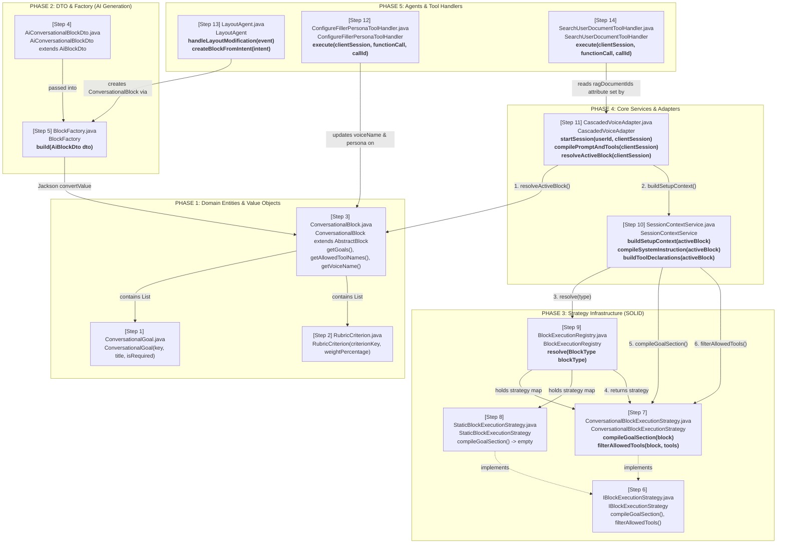

# 19: ConversationalBlock Redesign & SOLID Strategy Implementation Guide

**Author**: Technical Architecture Team  
**Platform**: reForm Enterprise Form Builder & Conversational AI Platform (`com.reForm.backend.form.entity.block.conversationalBlock`)  
**Target File**: `backend/knowledge/pth/week4/19_conversational_block_redesign_and_implementation_guide.md`  
**Date**: 2026-08-13  
**Version**: 1.4.0-RELEASE  

---

## Executive Summary & Architectural Rationale

This document provides the complete master architectural specification, implementation plan, and technical walkthrough for the **`ConversationalBlock`** redesign in the reForm backend monolith.

### ❓ Key Design Questions Answered

#### 1. Why `IBlockExecutionStrategy` and `StaticBlockExecutionStrategy`?
* **The Question**: *"Static blocks are static (like a short text field asking for a user's name). Why do we need `IBlockExecutionStrategy` and `StaticBlockExecutionStrategy`?"*
* **The Answer**: 
  - A `StaticBlock` indeed does **not** have AI goals, voice overrides, or rubrics.
  - We introduced `IBlockExecutionStrategy` and `StaticBlockExecutionStrategy` to implement the **Null Object Pattern** (a subset of Strategy Pattern).
  - Without it, `SessionContextService` would need `if (block instanceof ConversationalBlock)` checks everywhere.
  - With it, `SessionContextService` calls `blockExecutionRegistry.resolve(block.getType())` polymorphically:
    - If `ConversationalBlock` $\rightarrow$ `ConversationalBlockExecutionStrategy` formats goals into prompt checklists, filters tool whitelists, and extracts rubrics.
    - If `StaticBlock` $\rightarrow$ `StaticBlockExecutionStrategy` safely returns `""` (no goals), passes tools unchanged, and returns null voice.
  - This ensures `SessionContextService` complies with the **Open-Closed Principle (OCP)**: zero `instanceof` checks.

#### 2. What does `ConversationalBlockExecutionStrategy` do and where does it fit?
* **What it does**:
  1. `compileGoalSection(block)`: Reads `ConversationalBlock.goals` and formats them into an `[INTERVIEW GOALS CHECKLIST]` string for Gemini.
  2. `filterAllowedTools(block, globalTools)`: Reads `ConversationalBlock.allowedToolNames` whitelist and filters Gemini's 18 function declarations down to only what this block permits.
  3. `resolveVoiceName(block)`: Reads Level 3 `ConversationalBlock.voiceName` override.
  4. `getEvaluationRubric(block)`: Reads `ConversationalBlock.evaluationRubric` for post-session grading by `EvaluationAgent`.
* **Where it fits**: It is invoked by `SessionContextService` during session startup whenever a Form Filler connects or changes blocks.

#### 3. How does Form Builder Interactive Co-Building & Persona Modification Work?
* **The Question**: *"Right now it is basic: the user says 'add conversational block', AI gives back a block through BlockFactory. How do we support builders speaking complex instructions like 'be funny but strict, ask 3 technical questions, set voice to Kore'?"*
* **The Answer**:
  - **Who Configures It**: The Form Builder speaks or types complex requirements to the AI Co-Pilot (Mode 2 or Mode 4).
  - **AI Suggestion & Persona Synthesis**: The AI Co-Pilot interprets the builder's intent ("be funny but strict, ask Java questions") and translates it into structured configuration parameters (`tone = "funny but strict"`, `goals = [Java exp, Microservices]`, `voiceName = "Kore"`).
  - **Tool Handler Dispatch**: The AI invokes `configureFillerPersona` (or `modifyFormLayout`), passing `targetBlockId` along with the synthesized goals, voice, persona prompt, and evaluation rubric.
  - **Block Mutation**: `ConfigureFillerPersonaToolHandler` locates the target `ConversationalBlock` by ID inside `Form.blocks` JSONB, updates its fields, and persists it to PostgreSQL.

#### 4. How does `allowedToolNames` Whitelist Work Step-by-Step?
* **Who defines it?**: The Form Builder (or the AI Co-Pilot assisting the Form Builder). For example, a builder says: *"In this strict quiz block, only allow saving answers and ending the session. Do not allow skipping questions."* $\rightarrow$ `allowedToolNames = ["saveFieldResponse", "endSession"]`. (An empty list = all 18 tools allowed by default).
* **Step-by-Step Execution**:
  1. **Session Setup**: Candidate connects $\rightarrow$ `CascadedVoiceAdapter.startSession()` resolves active `ConversationalBlock`.
  2. **Context Compilation**: `SessionContextService.buildToolDeclarations()` builds the full global list of candidate tool declarations (18 tools).
  3. **Strategy Whitelist Filtering**: `SessionContextService` passes the tools to `ConversationalBlockExecutionStrategy.filterAllowedTools(activeBlock, globalTools)`.
  4. **Array Scoping**: The strategy checks `activeBlock.getAllowedToolNames()`. If non-empty, it filters Gemini's `functionDeclarations` array, retaining **ONLY** tools matching the whitelist.
  5. **Gemini Transmission**: Only the whitelisted tool schemas are sent to Google Gemini in the WebSocket setup frame.
  6. **Security Enforcement**: Gemini literally does not know excluded tools exist—it cannot call `skipQuestion` or `renderDynamicUI` during that block's turn loop!

---

## 0. Folder Structure & Step-by-Step Reading Order

The 14 new and modified files are organized below in their exact **logical step-by-step reading order**:

```
backend/src/main/java/com/reForm/backend/
│
├── form/entity/block/conversationalBlock/       ◄── PHASE 1: Domain Entities & Value Objects
│   ├── [Step 1] ConversationalGoal.java                 [NEW]  (Topic checklist record for MemoryGoalAgent)
│   ├── [Step 2] RubricCriterion.java                    [NEW]  (Weighted scoring criterion for EvaluationAgent)
│   └── [Step 3] ConversationalBlock.java                [MOD]  (Enriched micro-session block entity)
│
├── ai/
│   ├── dto/                                      ◄── PHASE 2: DTO & Factory (AI Generation)
│   │   └── [Step 4] AiConversationalBlockDto.java       [MOD]  (DTO for Spring AI / Gemini Flash output)
│   │
│   ├── factory/
│   │   └── [Step 5] BlockFactory.java                   [MOD]  (DTO-to-Entity mapper using Jackson)
│   │
│   ├── strategy/block/                           ◄── PHASE 3: Strategy Infrastructure (SOLID)
│   │   ├── [Step 6] IBlockExecutionStrategy.java        [NEW]  (Strategy interface for block behavior)
│   │   ├── [Step 7] ConversationalBlockExecutionStrategy.java [NEW] (CONVERSATIONAL block strategy bean)
│   │   ├── [Step 8] StaticBlockExecutionStrategy.java   [NEW]  (STATIC block no-op strategy bean)
│   │   └── [Step 9] BlockExecutionRegistry.java         [NEW]  (Strategy IoC lookup registry for BlockType)
│   │
│   ├── service/                                  ◄── PHASE 4: Service & Adapter Integrations
│   │   ├── [Step 10] SessionContextService.java         [MOD]  (3-level cascade & prompt context compilation)
│   │   └── [Step 11] CascadedVoiceAdapter.java          [MOD]  (Mode 3 active block resolution & RAG scoping)
│   │
│   ├── agent/
│   │   └── [Step 13] LayoutAgent.java                   [MOD]  (Async form layout builder using BlockFactory)
│   │
│   └── tool/handler/
│       ├── builder/
│       │   └── [Step 12] ConfigureFillerPersonaToolHandler.java [MOD] (Form & block-level persona/voice updater)
│       └── universal/
│           └── [Step 14] SearchUserDocumentToolHandler.java    [MOD] (Document RAG tool with block scoping)
```

---

## 1. Chronological Lifecycle Sequence Diagram

This sequence diagram traces the **complete lifecycle across Phase A (Builder Co-Building), Phase B (Filler Session Startup), and Phase D (Post-Session Evaluation)**:

```mermaid
sequenceDiagram
    autonumber
    actor User as User (Builder / Filler)
    participant Layout as [Step 13] LayoutAgent
    participant Dto as [Step 4] AiConversationalBlockDto
    participant Factory as [Step 5] BlockFactory
    participant Block as [Step 3] ConversationalBlock
    participant Persona as [Step 12] ConfigureFillerPersonaToolHandler
    participant Adapter as [Step 11] CascadedVoiceAdapter
    participant Ctx as [Step 10] SessionContextService
    participant Reg as [Step 9] BlockExecutionRegistry
    participant Strat as [Step 7] ConversationalBlockExecutionStrategy
    participant StaticStrat as [Step 8] StaticBlockExecutionStrategy
    participant StrategyInterface as [Step 6] IBlockExecutionStrategy
    participant GoalRecord as [Step 1] ConversationalGoal
    participant RubricRecord as [Step 2] RubricCriterion

    rect rgb(30, 50, 70)
        Note over User,Block: PHASE A: BUILDER CREATES, SYNTHESIZES & CONFIGURES BLOCK
        User->>Layout: "Add Java interview section (funny tone, Kore voice, Java goals)"
        Layout->>Dto: Instantiate DTO with ConversationalGoal & RubricCriterion
        Dto->>GoalRecord: Holds Goal record (key: work_experience)
        Dto->>RubricRecord: Holds Rubric record (technical_depth: 40%)
        Layout->>Factory: build(AiConversationalBlockDto)
        Factory->>Block: Instantiates ConversationalBlock entity
        Layout->>User: Form updated in PostgreSQL with ConversationalBlock
        User->>Persona: "Update interview block: tone funny but strict, voice Kore"
        Persona->>Block: Updates target block.voiceName = "Kore" & persona prompt
    end

    rect rgb(30, 70, 50)
        Note over User,Ctx: PHASE B: FILLER SESSION INITIALIZATION & STRATEGY EXECUTION
        User->>Adapter: Connect WebSocket (?formId=abc&mode=MODE_3)
        Adapter->>Adapter: resolveActiveBlock(clientSession) -> returns ConversationalBlock
        Adapter->>Ctx: buildSetupContext(userId, FILLER, formId, modelKey, activeBlock)
        Ctx->>Reg: resolve(activeBlock.getType())
        Note over Reg: Checks IBlockExecutionStrategy implementations
        Reg-->>Ctx: Returns ConversationalBlockExecutionStrategy (not StaticBlockExecutionStrategy)
        
        Ctx->>Strat: compileGoalSection(activeBlock)
        Strat->>Block: getGoals()
        Block->>GoalRecord: Reads goal records
        Strat-->>Ctx: Returns "[INTERVIEW GOALS CHECKLIST]\n- [ ] work_experience..."
        
        Ctx->>Strat: filterAllowedTools(activeBlock, globalTools)
        Strat->>Block: getAllowedToolNames()
        Strat-->>Ctx: Returns Whitelisted tool declarations
        
        Ctx->>Strat: resolveVoiceName(activeBlock)
        Strat->>Block: getVoiceName()
        Strat-->>Ctx: Returns "Kore"
        
        Ctx-->>Adapter: Setup payload with compiled prompt, whitelisted tools & Kore voice
    end

    rect rgb(60, 30, 60)
        Note over User,RubricRecord: PHASE D: POST-SESSION EVALUATION
        User->>Adapter: Session End
        Adapter->>Reg: resolve(block.getType()).getEvaluationRubric(block)
        Reg->>Strat: getEvaluationRubric(block)
        Strat->>Block: getEvaluationRubric()
        Block->>RubricRecord: Reads RubricCriterion (technical_depth: 40%)
        Strat-->>User: Transcript graded against block rubric
    end
```



---

## 2. 14-File System Flowchart (Component Dependencies)

This diagram shows all 14 steps/files working together with exact Java class names and method signatures:



---

## 3. Decoupled 3-Level Configuration Cascade

To maintain SOLID Dependency Inversion and Open-Closed principles, configuration settings resolve via a strict 3-level fallback cascade:

```
┌─────────────────────────────────────────────────────────────────────────────────────────┐
│                       3-LEVEL CONFIGURATION CASCADE (Most Specific Wins)                │
│                                                                                         │
│   Level 3 (Highest Priority): ConversationalBlock Overrides                             │
│   ┌───────────────────────────────────────────────────────────────────────────────┐     │
│   │ block.getPrompt()          → Overrides profile systemPromptTemplate           │     │
│   │ block.getPersona()         → Overrides profile compiled persona               │     │
│   │ block.getVoiceName()       → Overrides profile voiceName                      │     │
│   │ block.getGoals()           → Block-specific checklist for MemoryGoalAgent     │     │
│   │ block.getAllowedToolNames()→ Block-specific whitelist for ToolCallRegistry    │     │
│   │ block.getEvaluationRubric()→ Block-specific criteria for EvaluationAgent      │     │
│   │ block.getRagDocumentIds()  → Block-specific doc scope for RagSearchAgent        │     │
│   └───────────────────────────────────────────────────────────────────────────────┘     │
│                              ▲ Overrides                                                │
│   Level 2: FormAiAgentProfile (PostgreSQL Defaults set by Form Builder)                 │
│   ┌───────────────────────────────────────────────────────────────────────────────┐     │
│   │ profile.getSystemPromptTemplate() (Form-level prompt template)                │     │
│   │ profile.getVoiceName()            (Form-level voice choice: "Puck", "Kore")   │     │
│   │ profile.getTemperature()          (Form-level temperature: 0.7)               │     │
│   │ profile.getModelKey()             (Form-level model choice: "GEMINI_3_1_LIVE")│     │
│   └───────────────────────────────────────────────────────────────────────────────┘     │
│                              ▲ Overrides                                                │
│   Level 1 (Lowest Priority): Baseline System Defaults                                   │
│   ┌───────────────────────────────────────────────────────────────────────────────┐     │
│   │ SessionContextService role baselines (Role.FORM_BUILDER vs Role.FORM_FILLER)  │     │
│   │ System voice default ("Puck"), Temperature (0.7), Model ("GEMINI_3_1_LIVE")   │     │
│   └───────────────────────────────────────────────────────────────────────────────┘     │
│                                                                                         │
│   Global Provider Decoupling: STT & TTS Strategies (application.yml)                    │
│   ┌───────────────────────────────────────────────────────────────────────────────┐     │
│   │ voice.stt.default-strategy: DEEPGRAM_NOVA_3 (ISttProviderStrategy)            │     │
│   │ voice.tts.default-strategy: CARTESIA_SONIC_3_5 (ITtsProviderStrategy)         │     │
│   │ → Decoupled via Strategy Pattern: If provider fails, change config key.        │     │
│   └───────────────────────────────────────────────────────────────────────────────┘     │
└─────────────────────────────────────────────────────────────────────────────────────────┘
```

---

## 4. Step-by-Step File-by-File Implementation Walkthrough

### Phase 1: Domain Models & Value Objects

#### 1. `ConversationalGoal.java` [NEW]
- **Path**: `com.reForm.backend.form.entity.block.conversationalBlock.ConversationalGoal`
- **WHY**: To provide a strongly-typed domain value object for topic checklist goals.
- **HOW**: Implemented as a Java `record` (`key`, `title`, `description`, `isRequired`, `targetDataField`). Automatically serialized into PostgreSQL JSONB block arrays. Used by `MemoryGoalAgent` to track goal status (`session:id:goals` in Redis).

#### 2. `RubricCriterion.java` [NEW]
- **Path**: `com.reForm.backend.form.entity.block.conversationalBlock.RubricCriterion`
- **WHY**: To provide weighted grading criteria for post-session transcript scoring.
- **HOW**: Implemented as a Java `record` (`criterionKey`, `title`, `weightPercentage`, `scoringGuide`). Extracted post-session by `EvaluationAgent` to instruct Gemini 3.6 Flash / Spring AI `ChatClient` during evaluation report generation.

#### 3. `ConversationalBlock.java` [MODIFY]
- **Path**: [`ConversationalBlock.java`](file:///Users/apple/Coding-projects/reForm-Web-App/backend/src/main/java/com/reForm/backend/form/entity/block/conversationalBlock/ConversationalBlock.java)
- **WHY**: To expand the thin 4-field entity into a first-class micro-session engine configuration.
- **HOW**: Added 7 new attributes: `goals`, `ragDocumentIds`, `allowedToolNames`, `maxTurnCount`, `silenceTimeoutSeconds`, `autoAdvanceOnGoalCompletion`, `evaluationRubric`. Retained `@JsonIgnoreProperties(ignoreUnknown = true)` for 100% backward compatibility with existing forms.

---

### Phase 2: DTO & Factory (AI Generation)

#### 4. `AiConversationalBlockDto.java` [MODIFY]
- **Path**: [`AiConversationalBlockDto.java`](file:///Users/apple/Coding-projects/reForm-Web-App/backend/src/main/java/com/reForm/backend/ai/dto/AiConversationalBlockDto.java)
- **WHY**: To enable Spring AI `BeanOutputConverter` and Gemini Flash to output rich block schemas during Mode 2 layout generation.
- **HOW**: Added `goals`, `allowedToolNames`, `maxTurnCount`, and `evaluationRubric` fields matching the enriched entity.

#### 5. `BlockFactory.java` [MODIFY]
- **Path**: [`BlockFactory.java`](file:///Users/apple/Coding-projects/reForm-Web-App/backend/src/main/java/com/reForm/backend/ai/factory/BlockFactory.java)
- **WHY**: To map enriched `AiConversationalBlockDto` attributes into `AbstractBlock` domain instances.
- **HOW**: Updated `buildConversational()` to map `voiceName`, `goals`, `allowedToolNames`, `maxTurnCount`, and `evaluationRubric` into the merged property map for Jackson conversion.

---

### Phase 3: Block Execution Strategy (SOLID Infrastructure)

#### 6. `IBlockExecutionStrategy.java` [NEW]
- **Path**: `com.reForm.backend.ai.strategy.block.IBlockExecutionStrategy`
- **WHY**: To enforce SOLID Open-Closed (OCP) and Single Responsibility (SRP) principles for block execution behavior.
- **HOW**: Defined contract methods: `supports(BlockType)`, `compileGoalSection(AbstractBlock)`, `filterAllowedTools(AbstractBlock, List<Map>)`, `resolveVoiceName(AbstractBlock)`, and `getEvaluationRubric(AbstractBlock)`.

#### 7. `ConversationalBlockExecutionStrategy.java` [NEW]
- **Path**: `com.reForm.backend.ai.strategy.block.ConversationalBlockExecutionStrategy`
- **WHY**: To encapsulate all `ConversationalBlock`-specific prompt, tool, voice, and rubric logic inside a single Spring `@Component`.
- **HOW**: Implemented strategy logic:
  - `compileGoalSection()`: Formats goals into an `[INTERVIEW GOALS CHECKLIST]` string.
  - `filterAllowedTools()`: Filters tool declaration groups against `allowedToolNames` whitelist.
  - `resolveVoiceName()`: Returns block `voiceName` or null.
  - `getEvaluationRubric()`: Returns block `evaluationRubric`.

#### 8. `StaticBlockExecutionStrategy.java` [NEW]
- **Path**: `com.reForm.backend.ai.strategy.block.StaticBlockExecutionStrategy`
- **WHY**: To provide a clean no-op strategy for static form fields (`STATIC` blocks).
- **HOW**: `@Component` returning empty strings, nulls, and unfiltered tool lists.

#### 9. `BlockExecutionRegistry.java` [NEW]
- **Path**: `com.reForm.backend.ai.strategy.block.BlockExecutionRegistry`
- **WHY**: To auto-wire strategy beans into an IoC lookup registry, mirroring `ToolCallRegistry`.
- **HOW**: `@Service` collecting `List<IBlockExecutionStrategy>` into a `Map<BlockType, IBlockExecutionStrategy>`. Resolves strategies via `resolve(BlockType)`.

---

### Phase 4: Service Integrations & Handlers

#### 10. `SessionContextService.java` [MODIFY]
- **Path**: [`SessionContextService.java`](file:///Users/apple/Coding-projects/reForm-Web-App/backend/src/main/java/com/reForm/backend/ai/service/SessionContextService.java)
- **WHY**: To eliminate hardcoded `instanceof ConversationalBlock` checks and implement 3-level prompt/voice cascading.
- **HOW**: Injected `BlockExecutionRegistry`. Added overloaded `compileSystemInstruction()` and `buildToolDeclarations()` supporting `AbstractBlock`. Delegated goal checklist appending, tool whitelist filtering, and Level 3 voice overrides to `BlockExecutionRegistry.resolve(type)`.

#### 11. `CascadedVoiceAdapter.java` [MODIFY]
- **Path**: [`CascadedVoiceAdapter.java`](file:///Users/apple/Coding-projects/reForm-Web-App/backend/src/main/java/com/reForm/backend/ai/service/CascadedVoiceAdapter.java)
- **WHY**: Mode 3 previously passed `null` for `activeBlock`, completely bypassing block-level overrides.
- **HOW**: Injected `FormRepository`. Added `resolveActiveBlock()` helper to resolve active `ConversationalBlock` from `Form.blocks` and pass it to `SessionContextService`. Pushed `ragDocumentIds` to session attributes.

#### 12. `ConfigureFillerPersonaToolHandler.java` [MODIFY]
- **Path**: [`ConfigureFillerPersonaToolHandler.java`](file:///Users/apple/Coding-projects/reForm-Web-App/backend/src/main/java/com/reForm/backend/ai/tool/handler/builder/ConfigureFillerPersonaToolHandler.java)
- **WHY**: Form Builders needed the ability to update both form-level persona defaults AND block-level overrides.
- **HOW**: Added logic to update `FormAiAgentProfile` (form-level) AND locate target `ConversationalBlock` by `targetBlockId` to update block `persona`, `prompt`, and `voiceName` (block-level).

#### 13. `LayoutAgent.java` [MODIFY]
- **Path**: [`LayoutAgent.java`](file:///Users/apple/Coding-projects/reForm-Web-App/backend/src/main/java/com/reForm/backend/ai/agent/LayoutAgent.java)
- **WHY**: Previously hardcoded `new ConversationalBlock()` directly, bypassing `BlockFactory`.
- **HOW**: Injected `BlockFactory` and updated `createBlockFromIntent()` to build `AiConversationalBlockDto` through `BlockFactory.build()`.

#### 14. `SearchUserDocumentToolHandler.java` [MODIFY]
- **Path**: [`SearchUserDocumentToolHandler.java`](file:///Users/apple/Coding-projects/reForm-Web-App/backend/src/main/java/com/reForm/backend/ai/tool/handler/universal/SearchUserDocumentToolHandler.java)
- **WHY**: Vector searches were unconstrained across the entire form.
- **HOW**: Updated to read `ragDocumentIds` from WebSocket session attributes (set by `CascadedVoiceAdapter` from `ConversationalBlock.ragDocumentIds`) and scope vector searches accordingly.

---

## 5. Principles & Quality Assurance Matrix

| SOLID / OOP Principle | How This Design Enforces It |
| :--- | :--- |
| **Single Responsibility Principle (SRP)** | `ConversationalBlock` is a pure data entity; `ConversationalBlockExecutionStrategy` handles execution logic; `BlockExecutionRegistry` handles strategy routing. |
| **Open-Closed Principle (OCP)** | Adding a new block type requires creating 1 new `IBlockExecutionStrategy` `@Component` bean — zero changes to `SessionContextService` or WebSocket adapters. |
| **Liskov Substitution Principle (LSP)** | `ConversationalBlock` extends `AbstractBlock` cleanly without breaking polymorphic Jackson deserialization (`AbstractBlockDeserializer`) or DB JSONB storage (`AbstractBlockConverter`). |
| **Interface Segregation Principle (ISP)** | `IBlockExecutionStrategy` defines concise, focused methods for goal formatting, tool filtering, and rubric extraction. |
| **Dependency Inversion Principle (DIP)** | `SessionContextService` and voice adapters depend on the `IBlockExecutionStrategy` interface and `BlockExecutionRegistry`, not concrete block classes. |
| **KISS & DRY** | Reuses the exact same strategy registry pattern as `ToolCallRegistry` and `ISttProviderStrategy`. Eliminates duplicated code across Mode 2, Mode 3, and Mode 4. |

---

## 6. Verification Checklist

| # | Verification Test | Execution Command / Check |
|:---|:---|:---|
| 1 | **Clean Compilation** | `./mvnw compile` (Clean build with zero Java compiler warnings) |
| 2 | **Jackson JSON Round-trip** | Unit test serializing/deserializing `ConversationalBlock` with goals and rubric to/from JSONB string |
| 3 | **Backward Compatibility** | Deserialize legacy JSONB (only `prompt`/`persona`/`voiceName`) $\rightarrow$ verify new fields default to empty/null |
| 4 | **Goal Checklist Compilation** | Verify `SessionContextService.compileSystemInstruction()` appends formatted Goal Checklist |
| 5 | **Tool Whitelist Filtering** | Verify `allowedToolNames = ["saveFieldResponse", "endSession"]` excludes unlisted tools |
| 6 | **Voice Cascade Hierarchy** | Verify Level 3 (Block voice) > Level 2 (Profile voice) > Level 1 (Default voice) |
