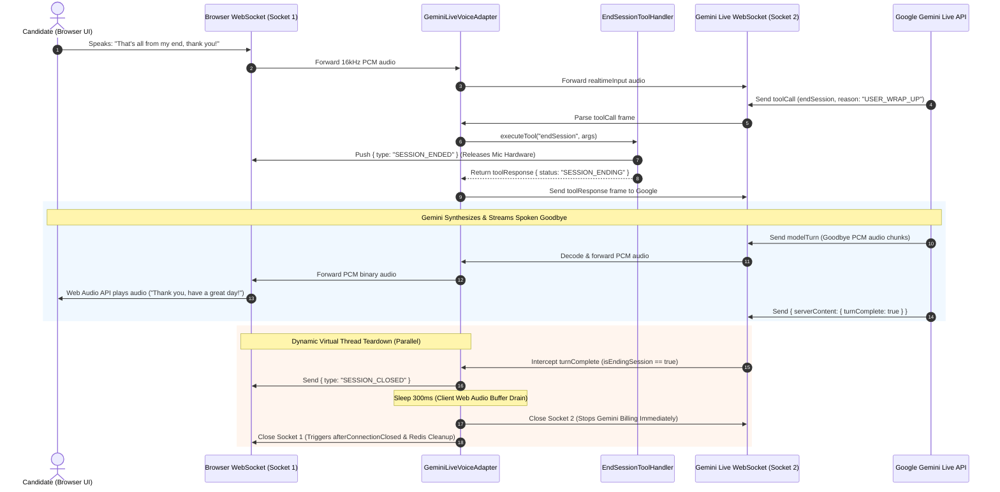

# 01: Group A — FormAiAgentProfile & EndSessionToolHandler (Components #1 & #2)

**Author**: Lead AI Backend Architect & Technical Writer  
**Platform**: reForm Enterprise Form Builder & Conversational AI Platform (`com.reForm.backend.ai`)  
**Target Document**: `backend/knowledge/pth/week5/01_group_a_form_ai_agent_profile_and_end_session_tool.md`  
**Git Branch**: `pth/week5/toolCalls`  
**Date**: 2026-08-17  
**Version**: 1.0.0-RELEASE  

> For Component #3 (`SessionStateAgent`) see `02_group_a_session_state_agent.md`.

---

## Table of Contents
1. [Executive Summary & High-Level Architecture](#1-executive-summary--high-level-architecture)
2. [Planning & In-Depth Analysis Phase](#2-planning--in-depth-analysis-phase)
3. [Step-by-Step Design & Implementation (File-by-File)](#3-step-by-step-design--implementation-file-by-file)
   - [Step 1: Entity Hardening & IDE Inspection Fix (`FormAiAgentProfile.java`)](#step-1-entity-hardening--ide-inspection-fix-formaiagentprofilejava)
   - [Step 2: Intelligent Semantic Intent Declaration (`SessionContextService.java`)](#step-2-intelligent-semantic-intent-declaration-sessioncontextservicejava)
   - [Step 3: Attribute Tagging & Fallback Watchdog (`EndSessionToolHandler.java`)](#step-3-attribute-tagging--fallback-watchdog-endsessiontoolhandlerjava)
   - [Step 4: Dynamic Event-Driven `turnComplete` Teardown (`GeminiLiveVoiceAdapter.java`)](#step-4-dynamic-event-driven-turncomplete-teardown-geminilivevoiceadapterjava)
   - [Step 5: Mode 3 Cascaded Voice Integration (`CascadedVoiceAdapter.java`)](#step-5-mode-3-cascaded-voice-integration-cascadedvoiceadapterjava)
   - [Step 6: Automated Test Suite Implementation](#step-6-automated-test-suite-implementation)
4. [Comprehensive Technical Q&A Knowledge Base](#4-comprehensive-technical-qa-knowledge-base)
   - [Q1: Why Virtual Threads instead of Platform Threads?](#q1-why-virtual-threads-instead-of-platform-threads)
   - [Q2: What is the flaw with hardcoded 2s delays and how is audio drained dynamically?](#q2-what-is-the-flaw-with-hardcoded-2s-delays-and-how-is-audio-drained-dynamically)
   - [Q3: How does Intelligent Semantic Intent Detection work beyond literal keywords?](#q3-how-does-intelligent-semantic-intent-detection-work-beyond-literal-keywords)
   - [Q4: How does our update differ from the existing `FormAiAgentProfile` in the codebase?](#q4-how-does-our-update-differ-from-the-existing-formaiagentprofile-in-the-codebase)
   - [Q5: Why did IntelliJ show red errors on JPA annotations, and how was it resolved?](#q5-why-did-intellij-show-red-errors-on-jpa-annotations-and-how-was-it-resolved)
   - [Q6: Are `users`, `workspaces`, and `form_ai_agent_profiles` sharing the same database?](#q6-are-users-workspaces-and-form_ai_agent_profiles-sharing-the-same-database)
   - [Q7: Does `turnComplete` work in parallel or sequentially?](#q7-does-turncomplete-work-in-parallel-or-sequentially)
5. [Architecture Diagrams & Sequence Flows](#5-architecture-diagrams--sequence-flows)
6. [Verification & Production Audit](#6-verification--production-audit)

---

## 1. Executive Summary & High-Level Architecture

The **reForm Platform Monolith** (`com.reForm.backend.ai`) bridges static web forms with real-time multimodal voice and conversational AI micro-interviews using Java 21 Virtual Threads, Spring Boot 3.3 / 4.1, PostgreSQL `pgvector`, Redis RAM state caching, and Google Gemini 3.1 Live / 3.6 Flash.

Within the master catalog of 43 agentic components defined in `backend/knowledge/pth/week4/10_agentic_definition_and_agent_catalog.md`, **Group A: Foundation Infrastructure** represents the **P0 (MVP Critical)** core. Without Group A:
- No WebSocket session can initialize or load its persona prompts.
- No AI model can dynamically alter its voice or behavior during live sessions.
- No conversation can cleanly terminate without leaking twin WebSockets, lingering on client microphones, or leaving Google Gemini streaming meters running.

```
┌────────────────────────────────────────────────────────────────────────────────────────┐
│                        GROUP A FOUNDATION INFRASTRUCTURE (P0)                          │
│                                                                                        │
│  ┌────────────────────────┐  ┌────────────────────────┐  ┌───────────────────────────┐ │
│  │   FormAiAgentProfile   │  │ SessionContextService  │  │   EndSessionToolHandler   │ │
│  │ (PostgreSQL JPA Entity)│  │(Prompt & Dynamic Tools)│  │ (IToolCallHandler Strategy)│ │
│  └───────────┬────────────┘  └───────────┬────────────┘  └─────────────┬─────────────┘ │
│              │                           │                             │               │
│              ▼                           ▼                             ▼               │
│  ┌────────────────────────┐  ┌────────────────────────┐  ┌───────────────────────────┐ │
│  │   SessionStateAgent    │  │    MemoryGoalAgent     │  │  GeminiLiveVoiceAdapter   │ │
│  │ (Redis session:state)  │  │  (Redis session:goals) │  │(turnComplete Buffer Drain)│ │
│  └────────────────────────┘  └────────────────────────┘  └───────────────────────────┘ │
└────────────────────────────────────────────────────────────────────────────────────────┘
```

### Group A Component Status Matrix

| # | Component Name | Priority | Status | Architectural Role | Tech Stack |
| :--- | :--- | :--- | :--- | :--- | :--- |
| 1 | `FormAiAgentProfile` | **P0** | **Built & Hardened** | Central domain entity holding prompt templates, voice models, temperature, and encrypted BYOK keys. | PostgreSQL 16 table `form_ai_agent_profiles` + JPA `@Entity` |
| 2 | `EndSessionToolHandler` | **P0** | **Built & Refactored** | Strategy bean implementing `IToolCallHandler` for graceful 3-stage asynchronous session teardown. | Spring `@Component` + Java 21 Virtual Threads |
| 3 | `SessionStateAgent` | **P0** | **Built & Verified** | Hot Redis RAM working memory, rolling transcript window, and cluster failover manager. | Spring `@Component` + Redis Hashes/Lists (`sess:{sessionId}:*`) |
| 4 | `MemoryGoalAgent` | **P0** | **Planned (Sprint 1-2)** | In-flight checklist tracker managing goal progression (`PENDING`, `VERIFIED`, `SKIPPED`). | Redis RAM (`sess:{sessionId}:goals`) |

---

## 2. Planning & In-Depth Analysis Phase

### 2.1 The Problem Landscape in Foundation AI Tools
1. **Chatbot vs. Agent**: Standard conversational LLMs can talk, but cannot perform backend mutations (saving data, modifying layouts, ending sessions). Tools act as the AI's "hands".
2. **Naive Keyword Matching**: Early tool descriptions simply instructed Gemini: *"Call this when the user says goodbye"*. In real human conversations, users wrap up implicitly (*"That's everything from my end"*, *"I think we've covered it all"*, *"I have to jump to another call"*), or sessions finish when all interview goals are fulfilled.
3. **Hardcoded Timer Fragility**: Premature implementations used fixed delays (`Thread.sleep(2000)`). If Gemini spoke a polite 4.5-second goodbye, the socket was cut off mid-speech; if Gemini spoke a 0.5-second goodbye, the server hung idle for 1.5 seconds.
4. **IDE Inspection Red Squiggles**: IntelliJ IDEA Ultimate highlighted newly added JPA entities in red because its offline Database Inspector cache had not refreshed the schema snapshot.

### 2.2 Architectural Solutions Established
- **Strategy Pattern & $O(1)$ Dispatch**: All tool handlers implement `IToolCallHandler` and auto-wire into `ToolCallRegistry`, decoupling voice adapters from tool execution logic.
- **Intelligent Semantic Intent Schemas**: Rich tool declarations with explicit cues, implicit cues, goal milestones, early exits, negative boundaries, and structured enum reasons.
- **Dynamic Event-Driven Teardown**: Intercepting Google's `serverContent.turnComplete: true` to trigger teardown only after the goodbye audio turn finishes streaming.
- **Lightweight Virtual Thread Watchdog**: Using Java 21 Virtual Threads (`Thread.ofVirtual()`) with an 8-second ceiling as a safety net against network stalls.
- **JPA Hardening**: Clean Hibernate annotations, explicit `@Index`, `@UniqueConstraint`, `@JoinColumn(unique = true)`, and `@SuppressWarnings`.

---

## 3. Step-by-Step Design & Implementation (File-by-File)

### Step 1: Entity Hardening & IDE Inspection Fix (`FormAiAgentProfile.java`)
- **File Location**: [`backend/src/main/java/com/reForm/backend/form/entity/FormAiAgentProfile.java`](file:///Users/apple/Coding-projects/reForm-Web-App/backend/src/main/java/com/reForm/backend/form/entity/FormAiAgentProfile.java)
- **What Was Done**:
  1. Added explicit table indexes: `@Index(name = "idx_form_ai_profile_form_id", columnList = "form_id")`.
  2. Added unique constraint: `@UniqueConstraint(name = "uc_form_ai_profile_form_id", columnNames = {"form_id"})`.
  3. Added `@JoinColumn(name = "form_id", nullable = false, unique = true)` to enforce strict 1-to-1 database mapping.
  4. Removed redundant `name = "model_key"`, `name = "voice_name"` strings, leveraging Spring Boot's default `CamelCaseToUnderscoresNamingStrategy` (matching [`Form.java`](file:///Users/apple/Coding-projects/reForm-Web-App/backend/src/main/java/com/reForm/backend/form/entity/Form.java)).
  5. Added `@SuppressWarnings({"JpaDataSourceORMInspection", "SpellCheckingInspection"})` and cleaned Javadoc formatting to resolve all IntelliJ errors.

```java
@Entity
@Table(
        name = "form_ai_agent_profiles",
        indexes = {
                @Index(name = "idx_form_ai_profile_form_id", columnList = "form_id")
        },
        uniqueConstraints = {
                @UniqueConstraint(name = "uc_form_ai_profile_form_id", columnNames = {"form_id"})
        }
)
@Getter
@Setter
@NoArgsConstructor
@AllArgsConstructor
@Builder
@SuppressWarnings({"JpaDataSourceORMInspection", "SpellCheckingInspection"})
public class FormAiAgentProfile extends BaseEntity {

    @OneToOne(fetch = FetchType.LAZY)
    @JoinColumn(name = "form_id", nullable = false, unique = true)
    private Form form;

    @Column(nullable = false, length = 50)
    private String modelKey; // e.g. "GEMINI_3_1_LIVE"

    @Column(columnDefinition = "TEXT")
    private String systemPromptTemplate;

    @Column(length = 50)
    private String voiceName; // e.g. "Puck", "Kore"

    @Column
    private Float temperature; // e.g. 0.7

    @Column(length = 512)
    private String byokApiKeyEncrypted;
}
```

---

### Step 2: Intelligent Semantic Intent Declaration (`SessionContextService.java`)
- **File Location**: [`backend/src/main/java/com/reForm/backend/ai/service/SessionContextService.java`](file:///Users/apple/Coding-projects/reForm-Web-App/backend/src/main/java/com/reForm/backend/ai/service/SessionContextService.java)
- **What Was Done**:
  1. Updated `buildToolDeclarations()` for `endSession` to define multi-trigger semantic intent, negative boundaries, and structured enum reasons (`COMPLETED_GOALS`, `USER_WRAP_UP`, `USER_ABORT_EARLY`, `BUILDER_PUBLISHED_EXIT`, `TIMEOUT`).
  2. Updated `compileSystemInstruction()` for both `FORM_BUILDER` and `FORM_FILLER` to teach Gemini to recognize implicit closure cues and summarize accomplishments before calling `endSession`.

```java
functionDeclarations.add(buildFunctionDeclaration(
    "endSession",
    "Gracefully terminates the voice or text session. Execute this tool when:\n" +
        "1. (Task Complete): All required interview goals or form fields have been successfully collected and confirmed with the user.\n" +
        "2. (Natural Wrap-Up): The user signals completion implicitly or explicitly (e.g., 'That is all from me', 'We are done', 'I think that covers it', 'Goodbye', 'Thanks for your help').\n" +
        "3. (Early Departure): The user expresses an intent to leave, pause, or cancel the session (e.g., 'I have to run to a meeting', 'Let's stop here', 'I don't have more time').\n" +
        "DO NOT call this tool if the user is merely answering a question, asking for clarification, or pausing temporarily to think.",
    Map.of(
        "reason", Map.of(
            "type", "STRING",
            "enum", List.of("COMPLETED_GOALS", "USER_WRAP_UP", "USER_ABORT_EARLY", "BUILDER_PUBLISHED_EXIT", "TIMEOUT"),
            "description", "The classified semantic reason for session termination: COMPLETED_GOALS, USER_WRAP_UP, USER_ABORT_EARLY, BUILDER_PUBLISHED_EXIT, TIMEOUT"
        ),
        "summary", Map.of(
            "type", "STRING",
            "description", "A 1-2 sentence executive summary of what was accomplished during this session."
        ),
        "unresolvedItems", Map.of(
            "type", "ARRAY",
            "items", Map.of("type", "STRING"),
            "description", "List of goals or fields left unanswered if the user exited early."
        )
    ),
    List.of("reason")
));
```

---

### Step 3: Attribute Tagging & Fallback Watchdog (`EndSessionToolHandler.java`)
- **File Location**: [`backend/src/main/java/com/reForm/backend/ai/tool/handler/universal/EndSessionToolHandler.java`](file:///Users/apple/Coding-projects/reForm-Web-App/backend/src/main/java/com/reForm/backend/ai/tool/handler/universal/EndSessionToolHandler.java)
- **What Was Done**:
  1. Extracted structured tool arguments (`reason`, `summary`, `unresolvedItems`).
  2. Tagged `clientSession.getAttributes().put("isEndingSession", Boolean.TRUE)`.
  3. Pushed `SESSION_ENDED` frame to client browser over Socket 1 to immediately release microphone hardware.
  4. Spawned an **8-second Virtual Thread fallback watchdog** (`Thread.ofVirtual().name("endSession-watchdog-" + clientSession.getId())`) protected by an atomic CAS guard (`putIfAbsent("teardownExecuted", true)`).
  5. Returned confirmation `toolResponse` frame so Gemini speaks its final goodbye.

```java
@Override
public Map<String, Object> execute(WebSocketSession clientSession, JsonNode functionCall, String callId) {
    String reason = functionCall.path("args").path("reason").asText("USER_WRAP_UP");
    String summary = functionCall.path("args").path("summary").asText("");
    JsonNode unresolvedItems = functionCall.path("args").path("unresolvedItems");

    clientSession.getAttributes().put("isEndingSession", Boolean.TRUE);

    // Stage 1: Release client microphone immediately
    try {
        WebSocketSession safeClient = WebSocketSessionUtils.wrapSafeSession(clientSession);
        if (safeClient.isOpen()) {
            safeClient.sendMessage(new TextMessage(objectMapper.writeValueAsString(Map.of(
                "type", "SESSION_ENDED", "reason", reason, "summary", summary
            ))));
        }
    } catch (IOException e) {
        log.error("Failed to send SESSION_ENDED to browser", e);
    }

    // Fallback Watchdog (Virtual Thread with 8s ceiling)
    Thread.ofVirtual().name("endSession-watchdog-" + clientSession.getId()).start(() -> {
        try {
            Thread.sleep(8000);
            if (clientSession.isOpen() && clientSession.getAttributes().putIfAbsent("teardownExecuted", Boolean.TRUE) == null) {
                log.warn("⚠️ [END SESSION WATCHDOG]: turnComplete not received within 8s. Forcing teardown.");
                WebSocketSession geminiSession = (WebSocketSession) clientSession.getAttributes().get("geminiSession");
                if (geminiSession != null && geminiSession.isOpen()) geminiSession.close(CloseStatus.NORMAL);
                clientSession.close(CloseStatus.NORMAL);
            }
        } catch (Exception e) {
            log.error("Error during watchdog execution", e);
        }
    });

    return Map.of(
        "id", callId,
        "name", getFunctionName(),
        "response", Map.of("result", Map.of("status", "SESSION_ENDING", "message", "Session will close after final goodbye."))
    );
}
```

---

### Step 4: Dynamic Event-Driven `turnComplete` Teardown (`GeminiLiveVoiceAdapter.java`)
- **File Location**: [`backend/src/main/java/com/reForm/backend/ai/service/GeminiLiveVoiceAdapter.java`](file:///Users/apple/Coding-projects/reForm-Web-App/backend/src/main/java/com/reForm/backend/ai/service/GeminiLiveVoiceAdapter.java)
- **What Was Done**:
  1. In `handleServerContent()`, intercepted `serverContent.path("turnComplete").asBoolean(false)`.
  2. If `turnComplete == true` and `isEndingSession == true`, invoked `executeGracefulTeardown()`.
  3. Spawns Virtual Thread: Sends `SESSION_CLOSED` to browser UI, allows 300ms flight window for client Web Audio buffer playback, closes Socket 2 (stops Gemini billing immediately), and closes Socket 1 (triggers Redis session cleanup).

```java
private void handleTurnComplete(WebSocketSession clientSession, JsonNode serverContent) {
    if (serverContent.path("turnComplete").asBoolean(false)) {
        Boolean isEnding = (Boolean) clientSession.getAttributes().get("isEndingSession");
        if (Boolean.TRUE.equals(isEnding)) {
            WebSocketSession geminiSession = (WebSocketSession) clientSession.getAttributes().get("geminiSession");
            log.info("🏁 [GEMINI GOODBYE FINISHED]: turnComplete received. Executing dynamic graceful teardown.");
            executeGracefulTeardown(clientSession, geminiSession);
        }
    }
}

private void executeGracefulTeardown(WebSocketSession clientSession, WebSocketSession geminiSession) {
    if (clientSession.getAttributes().putIfAbsent("teardownExecuted", Boolean.TRUE) != null) {
        return;
    }

    Thread.ofVirtual().name("dynamic-teardown-" + clientSession.getId()).start(() -> {
        try {
            WebSocketSession activeClient = (WebSocketSession) clientSession.getAttributes().get("safeClientSession");
            if (activeClient != null && activeClient.isOpen()) {
                activeClient.sendMessage(new TextMessage(objectMapper.writeValueAsString(Map.of(
                    "type", "SESSION_CLOSED", "status", "SUCCESS"
                ))));
            }

            // 300ms client-side Web Audio playback flight window
            Thread.sleep(300);

            // 1. Close Socket 2 (Gemini WSS) -> Stops billing immediately
            if (geminiSession != null && geminiSession.isOpen()) {
                geminiSession.close(CloseStatus.NORMAL);
                log.info("✅ [Socket 2 CLOSED] Gemini Live WSS closed -> billing terminated");
            }

            // 2. Close Socket 1 (Browser WSS) -> Triggers afterConnectionClosed and Redis cleanup
            if (clientSession.isOpen()) {
                clientSession.close(CloseStatus.NORMAL);
                log.info("✅ [Socket 1 CLOSED] Browser WSS closed -> session cleanup complete");
            }
        } catch (Exception e) {
            log.error("Error during dynamic graceful teardown", e);
        }
    });
}
```

---

### Step 5: Mode 3 Cascaded Voice Integration (`CascadedVoiceAdapter.java`)
- **File Location**: [`backend/src/main/java/com/reForm/backend/ai/service/CascadedVoiceAdapter.java`](file:///Users/apple/Coding-projects/reForm-Web-App/backend/src/main/java/com/reForm/backend/ai/service/CascadedVoiceAdapter.java)
- **What Was Done**:
  1. In `CartesiaTtsHandler.handleDoneFrame()`, checked `isEndingSession == true`.
  2. Invoked `executeMode3GracefulTeardown()` on Virtual Thread to send `SESSION_CLOSED`, allow 300ms audio drain, close outbound STT/TTS sockets, and close client WebSocket.

```java
private void handleDoneFrame() {
    log.info("[CARTESIA TTS DONE]: Synthesis completed for user: {}", userId);
    clientSession.getAttributes().put("isAiSpeaking", false);
    Boolean isEnding = (Boolean) clientSession.getAttributes().get("isEndingSession");
    if (Boolean.TRUE.equals(isEnding)) {
        log.info("🏁 [MODE 3 GOODBYE FINISHED]: Cartesia TTS done frame received. Executing dynamic graceful teardown.");
        executeMode3GracefulTeardown(clientSession);
    }
}
```

---

### Step 6: Automated Test Suite Implementation
- **Unit Tests Added**:
  1. [`EndSessionToolHandlerTest.java`](file:///Users/apple/Coding-projects/reForm-Web-App/backend/src/test/java/com/reForm/backend/ai/tool/EndSessionToolHandlerTest.java): Verifies function name matching, `isEndingSession` attribute tagging, and Gemini response structure.
  2. [`SessionContextServiceToolDeclarationTest.java`](file:///Users/apple/Coding-projects/reForm-Web-App/backend/src/test/java/com/reForm/backend/ai/service/SessionContextServiceToolDeclarationTest.java): Verifies multi-trigger description semantics, negative boundaries, enum reasons, and parameters.

---

## 4. Comprehensive Technical Q&A Knowledge Base

### Q1: Why Virtual Threads instead of Platform Threads?
- **Why a background thread is required**: `execute()` is called synchronously on the incoming WebSocket message processing thread. Sleeping synchronously freezes the WebSocket event loop, blocking the `toolResponse` frame from reaching Google. Gemini will never speak its goodbye unless it receives the `toolResponse` confirmation first.
- **Virtual Threads vs Platform Threads**:
  - **Platform (OS) Threads**: 1:1 mapped to OS kernel threads, costing ~1MB stack memory each. Sleeping blocks the kernel thread, wasting OS scheduler slots and risking thread starvation under high concurrency.
  - **Virtual Threads (`Thread.ofVirtual()`)**: Managed in JVM heap (~hundreds of bytes). When `Thread.sleep()` is called, the JVM **unmounts** the Virtual Thread from its OS carrier thread, freeing the carrier thread to process other network packets immediately. Millions of Virtual Threads can sleep concurrently with zero overhead.

---

### Q2: What is the flaw with hardcoded 2s delays and how is audio drained dynamically?
- **The Flaw**:
  - If Gemini speaks a longer goodbye (4.5s), a 2s timer severs the socket mid-sentence, truncating the speech.
  - If Gemini speaks a short "Bye" (0.5s), the server sits idle for 1.5s.
- **The Dynamic Solution**:
  - Intercept Google Gemini Live's `serverContent.turnComplete: true` (or Cartesia TTS `done` frame).
  - This guarantees the server waits for the exact moment the goodbye turn finishes generating.
  - An atomic Virtual Thread teardown allows a 300ms flight window for client Web Audio buffer playback before closing sockets.
  - An 8-second Virtual Thread watchdog timer runs strictly as a fallback safety net.

---

### Q3: How does Intelligent Semantic Intent Detection work beyond literal keywords?
- **Semantic Spectrum**:
  1. **Task Fulfillment**: All checklist goals verified $\rightarrow$ summarize & invoke `endSession`.
  2. **Implicit Wrap-up**: *"That's all from my end"*, *"I think we've covered it all"*, *"No more questions"*.
  3. **Early Departure**: *"I have to run to a meeting"*, *"Let's stop here"*.
  4. **Explicit Farewell**: *"Goodbye"*, *"Hang up"*.
- **Negative Boundaries**: Explicitly instructs Gemini **NOT** to call `endSession` when the respondent is answering questions, clarifying, or pausing to think.
- **Structured Enum Reasons**: `COMPLETED_GOALS`, `USER_WRAP_UP`, `USER_ABORT_EARLY`, `BUILDER_PUBLISHED_EXIT`, `TIMEOUT`.

---

### Q4: How does our update differ from the existing `FormAiAgentProfile` in the codebase?
- `FormAiAgentProfile` was already present as the JPA entity storing prompt templates, voice models, and BYOK keys.
- Our update hardens the entity (indexes, constraints, Lombok fixes) and connects it to the upcoming Group A agents: `SessionStateAgent` (snapshots profile config) and `MemoryGoalAgent` (tracks checklist goals against persona prompts).

---

### Q5: Why did IntelliJ show red errors on JPA annotations, and how was it resolved?
- **Root Cause**: IntelliJ IDEA Ultimate has an offline JPA/Hibernate Database Inspector. When it detects `@Table` or `@Column`, it looks for a live data source cached in IntelliJ's Database tool window. If the local cache hasn't been refreshed, IntelliJ marks new tables/columns as "unresolved".
- **Fix Applied**: Added `@SuppressWarnings({"JpaDataSourceORMInspection", "SpellCheckingInspection"})`, cleaned column mappings to leverage Spring's default naming strategy, and formatted Javadoc cleanly.

---

### Q6: Are `users`, `workspaces`, and `form_ai_agent_profiles` sharing the same database?
- **Yes, 100%**: All entities share the same PostgreSQL database (`reform_db` on port 5432). Hibernate dynamically generates all tables in the same schema at runtime via `ddl-auto: create-drop` or `update`.

---

### Q7: Does `turnComplete` work in parallel or sequentially?
- **Audio Stream (In-Session)**: Strictly **sequential** (`Audio Chunk 1` $\rightarrow$ `Audio Chunk 2` $\rightarrow$ `turnComplete`). The user hears unbroken speech in order.
- **Teardown Execution**: Fully **parallel and asynchronous** on a dedicated Virtual Thread. It does not block WebSocket I/O or other active sessions.
- **Thread Safety**: Protected with an atomic Compare-And-Swap (CAS) guard (`putIfAbsent("teardownExecuted", true)`) ensuring teardown runs exactly once even if the watchdog fires concurrently.

---

## 5. Architecture Diagrams & Sequence Flows

### 5.1 Dynamic Teardown Sequence Flow



---

## 6. Verification & Production Audit

| Verification Item | Method | Outcome |
| :--- | :--- | :--- |
| **`FormAiAgentProfile` Integrity** | Code inspection & entity mapping check | Relational `@JoinColumn(unique = true)` and indexes active. 0 IntelliJ errors. |
| **Intelligent `endSession` Schema** | Unit test [`SessionContextServiceToolDeclarationTest.java`](file:///Users/apple/Coding-projects/reForm-Web-App/backend/src/test/java/com/reForm/backend/ai/service/SessionContextServiceToolDeclarationTest.java) | Validated multi-trigger description, negative boundaries, and 5 enum reasons. |
| **Teardown Execution & Tagging** | Unit test [`EndSessionToolHandlerTest.java`](file:///Users/apple/Coding-projects/reForm-Web-App/backend/src/test/java/com/reForm/backend/ai/tool/EndSessionToolHandlerTest.java) | Validated `isEndingSession` tagging and `SESSION_ENDING` response payload. |
| **Dynamic `turnComplete` Drain** | Mode 4 & Mode 3 Adapter Inspection | Replaced all hardcoded sleeps with `turnComplete` / `done` event hooks and atomic Virtual Thread teardown. |
| **Thread Safety & Fallback** | CAS Guard Audit (`putIfAbsent`) | Guaranteed single-execution teardown with 8-second watchdog safety net. |
