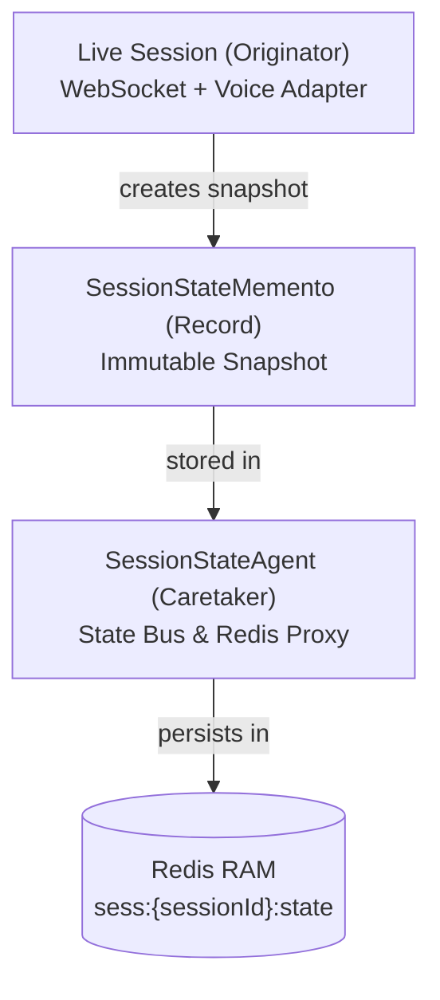
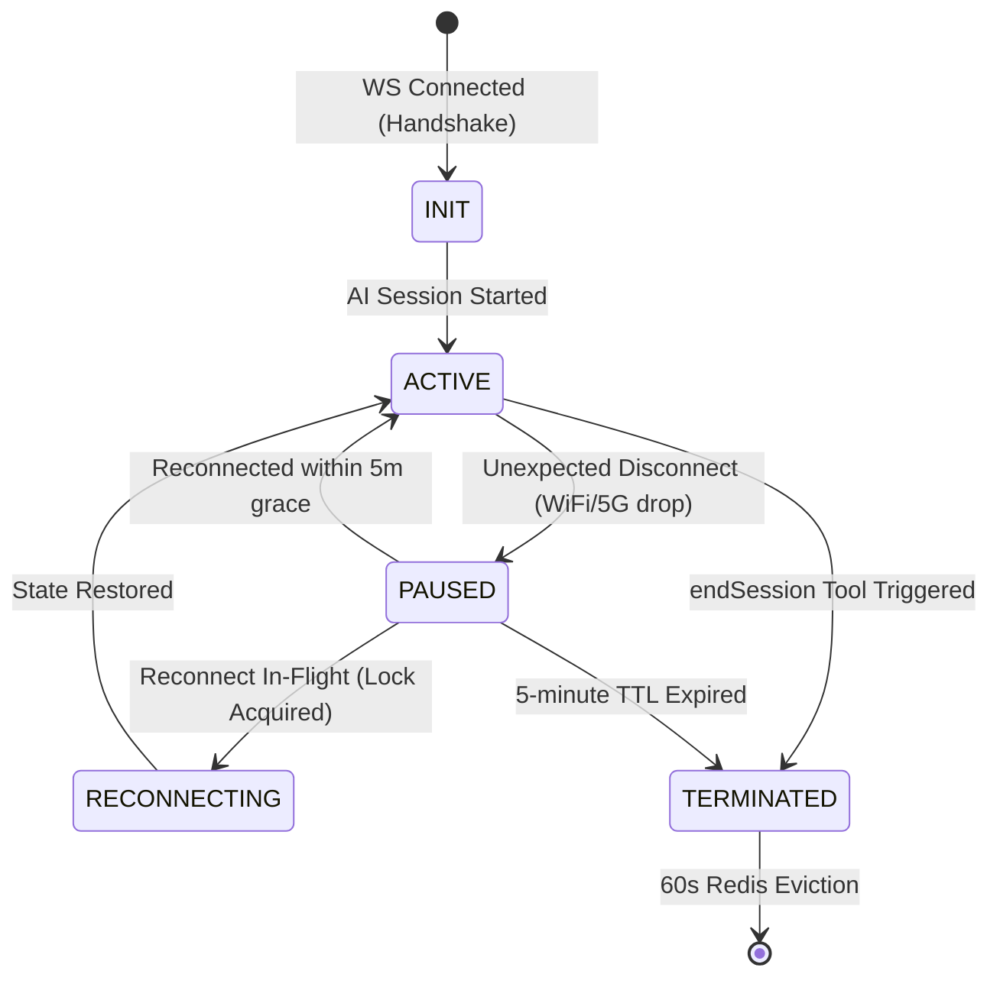
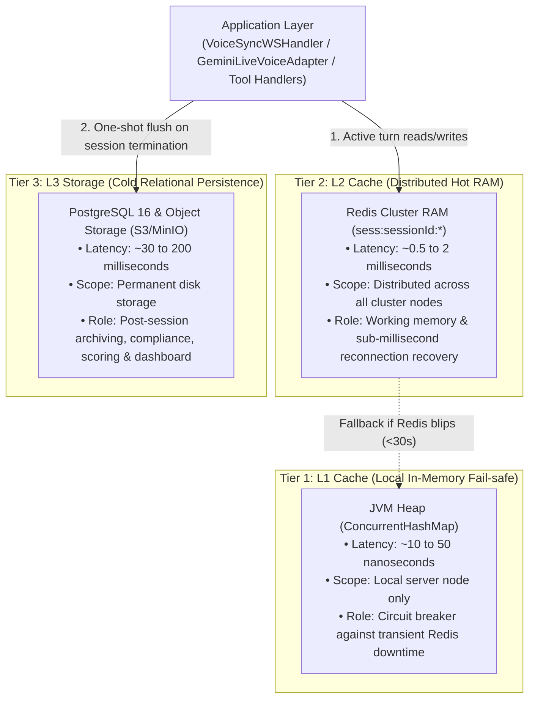
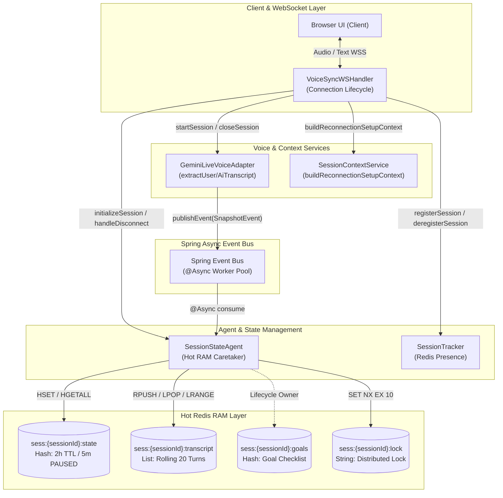
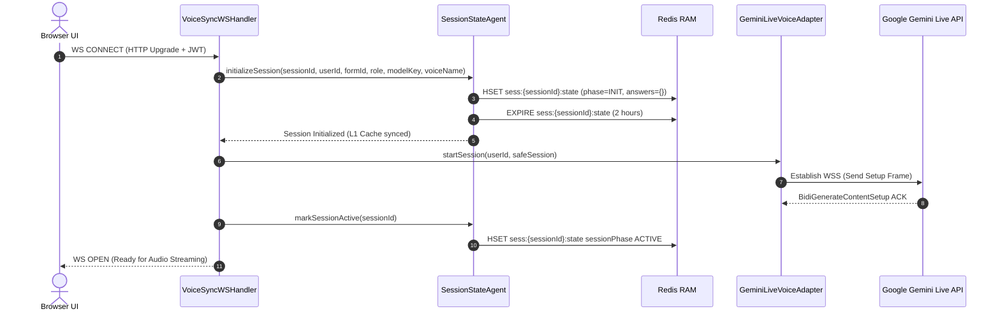
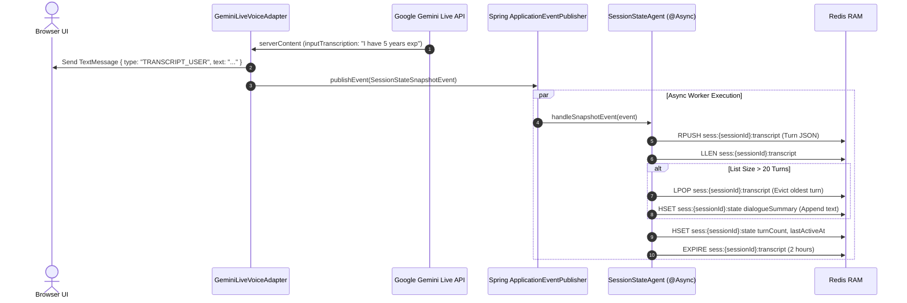
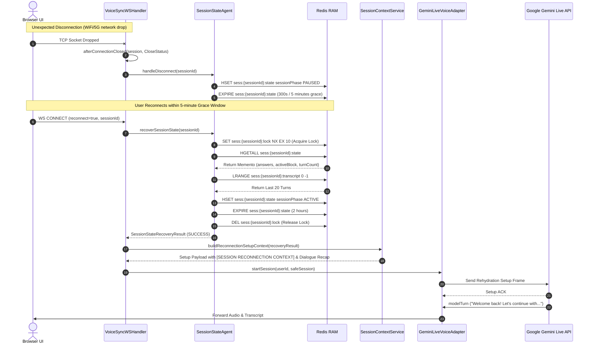
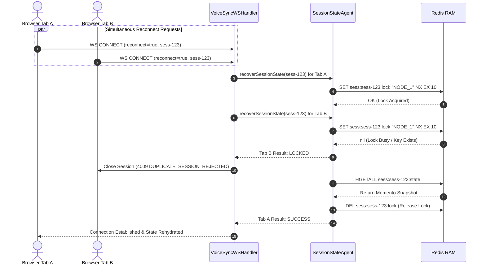
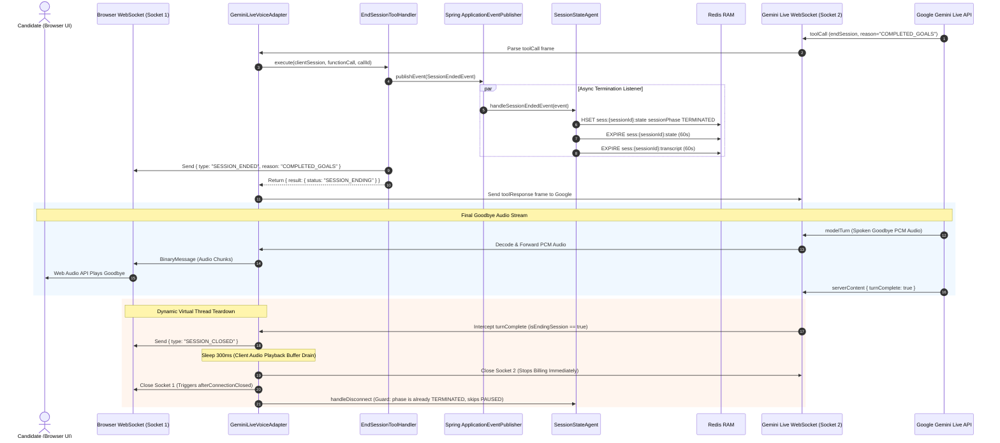

# 02: Group A — SessionStateAgent: Hot Redis RAM, Reconnection & Cross-Group Tool Orchestration

**Author**: Lead AI Backend Architect & Technical Writer  
**Platform**: reForm Enterprise Form Builder & Conversational AI Platform (`com.reForm.backend.ai`)  
**Target Document**: `backend/knowledge/pth/week5/02_group_a_session_state_agent.md`  
**Git Branch**: `pth/week5/toolCalls`  
**Date**: 2026-08-17  
**Version**: 1.0.0-RELEASE

> This is Group A Component #3 documentation. See `01_group_a_foundation_and_intelligent_tool_calling_mastery.md` for Components #1 (FormAiAgentProfile) and #2 (EndSessionToolHandler).

---

## Table of Contents

1. [Executive Summary](#1-executive-summary)
2. [Problem Statement: Why Do We Need This?](#2-problem-statement-why-do-we-need-this)
3. [Conceptual Design: Memento Pattern & Session Phases](#3-conceptual-design-memento-pattern--session-phases)
   - [Q&A: What is the Memento Pattern?](#qa-what-is-the-memento-pattern)
   - [Q&A: Why Do We Need Session Phases?](#qa-why-do-we-need-session-phases)
4. [Architecture: Three-Tier Storage Model (L1 JVM Cache vs. L2 Hot Redis RAM vs. L3 Cold PostgreSQL)](#4-architecture-three-tier-storage-model-l1-jvm-cache-vs-l2-hot-redis-ram-vs-l3-cold-postgresql)
   - [Three-Tier Storage Comparison](#three-tier-storage-comparison)
   - [Concurrency, Capacity & Memory Sizing Across the Three Tiers](#concurrency-capacity--memory-sizing-across-the-three-tiers)
   - [Q&A: We already have SaveSessionTranscriptToolHandler — isn't that enough?](#qa-we-already-have-savesessiontranscripttoolhandler--isnt-that-enough)
   - [Q&A: What exactly is the Hot RAM on Redis for reconnection?](#qa-what-exactly-is-the-hot-ram-on-redis-for-reconnection)
5. [Baseline Audit: What Already Exists](#5-baseline-audit-what-already-exists)
6. [Hot Redis RAM Data Architecture](#6-hot-redis-ram-data-architecture)
   - [Key Namespace Design](#key-namespace-design)
   - [Structure 1: State Hash](#structure-1-sesssessionidstate--redis-hash--core-working-memory)
   - [Structure 2: Transcript List (Rolling Window)](#structure-2-sesssessionidtranscript--redis-list--rolling-dialogue-window)
   - [Structure 3: Goals Hash](#structure-3-sesssessionidgoals--redis-hash--goal-checklist)
   - [Structure 4: Distributed Lock](#structure-4-sesssessionidlock--redis-string--distributed-lock)
   - [TTL Policy](#ttl-policy)
   - [Timestamp Architecture: Old vs. New Pattern](#timestamp-architecture-old-vs-new-pattern)
7. [Cross-Group Tool Integration Design](#7-cross-group-tool-integration-design)
8. [How SessionStateAgent Integrates Into The System](#8-how-sessionstateagent-integrates-into-the-system)
9. [Sequence Diagrams](#9-sequence-diagrams)
   - [Sequence 1: Fresh Session Initialization](#sequence-1-fresh-session-initialization)
   - [Sequence 2: Active Turn Snapshotting](#sequence-2-active-turn-snapshotting)
   - [Sequence 3: Unexpected Disconnect & Reconnect](#sequence-3-unexpected-disconnect--reconnect)
   - [Sequence 4: Concurrent Multi-Tab Reconnect (Distributed Lock)](#sequence-4-concurrent-multi-tab-reconnect-distributed-lock)
   - [Sequence 5: Graceful Session Termination](#sequence-5-graceful-session-termination)
10. [Implementation Plan (File-by-File)](#10-implementation-plan-file-by-file)
    - [New Files Created](#new-files-created)
    - [Modified Files](#modified-files)
11. [Exhaustive Edge Cases](#11-exhaustive-edge-cases)
12. [Step-by-Step Implementation Order](#12-step-by-step-implementation-order)
13. [Verification Plan](#13-verification-plan)
14. [Q&A Knowledge Base](#14-qa-knowledge-base)
    - [Q1: Why Memento Pattern over just updating a Redis Hash directly in WSHandler?](#q1-why-memento-pattern-over-just-updating-a-redis-hash-directly-in-wshandler)
    - [Q2: Why Redis List for transcripts instead of a single JSON array string?](#q2-why-redis-list-for-transcripts-instead-of-a-single-json-array-string)
    - [Q3: Why 20 turns as the rolling window limit?](#q3-why-20-turns-as-the-rolling-window-limit)
    - [Q4: Why is handleDisconnect() called BEFORE sessionTracker.deregisterSession()?](#q4-why-is-handledisconnect-called-before-sessiontrackerderegistersession)
    - [Q5: How does the L1 JVM cache work together with Redis?](#q5-how-does-the-l1-jvm-cache-work-together-with-redis)
    - [Q6: What happens to the goals (sess:{sessionId}:goals) on reconnect?](#q6-what-happens-to-the-goals-sesssessionidgoals-on-reconnect)
    - [Q7: Why avoid inline System.currentTimeMillis() double-calls in distributed multi-server deployments?](#q7-why-avoid-inline-systemcurrenttimemillis-double-calls-in-distributed-multi-server-deployments)
    - [Q8: Is the L1 JVM cache good enough to handle massive concurrency, and how many sessions can a single node hold?](#q8-is-the-l1-jvm-cache-good-enough-to-handle-massive-concurrency-and-how-many-sessions-can-a-single-node-hold)

---

## 1. Executive Summary

`SessionStateAgent` is Group A Component #3. It is the **hot memory layer** of the reForm AI platform — a Spring `@Component` responsible for capturing and restoring session working state in Redis RAM with sub-millisecond latency, enabling:

1. **Seamless reconnection** after network disruption (WiFi/5G switch, tab refresh, server rebalancing).
2. **Zero answer loss** — all validated field responses are captured per-turn in Redis before PostgreSQL persistence happens.
3. **Cross-group tool orchestration** — every tool group (A through F) queries or writes session context through this agent as a centralized in-memory bus.

The implementation follows the **Memento Design Pattern** and a strict **5-phase state machine** (`INIT` → `ACTIVE` ↔ `PAUSED` → `TERMINATED`).

---

## 2. Problem Statement: Why Do We Need This?

### The Reconnection Problem
Voice interview sessions on reForm can last 10–30 minutes. During that time, the user's network is not guaranteed to be stable. A momentary WiFi/5G switch can kill the WebSocket socket. Without session state recovery:
- The respondent must start the **entire interview from scratch**.
- All partial answers are **lost** (there is no cold storage write mid-session).
- The AI has **no memory** of the conversation and re-asks answered questions.

This is a catastrophic user experience failure.

### The Cross-Group Coordination Problem
Without a central session state bus, every tool handler that needs to know "what answers have been collected so far?" or "what block is the user on?" must issue a **synchronous PostgreSQL query** mid-voice-turn. Under load, this adds 30–200ms latency per tool call — audible as a hesitation in the AI's speech.

### Solution
A **Hot Redis RAM layer** keyed by `sessionId`, updated asynchronously per-turn, and queryable in $O(1)$ time. All tool groups read from this layer during a live session. Only after the session terminates does data flush to cold PostgreSQL storage.

---

## 3. Conceptual Design: Memento Pattern & Session Phases

### Q&A: What is the Memento Pattern?

**Q: What is the Memento Pattern and why is it used here?**

**A:** The Memento Pattern is a behavioral design pattern that captures and externalizes an object's internal state so that it can be restored later — without violating encapsulation.

In the context of `SessionStateAgent`:

- The **Originator** is the live session (voice adapter + WebSocket handler + all tool handlers collectively).
- The **Memento** is `SessionStateMemento` — a Java record that holds a snapshot of the session's working state at any given moment (answers, active block, turn count, phase, timestamps).
- The **Caretaker** is `SessionStateAgent` — it stores, retrieves, and manages the lifecycle of these mementos in Redis.

Why this pattern specifically? Because:
1. The session working state is spread across multiple objects (`VoiceSyncWSHandler`, `GeminiLiveVoiceAdapter`, various tool handlers). The Memento pattern gives us a clean, immutable object to carry all of this state without leaking internals of any individual object.
2. On reconnection, the Caretaker (`SessionStateAgent`) restores the Memento into a new session context — making the user experience seamless.



---

### Q&A: Why Do We Need Session Phases?

**Q: Why do we need session phases? Can't we just store data and retrieve it?**

**A:** Session phases are a **state machine guard** that prevent illegal state transitions. Without them:
- A disconnected session's state could be overwritten by a new session initialization.
- A `TERMINATED` session could still receive `recordAnswer()` writes from a dangling tool callback.
- Reconnection logic cannot distinguish between "this session is recoverable (PAUSED)" vs "this is a new session (never existed)" vs "this session expired (timeout)".

The 5-phase state machine (`INIT` → `ACTIVE` ↔ `PAUSED` → `TERMINATED` / `RECONNECTING`) provides explicit guards at every transition. Each phase has a **different TTL policy** in Redis:

| Phase | TTL | Meaning |
| :--- | :--- | :--- |
| `INIT` | 2 hours | Handshake in progress |
| `ACTIVE` | 2 hours, refreshed on every turn | Live conversation running |
| `PAUSED` | 5 minutes | Socket disconnected, reconnect window open |
| `RECONNECTING` | Transient (lock-protected) | Reconnect handshake in flight |
| `TERMINATED` | 60 seconds | Session cleanly ended, final eviction countdown |



---

## 4. Architecture: Three-Tier Storage Model (L1 JVM Cache vs. L2 Hot Redis RAM vs. L3 Cold PostgreSQL)

The reForm AI platform uses a **three-tier storage model** to balance nanosecond-level execution safety, distributed cluster-wide synchronization, and long-term durability:



### Three-Tier Storage Comparison

| Tier | Layer | Storage Medium | Latency | Scope / Visibility | Survives Node Restart? | Primary Responsibilities |
| :--- | :--- | :--- | :--- | :--- | :--- | :--- |
| **L1** | **Local Cache** | JVM Heap (`ConcurrentHashMap`) | **Nanoseconds** ($<0.001\text{ms}$) | Single Server Pod | ❌ No | Emergency circuit breaker; prevents voice socket crashes during transient Redis connectivity blips. |
| **L2** | **Hot RAM** | Redis Cluster (`sess:{id}:*`) | **Sub-millisecond** ($~1\text{ms}$) | Cluster-Wide | ✅ Yes | In-flight working state, rolling transcripts (20 turns), answers map, locks, sub-ms reconnection. |
| **L3** | **Cold Storage** | PostgreSQL 16 & S3/MinIO | **Milliseconds** ($30\text{–}200\text{ms}$) | Cluster-Wide | ✅ Yes (Disk) | Final `FormSubmission`, `TranscriptLog`, `EvaluationScore`, permanent audit logs. |

---

### Concurrency, Capacity & Memory Sizing Across the Three Tiers

To design for massive multi-tenant scale (thousands of concurrent live voice sessions), each tier is optimized for specific concurrency constraints:

#### 1. Tier 1 (L1 JVM Cache) Concurrency & Capacity Analysis

* **Data Structure**: `ConcurrentHashMap<String, SessionStateMemento> l1Cache = new ConcurrentHashMap<>();`
* **Concurrency Primitives**:
  - **Lock-Free Reads**: `getSessionState()` and `getAnsweredCount()` rely on `volatile` memory semantics for direct array indexing with **zero locking overhead** (~10–30 nanoseconds).
  - **CAS & Lock Striping on Writes**: `l1Cache.put()` locks only the specific synchronized bin/bucket header matching `sessionId.hashCode()`. Two concurrent WebSocket sessions writing on different threads will never contend.
  - **Virtual Thread Efficiency**: Because L1 access is pure memory operations without thread-blocking system calls, Java 21 Virtual Threads execute without pinning the underlying OS carrier threads.

* **Memory Footprint per Session**:
  ```
  SessionStateMemento Heap Profile:
  ├── String references (sessionId, formId, userId, role, modelKey, voiceName) : ~300 bytes
  ├── Primitive ints & longs (turnCount, lastCompletedTurnId, timestamps)        : ~48 bytes
  ├── answers (Map<String, Object> holding 5 to 30 form responses)             : ~1,200 bytes
  ├── skippedFields (Set<String> holding 1 to 5 field IDs)                     : ~250 bytes
  └── dialogueSummary (String holding compressed evicted turns)                : ~1,500 bytes
  ──────────────────────────────────────────────────────────────────────────────────────────
  TOTAL ESTIMATED HEAP USAGE PER LIVE SESSION:                                 ≈ 2 to 4 KB
  ```

* **Single-Node Session Capacity Formula**:
  $$\text{Concurrent Sessions} = \frac{\text{Allocated JVM Heap for L1 Cache}}{\text{Average Footprint per Session (4 KB)}}$$

  | Dedicated L1 Heap Allocation | Max Supported Concurrent Sessions on **1 Server Pod** |
  | :--- | :--- |
  | **50 MB** | ~12,500 sessions |
  | **200 MB** | **~50,000 sessions** |
  | **500 MB** | ~125,000 sessions |

  > **Architecture Insight**: A standard backend server pod will exhaust network bandwidth or OS WebSocket file descriptors (typically 10,000 to 20,000 active bi-directional voice streams) **long before** L1 JVM RAM is exhausted.

#### 2. Tier 2 (L2 Hot Redis RAM) Concurrency Architecture

* **Engine**: In-memory single-threaded event loop per Redis shard with multiplexed I/O (`epoll`/`kqueue`).
* **Atomic Operations**:
  - `HSET` / `HGETALL` on `sess:{sessionId}:state` are single-cycle atomic hash mutations.
  - `RPUSH` / `LPOP` on `sess:{sessionId}:transcript` guarantee FIFO chronological order with zero application-level transaction locking.
  - `SET NX EX 10` on `sess:{sessionId}:lock` provides atomic distributed mutual exclusion against race conditions (e.g. user opening duplicate tabs).
* **Horizontal Scaling**: Scales linearly across Redis Cluster shards with cluster proxying / Lettuce connection pooling.

#### 3. Tier 3 (L3 PostgreSQL Cold Persistence) Concurrency Strategy

* **Engine**: PostgreSQL 16 ACID relational database with HikariCP connection pooling.
* **Non-Blocking Execution**: Zero database operations occur during active speech turns. All writes to PostgreSQL (`FormSubmission`, `TranscriptLog`) are dispatched asynchronously upon session finalization via Spring `@Async` Virtual Thread workers, ensuring that slow disk I/O (30–200ms) never impacts real-time voice latency.

---


### Q&A: We already have SaveSessionTranscriptToolHandler — isn't that enough?

**Q: We have `SaveSessionTranscriptToolHandler` already — isn't that enough for transcript storage?**

**A:** `SaveSessionTranscriptToolHandler` is an **L3 cold storage tool** — it is called by the AI at the end of a session (during tool calling), and it writes the transcript to PostgreSQL for archival, review, and compliance. It is a **one-shot finalization operation**.

For reconnection recovery, we need something completely different:
1. **Per-turn granularity**: The transcript must be updated after every single conversational turn, not just at session end. If the user disconnects after turn 7 of 20, we need all 7 turns available instantly in L2 Hot Redis RAM.
2. **Zero latency**: On reconnect, we must restore context in milliseconds. A PostgreSQL query for transcript rows takes 30–200ms. Redis retrieval is sub-millisecond.
3. **Idempotent writes**: Multiple turns can be written to Redis simultaneously without transaction coordination. Redis `RPUSH` is atomic by nature.

So the layers serve different purposes:
- **`SessionStateAgent` / L2 Redis**: Hot RAM for reconnection recovery during active sessions.
- **`SessionStateAgent` / L1 JVM**: Local fail-safe circuit breaker if L2 is temporarily unreachable.
- **`SaveSessionTranscriptToolHandler` / L3 PostgreSQL**: Cold storage for post-session archival and display.

### Q&A: What exactly is the Hot RAM on Redis for reconnection?

**Q: I'm just talking about the hot RAM on Redis for reconnection — what exactly does it store and how does it work?**

**A:** The Hot Redis RAM layer for reconnection stores **exactly the working state needed to resume the session from where it was interrupted**:

1. **Session state** (`sess:{sessionId}:state`, Redis Hash):
   - What phase the session was in (should be `PAUSED` on reconnect).
   - Which block the user was answering when they disconnected.
   - All answers verified so far (so they don't get re-asked).
   - The voice configuration (so the reconnected session uses the same voice/model).

2. **Transcript history** (`sess:{sessionId}:transcript`, Redis List):
   - The last 20 turns of conversation as JSON objects.
   - Older turns are summarized in `dialogueSummary` (rolling window).
   - On reconnection, `buildReconnectionSetupContext()` builds a Gemini Live setup frame that injects this dialogue as context, so the AI "remembers" everything.

3. **Distributed lock** (`sess:{sessionId}:lock`, Redis String):
   - A `SET ... NX EX 10` atomic lock to prevent two browser tabs from simultaneously claiming the reconnect.

When the user reconnects, `VoiceSyncWSHandler` detects the `reconnect=true` query param, calls `sessionStateAgent.recoverSessionState(sessionId)`, and passes the `SessionStateRecoveryResult` to `SessionContextService.buildReconnectionSetupContext()` — which builds the Gemini Live setup message with the full dialogue recap injected. The AI then greets the user with *"Welcome back! Let's continue where we left off..."* without re-asking answered questions.

---

## 5. Baseline Audit: What Already Exists

Before building, we audited the codebase to avoid duplication and conflicts:

| Existing Component | Key Detail | Implication for `SessionStateAgent` |
| :--- | :--- | :--- |
| **`SessionTracker.java`** (`@Service`) | Uses Redis key prefix `session:{userId}` (Hash). TTL: 2 hours. Tracks WebSocket presence: `nodeId`, `connectedAt`, `sessionId`. | `SessionStateAgent` MUST use a **different namespace** — `sess:{sessionId}:*` — keyed by **sessionId UUID** (not userId). These two keys serve completely different purposes and must NOT collide. |
| **`LayoutAgent.java`** (`@Component`) | Pattern: `@EventListener` + `@Async` for `FormLayoutModificationEvent`. Processes layout changes off the WebSocket thread. | `SessionStateAgent` follows the **exact same pattern** — `@Component` + `@EventListener` + `@Async` for `SessionStateSnapshotEvent`. |
| **`SessionEndedEvent.java`** (`record`) | Already exists. Carries `sessionId`, `formId`, `submissionId`, `closeReason`. | `SessionStateAgent` listens to this event for TERMINATED transition. Do **NOT** create a duplicate event. |
| **`GeminiLiveVoiceAdapter.java`** | `extractUserTranscript()` and `extractAiTranscript()` already extract `inputTranscription.text` and `outputTranscription.text` from Google. | These methods are the **precise injection points** — just add `publishEvent()` after the existing `sendMessage()` call. Zero new extraction logic needed. |
| **`VoiceMode.java`** (`enum`) | Lives in `ai/domain/`. | `SessionPhase.java` goes in the same package (`ai/domain/`). |
| **`RedisTemplate<String, Object>`** | Already configured in `RedisConfig.java` with `StringRedisSerializer` for keys, `GenericJacksonJsonRedisSerializer` for values. | `SessionStateAgent` injects this template directly. No new Redis beans or config needed. |
| **`ApplicationEventPublisher`** | Used by `LayoutAgent` via Spring's context. NOT yet injected in `GeminiLiveVoiceAdapter` — only the import exists, not the field. | Must add `private final ApplicationEventPublisher applicationEventPublisher;` field to `GeminiLiveVoiceAdapter`'s `@RequiredArgsConstructor` constructor. |

---

## 6. Hot Redis RAM Data Architecture

### Key Namespace Design

The key naming convention is `sess:{sessionId}:{type}`:

```
sess:{sessionId}:state       → Redis Hash  (core working memory)
sess:{sessionId}:transcript  → Redis List  (rolling 20-turn dialogue window)
sess:{sessionId}:goals       → Redis Hash  (goal checklist, owned by MemoryGoalAgent)
sess:{sessionId}:lock        → Redis String (distributed reconnect lock)
```

Why `sess:` prefix instead of `session:`?  
`SessionTracker` already uses `session:{userId}` — a 2-letter prefix difference (`sess:` vs `session:`) combined with keying by `sessionId` UUID (not userId) ensures **zero namespace collision**.

---

### Structure 1: `sess:{sessionId}:state` — Redis Hash — Core Working Memory

The central coordination register. Every tool group reads from or writes to this structure during a live session.

| Field | Type | Description |
| :--- | :--- | :--- |
| `sessionId` | String (UUID) | The WebSocket session ID |
| `sessionPhase` | String (enum) | Current phase: `INIT`, `ACTIVE`, `PAUSED`, `RECONNECTING`, `TERMINATED` |
| `formId` | String (UUID) | The form being answered or built |
| `userId` | String (UUID) | Respondent user ID |
| `role` | String | `FORM_FILLER` or `FORM_BUILDER` |
| `modelKey` | String | AI model key (e.g. `GEMINI_3_1_LIVE`) — from `FormAiAgentProfile` |
| `voiceName` | String | Active voice persona (e.g. `Puck`) — from `FormAiAgentProfile` |
| `nodeId` | String | Server node that owns this session (for cluster eviction) |
| `activeBlockId` | String | Current block being answered (updated by `SaveFieldResponseToolHandler`) |
| `activeBlockIndex` | int | Zero-based index of current block in layout |
| `turnCount` | int | Total turns completed so far |
| `lastCompletedTurnId` | int | Last turn fully committed — for mid-turn interruption detection |
| `answers` | JSON String | `{"fullName":"Jane","experience":"5 years"}` — all verified field answers |
| `skippedFields` | JSON String | `["block-phone","block-linkedin"]` — block IDs user declined to answer |
| `uploadedFileIds` | JSON String | `["file-uuid-1","file-uuid-2"]` — S3/MinIO file IDs from upload tools |
| `dialogueSummary` | String | Compressed summary of turns older than the rolling window (>20 turns) |
| `connectedAt` | long | Session start timestamp (epoch ms) |
| `lastActiveAt` | long | Last activity timestamp (epoch ms) — refreshed on every turn |

---

### Structure 2: `sess:{sessionId}:transcript` — Redis List — Rolling Dialogue Window

An **append-only log** of conversational turns for reconnection context rehydration.

Each entry in the list is a JSON-serialized `TranscriptTurn` record:

```json
{
  "turnId": 7,
  "role": "user",
  "text": "I have 5 years of experience in distributed systems.",
  "timestamp": 1723891234567,
  "activeBlockId": "block-experience"
}
```

#### Rolling Window Policy (Memory Safety)

Without a cap, a 30-minute interview could accumulate hundreds of turns, consuming unbounded Redis memory.

**Policy**:
1. On each new turn: `RPUSH sess:{sessionId}:transcript <turnJson>`.
2. After push: `LLEN sess:{sessionId}:transcript`.
3. If `LLEN > 20`:
   - `LPOP` the oldest entry (leftmost).
   - Append the oldest turn's text to `dialogueSummary` in the state hash.
4. The list always holds **exactly the most recent 20 turns**.
5. `dialogueSummary` grows as a compressed text blob of all evicted turns.

On reconnection: `buildReconnectionSetupContext()` passes both the `dialogueSummary` (older context) and the last 20 raw turns (recent context) to Gemini Live's system instruction.

---

### Structure 3: `sess:{sessionId}:goals` — Redis Hash — Goal Checklist

Coordinated with Group A Component #4 (`MemoryGoalAgent`). Stores the interview goal progression.

```
sess:{sessionId}:goals
  goal_intro          → "VERIFIED"
  goal_experience     → "VERIFIED"
  goal_system_design  → "PENDING"
  goal_culture_fit    → "PENDING"
  goal_behavioral     → "SKIPPED"
```

**Ownership boundary**:
- `SessionStateAgent` owns **key lifecycle** (creates the key on `initializeSession()`, evicts on `terminateSession()`).
- `MemoryGoalAgent` (Component #4) owns **field read/write** on individual goal entries.

This clear ownership boundary prevents circular dependencies between the two agents.

---

### Structure 4: `sess:{sessionId}:lock` — Redis String — Distributed Lock

Prevents split-brain session duplication when a user opens the same interview link in two browser tabs simultaneously.

```
SET sess:{sessionId}:lock "NODE_a4f2b1:1723891234567" NX EX 10
```

- **`NX`**: Only set if the key does NOT already exist — makes the acquire atomic.
- **`EX 10`**: The lock auto-expires in 10 seconds even if the server crashes — prevents deadlocks.
- **First tab acquires**: Lock set → session recovery proceeds normally.
- **Second tab acquires**: Lock already exists → `recoverSessionState()` returns `LOCKED` status → `VoiceSyncWSHandler` closes the second socket with `4009 DUPLICATE_SESSION_REJECTED`.

---

### TTL Policy

| Phase | TTL | Rationale |
| :--- | :--- | :--- |
| `INIT` → `ACTIVE` | **2 hours** | Long enough to cover any interview session |
| `ACTIVE` | **2 hours**, refreshed on every turn | Each turn resets the clock — an actively answering user never expires |
| `PAUSED` | **5 minutes** | Grace window after network disconnect — reasonable for WiFi/5G switch |
| `TERMINATED` | **60 seconds** | Just enough for final async cleanup (billing, PostgreSQL flush) before eviction |

---

### Timestamp Architecture: Old vs. New Pattern

In distributed real-time systems where voice sessions migrate across pods or reconnect through different WebSocket gateways, timestamp consistency is critical for session state reconciliation and audit trails.

#### ❌ The Old Code (Problematic Inline Pattern)

```java
// 1. In SessionStateMemento.empty():
public static SessionStateMemento empty(String sessionId) {
    return new SessionStateMemento(
        sessionId, null, null, null, null, null,
        SessionPhase.INIT, null, 0, 0,
        Map.of(), Set.of(), "", 0,
        System.currentTimeMillis(), System.currentTimeMillis() // ❌ Double call
    );
}

// 2. In SessionStateAgent.updatePhase():
redisTemplate.opsForHash().put(stateKey, "lastActiveAt", System.currentTimeMillis()); // ❌ Call 1
l1Cache.put(sessionId, new SessionStateMemento(
    ..., existing.connectedAt(), System.currentTimeMillis() // ❌ Call 2
));

// 3. In GeminiLiveVoiceAdapter & Tool Handlers:
new TranscriptTurn(turnId, "user", userTranscript, System.currentTimeMillis(), activeBlockId) // ❌ Inline call
```

#### ⚠️ Why the Old Code Is Not That Good:

1. **Non-Deterministic Double-Call Divergence**:
   - Calling `System.currentTimeMillis()` multiple times within the same method or record constructor evaluates the clock at distinct CPU cycles.
   - In `SessionStateMemento.empty()`, if an OS thread context-switch occurs between argument evaluations, `connectedAt` can be **smaller** than `lastActiveAt` at initialization time.
   - In `updatePhase()`, the timestamp written to Redis Hash and the timestamp stored in the L1 JVM cache will differ, causing state divergence between the cluster cache and the local cache.

2. **Distributed Cluster Clock Drift & NTP Jitter**:
   - `System.currentTimeMillis()` reads the host operating system's wall-clock time.
   - When a user experiences a WiFi/5G drop on Node 1 and reconnects 2 seconds later to Node 2, slight NTP offset or leap-second adjustments between Node 1 and Node 2 can produce out-of-order event timestamps or inverted duration calculations.

3. **Legacy Java 1.0 Heritage**:
   - `System.currentTimeMillis()` is a primitive Java 1.0 method without explicit UTC timezone anchoring or integration with modern Java 8+ `java.time` types.

---

#### ✅ The New Code (Modern Single-Capture UTC Pattern)

```java
// 1. In SessionStateMemento.empty():
public static SessionStateMemento empty(String sessionId) {
    long now = Instant.now().toEpochMilli(); // ✅ Single capture
    return new SessionStateMemento(
        sessionId, null, null, null, null, null,
        SessionPhase.INIT, null, 0, 0,
        Map.of(), Set.of(), "", 0,
        now, now // ✅ Identical atomic point-in-time
    );
}

// 2. In SessionStateAgent.updatePhase():
long now = Instant.now().toEpochMilli(); // ✅ Single capture
redisTemplate.opsForHash().put(stateKey, "lastActiveAt", now);
l1Cache.put(sessionId, new SessionStateMemento(
    ..., existing.connectedAt(), now // ✅ Guaranteed synchronized with Redis
));

// 3. In GeminiLiveVoiceAdapter (extractUserTranscript & extractAiTranscript):
long now = Instant.now().toEpochMilli(); // ✅ Single capture per turn
applicationEventPublisher.publishEvent(new SessionStateSnapshotEvent(
    clientSession.getId(),
    new TranscriptTurn(turnId, "user", userTranscript, now, activeBlockId)
));
```

#### 🌟 Why the New Code Is Good:

1. **Guaranteed Atomic Snapshot Consistency**:
   - Capturing `long now = Instant.now().toEpochMilli()` once per operation ensures all composite objects, events, and Redis records created in that scope share the **exact same monotonic instant**.
   - Guaranteed `connectedAt == lastActiveAt` at fresh session initialization.
   - Zero divergence between Redis Hot RAM and L1 JVM in-memory fallback.

2. **Explicit UTC Timeline Anchoring**:
   - `java.time.Instant` is mathematically defined as a point on the ISO-8601 UTC timeline, eliminating local timezone ambiguity across multi-region server clusters.

3. **Multi-Node Cluster Safety**:
   - Eliminates intra-operation skew.
   - Combined with Redis-level TTL leases and Redis `RPUSH` FIFO ordering, conversation sequence integrity is strictly preserved regardless of minor inter-node clock jitter.

---


## 7. Cross-Group Tool Integration Design

`SessionStateAgent` acts as the **central in-memory bus** for all tool groups. No tool group needs to issue PostgreSQL queries mid-session for state they can read from Redis in $O(1)$.

| Tool Group | Tool | Integration Point | What SessionStateAgent Does |
| :--- | :--- | :--- | :--- |
| **Group A** | `EndSessionToolHandler` | Publishes `SessionEndedEvent` | Listens via `@Async @EventListener` → transitions to `TERMINATED` |
| **Group A** | `SaveFieldResponseToolHandler` | Calls `recordAnswer(sessionId, fieldId, value)` | Updates `answers` JSON map in `sess:{id}:state` atomically |
| **Group A** | `LookupFormProgressToolHandler` | Calls `getAnsweredCount(sessionId)` | Returns `answers.size()` from Redis in $O(1)$ — zero SQL |
| **Group A** | `SkipQuestionToolHandler` | Calls `recordSkippedField(sessionId, fieldId, reason)` | Adds to `skippedFields` set in state hash |
| **Group B** | `ModifyFormLayoutToolHandler` | Reads `formId` from state | Retrieves form context without WebSocket attribute lookup |
| **Group C** | `EvaluateResponseToolHandler` | Reads `answers` map for scoring | Queries partial answers for evaluation context |
| **Group D** | `RequestFileUploadToolHandler` | Writes `uploadedFileIds` | Appends S3/MinIO file ID to `uploadedFileIds` list |
| **Group E** | `FlagForHumanReviewToolHandler` | Reads `answers`, `userId`, `formId` | Packages session context for reviewer notification |
| **Group F** | `MemoryGoalAgent` (Component #4) | Reads/writes `sess:{id}:goals` | Tracks goal `PENDING` → `VERIFIED` transitions |

---

## 8. How SessionStateAgent Integrates Into The System



---

## 9. Sequence Diagrams

### Sequence 1: Fresh Session Initialization



---

### Sequence 2: Active Turn Snapshotting



---

### Sequence 3: Unexpected Disconnect & Reconnect



---

### Sequence 4: Concurrent Multi-Tab Reconnect (Distributed Lock)



---

### Sequence 5: Graceful Session Termination



---

## 10. Implementation Plan (File-by-File)

### New Files Created

#### Domain Package: `com.reForm.backend.ai.domain`

**`SessionPhase.java`** — State machine enum.
```java
public enum SessionPhase {
    INIT,           // Handshake auth'd, persona loading
    ACTIVE,         // Live conversation running
    PAUSED,         // Socket disconnected, 5min grace window
    RECONNECTING,   // Reconnect in flight, distributed lock held
    TERMINATED      // Cleanly ended, 60s Redis eviction countdown
}
```

**`TranscriptTurn.java`** — Per-turn record.
```java
public record TranscriptTurn(
    int turnId,
    String role,        // "user" or "model"
    String text,
    long timestamp,
    String activeBlockId
) {}
```

**`SessionStateMemento.java`** — Complete session snapshot.
```java
public record SessionStateMemento(
    String sessionId,
    String formId,
    String userId,
    String role,
    String modelKey,
    String voiceName,
    SessionPhase sessionPhase,
    String activeBlockId,
    int activeBlockIndex,
    int turnCount,
    Map<String, Object> answers,
    Set<String> skippedFields,
    String dialogueSummary,
    int lastCompletedTurnId,
    long connectedAt,
    long lastActiveAt
) {
    public static SessionStateMemento empty(String sessionId) {
        long now = Instant.now().toEpochMilli();
        return new SessionStateMemento(
            sessionId, null, null, null, null, null,
            SessionPhase.INIT, null, 0, 0,
            Map.of(), Set.of(), "", 0,
            now, now
        );
    }
}
```

**`SessionStateRecoveryResult.java`** — Reconnection result carrier.
```java
public record SessionStateRecoveryResult(
    String sessionId,
    Status status,        // SUCCESS, EXPIRED, NOT_FOUND, LOCKED
    SessionStateMemento memento,
    List<TranscriptTurn> recentTurns,
    String message
) {}
```

---

#### Event Package: `com.reForm.backend.ai.event`

**`SessionStateSnapshotEvent.java`** — Per-turn async event.

Published after each transcribed user or AI turn. Consumed by `SessionStateAgent` via `@Async @EventListener`.

```java
public record SessionStateSnapshotEvent(
    String sessionId,
    TranscriptTurn turn,
    Map<String, Object> updatedAnswers  // null if just a transcript turn
) {}
```

> **Why NOT use `SessionEndedEvent` for transcript snapshots?**  
> `SessionEndedEvent` already exists and fires ONCE at session termination. `SessionStateSnapshotEvent` fires on EVERY conversational turn during the session. These are entirely different lifecycles.

---

#### Agent Package: `com.reForm.backend.ai.agent`

**`SessionStateAgent.java`** — Core caretaker agent.

Follows the `LayoutAgent` pattern: `@Component` + `@EventListener` + `@Async`.

**Public API surface**:

| Method | Caller | Description |
| :--- | :--- | :--- |
| `initializeSession(...)` | `VoiceSyncWSHandler.afterConnectionEstablished()` | Creates all Redis keys with 2-hour TTL. Phase = `INIT`. |
| `markSessionActive(sessionId)` | `VoiceSyncWSHandler` after Gemini setup ACK | `INIT` → `ACTIVE`. |
| `handleDisconnect(sessionId)` | `VoiceSyncWSHandler.afterConnectionClosed()` | `ACTIVE` → `PAUSED`, TTL reduced to 5 min. Guards if already `TERMINATED`. |
| `recoverSessionState(sessionId)` | `VoiceSyncWSHandler` on `reconnect=true` | Acquires distributed lock, reads full memento, restores `ACTIVE`. Returns `SessionStateRecoveryResult`. |
| `recordAnswer(sessionId, fieldId, value)` | `SaveFieldResponseToolHandler` | Atomically updates `answers` JSON map. Refreshes TTL. |
| `recordSkippedField(sessionId, fieldId, reason)` | `SkipQuestionToolHandler` | Adds to `skippedFields` set. |
| `terminateSession(sessionId, reason)` | Via `SessionEndedEvent` listener | `TERMINATED` phase, 60s TTL, releases lock, removes L1 cache entry. |
| `getAnsweredCount(sessionId)` | `LookupFormProgressToolHandler` | `answers.size()` from Redis — $O(1)$, zero SQL. |
| `getAnswers(sessionId)` | Multiple tool groups | Full answers map from Redis. |
| `getSessionState(sessionId)` | Internal + `VoiceSyncWSHandler` | Full `SessionStateMemento` from Redis with L1 JVM cache fallback. |

**Async Event Listeners**:
```java
@Async @EventListener
void handleSnapshotEvent(SessionStateSnapshotEvent event)
// → RPUSH transcript, trim if >20, update dialogueSummary, refresh TTL

@Async @EventListener
void handleSessionEndedEvent(SessionEndedEvent event)
// → terminateSession(event.sessionId(), event.closeReason())
```

**Circuit Breaker / L1 Cache**:
- `ConcurrentHashMap<String, SessionStateMemento>` JVM in-memory cache.
- All write operations update both Redis AND the L1 cache.
- All read operations try Redis first; fall back to L1 on `RedisConnectionException`.
- Voice sessions continue operating degraded during transient Redis downtime without any exception thrown or stream interrupted.

---

### Modified Files

#### `GeminiLiveVoiceAdapter.java`

**Where**: `extractUserTranscript()` and `extractAiTranscript()` methods.  
**What**: Added `ApplicationEventPublisher` as a new injected field. After each `sendMessage()` to the browser, publish `SessionStateSnapshotEvent` via `applicationEventPublisher.publishEvent(...)`.  

**Key design decision**: Used `session.getAttributes().computeIfAbsent("turnCounter", k -> new AtomicInteger(1))` stored in WebSocket session attributes as a lightweight per-session turn counter — no shared state, no thread safety issues.

**Injection note**: Although `FormLayoutModificationEvent` was imported, `ApplicationEventPublisher` was NOT in the constructor fields. Added as new `@RequiredArgsConstructor` field.

---

#### `VoiceSyncWSHandler.java`

**Where**: `afterConnectionEstablished()` and `afterConnectionClosed()`.

**`afterConnectionEstablished()` changes**:
1. Extract `formId`, `modelKey`, `voiceName`, and `reconnect` boolean from session attributes.
2. After `sessionTracker.registerSession()`: check `isReconnect`.
   - If **fresh**: call `sessionStateAgent.initializeSession(...)`.
   - If **reconnect**: call `sessionStateAgent.recoverSessionState(session.getId())` and store result in session attributes.
3. After `adapter.startSession()`: call `sessionStateAgent.markSessionActive(session.getId())`.

**`afterConnectionClosed()` changes**:
- After `adapter.closeSession(session)` and BEFORE `sessionTracker.deregisterSession(userId)`:
  - Call `sessionStateAgent.handleDisconnect(session.getId())`.

**Why this ordering matters**: `handleDisconnect()` writes `PAUSED` phase to Redis. `deregisterSession()` removes the presence key. If we did it in reverse order, a reconnecting node would find no presence key and might incorrectly conclude there was no session to recover.

---

#### `SessionContextService.java`

**What**: Added new method `buildReconnectionSetupContext(SessionStateRecoveryResult result)`.

**Logic**:
1. Calls existing `buildSetupContext()` using memento's `userId`, `role`, `formId`, `modelKey` — gets full persona prompt + tool declarations.
2. Appends a `[SESSION RECONNECTION CONTEXT]` section to the system instruction:
   - Lists all verified answers so far.
   - Injects the last 20 dialogue turns in chronological order.
   - Adds resumption directives: greet briefly, resume from `activeBlockId`, do NOT re-ask answered questions.

---

#### `EndSessionToolHandler.java`

**What**: Added `ApplicationEventPublisher` injection. Publishes `SessionEndedEvent` immediately after tagging `isEndingSession = true`.

**Why event-driven instead of direct call**: Keeps tool handlers completely decoupled from `SessionStateAgent` internals. The handler does not need to know how or where session state is cleaned up.

---

#### `SaveFieldResponseToolHandler.java`

**What**: Added `SessionStateAgent` injection. Added `sessionStateAgent.recordAnswer(clientSession.getId(), fieldId, value)` call immediately after logging the answer.

---

#### `LookupFormProgressToolHandler.java`

**What**: Added `SessionStateAgent` injection. Replaced the hardcoded `answeredFields = 5` mock with `sessionStateAgent.getAnsweredCount(clientSession.getId())` — live $O(1)$ Redis read.

---

## 11. Exhaustive Edge Cases

| # | Edge Case | Detection | Solution |
| :--- | :--- | :--- | :--- |
| **EC-1** | Rapid WiFi ↔ 5G flapping: disconnect/reconnect 5× in 10 seconds | `afterConnectionClosed()` fires repeatedly | `handleDisconnect()` is idempotent — `PAUSED` phase can be written repeatedly without side effects. Reconnect uses `putIfAbsent("reconnecting", true)` guard in session attributes. |
| **EC-2** | Two browser tabs reconnect simultaneously | Both call `recoverSessionState()` at same millisecond | `SET sess:{id}:lock {nodeId} NX EX 10` — atomic Redis lock. First tab acquires, second tab gets `nil` and returns `LOCKED`. Second WebSocket is closed with `4009 DUPLICATE_SESSION_REJECTED`. |
| **EC-3** | User returns after >5 minutes (grace period expired) | `recoverSessionState()` finds `HGETALL` returns empty map (key expired) | Returns `SessionStateRecoveryResult.expired()`. `VoiceSyncWSHandler` sends `{"type":"SESSION_EXPIRED"}` to browser. A fresh session is initialized. |
| **EC-4** | Mid-turn disconnect (socket drops while AI is speaking a sentence) | On recovery: `lastCompletedTurnId != turnCount` | `buildReconnectionSetupContext()` detects the mismatch and injects: *"The last AI turn was interrupted. Re-ask the question for block {{activeBlockId}}."* |
| **EC-5** | Load balancer routes reconnect to a different cluster node | Reconnecting node reads stale `nodeId` in state hash | Reconnecting node overwrites `nodeId` field with its own. Publishes `sess:{id}:evict` on Redis Pub/Sub. Old node subscribes and closes its dangling Socket 1 WebSocket. |
| **EC-6** | Redis connection failure during active session | `RedisConnectionException` thrown during Redis write | L1 JVM `ConcurrentHashMap` fallback. Agent logs warning and continues serving. All writes update L1 cache simultaneously, so no data is lost in the short term. |
| **EC-7** | Transcript exceeds 20 turns | `LLEN sess:{id}:transcript > 20` | `LPOP` removes the oldest turn. Oldest turn's text is appended to `dialogueSummary` field. Reconnection context still has full context through summary + recent turns. |
| **EC-8** | Tool handler calls `recordAnswer()` after TERMINATED | Phase check inside `recordAnswer()` | Guard at top: `if (getSessionPhase(sessionId) == TERMINATED) return;` — write is silently dropped. |
| **EC-9** | `SessionEndedEvent` fires but Redis keys already expired | `terminateSession()` receives empty map from `HGETALL` | Null-safe implementation: log warning, skip Redis operations, remove L1 cache entry, consider session already cleaned. |
| **EC-10** | `MemoryGoalAgent` updates goals during the 5-minute reconnection window | `sess:{id}:goals` still exists in Redis during `PAUSED` phase | Goals are NOT evicted during disconnect — `handleDisconnect()` only changes `sess:{id}:state` TTL. Goals are preserved with the full `ACTIVE` 2-hour TTL and restored on reconnect. |

---

## 12. Step-by-Step Implementation Order

Steps are sequenced so each step compiles and is independently testable.

**Step 1 — Domain Types** (`ai/domain/`)  
Create: `SessionPhase.java`, `SessionStateMemento.java`, `TranscriptTurn.java`, `SessionStateRecoveryResult.java`.  
*Why first*: All other components depend on these types. Pure records/enums — zero Spring dependencies, zero risk.

**Step 2 — New Event** (`ai/event/`)  
Create: `SessionStateSnapshotEvent.java`.  
*Why here*: Both publisher (`GeminiLiveVoiceAdapter`) and listener (`SessionStateAgent`) need it before either can be modified.

**Step 3 — Core Agent** (`ai/agent/`)  
Create: `SessionStateAgent.java` with full Redis operations, event listeners, L1 cache, rolling window, distributed lock.  
*Why before wiring*: Build and unit-test in isolation before touching production code.

**Step 4 — Modify `GeminiLiveVoiceAdapter.java`**  
Add `ApplicationEventPublisher` field. Add `publishEvent(SessionStateSnapshotEvent)` to `extractUserTranscript()` and `extractAiTranscript()`.  
*Why here*: Low-risk — only two `publishEvent()` calls added after existing `sendMessage()` calls.

**Step 5 — Modify `SessionContextService.java`**  
Add `buildReconnectionSetupContext(SessionStateRecoveryResult)` method.  
*Why here*: Must exist before `VoiceSyncWSHandler` can call it on reconnection.

**Step 6 — Modify `VoiceSyncWSHandler.java`**  
Wire `initializeSession()` on connect, `recoverSessionState()` on reconnect, `handleDisconnect()` on close.  
*Why here*: Depends on Steps 3 & 5 being complete.

**Step 7 — Modify `EndSessionToolHandler.java`**  
Add `publishEvent(new SessionEndedEvent(...))`.  
*Why here*: Short targeted change. Decouples tool from agent implementation.

**Step 8 — Modify `SaveFieldResponseToolHandler.java` & `LookupFormProgressToolHandler.java`**  
Wire `recordAnswer()` and `getAnsweredCount()`.

**Step 9 — Tests**  
Create `SessionStateAgentTest.java` (core API) and `SessionStateAgentEdgeCasesTest.java` (EC-1 through EC-10).

---

## 13. Verification Plan

### Automated Tests

| Test Class | What It Covers |
| :--- | :--- |
| `SessionStateAgentTest.java` | `initializeSession`, `markSessionActive`, `handleDisconnect`, `recordAnswer`, `recordSkippedField`, `recoverSessionState`, `terminateSession`, `handleSnapshotEvent` |
| `SessionStateAgentEdgeCasesTest.java` | EC-2 (multi-tab lock), EC-3 (expired grace period), EC-6 (Redis down L1 fallback), EC-7 (rolling window trim), EC-1 (terminated session guard) |

Run tests:
```bash
./gradlew test --tests "com.reForm.backend.ai.agent.*"
```

### Manual End-to-End Verification

1. Start a voice session. Give 3 answers to 3 questions.
2. Kill the network (disable WiFi adapter) for 5 seconds.
3. Re-enable WiFi. The browser should auto-reconnect (if frontend wires the reconnect logic with `?reconnect=true`).
4. Verify:
   - ✅ Gemini says: *"Welcome back! Let's continue where we left off..."*
   - ✅ The 3 already-answered questions are NOT re-asked.
   - ✅ `redis-cli HGETALL sess:{sessionId}:state` shows `sessionPhase: ACTIVE` and all 3 answers in `answers`.
   - ✅ `redis-cli LRANGE sess:{sessionId}:transcript 0 -1` shows the 6 turns (3 user + 3 AI).

---

## 14. Q&A Knowledge Base

### Q1: How does SessionStateAgent integrate with all other tool groups (not just Group A)?

**A:** Through two mechanisms:

1. **Read path**: Any tool handler that needs session state (formId, userId, answers, activeBlockId) injects `SessionStateAgent` and calls `getSessionState(sessionId)` or `getAnsweredCount(sessionId)`. This is a pure Redis read — $O(1)$, no blocking, no SQL.

2. **Write path**: Tool handlers that mutate state call specific write methods: `recordAnswer()`, `recordSkippedField()`, `updateActiveBlock()`. Each write is atomic and updates both Redis and the L1 JVM cache.

`SessionStateAgent` is the only component that knows about Redis key structure — all other components interact through a clean Java API.

---

### Q2: Why Redis List instead of Redis String for transcript storage?

**A:** Redis List (`RPUSH` / `LPOP` / `LRANGE`) gives us three properties that a Redis String cannot:

1. **Ordered sequence**: Turns are stored in insertion order, preserving conversation chronology.
2. **Atomic append**: `RPUSH` is atomic — no read-modify-write cycle needed.
3. **Range query**: `LRANGE 0 -1` retrieves the entire window in a single command.

A Redis String holding a JSON array would require a full read-deserialize-append-serialize-write cycle for every turn append, which is neither atomic nor efficient.

---

### Q3: Why 20 turns as the rolling window limit?

**A:** A typical interview question + answer exchange takes 2-4 turns (AI asks, user answers, AI follows-up, user clarifies). A 20-turn window covers approximately 5-10 full question cycles. The `dialogueSummary` ensures older context is not lost — it is simply compressed into text. 20 was chosen as a balance between:
- **Reconnection accuracy**: Enough recent turns for the AI to seamlessly resume.
- **Redis memory**: Each turn is ~200-400 bytes. 20 turns = ~4-8KB per session — negligible.

---

### Q4: Why is handleDisconnect() called BEFORE sessionTracker.deregisterSession()?

**A:** The ordering is critical for correctness on reconnection:

1. `handleDisconnect()` writes `PAUSED` phase + 5-minute TTL to `sess:{sessionId}:state`.
2. `deregisterSession()` deletes `session:{userId}` from `SessionTracker`.

If we reversed the order:
- A reconnecting browser (from another node or immediately after deregistration) would not find the `session:{userId}` presence key.
- That reconnecting node might interpret the missing presence key as "there is no session to recover from" and initialize a fresh session, destroying the `PAUSED` state.

By writing `PAUSED` first, any reconnecting node can find `sess:{sessionId}:state` independently, even after the presence key is gone.

---

### Q5: How does the L1 JVM cache work together with Redis?

**A:** The L1 cache is a `ConcurrentHashMap<String, SessionStateMemento>` inside `SessionStateAgent`:

- **On write** (e.g. `initializeSession`, `recordAnswer`, `updatePhase`): Both Redis and L1 cache are updated.
- **On read** (e.g. `getSessionState`, `getAnsweredCount`): Redis is tried first. On `RedisConnectionException`, L1 cache is returned as fallback.
- **On terminate**: L1 cache entry is removed (`l1Cache.remove(sessionId)`).

The L1 cache has no TTL — it lives for the lifetime of the server process. It is not a permanent store; its sole purpose is to keep voice sessions alive during transient Redis connectivity blips (< 30 seconds). If the server restarts, the L1 cache is empty and Redis is the authoritative source.

---

### Q6: What happens to the goals (sess:{sessionId}:goals) on reconnect?

**A:** Goals (`sess:{sessionId}:goals`) are preserved during disconnection. `handleDisconnect()` only modifies the TTL on `sess:{sessionId}:state`. The goals key is not touched.

When `MemoryGoalAgent` (Component #4) resumes on reconnect, it reads the existing goals Redis Hash — which still has `VERIFIED`/`PENDING`/`SKIPPED` entries from before the disconnect. The AI resumes from the correct position in the interview checklist without any re-initialization.

This is why `SessionStateAgent` owns the **key lifecycle** (creates on init, evicts on terminate) but `MemoryGoalAgent` owns the **field values** (reads/writes individual goal entries). Clear ownership prevents double-eviction or stale restoration bugs.

---

### Q7: Why avoid inline System.currentTimeMillis() double-calls in distributed multi-server deployments?

**A:** Calling `System.currentTimeMillis()` inline across multiple arguments or statements introduces three major architectural flaws:

1. **Double-Call Skew**: Calling `System.currentTimeMillis()` twice in the same constructor (e.g. `connectedAt` and `lastActiveAt`) evaluates at two different clock cycles. If an OS thread context switch or GC pause occurs between calls, `connectedAt` can be significantly earlier than `lastActiveAt` at initialization time.
2. **Multi-Node Cluster Drift**: In a multi-node Kubernetes cluster, server pod wall clocks can drift or step during NTP syncs. Relying on uncontrolled inline clock evaluations across nodes risks non-monotonic timestamps during session migration or reconnection.
3. **Cache Synchronization Inconsistency**: If `updatePhase()` calls `System.currentTimeMillis()` for the Redis write and again for the in-memory L1 cache update, the two representations of the session state will hold divergent timestamps.

**The Solution**: Declare a single `long now = Instant.now().toEpochMilli();` at the beginning of each operation and pass that single variable to all records, events, Redis commands, and L1 cache mutations. This guarantees an atomic, UTC-anchored point-in-time across all distributed state layers.

---

### Q8: Is the L1 JVM cache good enough to handle massive concurrency, and how many sessions can a single node hold?

**A:** Yes, the L1 JVM cache (`ConcurrentHashMap<String, SessionStateMemento>`) is exceptionally capable of handling massive concurrency:

1. **Lock-Free Concurrency**:
   - Reads (`getSessionState`, `getAnsweredCount`) are completely lock-free via `volatile` memory reads (~10–30 nanoseconds).
   - Writes use fine-grained bucket synchronization (CAS on hash bin headers). Different sessions on separate threads never block each other.
   - Fully compatible with Java 21 Virtual Threads without pinning carrier threads.

2. **Memory Footprint & Sizing**:
   - Each `SessionStateMemento` snapshot averages **2 KB to 4 KB** of heap memory (even with 20+ answers and dialogue summaries).
   - With a modest **200 MB** of heap allocated to L1 caching, a single server pod can hold:
     $$\frac{200\text{ MB}}{4\text{ KB/session}} = \mathbf{50,000\text{ active concurrent sessions}}$$
   - With **500 MB** of heap: **125,000 active concurrent sessions**.

3. **Production Limiting Factors**:
   - A single server node will encounter network bandwidth constraints or OS WebSocket file descriptor limits (~10,000 to 20,000 active audio connections) long before L1 JVM memory is pressured.
   - Eviction is handled via `l1Cache.remove(sessionId)` on `terminateSession()`. For abandoned sessions, Redis TTL policy governs lifecycle.

---

