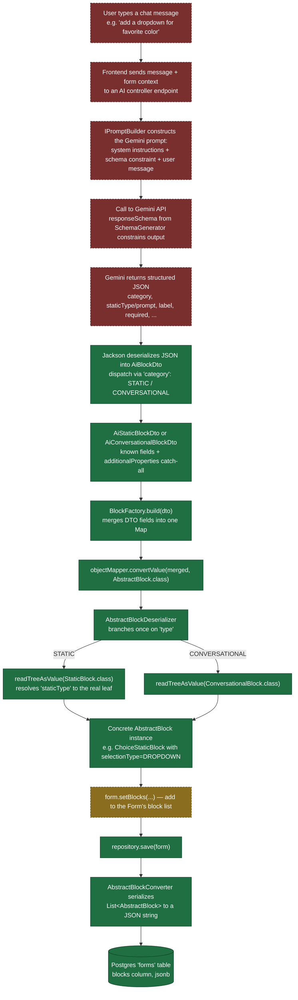

# End-to-End: User Chat Input → Persisted Form Block

Visualizes the full path a Chat-to-Build request takes, from a user's message down to a row in
Postgres. Clearly separates what's **built and verified** this session from what's still
**conceptual / not yet implemented** — several early steps don't have code behind them yet.

## Pipeline

🟩 built & verified · 🟥 not yet implemented (conceptual) · 🟨 built but not yet wired to a caller

## Step-by-step

1. **User message (A)** — not yet built. No frontend Chat-to-Build UI exists yet.
2. **Controller endpoint (B)** — not yet built. No AI-facing controller receives a chat message.
3. **`IPromptBuilder` (C)** — not yet built. Would construct the actual prompt sent to Gemini
   (system instructions, the current form's context, the user's message, and the schema
   constraint from step 4).
4. **Gemini call with `responseSchema` (D)** — not yet built. No Gemini SDK dependency exists in
   `pom.xml` yet (see [reflection-based-ai-block-attribute-pipeline.md §5.5](./reflection-based-ai-block-attribute-pipeline.md)).
   The `responseSchema` here is what a `SchemaGenerator`/`BlockSchemaGenerator` class (sketched,
   not yet built) would produce by reflecting over `AbstractBlock`'s subtypes.
5. **Gemini's structured JSON response (E)** — not yet built (depends on 3–4 existing first).
6. **Jackson → `AiBlockDto` (F)** — **built.** `AiBlockDto`'s `@JsonTypeInfo(property = "category")`
   dispatches to `AiStaticBlockDto` or `AiConversationalBlockDto`.
7. **`AiStaticBlockDto` / `AiConversationalBlockDto` (G)** — **built.** Both `extend AiBlockDto`
   (shared `label`/`required`); `AiStaticBlockDto` additionally has `staticType` and the
   `additionalProperties` catch-all map (`@JsonAnySetter`) for whatever attributes Gemini sends
   beyond the known flat fields.
8. **`BlockFactory.build(dto)` (H)** — **built.** Merges each DTO's fields (+ `additionalProperties`
   for static) into a plain `Map<String, Object>`, including `"type"` so the next step's dispatch
   works.
9. **`objectMapper.convertValue(merged, AbstractBlock.class)` (I)** — **built.** Hands the merged
   map to Jackson, targeting `AbstractBlock`.
10. **`AbstractBlockDeserializer` (J)** — **built & empirically verified.** Reads `"type"` once from
    the buffered tree, then makes a *fresh* top-level call into `StaticBlock.class` or
    `ConversationalBlock.class` — confirmed working via a throwaway test before relying on it (see
    [custom-abstractblock-deserializer-static-vs-conversational.md](./custom-abstractblock-deserializer-static-vs-conversational.md)).
11. **Leaf resolution (K/L) → concrete instance (M)** — **built.** For `STATIC`, `StaticBlock`'s own
    `"staticType"` `@JsonSubTypes` resolves the real leaf (e.g. `ChoiceStaticBlock`), binding
    `selectionType`, `options`, etc. purely by field-name matching — no code in `BlockFactory`
    names these attributes individually. For `CONVERSATIONAL`, it's already the concrete class.
12. **Attaching to a `Form` (N)** — **built (the mechanism), not wired (the caller).**
    `Form.setBlocks(List<AbstractBlock>)` already exists and is exercised by the ordinary
    create-form flow (`FormBuilderServiceImpl`), but nothing yet calls `BlockFactory.build(...)`
    from a real controller/service — it's currently a built, tested-in-isolation component with no
    caller. Confirmed via `grep`: `BlockFactory` is only referenced inside its own file.
13. **`repository.save(form)` (O)** — **built**, existing JPA repository call.
14. **`AbstractBlockConverter` (P)** — **built**, existing `AttributeConverter` serializing
    `List<AbstractBlock>` to a JSON string for the `jsonb` column.
15. **Postgres `forms` table (Q)** — **built**, existing schema (`blocks jsonb` column).

## What's next, concretely

Steps 1–2 (frontend + controller) and 12 (wiring `BlockFactory` into a real service) are all
straightforward plumbing once the AI-specific pieces exist. The two AI-specific pieces still
missing are `IPromptBuilder` and `SchemaGenerator` — see recommendation below.
