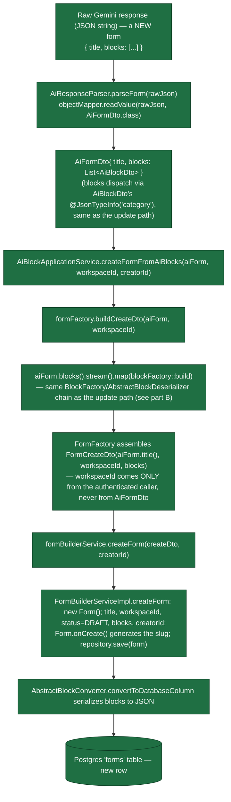

# Data-Flow Lifecycle: Raw LLM Response → Saved Form

Scoped specifically to the **LLM-output-processing** half of the AI work (as opposed to the
chatbot/prompt-construction half, tracked separately) — starting the moment Gemini's raw response
comes back after a chat turn, ending when the form is durably saved in Postgres.

Two separate lifecycles exist now, matching `AiBlockApplicationService`'s two operations: **create**
(no form exists yet — the AI response carries a title *and* blocks, via `AiFormDto`/`FormFactory`)
and **update** (a form already exists — the AI response is just a revised block list). They diverge
at the very first step (what shape the raw response is) and converge again at
`IFormBuilderService`.

## A. Create Lifecycle: Raw Response → New Form



**Concrete example**, starting from:
```json
{
  "title": "Customer Feedback",
  "blocks": [
    {"category":"STATIC","staticType":"SHORT_TEXT","label":"What is your name?","required":true},
    {"category":"STATIC","staticType":"CHOICE","label":"Favorite color?","required":false,
     "selectionType":"DROPDOWN","options":["Red","Blue","Green"]}
  ]
}
```

1. **`AiResponseParser.parseForm(rawJson)`** — `objectMapper.readValue(rawJson, AiFormDto.class)`, using the shared Spring-managed `ObjectMapper`. `AiFormDto`/`AiBlockDto`'s polymorphism is plain `@JsonTypeInfo`-driven (no custom deserializer involved here, unlike `AbstractBlock`), so this needs no special module registration.
2. **Result:** `AiFormDto{title="Customer Feedback", blocks=[AiStaticBlockDto(SHORT_TEXT...), AiStaticBlockDto(CHOICE...)]}` — each block dispatched the same way `List<AiBlockDto>` always is.
3. **`createFormFromAiBlocks(aiForm, workspaceId, creatorId)`** called — `workspaceId`/`creatorId` come from the authenticated request context (e.g. `X-Workspace-Id` header + `@AuthenticationPrincipal`, same as `BuilderController` today), never from the AI response.
4. **`formFactory.buildCreateDto(aiForm, workspaceId)`** — converts every block via `blockFactory.build(...)` (identical mechanism to part B, steps 4-8 below — same `AbstractBlockDeserializer` module-registered dispatch, same `StaticBlock`/`ConversationalBlock` leaf resolution), then assembles `new FormCreateDto("Customer Feedback", workspaceId, [ShortTextStaticBlock, ChoiceStaticBlock])`.
5. **`formBuilderService.createForm(createDto, creatorId)`** — `FormBuilderServiceImpl.createForm` builds a *brand-new* `Form` entity (`status = DRAFT`), generates its slug (`Form.onCreate()`, e.g. `customer-feedback-a1b2c3`), and saves. No `@CacheEvict` here — unlike update, there's nothing stale to evict for a form that didn't exist a moment ago.
6. **Persisted** the same way as always — `AbstractBlockConverter` serializes the block list into the `jsonb` column, new row in Postgres.

## B. Update Lifecycle: Raw Response → Revised Existing Form

```mermaid
flowchart TD
    A["Raw Gemini response (JSON string) — revising an EXISTING form<br/>e.g. one CHOICE block: category, staticType, label, required, selectionType, options"]
    B["AiResponseParser.parseBlocks(rawJson)<br/>objectMapper.readValue(rawJson, List&lt;AiBlockDto&gt;)"]
    C["Jackson dispatches via AiBlockDto's @JsonTypeInfo('category')"]
    D["AiStaticBlockDto instance<br/>staticType/label/required bound to named fields;<br/>selectionType/options fall into additionalProperties"]
    E["AiBlockApplicationService.updateFormFromAiBlocks(formId, workspaceId, List&lt;AiBlockDto&gt;)"]
    F["blockFactory.build(dto) for each element"]
    G["BlockFactory merges dto fields + additionalProperties into one Map,<br/>adds 'type':'STATIC'"]
    H["objectMapper.convertValue(merged, AbstractBlock.class)"]
    I["AbstractBlockDeserializer (module-registered — see fix note below)<br/>reads 'type' → 'STATIC' → fresh call: readTreeAsValue(node, StaticBlock.class)"]
    J["StaticBlock's own @JsonTypeInfo('staticType') reads 'CHOICE' →<br/>resolves ChoiceStaticBlock.class"]
    K["Real ChoiceStaticBlock instance:<br/>label, required, selectionType=DROPDOWN, options=[...]"]
    L["List&lt;AbstractBlock&gt; collected back in AiBlockApplicationService"]
    M["formBuilderService.updateBlocks(new FormUpdateDto(formId, workspaceId, blocks))"]
    N["FormBuilderServiceImpl: repository.findByIdAndWorkspaceId(...) loads Form,<br/>form.setBlocks(blocks), repository.save(form)"]
    O["@CacheEvict('forms', key=slug) — stale cached form dropped"]
    P["AbstractBlockConverter.convertToDatabaseColumn serializes<br/>List&lt;AbstractBlock&gt; back to a JSON string"]
    Q[("Postgres 'forms' table<br/>blocks column, jsonb")]

    A --> B --> C --> D --> E --> F --> G --> H --> I --> J --> K --> L --> M --> N --> O --> P --> Q

    class A,B,C,D,E,F,G,H,I,J,K,L,M,N,O,P,Q built
    classDef built fill:#1f6f43,stroke:#0d3d24,color:#fff
```



**Starting point:**
```json
[{"category":"STATIC","staticType":"CHOICE","label":"What's your favorite color?","required":true,"selectionType":"DROPDOWN","options":["Red","Blue","Green"]}]
```

1. **`AiResponseParser.parseBlocks(rawJson)`** — `objectMapper.readValue(rawJson, List<AiBlockDto>)`, built via `objectMapper.getTypeFactory().constructCollectionType(List.class, AiBlockDto.class)` to survive generic type erasure (same technique `AbstractBlockConverter` already uses for `List<AbstractBlock>`).

2. **Jackson dispatch:** `AiBlockDto`'s `@JsonTypeInfo(property = "category")` reads `"STATIC"` → builds an `AiStaticBlockDto`. `staticType`, `label`, `required` bind to named fields; `selectionType`/`options` fall into `additionalProperties` via `@JsonAnySetter`.
   ```java
   AiStaticBlockDto{ staticType="CHOICE", label="What's your favorite color?", required=true,
                      additionalProperties={selectionType="DROPDOWN", options=["Red","Blue","Green"]} }
   ```

3. **`AiBlockApplicationService.updateFormFromAiBlocks(formId, workspaceId, List.of(thatDto))`** called.

4. **`.stream().map(blockFactory::build)`** — the DTO goes into `BlockFactory.build(dto)`.

5. **Inside `BlockFactory.buildStatic`:**
   ```java
   merged = {selectionType: "DROPDOWN", options: [...]}
   merged.put("type", "STATIC")
   merged.put("staticType", "CHOICE")
   merged.put("label", "What's your favorite color?")
   merged.put("required", true)
   objectMapper.convertValue(merged, AbstractBlock.class)
   ```

6. **`AbstractBlockDeserializer.deserialize`** reads `"type"` → `"STATIC"` → `ctxt.readTreeAsValue(node, StaticBlock.class)` — a fresh top-level call.
   > **Registration fix:** this dispatch is now wired via a `SimpleModule` bean
   > (`AbstractBlockJacksonConfig`), binding `AbstractBlockDeserializer` to `AbstractBlock.class`
   > *only*. It used to be a `@JsonDeserialize` annotation directly on `AbstractBlock`, which Jackson
   > inherits down to subclasses — meaning `StaticBlock` was incorrectly *also* routed through
   > `AbstractBlockDeserializer` instead of its own `@JsonTypeInfo("staticType")`, producing an
   > `InvalidTypeIdException: missing type id property 'staticType'`. Caught by `FormFactoryTest`,
   > the first test to exercise these classes with a real `ObjectMapper` instead of mocks. See
   > `AbstractBlock`'s own code comment for the full explanation.

7. **`StaticBlock`'s own `@JsonTypeInfo("staticType")`** reads `"CHOICE"` → resolves `ChoiceStaticBlock.class`.

8. **Ordinary bean binding into `ChoiceStaticBlock`:** `label`, `required`, `selectionType` (enum `DROPDOWN`), `options` all bind by name; `"type"`/`"staticType"` silently ignored (`@JsonIgnoreProperties(ignoreUnknown = true)`).

9. **Back in `AiBlockApplicationService`**, collected into `List<AbstractBlock> blocks`.

10. **`formBuilderService.updateBlocks(new FormUpdateDto(formId, workspaceId, blocks))`** called.

11. **`FormBuilderServiceImpl.updateBlocks`**: loads via `repository.findByIdAndWorkspaceId(...)`, `form.setBlocks(blocks)` (full replace), `repository.save(form)`.

12. **`@CacheEvict(value = "forms", key = "#result.slug")`** fires — the stale cached copy is dropped (create has no equivalent, since there's nothing cached for a form that didn't exist).

13. **`AbstractBlockConverter.convertToDatabaseColumn`** serializes the list back to JSON.

14. **Postgres.** The `forms` table's `blocks` jsonb column now contains this block, durably saved.

## Status: Both Lifecycles Fully Built

The raw-string parser (`AiResponseParser`, `ai.parser` package) closed the last processing-chain
gap — every step from Gemini's raw JSON down to a saved Postgres row now has a concrete, tested
class behind it: `AiResponseParser` → `AiFormDto`/`AiBlockDto` dispatch → `FormFactory`/
`BlockFactory` → `AbstractBlockDeserializer` → `IFormBuilderService` → `AbstractBlockConverter` →
Postgres. `AiResponseParser` is deliberately minimal (no markdown-fence stripping, no
malformed-JSON repair/retry) — that's intentionally deferred until real Gemini structured-output
integration shows it's actually needed, not built speculatively now. It's also deliberately *not*
wired into `AiBlockApplicationService` — it stays a standalone step so the "untrusted raw text in"
vs. "typed object in" boundary stays where it was drawn.

## What's Still Missing, Broader Than This One Pipeline

These aren't part of the raw-response-to-database chain itself, but were flagged while building it
and remain open:

- **No error/validation boundary.** If `BlockFactory.build()` throws (a real `InvalidTypeIdException`
  like the one `FormFactoryTest` caught, or any other malformed input not stopped by schema
  constraints — which aren't wired to a live Gemini call yet either), it propagates raw and
  uncaught through `AiBlockApplicationService`/`FormFactory`. No `ResourceNotFoundException`-style
  wrapper exists for this failure mode.
- **`BlockFactory` and `AbstractBlockDeserializer` have no dedicated tests of their own.** Both are
  only exercised indirectly (mocked away in `AiBlockApplicationServiceTest`, used-but-not-directly-
  asserted-on in `FormFactoryTest`). The Jackson registration bug was real, shipped to `main`
  undetected for a while, and was only caught incidentally by `FormFactoryTest` — a direct test of
  `AbstractBlockDeserializer` would have caught it sooner and more clearly.
- **No end-to-end test reaching an actual database.** Nothing proves the *full* chain — parser →
  `BlockFactory`/`FormFactory` → real persistence → a row read back from Postgres. Harder to set up
  in this environment: `BackendApplicationTests` itself can't load its Spring context without a
  live Postgres connection right now.
