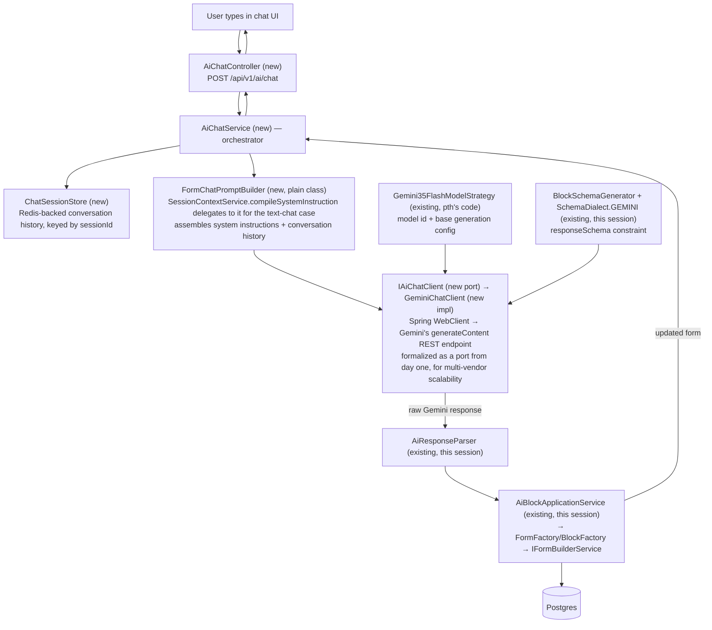

# Mode 2 (Text Chat Form) — Chatbot Build Plan

Follow-up to the whole `llm-output-processing-lifecycle.md`/`end-to-end-ai-form-pipeline.md` body
of work — that phase (raw Gemini response → persisted `Form`) is complete. This plan covers the
second phase: the actual chatbot that produces that raw response in the first place.

Before finalizing this, an agent cross-checked it against the teammate's (`pth`) existing AI
architecture docs (`backend/knowledge/pth/week2/`) and real code (`ai.port`, `ai.strategy`,
`ai.service`, etc.) to avoid building something that conflicts with the larger documented vision.
Findings from that check are folded into the decisions below.

**Update after merging `origin/main` (pth's Mode 4 stabilization pass, PRs #3/#4):** several things
called "planned"/"not yet built" below are now real code. See the "Findings" bullets marked
`[UPDATED]` and the implementation-plan doc's revised "Explicitly Deferred" section.

## Architecture

Everything below `GeminiChatClient` already exists from Phase 1. Everything at or above it is new.

## Findings From Cross-Checking Against Existing Docs/Code

- **A dedicated prompt-building class for text chat still doesn't exist.** The teammate's
  `SessionContextService.compileSystemInstruction` is **`[UPDATED]` no longer a stub** — it's a
  real, working method now, with signature `compileSystemInstruction(Role role,
  FormAiAgentProfile profile, ConversationalBlock activeBlock)` and a genuine 3-tier priority
  chain (active `ConversationalBlock` override → `FormAiAgentProfile` template → role-based
  default). It's still entirely voice-shaped, though — no structured-output/schema concern in it
  at all, and its role-based fallback is currently a `[DEV_TEST_TEMPORARY]` placeholder prompt.
  Our plan: a new plain concrete class, `FormChatPromptBuilder` (not a formal port — one real
  implementation doesn't earn that ceremony), which `compileSystemInstruction` delegates to for
  the text-chat case. `compileSystemInstruction`'s 3-tier pattern is worth mirroring for
  consistency once `FormAiAgentProfile` integration matters for Mode 2.
- **`[UPDATED]` `FormAgentConfig` exists in code now — as `FormAiAgentProfile`.** `form.entity`
  package as predicted, `@OneToOne` with `Form`, fields `modelKey`, `systemPromptTemplate`,
  `voiceName`, `temperature`, `byokApiKeyEncrypted` — still no `responseSchema`/structured-output
  field, confirming it was built for voice personas, not Mode 2's needs. Still deferred for this
  plan (see below) — but it's a real entity/repository now, not a documented-only concept.
- **`IAiModelProviderStrategy`/`Gemini35FlashModelStrategy` already exist and are already the
  Mode 2 (text) strategy** — `getGenerationConfig()` currently returns
  `{"responseModalities": ["TEXT"]}`. It has no slot for `responseSchema` yet; `GeminiChatClient`
  will need to layer `BlockSchemaGenerator`'s output on top of what this strategy returns, not
  replace it.
- **`[UPDATED]` The event-driven entry point is now real, and actively firing with no listener.**
  `FormLayoutModificationEvent` (`ai.event` package) exists, is published by
  `GeminiLiveVoiceAdapter` when a voice session's `modifyFormLayout` tool call fires
  (`{formId, userIntent, targetBlockId}`), and — confirmed via `grep` — **no `LayoutAgent` or any
  other `@EventListener` consumes it anywhere in the codebase.** This is no longer a speculative
  future integration point; it's a genuine, currently-unhandled event that whatever `AiChatService`
  we build should be positioned to eventually serve (see implementation plan). `AiChatService`
  staying a plain, controller-independent Spring service remains the right call for exactly this
  reason.
- **No conflict found** between structured-output (`responseSchema`) and the function-calling/MCP
  docs (17, 19) — those are scoped to voice-mode intent-routing and external third-party clients
  respectively, not competing mechanisms for actual block generation. The real
  `buildToolDeclarations` implementation (now built) confirms this directly: `modifyFormLayout`'s
  parameters are just `{userIntent, targetBlockId}` — free-text intent, not structured block JSON
  — corroborating that the actual JSON generation is meant to happen downstream, via Mode 2.
- **Real, currently-unaddressed gaps** per doc 20's agent catalog: guardrails (content moderation),
  billing (BYOK-vs-platform-key credit tracking), caching. `[UPDATED]` BYOK specifically: 
  `resolveApiKey` was **fully removed** from `SessionContextService` in this merge (not left as a
  stub) — confirms BYOK is genuinely out of scope right now, on the voice side too, not just
  deferred in our own plan. Deliberately deferred — see below.

## Decisions Made

| Concern | Choice | Why |
|---|---|---|
| Conversation memory | Redis (existing infra) | Reuses what's already running for rate-limiting/caching; matches voice mode's `SessionTracker` pattern |
| Model selection | `IAiModelProviderStrategy` / `Gemini35FlashModelStrategy` (existing) | Already built and already the text-mode strategy — avoids duplicating centralized model-resolution logic |
| Structured-output constraint | `BlockSchemaGenerator` / `SchemaDialect.GEMINI` (existing) | Already built and tested this session |
| Calling Gemini | Spring `WebClient`, behind a new `IAiChatClient` port | `spring-boot-starter-webflux` already a dependency — zero new HTTP-client dependencies. Formalized as a port (unlike prompt-building) specifically for multi-vendor scalability, mirroring `IAiVoiceAdapter`'s shape |
| Prompt construction | New `FormChatPromptBuilder`, plain concrete class | `SessionContextService.compileSystemInstruction` delegates to it for the text-chat case; no formal port since there's only one real implementation and scalability isn't the priority here |
| Per-form AI customization (`FormAgentConfig`) | Deferred | Avoids scope creep into a new entity/migration before the core loop works |
| API key | Single platform key from `application.yml` | BYOK deferred — full key-resolution logic is its own feature |
| Response delivery | Synchronous, complete response (no SSE) | Structured JSON doesn't benefit from partial/incremental display; simpler for v1 |
| Guardrails / billing / caching | Deferred | Full standalone features in the documented vision; not needed for a working core loop |

## Build Order (bottom-up — each step testable before the next depends on it)

1. **`ChatTurn`** — one message in a conversation: `role` (user/model), `content`. The basic unit
   `ChatSessionStore` stores and `FormChatPromptBuilder` consumes.
2. **`ChatSessionStore`** — Redis-backed: `List<ChatTurn> getHistory(sessionId)`,
   `void appendTurn(sessionId, ChatTurn)`. No AI-specific dependency; testable against Redis (or a
   fake) in isolation.
3. **`FormChatPromptBuilder`** (plain class, `ai.prompt`) — produces the text-chat system
   instruction (`SessionContextService.compileSystemInstruction` delegates to it for this case,
   routing between its own voice-mode logic and this class rather than either duplicating logic
   or being called by it) plus the conversation content to send, built from conversation history
   and the new user message. Testable with hand-built `ChatTurn` lists, no Gemini call needed.
4. **`IAiChatClient`** (port, `ai.port`) + **`GeminiChatClient`** (implementation, `ai.client`) —
   the implementation combines `Gemini35FlashModelStrategy`'s model id/base config,
   `BlockSchemaGenerator`'s schema, and `FormChatPromptBuilder`'s output into one WebClient
   request, returns the raw response text. Formalized as a port from the start (unlike
   `FormChatPromptBuilder`) for multi-vendor scalability. **Flag:** Gemini's exact REST
   request/response JSON shape isn't known with certainty yet — needs an actual look at Gemini's
   API docs before building, not guessed field names, same "verify don't guess" standard held all
   session (just pointed at an external API instead of Jackson internals this time).
5. **`AiChatService`** — orchestrates 1-4 with the already-built `AiResponseParser` →
   `AiBlockApplicationService` chain, deciding create-vs-update based on whether a `formId` was
   given.
6. **Request/response DTOs** (`ChatRequestDto`, `ChatResponseDto`) + **`AiChatController`** — thin
   HTTP layer, reusing `BuilderController`'s existing auth pattern (`X-Workspace-Id` header,
   `@AuthenticationPrincipal` for creator, presumably a `@PreAuthorize` workspace-membership check).

## Tradeoffs, Named Explicitly

- **Redis sessions vs. stateless client-sent history:** less frontend work, consistent with
  existing infra — but adds a TTL/expiry concern (how long an abandoned session lives before
  Redis evicts it) a stateless design wouldn't have.
- **Deferring `FormAgentConfig`:** faster to a working v1 — every form gets identical AI behavior
  until this is built; no custom personas/instructions per form yet.
- **WebClient over an official SDK:** zero new dependencies, fits the project's existing style —
  but means maintaining hand-built request/response JSON shapes ourselves instead of typed SDK
  objects; more surface area for a subtle shape mismatch (the same category of bug just fixed in
  the `AbstractBlockDeserializer` registration issue).
- **`FormChatPromptBuilder` as a plain class, not a formal port:** no interface ceremony for a
  single implementation — but if a second prompting strategy ever appears (e.g. per form
  category), introducing a port at that point means touching every caller.
- **`IAiChatClient` formalized as a port immediately, unlike `FormChatPromptBuilder`:** the
  opposite call, made deliberately — costs a small amount of ceremony now (an interface with one
  implementation, same situation as `FormChatPromptBuilder` was in) in exchange for zero
  restructuring cost when a second AI vendor is added later, since scalability was named as an
  explicit priority. Worth being honest that this is the *same* one-implementation situation
  resolved oppositely in two places in this plan — the difference is a deliberate priority call
  (scalability matters more for the vendor call than for prompt-building), not an inconsistency.
- **Deferred BYOK/guardrails/billing/caching/SSE:** genuinely incomplete relative to doc 20's full
  vision — intentional, sequenced later, not forgotten.

## Other Things Worth Knowing

- **Two entry points, one core — and one of them has a name and is confirmed ours to build.**
  Per `pth/week3/16_...` and `07_agent_mechanics_and_subagent_spawning.md`: the `@EventListener`
  that consumes `FormLayoutModificationEvent` is called **`LayoutAgent`**, explicitly documented
  as *"operating in Mode 2."* This isn't a hypothetical future integration point — it's this
  plan's actual second entry point, by the teammate's own naming. `LayoutAgent` should be a thin
  wrapper: unwrap the event → call `AiChatService` (the exact same pipeline the HTTP controller
  uses) → additionally push a WebSocket canvas-update frame to the frontend (needed here
  specifically because this trigger comes from a live voice conversation, not a browser waiting on
  an HTTP response — the plain chat controller path doesn't need this extra step, since its HTTP
  response *is* the notification). Building `LayoutAgent` itself is not in this plan's immediate
  scope, but `AiChatService`'s method signature should be shaped with this real consumer in mind.
- **Security boundary carries forward.** Same rule as `FormFactory`: `workspaceId`/`creatorId` must
  come from the authenticated request context, never from anything AI-generated or client-supplied
  in the chat payload.
- **Testing approach should match what's worked all session:** real objects over mocks where
  feasible, a throwaway verification test before trusting anything uncertain (especially Gemini's
  actual response shape), a permanent test once a class's behavior is settled.
