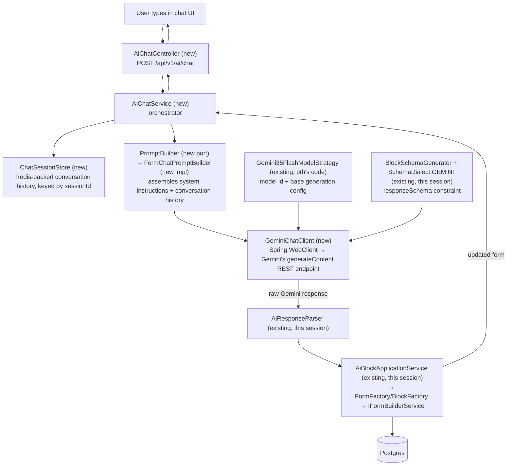

# Mode 2 (Text Chat Form) — Chatbot Build Plan

Follow-up to the whole `llm-output-processing-lifecycle.md`/`end-to-end-ai-form-pipeline.md` body
of work — that phase (raw Gemini response → persisted `Form`) is complete. This plan covers the
second phase: the actual chatbot that produces that raw response in the first place.

Before finalizing this, an agent cross-checked it against the teammate's (`pth`) existing AI
architecture docs (`backend/knowledge/pth/week2/`) and real code (`ai.port`, `ai.strategy`,
`ai.service`, etc.) to avoid building something that conflicts with the larger documented vision.
Findings from that check are folded into the decisions below.

## Architecture

Everything below `GeminiChatClient` already exists from Phase 1. Everything at or above it is new.

## Findings From Cross-Checking Against Existing Docs/Code

- **No `IPromptBuilder`-shaped abstraction exists yet.** The teammate's actual pattern is a
  concrete method, `SessionContextService.compileSystemInstruction(userId, role, formId)`
  (currently a `TODO` stub), which queries a *planned* `FormAgentConfig` entity. We're introducing
  `IPromptBuilder` as a new port, matching the existing `IAiModelProviderStrategy`/`IAiVoiceAdapter`
  convention — `SessionContextService.compileSystemInstruction` should eventually delegate to it
  rather than there being two competing "how prompts get built" stories.
- **`FormAgentConfig` doesn't exist in code yet.** Per doc 14, it's planned to live in
  `form.entity` (not `ai.*`), with fields `modelKey`, `systemPrompt`, `voiceName`, `temperature`,
  `byokApiKeyEncrypted` — no `responseSchema`/structured-output field, since it was designed for
  voice-mode personas. Deferred for this plan (see below); when it does get built, it'll likely
  need extending for Mode 2's needs.
- **`IAiModelProviderStrategy`/`Gemini35FlashModelStrategy` already exist and are already the
  Mode 2 (text) strategy** — `getGenerationConfig()` currently returns
  `{"responseModalities": ["TEXT"]}`. It has no slot for `responseSchema` yet; `GeminiChatClient`
  will need to layer `BlockSchemaGenerator`'s output on top of what this strategy returns, not
  replace it.
- **Doc 20 describes a second, event-driven entry point** (`FormLayoutModificationEvent`, fired
  from Mode 4 voice tool calls) that's expected to reach the same block-generation logic. Not
  built now, but `AiChatService` should stay a plain, controller-independent Spring service so
  that door stays open later without rework.
- **No conflict found** between structured-output (`responseSchema`) and the function-calling/MCP
  docs (17, 19) — those are scoped to voice-mode intent-routing and external third-party clients
  respectively, not competing mechanisms for actual block generation. Doc 20 corroborates the
  structured-output approach.
- **Real, currently-unaddressed gaps** per doc 20's agent catalog: guardrails (content moderation),
  billing (BYOK-vs-platform-key credit tracking), caching. Deliberately deferred — see below.

## Decisions Made

| Concern | Choice | Why |
|---|---|---|
| Conversation memory | Redis (existing infra) | Reuses what's already running for rate-limiting/caching; matches voice mode's `SessionTracker` pattern |
| Model selection | `IAiModelProviderStrategy` / `Gemini35FlashModelStrategy` (existing) | Already built and already the text-mode strategy — avoids duplicating centralized model-resolution logic |
| Structured-output constraint | `BlockSchemaGenerator` / `SchemaDialect.GEMINI` (existing) | Already built and tested this session |
| Calling Gemini | Spring `WebClient` | `spring-boot-starter-webflux` already a dependency — zero new dependencies, fits this project's existing "plain Map" request-building style |
| Prompt construction | New `IPromptBuilder` port + one concrete implementation | Matches the existing port/strategy convention for consistency |
| Per-form AI customization (`FormAgentConfig`) | Deferred | Avoids scope creep into a new entity/migration before the core loop works |
| API key | Single platform key from `application.yml` | BYOK deferred — full key-resolution logic is its own feature |
| Response delivery | Synchronous, complete response (no SSE) | Structured JSON doesn't benefit from partial/incremental display; simpler for v1 |
| Guardrails / billing / caching | Deferred | Full standalone features in the documented vision; not needed for a working core loop |

## Build Order (bottom-up — each step testable before the next depends on it)

1. **`ChatTurn`** — one message in a conversation: `role` (user/model), `content`. The basic unit
   `ChatSessionStore` stores and `IPromptBuilder` consumes.
2. **`ChatSessionStore`** — Redis-backed: `List<ChatTurn> getHistory(sessionId)`,
   `void appendTurn(sessionId, ChatTurn)`. No AI-specific dependency; testable against Redis (or a
   fake) in isolation.
3. **`IPromptBuilder`** (port, `ai.port`) + **`FormChatPromptBuilder`** (implementation) — takes
   conversation history + the new user message (+ later, `FormAgentConfig` when that exists) and
   produces the system instruction + conversation content to send. Testable with hand-built
   `ChatTurn` lists, no Gemini call needed.
4. **`GeminiChatClient`** — combines `Gemini35FlashModelStrategy`'s model id/base config,
   `BlockSchemaGenerator`'s schema, and `IPromptBuilder`'s output into one WebClient request,
   returns the raw response text. **Flag:** Gemini's exact REST request/response JSON shape isn't
   known with certainty yet — needs an actual look at Gemini's API docs before building, not
   guessed field names, same "verify don't guess" standard held all session (just pointed at an
   external API instead of Jackson internals this time).
5. **`AiChatService`** — orchestrates 1-4 with the already-built `AiResponseParser` →
   `AiBlockApplicationService` chain, deciding create-vs-update based on whether a `formId` was
   given.
6. **Request/response DTOs** (`ChatRequestDto`, `ChatResponseDto`) + **`AiChatController`** — thin
   HTTP layer, reusing `BuilderController`'s existing auth pattern (`X-Workspace-Id` header,
   `@AuthenticationPrincipal` for creator, presumably a `@PreAuthorize` workspace-membership check).

## Tradeoffs, Named Explicitly

- **Redis sessions vs. stateless client-sent history:** less frontend work, consistent with
  existing infra — but adds a TTL/expiry concern (how long an abandoned session lives before
  Redis evicts it) a stateless design wouldn't have.
- **Deferring `FormAgentConfig`:** faster to a working v1 — every form gets identical AI behavior
  until this is built; no custom personas/instructions per form yet.
- **WebClient over an official SDK:** zero new dependencies, fits the project's existing style —
  but means maintaining hand-built request/response JSON shapes ourselves instead of typed SDK
  objects; more surface area for a subtle shape mismatch (the same category of bug just fixed in
  the `AbstractBlockDeserializer` registration issue).
- **`IPromptBuilder` as a formal port:** consistent with the codebase's established pattern — but
  is one interface with exactly one implementation for now; only pays off if/when a second
  implementation appears.
- **Deferred BYOK/guardrails/billing/caching/SSE:** genuinely incomplete relative to doc 20's full
  vision — intentional, sequenced later, not forgotten.

## Other Things Worth Knowing

- **Two entry points, one core.** Structuring `AiChatService` as a plain, controller-independent
  Spring service (not logic embedded in the controller) keeps the door open for a future
  `@EventListener` entry point (doc 20's "Layout Agent") without rework.
- **Security boundary carries forward.** Same rule as `FormFactory`: `workspaceId`/`creatorId` must
  come from the authenticated request context, never from anything AI-generated or client-supplied
  in the chat payload.
- **Testing approach should match what's worked all session:** real objects over mocks where
  feasible, a throwaway verification test before trusting anything uncertain (especially Gemini's
  actual response shape), a permanent test once a class's behavior is settled.
