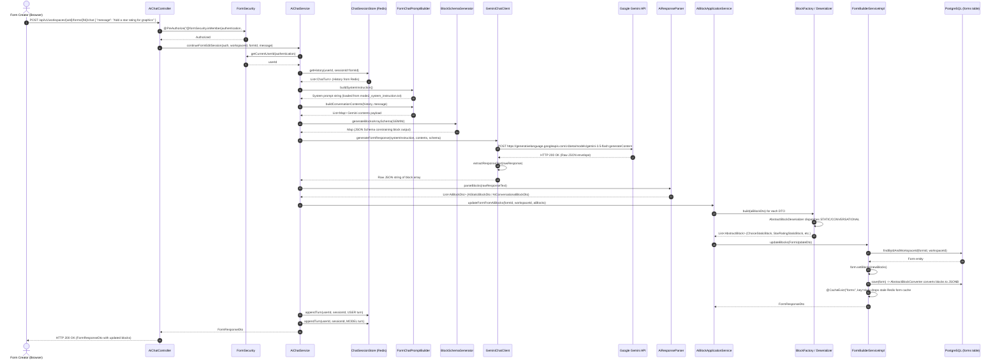

# Mode 2 Sequence Diagram & Lifecycle Execution Flow

This document details the end-to-end data flow and lifecycle of **Mode 2 (AI Form Builder / Chat-to-Build)**.

---

## 📊 Sequence Diagram

---

## 🛠️ Class & Function Execution Roadmap

| Step | Class Name | Function / Method Name | Purpose |
| :--- | :--- | :--- | :--- |
| **1** | `AiChatController` | `continueFormEditSession(...)` | Receives HTTP POST request from frontend with `ChatRequestDto`. |
| **2** | `FormSecurity` | `isMember(...)` & `getCurrentUserId(...)` | Validates JWT & workspace membership; extracts authenticated `userId`. |
| **3** | `AiChatService` | `continueFormEditSession(...)` | Main orchestrator managing session, prompt assembly, API call, parsing, and persistence. |
| **4** | `ChatSessionStore` | `getHistory(userId, sessionId)` | Loads prior conversation turns from Redis (`chat:session:{userId}:{formId}`). |
| **5** | `FormChatPromptBuilder` | `buildSystemInstruction()` & `buildConversationContents(...)` | Reads `mode2_system_instruction.txt` and formats history + new prompt for Gemini. |
| **6** | `BlockSchemaGenerator` | `generateBlocksArraySchema(SchemaDialect.GEMINI)` | Reflects domain block classes into a JSON Schema to constrain Gemini's output tokens. |
| **7** | `GeminiChatClient` | `generateFormResponse(...)` | Calls Google Gemini REST API (`generateContent`) via `WebClient` and extracts response text. |
| **8** | `AiResponseParser` | `parseBlocks(rawResponse)` | Deserializes raw JSON block array string into `List<AiBlockDto>` polymorphic records. |
| **9** | `AiBlockApplicationService` | `updateFormFromAiBlocks(...)` | Converts DTOs to domain blocks and hands off to form builder service. |
| **10** | `BlockFactory` | `build(dto)` & `AbstractBlockDeserializer` | Instantiates leaf block entities (e.g. `StarRatingStaticBlock`, `ChoiceStaticBlock`). |
| **11** | `FormBuilderServiceImpl` | `updateBlocks(FormUpdateDto)` | Updates the `Form` entity in PostgreSQL and evicts stale Redis form cache via `@CacheEvict`. |
| **12** | `AbstractBlockConverter` | `convertToDatabaseColumn(...)` | JPA converter serializing `List<AbstractBlock>` into Postgres `jsonb` column. |
| **13** | `ChatSessionStore` | `appendTurn(...)` | Saves the new `USER` message and `MODEL` response into Redis for future turns. |
