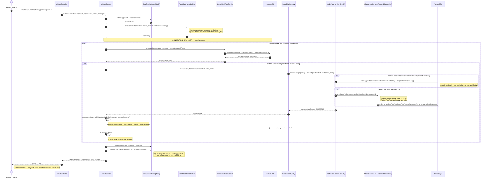

# Tool-Call Lifecycle (Mode 2 Reference)

This is the Mode 2 counterpart to [[tool_call_lifecycle]] (the Mode 4 reference) — one full round trip through
the wired-up design from [[mode2_toolcall_architecture]] and [[mode2_toolcall_implementation_plan]], from the
browser's HTTP POST to the HTTP response landing back in the chat window.

The core difference from Mode 4 isn't the *shape* of the loop — it's *where* the loop lives. Mode 4's round trip
is one turn stretched across a persistent socket; Mode 2 has no socket to hold state open, so the entire
propose → confirm → finalize conversation for one turn happens **inside a single HTTP request**, as a bounded loop
inside `AiChatService`, before the controller ever returns.

`Mode2ToolRegistry`/`IMode2ToolHandler` here are Mode 2's own strategy pattern — a separate stack from Mode 4's
`ToolCallRegistry`/`IToolCallHandler`, not a generalized version of it. Two of the eight tools below
(`proposeFormBlocks`, `finalizeForm`) are native to Mode 2; the other six (`publishForm`,
`configureFillerPersona`, `searchUserDocument`, `generateContentFromDocument`, `analyzeUploadedFile`,
`extractStructuredData`) are reused from Mode 3/4 by calling the *same shared service* their original WS handler
now also delegates to — see [[mode2_toolcall_architecture]]'s "Shared Service Extraction" for why that replaced
an earlier synthetic-`WebSocketSession` adapter idea.

---

## 📊 Sequence Diagram

---

## 🛠️ Class & Function Execution Roadmap

| Step | Class · Method | File | What happens |
| :--- | :--- | :--- | :--- |
| **SETUP** | `Mode2ToolDeclarationBuilder.buildToolDeclarations()` | `ai/prompt/Mode2ToolDeclarationBuilder.java` | Builds the 8-tool list sent with every request in this turn's loop; `proposeFormBlocks`'s `blocks` arg reuses `BlockSchemaGenerator.generateBlocksArraySchema()` as-is. `endSession`/`requestFileUpload`/`modifyFormLayout` are never declared — no live channel to act through. |
| **①** | `AiChatController.chat()` | `ai/controller/AiChatController.java` | Receives the POST from the browser; unchanged from today — `@PreAuthorize` gate, then delegates. |
| **②** | `AiChatService.continueFormEditSession()` | `ai/service/AiChatService.java` | The orchestrator — owns the whole loop below. |
| **③** | `ChatSessionStore.getHistory()` | `ai/session/ChatSessionStore.java` | Loads prior `USER`/`MODEL` turns from Redis — unchanged call. |
| **④** | `FormChatPromptBuilder.buildConversationContents()` (+ `buildCurrentStateContext()`) | `ai/prompt/FormChatPromptBuilder.java` | Assembles `contents[]`: history + a re-fetched snapshot of the form's current blocks + the new user message. |
| **⑤** | `GeminiFlashRestService.generateContent()` | `ai/service/GeminiFlashRestService.java` | POSTs to `generateContent` with `contents` + `tools` — no `responseSchema`, which is what makes free-form text replies possible at all. |
| **⑥** | *(external — Gemini)* | — | Decides, per call: plain text, or a `functionCall` part. |
| **if direct** | `AiChatService` breaks the loop | — | No tool needed this iteration — `part.text` becomes `replyText` immediately. |
| **⑦** | `Mode2ToolRegistry.executeTool()` | `ai/tool/registry/Mode2ToolRegistry.java` | Looks up the `IMode2ToolHandler` by function name, dispatches with a `ChatToolExecutionContext` (formId/workspaceId/userId — no socket, no shared interface with `IToolCallHandler`). |
| **⑧a** | `ProposeFormBlocksToolHandler.execute()` / `FinalizeFormToolHandler.execute()` | `ai/tool/handler/chat/ProposeFormBlocksToolHandler.java` / `FinalizeFormToolHandler.java` | Native to Mode 2, no backing service. `proposeFormBlocks`: `args.blocks` → `List<AiBlockDto>` → `AiBlockApplicationService.updateFormFromAiBlocks(...)` — writes to Postgres immediately. `finalizeForm`: no DB effect, pure acknowledgment. |
| **⑧b** | `Mode2PublishFormToolHandler.execute()` (+ 5 siblings) | `ai/tool/handler/chat/Mode2PublishFormToolHandler.java` (+ `Mode2ConfigureFillerPersonaToolHandler`, `Mode2SearchUserDocumentToolHandler`, `Mode2GenerateContentFromDocumentToolHandler`, `Mode2AnalyzeUploadedFileToolHandler`, `Mode2ExtractStructuredDataToolHandler`) | Each delegates to the *same shared service* the matching Mode 3/4 handler now also calls (`FormPublishService`, `FillerPersonaService`, `DocumentSearchService`, `DocumentContentGenerationService`, `FileAnalysisService`, `StructuredDataExtractionService`) — one business-logic implementation, two thin callers. |
| **⑨** | `AiChatService` appends turns, loops back to ⑤ | `ai/service/AiChatService.java` | The genuinely new mechanism — feeds the tool's real result back into `contents[]` so Gemini's *next* reply is grounded in whether it actually succeeded, capped at 4 iterations. |
| **⑩** | `ChatSessionStore.appendTurn()` ×2 | `ai/session/ChatSessionStore.java` | Persists only the original user message and the final text reply — the intra-loop `functionCall`/`functionResponse` turns never get written to Redis. |
| **⑪** | `ChatResponseDto` returned | `ai/dto/ChatResponseDto.java` | `message` (Gemini's words) + `form` (current state) + `formUpdated` (did this turn actually write blocks) — the real final output the user reads. |

---

## Notes

- The loop bound (4 iterations) exists so a misbehaving or chained tool-call sequence can't hang a single HTTP
  request indefinitely — if it's ever hit without a plain-text part, `AiChatService` should fail the turn loudly
  rather than silently return a stale reply (exact behavior TBD at implementation time).
- `endSession`, `requestFileUpload`, and `modifyFormLayout` never appear in this diagram at all — confirmed by
  reading each handler directly, none has a business-logic core separable from live socket I/O
  (`endSession`/`requestFileUpload`) or Mode 4's async event model (`modifyFormLayout`). See
  [[mode2_toolcall_architecture]]'s "Excluded — no separable business-logic core" table.
- Every class named above already exists in [[mode2_toolcall_implementation_plan]]'s file inventory — this
  document is the "how they call each other," not a new design decision.
