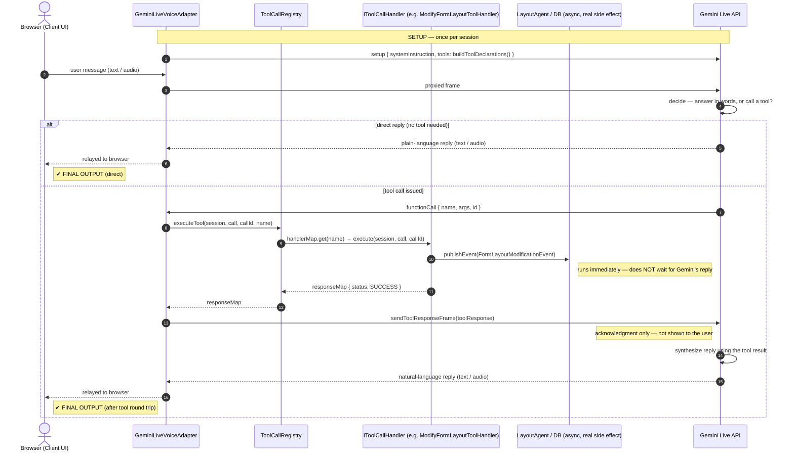

# Tool-Call Lifecycle (Mode 4 Reference)

This document traces one full round trip of Gemini function calling in **Mode 4 (Voice Co-Builder)** —
from the moment a message leaves the browser to the moment a reply lands back in the chat window —
as a reference for bringing the same loop into Mode 2.

Every turn resolves one of two ways: Gemini answers directly, or it calls a tool and waits for the
backend to run it before answering. Note the branch is a genuine loop, not a straight line: the
handler's return value goes back **into Gemini** as data, not to the user — Gemini writes the actual
user-facing reply itself, in a turn generated *after* it receives that acknowledgment.

---

## 📊 Sequence Diagram

---

## 🛠️ Class & Function Execution Roadmap

| Step | Class · Method | File | What happens |
| :--- | :--- | :--- | :--- |
| **SETUP** | `SessionContextService.buildToolDeclarations()` | `ai/service/SessionContextService.java:229` | Builds the JSON-schema tool menu, sent once in the WS `setup` frame. |
| **①** | `GeminiLiveVoiceAdapter.handleMessage()` | `ai/service/GeminiLiveVoiceAdapter.java` | Receives the text/audio frame from the browser's `WebSocketSession`. |
| **②** | adapter → `geminiSession` | `ai/service/GeminiLiveVoiceAdapter.java` | Forwards the frame to the live Gemini socket unchanged. |
| **if direct** | adapter relays as-is | — | No tool needed — Gemini's words are relayed straight to the browser. Done. |
| **③** | `GeminiLiveVoiceAdapter.handleToolCall()` | `GeminiLiveVoiceAdapter.java:283` | Reads the `functionCalls` array out of Gemini's message. |
| **④** | `ToolCallRegistry.executeTool()` | `tool/registry/ToolCallRegistry.java:43` | Looks up the handler for this function name in `handlerMap` and calls it. |
| **④** | e.g. `ModifyFormLayoutToolHandler.execute()` | `tool/handler/builder/ModifyFormLayoutToolHandler.java:38` | Runs the real business logic for this one tool. |
| **④a** | `eventPublisher.publishEvent(...)` | `ModifyFormLayoutToolHandler.java:57` | Fires immediately, consumed async by `LayoutAgent` — independent of what Gemini says next. |
| **⑤** | `return responseMap{status:"SUCCESS"}` | `ModifyFormLayoutToolHandler.java:59-63` | Not shown to the user — this is data for Gemini. |
| **⑥** | `GeminiLiveVoiceAdapter.sendToolResponseFrame()` | `GeminiLiveVoiceAdapter.java:299` | Delivers the toolResponse back into the live Gemini socket. |
| **⑦** | *(external — Gemini)* | — | Gemini synthesizes the next natural-language turn using the tool result. |
| **⑧** | adapter relays to browser | `GeminiLiveVoiceAdapter.java` | This is the message the user actually reads or hears — the true final output. |

---

## Relevance to Mode 2

Mode 2 currently has no equivalent of steps ③–⑧ — every turn is forced through a constrained-schema
generation (`AiChatService.continueFormEditSession`) with no branch point. Reusing this loop is what
would let it ask clarifying questions before finalizing, instead of emitting a full form JSON on every turn.

`GeminiFlashRestService` — already shared across Mode 2 and Mode 3 — and `ToolCallRegistry` /
`IToolCallHandler` are transport-agnostic enough to reuse directly, with one caveat: `IToolCallHandler.execute()`
currently takes a `WebSocketSession` as its context object, which Mode 2's stateless HTTP flow doesn't have.
That signature would need generalizing before Mode 2's handlers can share the same interface.
